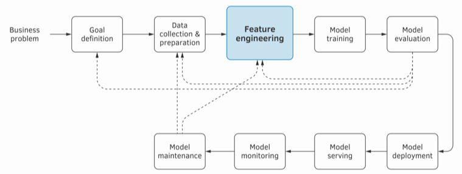
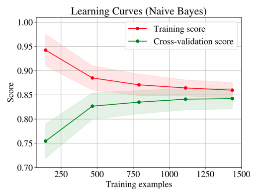
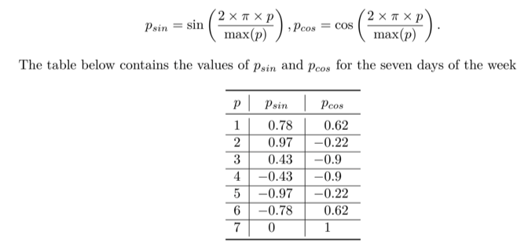
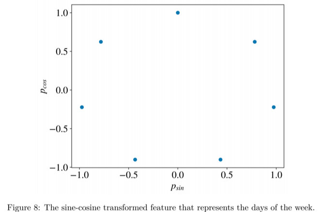

# TOC
1. [Introduction](#intro)
2. [How to present a project as an ML Engineer](#project_presentation)
3. [Feature Engineering](#feature_eng)
    1. [Best Practices](#feat_eng_best)
4. [Dimensionality Reduction](#dim_reduc)

# Introduction
A machine learning project life cycle consists of the following stages: 
1. goal definition, 
2. data collection and preparation, 
3. feature engineering, 
4. model training, 
5. model evaluation,
6. model deployment, 
7. model serving, 
8. model monitoring, and 
9. model maintenance

# Project Presentation
- Express the project in terms of its cost
    - the difficulty of the problem
    - the cost of data(acquisition/generation/labelling)
    - the needed model performance quality
- complexity of the model
    - parameters
    - methodology
    - no. of features
- data availability
    - how quickly is the new data generated(in case of current data size being inadequate)
    - **if possible/applicable**, plot learning curves of different models used on different dataset sizes
        - as we can see in the graph below, for no. of training samples in the range 300, the model Naive Bayes is rote-learning, i.e. overfitting, and as the no. of samples increase, the gap in training and cross-validation scores decrease, meaning that its finally able to grasp patterns.
        - 
- data usability
    - missing value imputation
    - duplicates removal
    - expired data: old data that doesn't reflect the system anymore, for instance if you had old data of a logistics company, when their performance was *average*, but now that they have improved their processes, their *new mean ETA* is significantly lower, but your model hasn't been trained on the new data, so it will continue to give an ETA prediction that's higher than the usual.
    - incomplete/unrepresentative of the phenomenon relevant to the task: *an imbalance of situations*
        -  A dataset of pedestrians for self-driving car systems might be created with engineers posing as pedestrians; 
        - in such a dataset, most situations would include only younger men, while children, women, and the elderly would be underrepresented or entirely absent.
    - **Data Leakage**: when the variable that the analyst tries to predict is found among the features in the feature vector. 
- data reliability
    - single mechanical turker vs voting from annotations of different turkers.
    - target/feature = measured from a machine: machine reliability, standard error, etc.
    - 

Search for *machine learning engineer* on github.

# Feature Engineering
1. **cylic features** such as days of the week = [Sunday, Monday, Tuesday.... Saturday]
    1. The difference between Sunday and Saturday is 1, while the difference between Monday and Sunday is 6. However, our reasoning suggests the same difference of 1, because Monday is just one day past Sunday.
    2. use sine-cosine transformation(cyclic feature ---> 2 features). p is the day of the week as a number

      \
2. Topic modelling
    1. rather than embedding a token, 
3. An essential property of a good feature is that the distribution of its values in the training set is similar(or is a superset, i.e. contains) to the distribution it will receive in production.
4. If the learning algorithm *sees* that some feature has a non-zero value only in a couple of training examples, it is *doubtful*(not certain, depends on algorithm) the algorithm will learn any useful pattern from that feature.
5. **Long-Tail Removal**: for a feature, only a small proportion of values have considerable frequency/probability, a larger part of the domain has very low.
    - generally advisable to remove such features, need not follow this advice always.
    - long tail snipping can help, i.e. cut the tail at some task-relevant threshold.
    - remember Dwell-time 95th percentile capping, removal of rare words(abstractive summarizer), truncating texts and summaries(abstractive summarizer)
6. **Boruta**: use random forest algorithms to determine feature importances in order to weed out *unimportant* ones.
    1. for all original features, shadow features are created by permuting the original feature.
    2. a random forest model is used to assess feature importance of each feature and compared against that of its shadow.
    3. statistical significance in the comparison of these 2 importances(per feature) is determined as follows:
        1. a trial consists of permuting the target variable of the examples at hand.
        2. for each trial, a model is trained and feature importances of the original and their shadows are noted.
        3. for each original feature, the distribution of importance-value of the most important shadow feature per trial is viewed.
        4. this serves as the probabilitiy distribution of feature importance of the shadow feature, and is used for hypothesis testing
            1. null hypothesis: there's no meaningful relation between an original feature and the target
            2. p-value: represents the probability of feature importance of shadow-feature greater than that of the corresponding original.
            3. p-value >= 0.05, null hypothesis can't be rejected.
            4. p-value < 0.05, null hypothesis is rejected, meaning **original feature is significantly important**.
7. **Document embedding**: learning embedding for a never-seen-before document(document = sentence, generally)
    1. the never-seen-before doc is added to the training corpus
    2. the embedding vector associated with it is the only set of parameters trained, i.e. other params of the models are turned off for gradient descent.

## Best Practices
1. **Hidden Feedback Loop**
    1. features formed from an external system() might be used by your model
    2. if that external system’s owner decides to use the output of your model as the input for their model, this creates the hidden feedback loop , a situation where you influence the phenomenon from which you learn.
2. **Use counts based features cautiously**
    1. *safe counts* or *the valid range of counts* may change with time.
        1. for instance, for a subscription based company, consider *no. of calls since subscription* as a feature.
        2. when the company size(customer base) is small, this may be a good feature
        3. upon growth, the range of this feature observed in training may be no longer observed/surpassed.
    2. Even if the counts are categorized into range-bins, these bins could easily suffer from the same issue.
        1. the highest bin is filling up because re-binning(re-categorization) is required.
    3. **Always advisable to re-evaluate the model and features from time to time.**
3. **Selecting Features when training distributions change**: its advisable to re-perform feature selection in order to know the new importance of features.
    1. the original training data might have different nature of feature-relationships, and different distributions per feature than the new training data.
    2. this could mean features relevant in the past are no longer so, and features that weren't now become relevant.
4. **Feature Extraction Details**
    1. Each feature has to be tested for speed, memory consumption, and compatibility with the production environment. What works reasonably well in your local environment may perform poorly when deployed in production.
5. **Test-train drift computation**
    1. scheduled checks for drift estimation amongst feature-distributions of train and test sets.
    2. is done so as to detect if the test contains patterns yet unseen by the model.
    3. The p-value from the *KS Test*(**continuous features**)/*Chi-square Test*(**discrete features**) on the train-test feature distributions per feature will convey the significance of drift.
    4. if no. of features with significant drift  exceeds 40% of the total no.
    

# Dimensionality Reduction
1. UMAP(Uniform Manifold Approximation and Projection) best suited to generate 2d/3d vectors of a d-dimensional feature-vector
    1. requires all data to be in-memory
    2. better used for visualising the data and understanding several groups(clusters) formed from the samples. whereas PCA is used to find a compressed version of the dataset for further ML tasks, which preserves *linear relationships*.
    3. involves symmetric membership matrix estimation
        1. using [NearestNeighbors](https://scikit-learn.org/stable/modules/generated/sklearn.neighbors.NearestNeighbors.html#sklearn.neighbors.NearestNeighbors) , for each point(in the high-dimensional representation), rank others based on their distances from this.
        2. for each point, find median distance value, $\sigma$, and min-distance, subtract this from all distances, and scale down the difference by $\sigma$. \
        this is the normalized distances array for this point. \
        on concatenating this array across all points, a matrix is obtained.
        3. the membership matrix is the exponent of negative of normalized distances matrix.
        4. to obtain a symmetric matrix: `P_symm[i,j] = P[i,j]+P[j,i]-P[i,j].P[j,i]`
    4. embedding matrix E: converts into low-dimensional feature vectors
        1. the low-dimensional feature-representation that completely captures the relationship of samples in the original feature-space **should have the same membership matrix**
        2. the optimisation occurs by computing attractive and repulsive forces and updating the embeddings accordingly.
        3. attractive forces:`grad_p = 2 * (embedding[i] - embedding[j]) * P_high[i, j] / (1 + distances[i, j] ** 2)`(a vector of length k, k < d, d: original dimensionality)
        4. repulsive forces: `grad_n = 2 * (embedding[i] - embedding[j]) * repulsion_strength / (1 + distances[i, j] ** 2)` (k-lengthed vector)
        5. update: `grad[i] += grad_p;grad[i] -= grad_n; embedding -= learning_rate * grad / np.linalg.norm(grad, axis=1, keepdims=True)`

# Storing and Documenting Features
1. Creating a feature store:
    1. compute and store features at some DB which can be accessed in a fast and easy/convenient manner.
    2. what was done in the ETA problem was creating a feature store, but storing in GBQ may not be the fastest manner.
2. Uber's ML platform Michaelangelo uses the **best practices of maintaining a feature store**: to have **offline**(for training) and **online**(for realtime inference) features stores
3. Offline Store
    1. historically-aggregated data, such as PERCENTILES, MEANs, etc.
    2. less frequently calculated data
    3. Non-realtime data
4. Online Store
    1. realtime computed data
    2. more frequent calculation
    3. low latency is offered, which is needed for fast inferencing
    4. this **theoretically stores both historically-aggregated and realtime features**, but the *historically-aggregated* features are *synced from* the *offline store* at some relevant frequency.

# References
1. [Machine Learning Engineering by Andriy Burkov](http://www.mlebook.com/wiki/doku.php)
2. []

# Framework
- learn up a framework so that that could be used to explain in an interview.