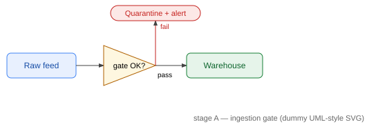
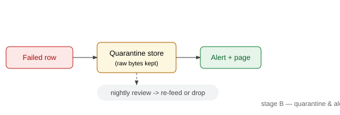
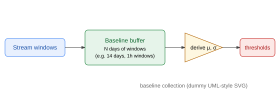

---
markmap:
  maxWidth: 900
  initialExpandLevel: 2
---

# ML-Engineer — mind-map demo (dummy root)

## M5 — Data Engineering II: Quality & Validation

### Drift at ingestion & anomaly detection

#### Volume and arrival rate

##### Stage A — ingestion gate

- Validate raw data as it lands (schema, ranges, nullability).
- A row that fails here is rejected before it can poison anything.
- 

##### Stage B — quarantine & alert

- Failed rows go to quarantine, an alert fires, the pipeline continues.
- 

##### Baseline collection

- Collect a rolling window of windows before deriving thresholds.
- 

#### Per-column statistics

##### A leaf that holds two diagrams (array of diagrams)

- 
- 

### A text-only section (no diagrams)

#### Plain bullets only

- Leaves don't have to end in diagrams.
- Drag to pan, pinch to zoom, tap a circle to expand/collapse a branch.

## M99 — copy this branch for your real modules

### How the tree is generated

- Every `#`/`##`/`###` heading in your Markdown becomes one level of the tree.
- Bullets under the deepest heading become that leaf's children.
- A list item that is only an image becomes a diagram node at the leaf.
