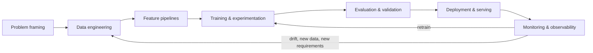
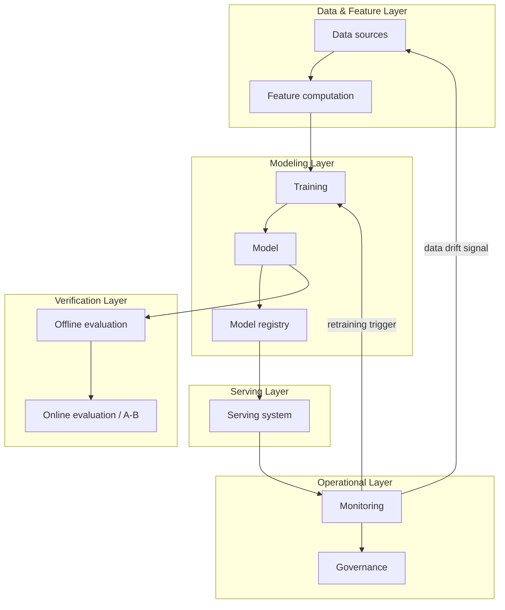

# M1 · What Is an ML System?

> **Core question:** What exactly is the engineering artifact we're designing?

---

## The notebook scored 0.99

Imagine you're on a payments team. Fraud is rising, and you've been asked to "do something with ML." 
- You grab the transaction dataset, clean it in a notebook, and train a gradient-boosted classifier. 
- Holdout AUC: **0.99**. Precision: **0.94**. 
- You screenshot the metrics, ship the notebook to an engineer, and a few weeks later a model is serving predictions in production.

Then the alerts start.
- The model flags a surge of fraud *after* the money has already left. 
- It blocks legitimate high-value transactions from long-time customers, who call support in droves. 
- Two months in, precision has decayed to 0.71, and nobody can say why. 
- The notebook, still on your laptop, still says 0.99.

What went wrong? 
- The model didn't. It's the *same model* that scored 0.99. 
- What changed is everything the notebook left out: how the data got there, what the features meant at inference time, how labels arrived late, who deployed it, how it was monitored — or wasn't.

That gap — between **a model that predicts well in a notebook** and **a system that behaves well in the world** — is the entire subject of this course.

## The model is not the product — the system is

A trained model is a *component*, not a product. It's a function: features in, a number out. By itself it does nothing for anyone. What turns that function into something reliable, governed, and observable is a surrounding structure of systems you have to design:

- **Data pipelines** that get the right, temporally-honest data to training and serving.
- **Feature pipelines** that compute the same features, the same way, everywhere.
- **Training & experimentation** that make any result reproducible and attributable.
- **Evaluation** that measures the model honestly, before and after shipping.
- **Serving** that delivers predictions within a latency budget, safely.
- **Monitoring & governance** that watch the system as the world changes and keep it accountable.

The model is usually 5–10% of the engineering. The other 90% is the harness — wait, wrong course. The other 90% is *this*: the deliberately engineered operating environment around the model. The moment you stop treating that environment as "details" and start treating it as the primary artifact, you're doing ML engineering design.

> **⚠️ Failure mode** — *The 0.99 trap.* A stellar offline metric is evidence about a *model*, not about a *system*. Every production failure in this course traces back to something the notebook didn't know about — time, labels, distribution, deployment, feedback. Hold the metric loosely until you've seen the system.

## The notebook → production gap, made concrete

Here is the same fraud problem seen through the two lenses. Read them as a checklist of everything the notebook *assumes away*:

| Concern | Notebook world | Production world |
|---|---|---|
| **Data** | A CSV someone exported | Streams and tables, changing shape, arriving late |
| **Time** | Frozen snapshot | The future must not leak into training |
| **Features** | Computed inline, once | Re-computed live, on possibly different data |
| **Labels** | Available immediately | Fraud is confirmed days/weeks later, if ever |
| **Evaluation** | Random holdout split | Must respect time, groups, and leakage |
| **Deployment** | `model.predict()` | Serving infra, versioning, rollback |
| **Change** | Static world | Fraudsters adapt; the model decays |
| **Feedback** | None | The model's own decisions change the data it sees |

Every one of those rows is a module in this course. The notebook isn't wrong — it's just *incomplete*. The skill you're building is learning to see the rows the notebook hides.

## The production ML lifecycle: the spine of the course

If the notebook-to-production gap is the disease, the **production ML lifecycle** is the map we use to treat it. It's the one diagram to memorize, because every module in this course is a region on it:

A few things to notice, because they're not cosmetic:

1. **It's a cycle, not a line.** Production ML is never "done." The monitoring stage feeds back into data (new data arrives, drift happens) and training (retrain). The loop is the system.
2. **Framing comes first.** You can't design data, features, or evaluation until you know what "success" means and what the requirements are. Get framing wrong and everything downstream is expensive rework.
3. **Deployment is the middle, not the end.** A model that can't be served within budget, or can't be rolled back, is a research project, not a product. And after deployment comes the *long* phase — operating it.

This lifecycle is a descendant of CRISP-DM (the 1990s data-mining process) updated for production — sometimes called CRISP-ML(Q), adding quality assurance as a first-class concern. We'll use the version above and refer to its stages by name for the rest of the course.

## System anatomy in one picture

If the lifecycle is *when* things happen, the anatomy is *what* they happen to. An ML system has six anatomical layers:

Hold these two diagrams loosely for now. They're the map; the rest of the course fills in the terrain. What matters at this stage is that you can point at any real ML product and locate its parts on both.

## The vocabulary trap: model vs. system vs. platform

Before going further, three words that get used interchangeably and shouldn't be:

- **ML model** — the artifact: weights, architecture, code. A thing that maps features to a prediction. Small, replaceable, and (by itself) useless.
- **ML system** — the model *plus* everything it needs to be useful and safe: data, features, training, evaluation, serving, monitoring. This course's subject.
- **ML platform** — the shared infrastructure many ML systems are built on: experiment tracking, feature store, model registry, compute, CI/CD. A platform is what lets a company build *many* systems without reinventing the plumbing each time.

The trap is using "model" when you mean "system" — e.g., "the model is down" when what's down is the serving layer, or "the model is biased" when what's biased is the data. Precision here isn't pedantry; it's how you locate the problem before you fix it.

> **⚖️ Tradeoff** — *Build vs. platform.* Early on, an ML system often starts with bespoke plumbing (a script here, a cron there). At some scale, that plumbing becomes the thing you're maintaining more than the model — and you graduate to a platform. Recognizing *when* is a design decision: too early, and the platform is premature abstraction; too late, and every new model reinvents the wheel. We'll revisit this tension when we talk about feature stores and registries.

## A taxonomy of failure modes (preview)

This course is organized around the failure modes of production ML systems, because design decisions only make sense against the thing they're preventing. Here's the taxonomy we'll carry through every module; M2 does a deep dive on each:

- **Data leakage** — training data contains information from the future, or from the thing you're predicting.
- **Training–serving skew** — features computed one way in training, another way in serving.
- **Data drift / concept drift** — the input distribution or the input→label relationship changes over time.
- **Feedback loops** — the model's predictions change the data, which changes the model's predictions. **TODO: How?**
- **Silent degradation** — the model gets worse without anyone noticing, because nothing was watching.
- **Cascading failure** — an upstream system (a feed, a feature) breaks and the model fails in a way nobody anticipated.
    - **TODO**: how to build a safe system that even on upstream failures is either able to compute the features (some sort of imputation) or is able to reject such features and use a new candidate set??

Every one of these maps to a layer that *should have caught it* — and that mapping is the through-line of the course. You'll internalize the reflex: *when an ML system misbehaves, which layer was responsible, and what design decision would have prevented it?*

## The tradeoff ledger

One idea you'll see in every module is the **tradeoff ledger**. ML systems design is not about finding "the right answer" — it's about making choices where every choice *gives something up*. Accuracy vs. latency. Freshness vs. cost. Autonomy vs. auditability.

The discipline: every significant decision you make, you record **what you chose and what you gave up**. A design without a ledger is just a pile of defaults. A design with a ledger is defensible — you can explain *why* you did what you did, and what would have to change to revisit it. From M3 on, we'll record these decisions as **ADRs** (architecture decision records).

## Reference stack at a glance

We'll use a fixed, vendor-neutral Python stack throughout — the same idea as the reference stack in the Harness Engineering course, but for ML. Here it is in one table; M3 is the deep dive:

| Layer | Tool | Role in this course |
|---|---|---|
| Modeling | scikit-learn, PyTorch | Classical and deep models |
| Data validation | Pandera, Great Expectations | Schema contracts, quality gates |
| Tracking & registry | MLflow | Experiments, models, lineage |
| Serving | FastAPI + Docker | Online endpoints, containers |
| Serialization | ONNX, TorchScript | Portable model artifacts |
| Observability | Prometheus, Grafana | Metrics, dashboards, alerts |
| Orchestration | Kubeflow, TFX, Airflow | Pipelines (conceptual) |

It's deliberately **cloud-agnostic**: no "everything runs on AWS/GCP/Azure" assumption, so the concepts transfer. Where a tool is referenced, it's at the API level — enough to make the concept concrete, not enough to build a lab (labs are deferred).

> **🐍 Reference stack at a glance** — A one-line sanity check for *this* module: none of the above is required yet. M1 is pure concepts. The stack appears here so you know where we're headed, not because you need it today.

## Where the code goes (and doesn't)

Some ideas in this course can't be conveyed by prose alone — the only honest way to teach them is with code. But we'll be disciplined about it:

- **Inline snippets** appear *only* where a concept needs one to click (usually 5–15 lines).
- **`💻 CODED DEMO (Pass 2)`** marks a place where a full, runnable demonstration is needed. Those are designed now, written in a second pass, so we don't get bogged down in code before the *design* is settled.

M1 itself needs no demo — it's pure concepts, and the tools those concepts depend on (serving, monitoring, tracking) don't arrive until later modules. It's deliberately demo-free.

## Design exercise

You know one ML product you use every day — a feed ranking, a fraud check, a search result, a recommendation. Pick one and dissect it.

**Part A — Locate the parts.** For your product, identify as concretely as you can:
- What is the **input** to the system? What is the **prediction**, and what *action* does it drive?
- Where does the **data** come from? When does the **label** (ground truth) arrive, if it ever does?
- What are the **non-functional requirements** you can infer? (latency? throughput? cost? explainability? regulatory?)

**Part B — Locate the risk.** Using the failure-mode taxonomy above, name the **two most likely ways this system breaks in production**, and — for each — which layer should have caught it.

**Part C — The ledger.** You made a few *inferred* design choices about this product (you don't know its internals). For one of them, write a one-line ledger entry: *what you believe they chose, and what they gave up for it.*

There are no right answers here — the point is to practice the two reflexes the whole course depends on: **locating a real product on the lifecycle and anatomy**, and **reasoning from failure modes rather than from buzzwords**.

---

*Next: M2 · ML Failure Science — the deep dive into why production ML actually breaks, and the failure-class → layer map we'll use everywhere.*
