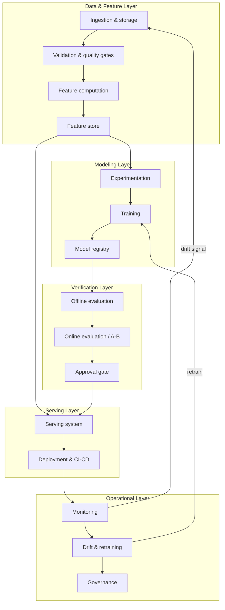

# M3 · ML System Architecture & the Reference Stack

> **Core question:** What are the parts of an ML system, and how do we reason about architecture decisions?

---

## From map to blueprint

M1 gave you the lifecycle (the *when*) and the anatomy (the *what*). M2 gave you the failure modes (the *why we care*). This module turns those into something you can design against: the **layer diagram in detail**, the **seams** between layers, the **ADR** discipline for recording decisions, and the **reference stack** — the concrete Python tooling we'll use for the rest of the course.

## The layer diagram, in detail

Every ML system, however bespoke, decomposes into the same six layers. What changes between systems is *how the layers are connected and where the seams are drawn* — and that's exactly what you'll be designing.



Each layer has a **single responsibility** and a **defined interface** to its neighbors. That's not bureaucracy — it's what makes failures *locatable*. When something breaks, you want to know *which* layer broke and *at which seam*, not "the ML is down."

## Coupling and seams

The most important architectural concept in ML systems is the **seam**: the boundary between two layers where a contract exists. A contract says: *this is the shape of what passes across this boundary, and if it changes, the change is explicit and versioned.*

Why seams matter so much here, specifically:

1. **ML systems change faster than normal systems.** Data changes, features change, models change, the world changes. Seams are where you *absorb* change without it silently propagating.
2. **Silent absorption is the enemy.** From M2: cascading failure happens when an upstream change flows downstream *unannounced*. A seam with a contract turns that silent flow into a *detected* event.

The two seams that matter most in practice:

- **The feature seam** — between feature computation and both training and serving. The contract: "features `x1..xn` are computed by *this* code, on *this* data, in *this* schema." Training and serving both consume *the same contract*. Break it, and you get training–serving skew (M6).
- **The data seam** — between ingestion and everything else. The contract: "this schema, these invariants, this freshness guarantee." Break it, and you get silent data corruption (M5).

> **⚠️ Failure mode** — *The seamless monolith.* A system where data flows from source to model with no explicit contracts works fine until it doesn't — and then the failure has no single location, because every layer silently assumed the one above it was right. The fix isn't more code; it's *seams with contracts*.

## ADRs: the tradeoff ledger, formalized

M1 introduced the tradeoff ledger. Its formal form is the **ADR — architecture decision record**. An ADR is a short document capturing one significant decision, the context, the options considered, and the consequences. It's not a spec; it's a *memory* of why the system is the way it is.

The template we'll use (a trimmed MADR-style format):

```
# ADR-001: <decision>

## Context
What problem are we solving? What constraints exist?

## Decision
What did we choose? (The actual decision, in one sentence.)

## Alternatives considered
- Option A — why not
- Option B — why not

## Consequences
- Good: what this buys us
- Bad: what this costs us (the tradeoff)
```

Every module from here on ends with design exercises that produce ADR-shaped thinking. When in doubt, the question is always: **"why this, and what does it give up?"**

> **⚖️ Tradeoff** — *Documenting vs. shipping.* ADRs feel like overhead, and they are — until the day you inherit a system with no record of why it's shaped the way it is, and every change is archaeology. The ledger entry: *chose to write ADRs, gave up some velocity, bought the ability to revisit decisions without reliving them.*

## The reference stack

A course is only concrete if it picks tools. We pick a **fixed, vendor-neutral Python stack** — the ML analog of the Harness Engineering course's "ADK + LiteLLM" choice. The principle: **no single-cloud assumption.** The concepts must transfer to whatever stack you actually run in production.

| Layer | Tool | What we use it for |
|---|---|---|
| Modeling (classical) | scikit-learn | Linear models, trees, ensembles, pipelines |
| Modeling (deep) | PyTorch | Neural networks when needed |
| Data validation | Pandera / Great Expectations | Schema contracts, quality gates |
| Experiment tracking & registry | MLflow | Params, metrics, artifacts, model versions |
| Serving | FastAPI + Docker | Online endpoints, containers |
| Serialization | ONNX, TorchScript | Portable model artifacts |
| Observability | Prometheus + Grafana | Metrics, dashboards, alerting |
| Drift detection | Evidently AI (conceptual) | Data/concept drift, PSI |
| Orchestration | Kubeflow, TFX, Airflow (conceptual) | Pipelines, scheduling |

A note on depth: we reference these at the **API level** — enough to make a concept concrete, not enough to run a production platform. Labs are deferred; the point of the stack is to make every idea *runnable in your head*.

### Why this stack

- **scikit-learn + PyTorch** covers the full spectrum from "a logistic regression is the right answer" to "this genuinely needs a neural net." Choosing between them *is itself a design decision* (M8).
- **Pandera / Great Expectations** make validation a *contract you can execute*, not a hope (M5).
- **MLflow** is the de-facto standard for tracking and registry, and it's cloud-agnostic (M7, M9).
- **FastAPI + Docker** are the workhorses of online serving and are trivial to reason about (M12, M13).
- **Prometheus + Grafana** are the standard for metrics/alerting and are not ML-specific — which is the point: ML monitoring should plug into the *same* observability the rest of your org uses (M15).
- **ONNX/TorchScript** make a model portable between training and serving runtimes — the serialization half of the feature seam (M12).

> **🐍 Reference stack at a glance** — The one tool that matters *right now* is **MLflow**: from M7 onward, every experiment we discuss is tracked, every model is registered, and "which model is in prod?" always has an answer. If you internalize one tool this course, make it MLflow.

## The first ADR

The rest of the course assumes this stack. Let's record that assumption the way we'd want it recorded in a real system — as an ADR — so you can see the discipline in action.

```
# ADR-001: Vendor-neutral Python reference stack

## Context
The course needs a concrete, runnable-in-your-head stack to make
concepts real, but must transfer to any production environment.

## Decision
Use scikit-learn + PyTorch for modeling, Pandera/Great Expectations
for validation, MLflow for tracking/registry, FastAPI + Docker for
serving, ONNX/TorchScript for serialization, Prometheus/Grafana for
observability, and treat Kubeflow/TFX/Airflow as conceptual.

## Alternatives considered
- Single-cloud stack (e.g., all-AWS SageMaker) — simpler but vendor-locks the concepts
- No stack, pure concepts — transfers but stays too abstract to be useful

## Consequences
- Good: transferable, industry-standard, every concept has a concrete surface
- Bad: not an optimized "one-click" platform; some tools stay conceptual
```

That's the template. You'll write your own before long.

## Design exercise

This is the module where you start *producing*, not just reading.

**Part A — Draw your own system.** Take the ML product you dissected in M1 and draw its layer diagram. Don't copy the generic one — draw *your product's* actual data sources, features, model, serving path, and monitoring (or the absence of monitoring, which is itself a finding). Mark every seam where you think a contract exists or *should* exist.

**Part B — Find the missing seam.** Identify the one boundary in your diagram where data flows with no explicit contract today. Write the contract that should exist there: what's the shape, the invariants, and what happens when it's violated?

**Part C — Write ADR-000.** Write your first ADR, in the template above, for one *real* decision you'd make about your product's architecture (not the course's stack — yours). It can be anything: "we'll serve batch rather than online," "we'll use a feature store," "we'll treat the model as retrainable monthly." The only requirement: it must state the tradeoff honestly in the Consequences section.

The goal is to leave this module with the reflex: **a design is a set of seams and a stack of ADRs.** Everything else is implementation.

---

*Next: Part 1 — the Data & Feature Layer. M4 · Data Engineering I: Ingestion, Storage & Point-in-Time Correctness — where training data actually comes from, and how to keep it temporally honest.*
