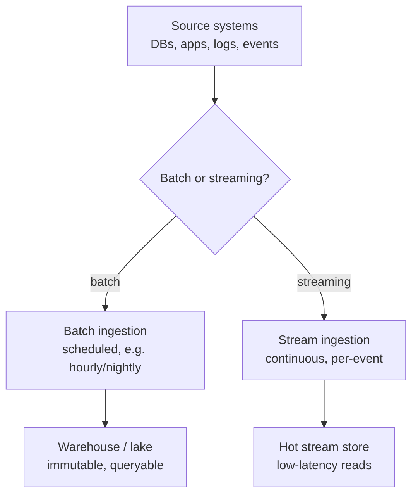
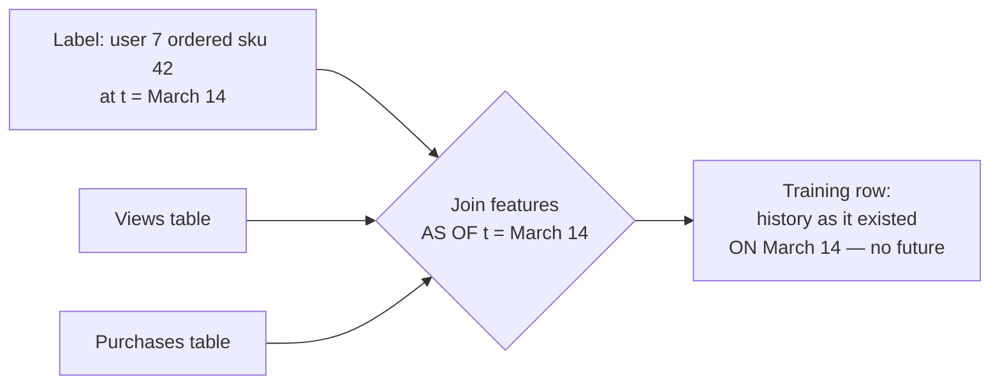

# M4 · Data Engineering I — Ingestion, Storage & Point-in-Time Correctness

> **Core question:** Where does training/serving data come from, and how do we keep it temporally honest?

---

## The recommendation model that knew the future

You're on the recommendations team at an e-commerce company. You've been asked to build a "next best product" model: given a user's browsing and purchase history, predict what they'll buy next so the home page can surface it.

You grab the company's data warehouse, join `users`, `orders`, and `product_views` into one big flat table, and train. The model is brilliant — AUC 0.94. You ship it. In production it's… fine, but not 0.94 fine. Over a few weeks the numbers settle at a mediocre 0.79, and nobody can explain the gap.

Months later, during an audit, you find the bug. When you built that flat table, you joined orders to *all* the product views the user ever made — including views that happened **after** the order you were trying to predict. The model didn't learn "what will they buy next." It learned "what did they look at, *including after they bought*" — which, for a model predicting a purchase, is the answer key to its own test.

The model wasn't wrong. It was trained on a **temporally dishonest** dataset — one that quietly let the future leak into the past. This module is about the layer that decides what "the data" even *is*, and how to keep it honest.

## The data layer is where the system lives or dies

In M1's lifecycle, the data layer is the first thing after framing — and it's the layer that most production ML failures trace back to. There's a reason M2's failure taxonomy starts with leakage and drift: **the data is the ground truth of everything downstream.** A model is only as good as the data it was trained on, and "good data" doesn't mean "a lot of data" — it means data that is *temporally honest*, *correctly labeled*, and *fed to the model the same way in training and serving*.

This module and the next two (M5, M6) cover that layer. This one is about **where the data comes from and how to keep it honest in time** — which is the foundation the other two build on.

## Sources & ingestion: batch vs. streaming

Data enters an ML system through one of two doors, and the door you pick is a *decision*, not a detail:



- **Batch ingestion** — data arrives on a schedule: an hourly dump, a nightly export. It's simple, cheap, and *stale by design*. The moment a batch lands, it's already behind the world. That's fine for training (which happens offline) and for features that don't need to be fresh.
- **Streaming ingestion** — data arrives continuously, per event, as it happens. It's fresh but expensive and operationally heavy: you now own a stream (Kafka-style topics), backpressure, and exactly-once/at-least-once delivery semantics.

The trap is assuming "real-time" is a virtue. It's a *cost*: every step toward real-time buys freshness and pays in complexity, money, and failure modes (a stream that lags, a partition that reorders, a consumer that falls behind). The M1 tradeoff ledger applies here in full force.

> **⚖️ Tradeoff** — *Freshness vs. cost vs. complexity.* You need streaming *only* for the parts of the system where a few minutes of staleness changes a decision: a fraud check on a live transaction, a price for a flash sale. For a next-best-product recommendation, an hour-old view history is just as useful as a live one. The ledger entry: *chose batch for the training path and streaming only for the online feature path, gave up universal real-time, bought a system a small team can actually operate.* "Real-time everything" is usually a statement about ambition, not requirements.

## Storage: lake, warehouse, feature store

Once data is ingested, where does it live? Three homes, three jobs:

| Store | What it is | What it's for |
|---|---|---|
| **Data lake** | Raw, immutable files (Parquet, etc.), cheap, everything lands here first | The system of record; the source of truth you can re-derive anything from |
| **Warehouse** | Structured, transformed, queryable tables (SQL) | Analytics, reporting, and *building training sets* |
| **Feature store** | Curated, versioned features, served for both training and online | The single source of features for models (M6's subject) |

The key distinction for ML is the **hot path vs. the cold path**:

- **Cold path** — the lake and warehouse. Queried by training jobs and analysts, tolerant of seconds-to-minutes of latency. This is where you *build* and *backfill* data.
- **Hot path** — the feature store's online serving side. Queried at prediction time, must return in single-digit milliseconds. This is where you *serve* data.

Mixing them is the classic blunder: a fraud model that queries the warehouse for a feature at scoring time, with a 200 ms budget, and a warehouse query that takes 800 ms. The feature store exists precisely to separate "where data is built" from "where data is served" (M6).

## Point-in-time correctness: the heart of the module

Here is the single most important idea in the data layer, and it has one rule:

> **A training example may only contain information that existed at the moment the prediction would have been made.**

Every other data-honesty principle is a corollary of this. The recommendation model failed because its training rows contained *future* product views. The fix is **point-in-time correctness** — building training sets the way the world actually looked, feature by feature, timestamp by timestamp.

The mechanism is a **point-in-time join** (also called a *time-travel query* or *as-of join*): when you join a label (the thing you're predicting) to its features, you join each feature *as it existed at the label's timestamp*, never as it exists *now*.



Concretely: for the label "user 7 bought sku 42 on March 14," you join *only* the views and purchases that happened **on or before March 14**. A view from March 20 is excluded. This is what "temporally honest" means, and it's the difference between a model that learns to predict and a model that learns the answer key.

> **⚠️ Failure mode** — *The future leak.* This is M2's **temporal leakage**, and it's the data layer's signature sin. It's insidious because the leaked feature is *correlated with the label* — the model legitimately learns it, and the inflated metrics look like success. The only defense is discipline: every feature in a training set must carry an **as-of timestamp**, and every join must be an as-of join. If you can't say "this feature's value is what the system would have seen at prediction time," you can't trust the training set.

Here is the smallest possible illustration of why the join *order* is the whole game:

```python
# Two ways to build "views in the 7 days before purchase" — only one is honest.
import pandas as pd

# views: (user, ts, sku)     orders: (user, ts, sku)   ← the label is "ordered sku"
# HONEST — count only views strictly before the order timestamp:
views_before = views[views.ts < order.ts]          # as-of the order moment

# LEAKY — count all views ever, including after the order:
views_ever = views                                     # contains the future
# The "views_ever" count correlates with the label not because it predicts
# the order, but because *the order itself* leads to more views afterward.
```

> **🐍 Reference stack at a glance** — The workhorse for point-in-time joins is **pandas/Polars**: `pd.merge_asof` (or Polars' `join_asof`) is the literal API for "join features *as of* the label timestamp." In the warehouse, the equivalent is a **time-travel SQL** query — a `BETWEEN` on `event_ts`, or a `valid_from`/`valid_to` pair on slowly-changing dimensions. The storage homes (lake/warehouse/feature store) are conceptual here; M6 makes the feature store concrete.

## Label sources & quality

Features are half the data story; **labels** are the other half, and they're usually the harder half. A label is the ground truth you're trying to predict — and for many real problems, it arrives late, partially, or never (M16 returns to this in depth).

Three label sources, in decreasing order of convenience:

1. **Direct labels** — the system already records the answer: "did the customer buy?", "was the chargeback filed?". Clean, but watch the *timing* (the chargeback arrives weeks after the transaction).
2. **Inferred labels** — you derive the truth from behavior: "didn't buy again in 90 days" as a proxy for churn. Convenient, but it's a *proxy*, and proxies carry assumptions (M16's delayed-label problem is born here).
3. **Weak supervision** — you programmatically *generate* noisy labels from rules, heuristics, or distant supervision when no clean labels exist (e.g., "any transaction over $10k to a new country is suspicious" as a weak fraud label). Cheap and scalable, but the noise is real, and the model will learn your rules' mistakes.

> **⚖️ Tradeoff** — *Label quality vs. label volume vs. label speed.* Clean labels are scarce and slow; weak labels are abundant and fast but noisy. The ledger entry: *chose a mix — direct labels where they exist, weak supervision to bootstrap coverage, gave up some label purity, bought enough volume to train at all.* The discipline is to *track label provenance*: every label should know whether it was direct, inferred, or weak, because a model trained on noisy labels needs to be evaluated against clean ones (M10).

## Design exercise

You're building a **next-best-product recommendation** model for e-commerce. The training set will join users, product views, add-to-carts, and orders.

**Part A — Sources & ingestion.** For each data source (user profile, product views, add-to-carts, orders), decide **batch or streaming** and justify it against *freshness need* and *cost*. Which sources genuinely need to be live for this model, and which can be hourly or nightly? Write the ledger entry for the one source you're most tempted to make real-time but shouldn't.

**Part B — The point-in-time join.** Define the training example precisely. What is the label (state it in one sentence: "for user U at time T, the next product purchased within 7 days is…")? For that label, list every feature you'd join, and for each, state its **as-of rule** — exactly which timestamp bounds it (before T? before T minus 7 days? a fixed window ending at T?).

**Part C — Find the leaks.** Now adversarially audit your own design. List at least **four** specific ways the future could leak into this training set. For each, name the feature, the mechanism (which join, which window), and the fix. Two to get you started: (1) a "total lifetime purchases" feature computed *after* the label time; (2) a product's *current* category used as a feature, even though the category changed after the purchase.

**Part D — Labels.** State how you'd obtain the label, its timing (when does it become available?), and whether it's direct or inferred. Then name one *weak-supervision* label you might add for cold-start users, and what noise it would introduce.

The goal: leave this module able to state, for any training example you build, *"here is what the system could have known at prediction time — and nothing else."*

---

*Next: M5 · Data Engineering II — Quality & Validation — you know where the data comes from and how to keep it temporally honest; now catch it before it poisons the model, with schema contracts and quality gates.*
