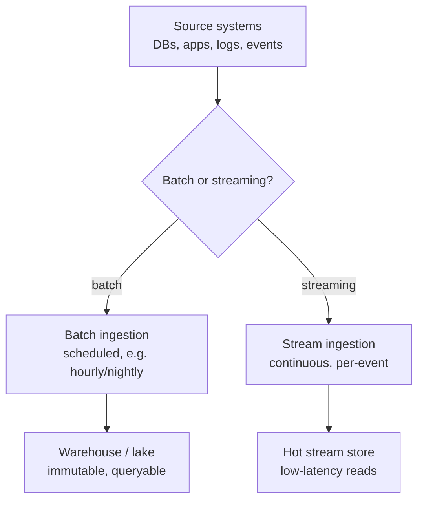
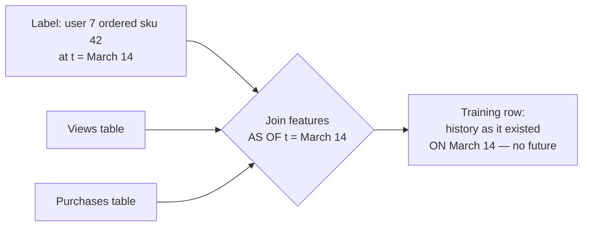

# M4 · Data Engineering I — Ingestion, Storage & Point-in-Time Correctness

> **Core question:** Where does training/serving data come from, and how do we keep it temporally honest?

---

## The recommendation model that knew the future

You're on the recommendations team at an e-commerce company. You've been asked to build a "next best product" model: given a user's browsing and purchase history, predict what they'll buy next so the home page can surface it.

You grab the company's data warehouse, join `users`, `orders`, and `product_views` into one big flat table, and train. The model is brilliant — AUC 0.94. You ship it. In production it's… fine, but not 0.94 fine. Over a few weeks the numbers settle at a mediocre 0.79, and nobody can explain the gap.

Months later, during an audit, you find the bug. When you built that flat table, you joined orders to *all* the product views the user ever made — including views that happened **after** the order you were trying to predict. The model didn't learn "what will they buy next." It learned "what did they look at, *including after they bought*" — which, for a model predicting a purchase, is the answer key to its own test.

The model wasn't wrong. It was trained on a **temporally dishonest** dataset — one that quietly let the future leak into the past. This module is about the layer that decides what "the data" even *is*, and how to keep it honest.

## The data layer is where the system lives or dies

In M1's lifecycle, the data layer is the first thing after framing — and it's the layer that most production ML failures trace back to. There's a reason M2's failure taxonomy starts with leakage and drift: **the data is the ground truth of everything downstream.** A model is only as good as the data it was trained on, and "good data" doesn't mean "a lot of data" — it means data that is *temporally honest*, *correctly labeled*, and *fed to the model the same way in training and serving*.

This module and the next two (M5, M6) cover that layer. This one is about **where the data comes from and how to keep it honest in time** — which is the foundation the other two build on.

## Sources & ingestion: batch vs. streaming

Data enters an ML system through one of two doors, and the door you pick is a *decision*, not a detail:



- **Batch ingestion** — data arrives on a schedule: an hourly dump, a nightly export. It's simple, cheap, and *stale by design*. The moment a batch lands, it's already behind the world. That's fine for training (which happens offline) and for features that don't need to be fresh.
- **Streaming ingestion** — data arrives continuously, per event, as it happens. It's fresh but expensive and operationally heavy: you now own a stream (Kafka-style topics), backpressure, and exactly-once/at-least-once delivery semantics.

The trap is assuming "real-time" is a virtue. It's a *cost*: every step toward real-time buys freshness and pays in complexity, money, and failure modes (a stream that lags, a partition that reorders, a consumer that falls behind). The M1 tradeoff ledger applies here in full force.

> **⚖️ Tradeoff** — *Freshness vs. cost vs. complexity.* You need streaming *only* for the parts of the system where a few minutes of staleness changes a decision: a fraud check on a live transaction, a price for a flash sale. For a next-best-product recommendation, an hour-old view history is just as useful as a live one. The ledger entry: *chose batch for the training path and streaming only for the online feature path, gave up universal real-time, bought a system a small team can actually operate.* "Real-time everything" is usually a statement about ambition, not requirements.

## Storage: lake, warehouse, feature store

Once data is ingested, where does it live? Three homes, three jobs:

| Store | What it is | What it's for |
|---|---|---|
| **Data lake** | Raw, immutable files (Parquet, etc.), cheap, everything lands here first | The system of record; the source of truth you can re-derive anything from |
| **Warehouse** | Structured, transformed, queryable tables (SQL) | Analytics, reporting, and *building training sets* |
| **Feature store** | Curated, versioned features, served for both training and online | The single source of features for models (M6's subject) |

The key distinction for ML is the **hot path vs. the cold path**:

- **Cold path** — the lake and warehouse. Queried by training jobs and analysts, tolerant of seconds-to-minutes of latency. This is where you *build* and *backfill* data.
- **Hot path** — the feature store's online serving side. Queried at prediction time, must return in single-digit milliseconds. This is where you *serve* data.

Mixing them is the classic blunder: a fraud model that queries the warehouse for a feature at scoring time, with a 200 ms budget, and a warehouse query that takes 800 ms. The feature store exists precisely to separate "where data is built" from "where data is served" (M6).

## Point-in-time correctness: the heart of the module

Here is the single most important idea in the data layer, and it has one rule:

> **A training example may only contain information that existed at the moment the prediction would have been made.**

Every other data-honesty principle is a corollary of this. The recommendation model failed because its training rows contained *future* product views. The fix is **point-in-time correctness** — building training sets the way the world actually looked, feature by feature, timestamp by timestamp.

The mechanism is a **point-in-time join** (also called a *time-travel query* or *as-of join*): when you join a label (the thing you're predicting) to its features, you join each feature *as it existed at the label's timestamp*, never as it exists *now*.



Concretely: for the label "user 7 bought sku 42 on March 14," you join *only* the views and purchases that happened **on or before March 14**. A view from March 20 is excluded. This is what "temporally honest" means, and it's the difference between a model that learns to predict and a model that learns the answer key.

> **⚠️ Failure mode** — *The future leak.* This is M2's **temporal leakage**, and it's the data layer's signature sin. It's insidious because the leaked feature is *correlated with the label* — the model legitimately learns it, and the inflated metrics look like success. The only defense is discipline: every feature in a training set must carry an **as-of timestamp**, and every join must be an as-of join. If you can't say "this feature's value is what the system would have seen at prediction time," you can't trust the training set.

Here is the smallest possible illustration of why the join *order* is the whole game:

```python
# Two ways to build "views in the 7 days before purchase" — only one is honest.
import pandas as pd

# views: (user, ts, sku)     orders: (user, ts, sku)   ← the label is "ordered sku"
# HONEST — count only views strictly before the order timestamp:
views_before = views[views.ts < order.ts]          # as-of the order moment

# LEAKY — count all views ever, including after the order:
views_ever = views                                     # contains the future
# The "views_ever" count correlates with the label not because it predicts
# the order, but because *the order itself* leads to more views afterward.
```

> **🐍 Reference stack at a glance** — The workhorse for point-in-time joins is **pandas/Polars**: `pd.merge_asof` (or Polars' `join_asof`) is the literal API for "join features *as of* the label timestamp." In the warehouse, the equivalent is a **time-travel SQL** query — a `BETWEEN` on `event_ts`, or a `valid_from`/`valid_to` pair on slowly-changing dimensions. The storage homes (lake/warehouse/feature store) are conceptual here; M6 makes the feature store concrete.

## Label sources & quality

Features are half the data story; **labels** are the other half, and they're usually the harder half. A label is the ground truth you're trying to predict — and for many real problems, it arrives late, partially, or never (M16 returns to this in depth).

Two label sources:

1. **Direct labels** — the system records the ground truth itself, exactly. "Did the customer close the account?", "did they buy?", "was the chargeback filed?", "did the analyst confirm the malware?". No inference, no approximation — this *is* the answer. Watch only the *timing* (the chargeback arrives weeks after the transaction; the account closure may arrive months after the churn began).

2. **Inferred labels** — everything else: you *derive* the label from signals that correlate with the truth but never confirm it 100%. One category, many methods:
   - **Behavioral proxies** — "no purchase in 90 days" as a stand-in for churn (the direct label would be "account closed"); watch time as a stand-in for "liked".
   - **Rule- / heuristic-generated labels** — "transaction > $10k to a new country ⇒ fraud" (the direct label would be a confirmed chargeback). This flavor is what the industry calls *weak supervision*.
   - **Distant supervision** — external knowledge as a label source (VirusTotal consensus, blacklists).
   - **Label functions / PU learning** — banks of noisy rules voted together, or training on positives + a sea of unlabeled data.

   All inferred labels share one property: **they're approximations.** Some are strong (watch time tracks liking fairly well), some are noisy (a single fraud rule fires on plenty of legitimate transactions), but none confirm 100% — and the model will inherit their mistakes.

> **⚖️ Tradeoff** — *Label certainty vs. volume vs. speed.* Direct labels are exact but scarce and slow; inferred labels are abundant and fast but approximate. The ledger entry: *chose a mix — direct labels where they exist, inferred labels to bootstrap coverage, gave up some certainty, bought enough volume to train at all.* The discipline is to *track label provenance*: every label should know whether it's direct or inferred, because a model trained on approximate labels needs to be evaluated against exact ones (M10).

### Label provenance(derivation) in practice: three domains

The taxonomy above isn't academic — real problems land on very different points of it. Three canonical domains, categorized. Note the pattern: each is a *mix*, and deciding the mix *is* the design decision.

**Recommendation engines — music, video, shopping**
- Core fact: the only *direct* signal of liking is the explicit thumbs-up — and it's rare; most liked videos are never thumbs-upped. Everything else (watch time, plays, completion) is *inferred* — a proxy that never confirms liking 100%. That's why recommenders lean on the inferred signals despite their uncertainty, and the label choice *is* the design decision.
- Music (Spotify):
  - **The point is a hierarchy of targets, not one label.** Spotify optimizes long-term engagement, which decomposes into nested loops on different time scales — each loop is its own task with its own label:
    - **Session loop** (seconds–minutes): "does the session continue?" → *not-skipped / completed / session-continued*
    - **Track affinity** (days–weeks): "durable preference for this track?" → *liked (heart) / re-listen within window*
    - **Artist affinity** (weeks–months): "want more of this artist?" → *artist-follow / share of listens*
    - **Discovery** (ongoing): "did we expand their taste?" → *new-artist engagement, taste diversity*
    - **Retention** (months): "will they stay?" → *active-in-N-days (churn)*
  - **Direct:** "Like" (heart → Liked Songs). Note: "Save to library" is *container-level* (albums, playlists, artists, shows) — a track inherits a save only via its container, so it's an *inferred* projection of container affinity onto the track, not a direct track-level signal.
  - **Inferred (the workhorse):** the per-loop labels above — skip/play-through (session), re-listen (affinity), follow (artist) — each an *inferred proxy* that never confirms liking 100%.
  - **Two level-confusions to avoid:**
    - *Vibe match is a feature, not a label.* "Similar to what you're listening to now" (embeddings, audio features, co-play statistics) is *input*; the session loop's label is **continuation** — did they skip, stop, or let it play.
    - *Exploration vs. exploitation is a policy, not a label.* It lives at the decision layer (bandits, ε-greedy, diversity constraints) and is a feedback-loop control: over-exploit perfect vibe matches and the system only collects data about safe matches (the filter bubble), starving the labels themselves (M2, M16).
  - **"Will they like it?" is the construct, not the target** — the hidden truth you sanity-check against, not something you can label at scale. Every operational label above is an *inferred proxy* for it, chosen per loop.
- Video (YouTube / Netflix):
  - **Direct:** like / dislike
  - **Inferred (the workhorse):** watch time, completion rate, click-through, rewatch
  - *Reasoning:* industry ranking is literally "predict engagement" — a proxy for satisfaction, not satisfaction itself
- Shopping (Amazon / Flipkart):
  - **Direct:** purchase (yes/no), returns
  - **Inferred:** click, add-to-cart, dwell time
  - *Reasoning:* the closest to direct of the three — a purchase *is* an observed outcome; returns give you a genuinely direct *negative*
- Cross-cutting, from M2/M16:
  - **Feedback loops:** what the recommender shows shapes what gets played / clicked / bought — the labels are partly the recommender's own product (the filter bubble)
  - **Timing:** engagement labels are immediate; satisfaction labels arrive months later or never

**Fraud detection with measly "report" labels**
- The trap: training only on confirmed-fraud reports fails twice — the sample is tiny, and it's biased (only *caught* fraud is labeled, i.e., the fraud your model would have caught anyway)
- **Direct (scarce, precious):** confirmed fraud — chargebacks, investigator verdicts. The true labels, but few and *delayed* (chargebacks arrive weeks later — M16). Reserve as the evaluation gold set (M10), never the whole training set
- **Inferred (the workhorse):** approximations that never confirm 100%:
  - *Rule heuristics / label functions (Snorkel-style):* "amount > threshold + new country + new device", "velocity > N", "payee never seen before", "unusual hour" — a bank of noisy rules, voted and combined into probabilistic labels
  - *Distant supervision:* known-fraudster blacklists / consortium data (other banks' confirmed fraud), known-good merchant lists
  - *PU learning:* positives + a sea of *unlabeled* (which secretly contains undetected fraud) — treat "unlabeled" as "probably negative with noise"
- One line: **inferred labels buy training coverage; direct labels buy truth — never confuse the two**

**Antivirus / cybersecurity**
- The adversarial twist: labels are *contested* — attackers actively try to make malicious look benign (M17's evasion / poisoning)
- **Direct (scarce, analyst-confirmed):** malware verdicts from human reverse-engineering — few, and biased toward *known* malware; zero-days are unlabeled by definition
- **Inferred (the workhorse):** approximations, each a different inference method:
  - *Distant supervision (the field's signature move):* VirusTotal multi-engine consensus — N of 70+ antivirus engines flagging a file ⇒ label it malware
  - *Rule heuristics:* YARA (**Yet Another Recursive Acronym**) rules ("matches a ransomware rule = malicious"), reputation feeds (IP / domain / URL blacklists for phishing and network detection), file-entropy heuristics
  - *Behavior:* sandbox detonation — observed network beacons, registry writes, file drops; "endpoint compromised" inferred from a chain of log events (C2 beaconing + privilege escalation)
  - *PU learning:* the unlabeled file corpus is *mostly* benign but contains unknown malware

<details>
<summary><strong>Inferred labels across problem sectors</strong></summary>

The two sectors above (recommendation, fraud & malware) are the deep-dives; here is the broader survey of sectors where direct labels are scarce and inferred labels are the only option.

| Sector | Example problems with inferred labels | The missing direct label (and why) |
|---|---|---|
| **Recommendation** *(done)* | music/video/shopping/content | "liked" — latent construct; proxied by engagement |
| **Fraud & malware** *(done)* | transaction fraud, malware, phishing, bot detection | confirmed fraud/malware — scarce, delayed, adversarial |
| **Healthcare & biomedicine** | diagnosis/triage, disease progression, treatment response, readmission, sepsis | confirmed diagnosis (expensive expert labels); hard outcomes like survival/progression (months–years delayed → surrogate endpoints) |
| **Finance & banking** | credit default, loan origination, LTV, insurance underwriting & claims, AML | default/loss (months–years delayed → delinquency proxies); confirmed money-laundering (scarce + adversarial) |
| **Real estate & property** | home-price valuation (Zillow's Zestimate), rental demand, property risk | **sale price** — one-shot, sparse, and a biased sample (only *transacted* homes get labeled) |
| **E-commerce & retail** | demand forecasting, product returns, customer churn, dynamic pricing | future sales (haven't occurred yet); returns/refunds (delayed); churn (future event) |
| **Marketing & advertising** | campaign response, lead scoring, LTV, multi-touch attribution | conversion (delayed); "which touchpoint caused it" (coarse-to-fine — never recorded as a fact) |
| **Manufacturing & industrial IoT** | predictive maintenance, defect detection, yield | equipment failure (rare + delayed → anomaly proxies); defect labels (expensive inspection) |
| **Energy & utilities** | demand forecasting, grid/equipment failure, outage risk | failures (rare + delayed); demand (future) |
| **Transportation & logistics** | ETA prediction, ride/delivery demand, driver & accident risk | actual arrival (realized later); accidents (rare, contested) |
| **HR & workforce** | attrition, performance rating, hiring quality | attrition (delayed); performance (subjective construct); hire success (months later) |
| **Education** | student dropout, learning outcomes, engagement | dropout (delayed); mastery (latent — test scores are imperfect proxies) |
| **Public policy & justice** | recidivism, child-welfare risk, benefit fraud | recidivism (delayed, contested); confirmed fraud (scarce + adversarial) |
| **Legal** | case-outcome prediction, document classification | case rulings (delayed); expert annotation (expensive) |

</details>

## Implementations

> **Advanced coursework.** The section above tells you *what* a label is and where it sits (direct vs. inferred). This section shows *how a practical engineer actually decides it* — the chain of thought that turns each inferred label into a verifiable, codable rule. Entries are collapsible; expand to follow the decomposition. No code yet (that's Pass 2) — here it's the algorithm, the reasoning, the decision.

<details>
<summary><strong>VirusTotal consensus ⇒ malware label</strong></summary>

**The inferred label:** "is this file malware?", derived from N antivirus engines — each a noisy detector. *(Source: a practitioner workflow where a real Mirai sample was flagged by only **6 of 75** engines.)*

**Q1 — What's the raw signal per engine?**
Each engine returns one of three states: `malicious`, `benign`, or `undetected` (no signature, or never scanned). The critical realization: **`undetected` ≠ `benign`.** An engine with no Mirai signature didn't declare the file safe — it simply failed to recognize it.

**Q2 — How do you encode it?**
Map `malicious → +1`, `benign → −1`, `undetected → 0` (neutral — contributes no evidence). If you instead map `undetected → −1` (treat "no verdict" as "clean"), you've declared Mirai benign by default — exactly the mistake the 6/75 number warns against. This is the same "missing ≠ negative" idea as exposure bias, transplanted to AV engines.

**Q3 — How do you aggregate N votes?**
Two layers of sophistication:
- *Simple:* the fraction of verdict-returning engines that flagged — `#malicious / (#malicious + #benign)`. `undetected` is dropped from the denominator: it's missing data, not a vote.
- *Weighted:* each engine carries a weight from its historical precision (how often its `malicious` calls hold up on analyst-confirmed samples). Score = `Σ wᵢ·vᵢ / Σ wᵢ`. A few high-precision engines should outweigh a noisy crowd.

**Q4 — How do you turn the score into a decision?**
Not a binary cut — a **three-way** decision, because the middle is genuinely ambiguous:
- `score ≥ t_malicious` → **malicious**
- `score ≤ t_benign` → **benign**
- otherwise → **unknown** → this feeds the *unlabeled* pool (the PU-learning setup from above, where "unlabeled" secretly contains undetected malware)

**Q5 — Where do the two thresholds come from?**
A held-out, analyst-confirmed set — the scarce *direct* labels. Sweep `t_malicious` and `t_benign`, plot precision vs. recall, and pick the operating point by cost: quarantining a false positive (a legitimate file blocked) vs. missing a false negative (Mirai walking through). The 6/75 Mirai sits at the false-negative end of that curve — a low threshold catches it, at the price of many false positives.

**The codable decision rule, in words:** for each file, gather every engine's verdict; encode each as `+1` (malicious) / `0` (undetected) / `−1` (benign) — never treating undetected as benign. Weighted-average the votes (weights = each engine's historical precision). Label **malicious** if the score clears `t_malicious`, **benign** if it falls below `t_benign`, otherwise **unknown** (unlabeled). Choose both thresholds by a precision/recall sweep on the analyst-confirmed gold set.

**The takeaway:** the whole label reduces to **one encoding choice (undetected ≠ benign) + one aggregation (weighted vote) + one threshold sweep against direct labels.**

</details>

## Design exercise

You're building a **next-best-product recommendation** model for e-commerce. The training set will join users, product views, add-to-carts, and orders.

**Part A — Sources & ingestion.** For each data source (user profile, product views, add-to-carts, orders), decide **batch or streaming** and justify it against *freshness need* and *cost*. Which sources genuinely need to be live for this model, and which can be hourly or nightly? Write the ledger entry for the one source you're most tempted to make real-time but shouldn't.

**Part B — The point-in-time join.** Define the training example precisely. What is the label (state it in one sentence: "for user U at time T, the next product purchased within 7 days is…")? For that label, list every feature you'd join, and for each, state its **as-of rule** — exactly which timestamp bounds it (before T? before T minus 7 days? a fixed window ending at T?).

**Part C — Find the leaks.** Now adversarially audit your own design. List at least **four** specific ways the future could leak into this training set. For each, name the feature, the mechanism (which join, which window), and the fix. Two to get you started: (1) a "total lifetime purchases" feature computed *after* the label time; (2) a product's *current* category used as a feature, even though the category changed after the purchase.

**Part D — Labels.** State how you'd obtain the label, its timing (when does it become available?), and whether it's direct or inferred. Then name one *inferred* (rule-generated) label you might add for cold-start users, and what noise it would introduce.

The goal: leave this module able to state, for any training example you build, *"here is what the system could have known at prediction time — and nothing else."*

---

*Next: M5 · Data Engineering II — Quality & Validation — you know where the data comes from and how to keep it temporally honest; now catch it before it poisons the model, with schema contracts and quality gates.*
