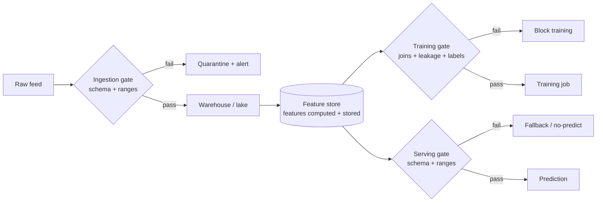

# M5 · Data Engineering II — Quality & Validation

> **Core question:** How do we catch bad data before it poisons a model?

---

## The transaction feed that changed silently

You're on the fraud team at a fintech. Your model has been stable for months. 
- Then, over a few weeks, precision quietly decays — the same slide you now recognize from M2's silent degradation. 
- You start digging and find the culprit buried in the ingestion layer: the upstream card network changed its transaction feed. 
- The `merchant_category` field, which used to be a four-digit code, now sometimes arrives as a *string description* ("RESTAURANT" instead of "5812"). 
- The `amount` field occasionally comes through as `null` for declined transactions. 
- Nobody was told, nothing crashed — the pipeline just absorbed the changes and kept feeding the model garbage.

The model didn't fail. The model was **poisoned by its data**, and the data layer had no gate that could have caught it. 
- M4 taught you where data comes from and how to keep it temporally honest. 
- This module is about the next line of defense: **validation** — making the data's *contract* explicit, and enforcing it automatically, before a single bad row reaches a model.

## Data has a contract, whether you write it down or not

Every dataset has an implicit contract — assumptions about its shape and meaning that the model silently relies on. 
- `amount` is a non-negative float. 
- `merchant_category` is a four-digit code. 
- `transaction_id` is unique. 
- `event_ts` is monotonic. 
- The model doesn't *know* these assumptions; it just behaves correctly only while they hold.

The moment those assumptions break, the model is wrong — but it's wrong *quietly*, because nothing checks. **Validation is the act of writing the contract down and enforcing it mechanically.** It turns "the data probably looks like this" into "the data is *verified* to look like this, or the pipeline stops."

> **⚠️ Failure mode** — *The silent schema change.* This is M2's **cascading failure** in its purest form: an upstream system changes (a feed, a schema, a nulling behavior) and the change flows downstream *unannounced*, because no seam declared a contract. M3's answer was "seams with contracts." Validation is what makes that seam *executable* — a gate that detects the break instead of absorbing it. If your pipeline can't tell you, on the day a column changes type, that it changed type, you don't have a pipeline; you have a hope.

## Schema validation: the contract, made executable

The first and cheapest defense is a **schema contract**: a machine-readable declaration of the expected shape of the data, checked on every batch, every stream window, every write.

```python
import pandera as pa
from pandera.typing import Series

class Transaction(pa.DataFrameModel):
    transaction_id: Series[str] = pa.Field(unique=True)
    amount: Series[float] = pa.Field(ge=0)              # non-negative
    merchant_category: Series[str] = pa.Field(str_matches=r"^\d{4}$")  # four digits
    event_ts: Series["datetime64[ns]"] = pa.Field(nullable=False)

    class Config:
        strict = True        # reject columns we didn't declare
        coerce = False       # never silently cast — fail loudly instead
```

Three things about that snippet carry the whole discipline:

1. **It fails loudly.** `strict=True` rejects unknown columns; `coerce=False` refuses to silently cast `"RESTAURANT"` into something numeric. A validation failure *raises*, it doesn't warn. That's the point: silent is how poison spreads.
2. **It's a contract, not a test suite.** The schema lives *with* the pipeline as a named, versioned artifact — the M3 "data seam" made concrete. Upstream teams can see it, and changes to it are changes to the contract.
3. **It runs everywhere.** The same schema checks training data and serving data. Validation at the door (M5) and continuous monitoring (M15's pillar 2) are the same contract, enforced at two different times.

**Note:** Read more about this [`pa.Field`](https://pandera.readthedocs.io/en/stable/reference/generated/pandera.api.dataframe.model_components.Field.html#pandera.api.dataframe.model_components.Field) here in order to know all possible checking criteria.

> **🐍 Reference stack at a glance** — **Pandera** (dataframe-native, decorators/`DataFrameModel` as above) and **Great Expectations** (expectation suites + data-docs reporting) are the two workhorses. Pandera integrates cleanly with pandas/polars and runs in-process; Great Expectations is heavier but produces human-readable data-quality reports and profiling. Pick one and enforce it everywhere; the *discipline* of a shared schema contract matters more than the library.

<details>
<summary><strong>Great Expectations in production — Data Docs & Checkpoints (alerts)</strong></summary>

GX's two production differentiators are **Data Docs** (auto-generated HTML reports) and **Checkpoints** (runnable validation with alert actions).

**How Data Docs is used in production.** Every validation run appends results — per expectation, per batch, over time — into a browsable HTML site. It's the *evidence/audit layer*, not a daily dashboard:
- **SecurityScorecard** — added GX quality checks to its scoring pipeline; the report is the mechanism that made the pipeline trustworthy ([Building Trust In Data](https://securityscorecard.com/blog/building-trust-in-data-how-we-added-data-quality-checks-to-our-scoring-data-pipeline/)).
- **Avanade** — detects **data drift from upstream model changes** ([case study](https://gxcloud.com/case-studies/how-avanade-uses-gx-to-detect-data-drift-from-upstream-model-changes-in/)).
- **Komodo Health** — quality checks + **UAT verification**; Data Docs is the persistent sign-off artifact ([case study](https://greatexpectations.io/case-studies/how-komodo-health-uses-gx-to-safeguard-their-data-pipelines-with-quality/)).
- **Catalog integration** — Data Docs feeds data catalogs (Alation/Collibra), so "is this table healthy?" is answerable where analysts browse ([blog](https://greatexpectations.io/blog/data-catalogs-and-data-quality-using-great-expectations-with-data-catalog/)).

**How Checkpoints + alerts are used.** A Checkpoint binds a suite + a batch + an action list; on run it validates, updates Data Docs, and fires alert actions on failure. First-class alert actions: **Slack**, **Email**, **Microsoft Teams**, **PagerDuty**, **Opsgenie** ([Checkpoints and Actions reference](https://legacy.017.docs.greatexpectations.io/docs/0.14.13/reference/checkpoints_and_actions/)). The `notify_on` knob (`all`/`success`/`failure`) is what makes it an *alert* (page on failure) rather than a firehose.

The practical pattern: the checkpoint runs on a schedule (Airflow/Dagster/cron) or after each batch; on failure it posts to **Slack** via webhook ([Slack action](https://legacy.017.docs.greatexpectations.io/docs/guides/validation/validation_actions/how_to_trigger_slack_notifications_as_a_validation_action/)) and/or escalates to **PagerDuty/Opsgenie** as an incident ([Email action](https://legacy.017.docs.greatexpectations.io/docs/guides/validation/validation_actions/how_to_trigger_email_as_a_validation_action/)). Slack is the default because it's low-latency and zero-setup; PagerDuty/Opsgenie are the escalation path when a failure must page an on-call rotation.

> ⚠️ **Version caveat:** most alert *how-to* docs are written against legacy 0.x (`action_list` + `class_name`); the current **GX Core 1.x** restructured checkpoints. Cross-check the [Create a Checkpoint with Actions](https://docs.greatexpectations.io/docs/core/trigger_actions_based_on_results/create_a_checkpoint_with_actions/) page for current syntax.

</details>

> **📌 TODO** — revisit this when trying to get a deeper understanding of GX's usage.

## Quality gates: validation in the pipeline

A schema check is one gate. A real pipeline needs several, at different points, because different failures appear at different depths:

1. **At the door (ingestion gate).** Validate raw data as it lands — schema, ranges, nullability. This is the earliest and cheapest place to catch the *silent schema change*. A row that fails here is rejected *before* it can contaminate anything.
2. **Before training (training gate).** Validate the *assembled training set* — joins are correct, no leakage (M4's point-in-time discipline), the label column isn't null, the class balance hasn't vanished. A model trained on a broken training set is a model you'll have to retrain.
3. **Before serving (serving gate).** Validate the features *at inference time* — same schema, same ranges as training. This is where training–serving skew (M6) gets caught at the last possible moment.



Notice the two different *responses* to failure: at ingestion you **quarantine and alert** (the data can be fixed and replayed); at serving you **fall back** (you can't fix the world in 200 ms — you degrade gracefully). Validation isn't just "reject bad data"; it's *deciding what the system does when data is bad*, at each gate.

## Drift at ingestion & anomaly detection

A schema gate catches *hard* breaks — wrong type, missing column, out-of-range value. 
- It does **not** catch *soft* breaks: the data is still the right shape, but its *distribution has moved*. 
- The `amount` field is still a non-negative float — it's just that the average transaction has quietly doubled because a new high-value product launched. 
- No schema violation; a very real change.

That's **drift at ingestion** — the M16 subject (data drift) appearing here, at the door, in its earliest detectable form. 
The cheap early-warning tool is **distributional monitoring on raw inputs**, in three checks. Each follows the same five-step discipline: (1) pick a metric and window, (2) collect a *known-good* baseline period, (3) describe the baseline's distribution, (4) set thresholds from that distribution (or from an explicit false-alert budget), (5) pre-commit the alert rule so nothing is left to runtime judgment.

### Volume and arrival rate

**What it detects.** The number of events (rows) arriving per fixed time window. A drop usually means an upstream break (a cascading failure); a spike means a retry storm or a bot.

**Deriving the baseline and thresholds.**

1. **Fix the window** (e.g., 1-minute or 1-hour buckets); the metric is *count per bucket*.
   - **What an "event" is:** one event = one row = one atomic record that just landed at ingestion (one transaction, one log line, one click). At ingestion the train/serve split doesn't exist yet — the volume metric counts *all* incoming rows, regardless of whether they later become training or inference samples.
   - **Streaming vs. batch:** this is *not* streaming-only. Streaming gives fine-grained "events per minute"; batch gives "rows per run." "This daily batch has 40k rows, it normally has 2M" is the same anomaly at one sample per run — same machinery, fewer and bigger observations (so a longer baseline is needed).

2. **Collect the baseline:** per-bucket counts from a period you *know* was healthy (no incidents, holidays, or deployments).
   - **How many buckets (the non-seasonal answer):**
       - The baseline needs *enough buckets* to estimate both λ and its spread, not a fixed span of calendar time.
       - **~100 consecutive healthy buckets** is a safe default; a few hundred gives a tighter overdispersion check (below).
       - Same count, different clock time by resolution: [exact times to be confirmed].
       - The "4–8 weeks" figure only enters with seasonality (step 5), where its job is to give each time-slice several samples — *not* how many buckets a single λ needs.
   - **Sequential, not cherry-picked:** the baseline must be one *contiguous* known-good period, not scattered buckets picked because they "look right" — that selection bias contaminates the baseline.
   - **"Healthiness" is external, not statistical:** you cannot detect "is this bucket healthy?" statistically before you have a baseline, because the baseline *defines* healthy. Healthiness comes from domain knowledge ("this was a good week"), a deployment timestamp, or "the first N buckets after a known-stable release" — not from the data itself.
   - **Interleaved health (b1,b2 good → b3–b6 bad → b7 good → b8–b9 bad → b10 good):** a single good bucket inside a bad run is noise, not recovery. Health is judged on a *run* (sustained deviation), not per-bucket — which is why step 6 uses "N of the last M," never a single blip.
   - **If you can't find healthy buckets (cold start):** when you *can* find some clean data, avoid cold start via robust statistics (median + MAD instead of mean + σ, which tolerate a minority of bad buckets) or the historical baseline from before the bad period. When there is *zero* clean history, cold start is unavoidable — the baseline can only be learned from the feed itself — and the moves are:
       - **Seed from domain knowledge.** If someone can say "we expect roughly 500–2,000 events/min," use that as the *initial* prior and let the data refine it.
       - **Bootstrap from the first N days.** Take the first 2–4 weeks as the baseline and *accept the risk* that those weeks may contain an anomaly (a bug, a bot, a launch spike) — you may bake a dirty period into "normal."
       - **Accept blindness to the first anomaly.** With zero clean history, "drift" is mathematically undefined: you cannot tell "this is the new normal" from "this is a problem," because both look like a change from nothing. The first anomaly is undetectable; you can only detect *changes after* you've established a baseline.

3. **Model the bucket count as a Gamma–Poisson mixture — the overdispersion check decides Poisson vs NB:** 
   - the rate **λ (lambda)** = the average count per bucket = (total events) ÷ (number of buckets); 
   - its spread is **σ = √λ** — the *model's* theoretical standard deviation (a population quantity of the fitted distribution), *not* a spread measured from the observed buckets (that measured spread, the sample variance is used only for the overdispersion check below).
   - **Mean example:** buckets `[10, 12, 9, 11, 13]` → λ = 55 / 5 = 11 events/min, σ = √11 ≈ 3.32.
   - **Overdispersion:** 
      - Poisson assumes *variance ≈ λ* — where "variance" means the **sample variance s²** of the *baseline* window's bucket counts (the same healthy stretch used for λ, **never the detection window**, which may contain the very anomaly you're hunting). 
      - **Compute the sample variance s² and λ, then compare them**: 
         - Check it: `[0, 0, 50, 0, 0]` has λ = 10 but s² = 400 (≫ λ): *one huge burst, mostly idle.* 
         - When **s² / λ is clearly > 1** (say > 1.5–2), the process is burstier than Poisson allows; use the **negative binomial**, which adds a dispersion parameter `r` and has variance (sample variance) = λ + λ²/r > λ, so bursts are expected rather than anomalous. thus `r` can be found out.
         - **Formulas** — Poisson: $P(X=k) = \frac{\lambda^k e^{-\lambda}}{k!}$; negative binomial: $P(X=k) = \binom{k+r-1}{k}\left(\frac{r}{r+\lambda}\right)^{r}\left(\frac{\lambda}{r+\lambda}\right)^{k}$. [See why this is doesn't look like the normal binomial PMF](#why-nb-looks-like-this)
         - **Poisson = binomial limit (why $E[X] = np = \lambda$):** 
            - $X\sim\mathrm{Binomial}(n,p)$ with $p=\lambda/n$, $n\to\infty$. 
            - $E[X]=np=\lambda$ by linearity of expectation. The PMF converges: $\binom{n}{k}\sim n^k/k!$, $p^k=\lambda^k/n^k$, and $(1-\lambda/n)^{n-k}\to e^{-\lambda}$ (a $1^\infty$ form → take $\ln$ → $0/0$ → L'Hôpital), giving $P(X=k)=\lambda^k e^{-\lambda}/k!$. 
            - Holding $\lambda=np$ fixed keeps the expected count constant while trials $\to\infty$ and per-trial probability $\to 0$; $np\to 0$ → no events, $np\to\infty$ → Normal, only $np\to\lambda$ → Poisson.
         - **Why the NB mean is $\lambda$ (not $np$):** the NB is a Gamma–Poisson mixture — $X\mid\Lambda\sim\mathrm{Poisson}(\Lambda)$ with $\Lambda\sim\mathrm{Gamma}(r,\ \text{mean }\lambda)$. Law of total expectation: $E[X]=E[\,E[X\mid\Lambda]\,]=E[\Lambda]=\lambda$. There's no $n\cdot p$ here — that identity belongs to the Binomial/Poisson; the NB's mean is just the average of the random rate.
         - **Why the NB variance is $\lambda + \lambda^2/r$:** by the law of total variance, $\mathrm{Var}(X) = E[\mathrm{Var}(X\mid\Lambda)] + \mathrm{Var}(E[X\mid\Lambda])$. Since $\mathrm{Var}(X\mid\Lambda) = \Lambda$ (a Poisson's variance equals its mean) and $E[X\mid\Lambda] = \Lambda$, this gives $\mathrm{Var}(X) = E[\Lambda] + \mathrm{Var}(\Lambda) = \lambda + \lambda^2/r$. The $\lambda$ term is the Poisson noise; the $\lambda^2/r$ term is the spread of the fluctuating rate, which vanishes as $r\to\infty$ (Poisson).
         - **Direct PMF derivation (the definition $E[X]=\sum_k k\,p(k)$ applied):**
            - **Binomial mean $=np$:** $E[X]=\sum_{k=0}^{n} k\binom{n}{k}p^k(1-p)^{n-k}$. Absorb the $k$ via $k\binom{n}{k}=n\binom{n-1}{k-1}$, factor out $np$, and the leftover sum is the binomial expansion $(p+(1-p))^{n-1}=1$, so $E[X]=np$.
            - **Poisson mean $=\lambda$:** $E[X]=e^{-\lambda}\sum_{k=1}^{\infty}\frac{k\,\lambda^k}{k!}=e^{-\lambda}\sum_{k=1}^{\infty}\frac{\lambda^k}{(k-1)!}$ (using $\frac{k}{k!}=\frac{1}{(k-1)!}$). Let $m=k-1$: $=e^{-\lambda}\,\lambda\sum_{m=0}^{\infty}\frac{\lambda^m}{m!}=e^{-\lambda}\,\lambda\,e^{\lambda}=\lambda$, where the sum is the Maclaurin series of $e^{\lambda}$.
            - **Poisson variance $=\lambda$:** compute $E[X(X-1)]$ instead of $E[X^2]$ because $\frac{k(k-1)}{k!}=\frac{1}{(k-2)!}$ cancels cleanly: $E[X(X-1)]=e^{-\lambda}\sum_{k=2}^{\infty}\frac{\lambda^k}{(k-2)!}=\lambda^2$. Then $E[X^2]=E[X(X-1)]+E[X]=\lambda^2+\lambda$, so $\mathrm{Var}(X)=(\lambda^2+\lambda)-\lambda^2=\lambda$.
      - **How r is chosen:**
         - *Method of moments* — equate the model variance to the observed sample variance, then solve for r: **r = λ² / (s² − λ)**.
         - Valid only when **s² > λ** (r positive); s² ≈ λ → r → ∞ (Poisson); s² < λ → NB invalid.
         - r is **fixed per baseline** (per time-slice with seasonality), like λ — not re-estimated per bucket.
      - **📌 TODO (drifting mean):** overdispersion has a second cause we're yet to discuss — a *drifting mean* inside the baseline window (slow growth or decline, not burstiness). That's a non-stationarity problem, not a dispersion problem: the fix is to shorten or detrend the baseline and re-estimate λ, not to switch distributions.

4. **Set the alert limits** from the fitted model — either *control limits* or *tail probability*:
   - **Control limits:** 
      - the **upper control limit (UCL) = λ + k·σ**,  the **lower control limit (LCL) = λ − k·σ** (never below 0), with k = 3. 
      - **σ is the standard deviation of the *fitted* distribution**: σ = √λ for the Poisson (so UCL = λ + k√λ), and σ = √(λ + λ²/r) for the negative binomial (so UCL = λ + k√(λ + λ²/r)). 
      - UCL/LCL are just the two boundaries of "normal variation": below LCL = abnormally few (drop / upstream break); above UCL = abnormally many (spike / retry storm).
   - **Tail probability (α):** alert when the observed count is so extreme it would occur with probability below **α/2** in the healthy baseline. **α is the tolerated false-alert rate** — α = 0.001 means "1 in 1,000 healthy buckets may false-alarm by pure chance."
   - **Bonferroni correction (many simultaneous tests):** if you monitor N buckets/metrics at once, each with its own α, false alarms add up — 1,440 minute-buckets at α = 0.001 is ≈ 1.4 false alarms/day on a healthy day. To hold the *overall* rate at α, divide per test: **α_per_test = α / N**. (Named after the statistician Carlo Emilio Bonferroni.)

5. **Remove seasonality:** arrival rate has time-of-day / day-of-week patterns, so fit a *separate λ per time-slice* — compare "this Monday-2pm bucket" to all Monday-2pm buckets in the baseline, never to "all buckets."
   - **How to use it:** define slices as (day-of-week × hour); for "Monday 2pm," collect all Monday-2pm buckets from the baseline and set λ_Monday2pm = their mean; separately λ_Saturday9am from all Saturday-9am buckets. A new Monday-2pm bucket is compared to λ_Monday2pm (and its limits), a Saturday-9am bucket to λ_Saturday9am. The predictable pattern is absorbed into the expected value, so the alarm fires only on the *surprise*.
   - **Sparse slices:** if a slice has too few baseline samples, coarsen it (merge into "9am, all days" or "weekday vs weekend"), or fit a simple forecast (expected = f(day-of-week, hour)) and alert on observed-minus-forecast.

6. **Pre-commit the trigger rule** — never a single blip. The standard form is **"N of the last M"**: alert only if *at least N of the most recent M buckets* cross the limit in the same direction. A single crossing is expected by chance (that's what α quantifies); a *run* of crossings is not.
   - **Two directions, two counters:** "crossing the limit" is *directional* — a bucket above UCL is a **spike**, a bucket below LCL is a **drop**, and they are different anomalies. Keep **two separate run counters** (one for `x > UCL`, one for `x < LCL`), each with its own N-of-M rule; never merge a spike and a drop into one "bad" flag, or a spike followed by a drop can masquerade as a run of a single anomaly.
   - **Formally:** let $b_j \in \{0,1\}$ mark whether bucket $j$ crossed the limit in that direction. Alert when
     $$\sum_{j=i-M+1}^{i} b_j \;\geq\; N .$$
   - **Why it kills false alarms:** if each bucket independently false-alarms with probability $\alpha$, the chance that $N$ or more of $M$ buckets fire *by chance* is the binomial tail
     $$P(\text{false alert}) = \sum_{k=N}^{M} \binom{M}{k}\,\alpha^{k}\,(1-\alpha)^{M-k},$$
     which collapses as $N$ grows. At $\alpha = 0.001$, "5 of 7" false-alarms with probability $\approx 2.1 \times 10^{-14}$ — essentially never.
   - **Walkthrough** ("5 of the last 7"; bad buckets are b3, b4, b5, b6, b8, b9):
     | At bucket | last 7 | bad count | alert? |
     |---|---|---|---|
     | b7 | b1–b7 | 4 | no (4 < 5) |
     | b8 | b2–b8 | 5 | yes (5 ≥ 5) |
     | b9 | b3–b9 | 6 | yes |
     | b10 | b4–b10 | 5 | yes |
     A single healthy b7 (and b10) inside the run does **not** cancel the alert — the window is majority-bad, so the episode is one continuous event, judged on the run, not the bucket.
   - **Costs:** (1) *lag* — you need M buckets before you can evaluate, and the alert fires a couple buckets after onset; (2) *a tuning choice* — larger N (relative to M) is slower but more false-positive-resistant. N and M are pre-committed once.

**The judgment runbook.**
1. Note direction (drop/spike), the window, and how many buckets tripped.
2. Check for a known cause first (deployment, maintenance, marketing, holiday).
3. Drop → look upstream (producer lag, queue depth, feed errors); spike → look for duplicates (repeated row IDs, one source IP/user-agent).
4. Confirm on raw counts, record the cause, and re-baseline if the shift is a *permanent* level change.

**Worked example.** 
- Monday-2pm baseline λ = 1,000/min, so σ ≈ 31.6 and the limits are ≈ 1,095 (upper) and ≈ 905 (lower). 
- Five consecutive 2pm buckets sit at ~150 → drop alert. 
- Human: the card-network consumer lag is climbing → the upstream producer stopped → cascading failure, not a model problem.

**Re-baselining after a permanent level shift.** 
- The core principle: **never re-baseline on volume alone** — a genuine level shift and a disguised raid (bot raid causing higher-than-usual event-volume) look identical on the volume meter (both are "sustained high"). 
- The discriminator is a *second signal*: genuine growth preserves *composition*; a raid distorts it.

- **Detect — growth vs. disguised raid.** 
    - Genuine growth means *more* people doing the same things: volume scales up **and unique identities scale up proportionally**, and the *mix* (IPs, geos, devices, user-agents) keeps the same proportions. 
    - A raid on the otherhand means the *same* few actors doing more: volume up, unique identities flat, one IP/user-agent dominating. 
    - The numeric discriminator is the **volume-to-breadth ratio** $\lambda / u$, where $u$ is the distinct-identity count (e.g., distinct IPs per minute):

  | | old normal | genuine growth | bot raid |
  |---|---|---|---|
  | λ (events/min) | 1,000 | 10,000 | 10,000 |
  | u (distinct IPs/min) | 800 | ~8,000 | ~800 |
  | λ / u | 1.25 | **1.25 (stable)** | **12.5 (blew up)** |
  | composition PSI | — | 0.08 (< 0.25) | 0.6 (> 0.25) |

  Decision rule: run the volume check **and** the per-column check together — if volume moved but breadth scaled proportionally *and* composition PSI stayed below 0.25, it's a genuine shift; otherwise it's a raid. Business corroboration (registrations / revenue / launches) is the tiebreaker.

- **Enact — CUSUM, then a stable window.** Confirm the shift is *legitimate and sustained* (not a spike) with **CUSUM** (cumulative sum), the classic change detector for a level shift:

  $$S_i = \max\!\big(0,\; S_{i-1} + x_i - (\lambda_{\text{old}} + k)\big), \qquad \text{alert when } S_i > h,$$

  with $S_0 = 0$, allowance $k = 0.5\sigma$, threshold $h = 5\sigma$, and $\sigma = \sqrt{\lambda_{\text{old}}}$ (Poisson). Noise keeps $S_i$ near 0; a real shift makes it march past $h$. Then, from the stable window alone (excluding the transition):

  $$\lambda_{\text{new}} = \frac{1}{n}\sum_{j=1}^{n} x_j, \qquad \sigma_{\text{new}} = \sqrt{\lambda_{\text{new}}},$$

  and recompute the limits: $\mathrm{UCL} = \lambda_{\text{new}} + k\sqrt{\lambda_{\text{new}}}$, $\mathrm{LCL} = \lambda_{\text{new}} - k\sqrt{\lambda_{\text{new}}}$.

- **Numeric — growth.** $\lambda_{\text{old}} = 1000$, $\sigma = \sqrt{1000} \approx 31.6$, $k \approx 16$, $h \approx 158$. CUSUM detects the shift within a few buckets (a single $x_i = 10{,}000$ gives $S_i = 10000 - 1000 - 16 = 8984 \gg h$). The stable window gives $\lambda_{\text{new}} = 10{,}000$, $\sigma_{\text{new}} = 100$. New limits: $\mathrm{UCL} = 10{,}300$, $\mathrm{LCL} = 9{,}700$.

- **Numeric — shrink.** The direction flips, the machinery doesn't. $\lambda_{\text{old}} = 10{,}000$, $\mathrm{LCL} = 9{,}700$. Volume settles at $\lambda_{\text{new}} = 2{,}000$, $\sigma_{\text{new}} = \sqrt{2000} \approx 44.7$. New limits: $\mathrm{LCL} = 2000 - 3 \cdot 44.7 \approx 1{,}866$, $\mathrm{UCL} \approx 2{,}134$. Detection is identical: CUSUM downward + breadth shrank proportionally + composition PSI stable + business corroboration.

- **The one-line rule.** Re-baseline only when (a) CUSUM confirms a sustained shift, (b) the volume-to-breadth ratio is stable, (c) composition PSI < 0.25, and (d) business signals corroborate — and estimate $\lambda_{\text{new}}$ from a stable confirmation window, never from the transition itself.

### Per-column statistics

**What it detects.** A single column's *distribution* has moved — its average/median/percentiles, its number of distinct values (cardinality), or its missingness — while the schema still "looks right."

**Deriving the baseline and thresholds.**
1. Choose the statistic per column, by type (numeric → mean, median, standard deviation, p5/p50/p95, missingness; categorical → cardinality, top-k frequencies, missingness). Document this once.
2. Collect the baseline: compute the statistic per window over the known-good period — you get a *distribution of the statistic* (e.g., 60 daily means of `amount`).
3. Describe it: its mean μ and standard deviation σ (or empirical percentiles).
4. Set thresholds:
   - *Point statistic:* alert if the current value is outside **μ ± k·σ** (k = 3) for ≥ 3 consecutive windows.
   - *Distribution (rigorous):* **PSI** (population stability index) compares the current window's distribution to the baseline, binned: `PSI = Σ (aᵢ − eᵢ)·ln(aᵢ/eᵢ)` over bins. **< 0.1 fine; 0.1–0.25 investigate; > 0.25 drift.**
   - *Cardinality:* alert if (current distinct count ÷ baseline distinct count) > 2 (vocabulary grew) or → 1 (column went constant = feed broke).
   - *Missingness:* alert if the missing rate exceeds 10× the baseline rate.
5. Apply the same seasonality fix (per time-slice baseline).

**The judgment runbook.**
1. Which column, which statistic, which direction.
2. Bulk vs. tail: a mean shift = the whole distribution moved (new product, units change); a p95 shift with a flat mean = outliers/injection.
3. Look at raw example rows — plausible (real new product) or corrupt (misparse, wrong units)?
4. Correlate with the volume check (shift + volume drop = the feed changed; shift with normal volume = the world changed).
5. Re-baseline (legit change) or fix the feed (corrupt).

**Worked example.** `amount` mean = 45.2 ± 2.1 for 8 weeks; one week it's 89.3 (≈ 21×σ), PSI = 0.41. Raw rows show every amount doubled → the upstream switched from local currency to cents (a *units* change, invisible to a type check). Fix upstream, don't retrain.

### Rare-value and new-value detection

**What it detects.** A categorical column's *vocabulary* changed — a value that never appeared (new) or reappeared after a long absence (rare). Invisible to mean/PSI when values are strings.

**Deriving the baseline and thresholds.**
1. Build a **vocabulary register** per categorical column over the baseline: each distinct value with its first-seen / last-seen timestamps and frequency.
2. Define *new* = frequency 0 in the baseline; *rare* = seen before but < 0.01% of rows, or not seen in the last N days (N = 30 is a sane default).
3. Set thresholds: alert if a *new* value exceeds **1% of a window** (a wave, not a one-off), or if a rare value unseen for N days reappears at > 1%, or if **cardinality grows > 50%** with new values dominating.
4. Pre-commit: "alert if any new value > 1% of a window, or cardinality grows > 50%."

**The judgment runbook.**
1. Which column, which value(s), at what frequency.
2. Plausible vs. corrupt: a real merchant code / ISO country code vs. garbage, a hash, or a placeholder ("9999", "N/A").
3. Plausible → vocabulary expansion: update the register; the model has never seen this value → it's extrapolating (M16 handoff).
4. Corrupt → misparse (M5's opening "RESTAURANT" vs "5812") → fix upstream.
5. Key insight: **a new value is not an error — it's evidence the model's vocabulary is stale.**

**Worked example.** `merchant_category` has 400 codes; one day "9999" (never seen) hits 3% of rows. Human: 9999 isn't a valid merchant code — it's the upstream's "unknown" placeholder → misparse → fix upstream. Contrast: a real new code "7801" appears → legit new segment → update the register; the model will be cold on it.

The principle from M15 applies here verbatim: these are **tripwires, not verdicts**. They tell you to *look*, not to act. The action — retrain, fix the feed, re-pin a feature — comes only after diagnosis.

## Data documentation & lineage

Validation tells you the data is *shaped right now*. **Documentation** tells you what the data *means* — and that's a different, harder problem. A column named `amount` could be dollars, cents, or a normalized score. A column named `status` could have a hundred meanings depending on the source.

The minimum viable data documentation:

- **A data dictionary** — for every column: its name, type, allowed values, units, and *who produces it*. This is the schema contract's prose twin.
- **Lineage** — where did this dataset come from, what transformations produced it, which upstream systems feed it. M9 and M17 do lineage for *models*; here it's lineage for *data*, and it's the same idea one layer down: when something breaks, you can walk *backward* from the broken value to its source.

> **⚖️ Tradeoff** — *Documentation vs. velocity.* Data docs are the first thing dropped under schedule pressure, and the first thing you regret dropping when a field's meaning is lost to a former employee. The ledger entry: *chose a minimal data dictionary (name, type, units, owner) enforced at schema-change time, gave up exhaustive documentation, bought a contract that survives the person who wrote it.* The schema you can enforce beats the wiki page nobody updates.

## Monitoring data quality as a first-class concern

The closing move: data quality is not a one-time gate — it's a **continuous obligation**, the same way model quality is. M15 will make this explicit as its "Pillar 2 · Data quality," but the decision belongs here: *data quality gets its own dashboards, its own alerts, its own SLOs* — not a subsection of the model dashboard.

A data-quality SLO looks like: "99.9% of transactions pass the ingestion gate; no critical feature exceeds 1% missingness over any 24-hour window; PSI on `amount` stays below 0.25 against its training reference." That's a *standing commitment*, and it's what turns the silent schema change from a three-week mystery into a same-hour alert.

> **💻 CODED DEMO (Pass 2)** — A runnable validation walkthrough: a transaction stream with a planted schema change (a `merchant_category` that flips from numeric to string), flowing through a Pandera gate. The demo shows the gate *rejecting* the bad rows, quarantining them, and firing the alert — then replays the fixed data. The "aha" is watching the same silent-change scenario from this module's opening get *caught at the door* instead of poisoning the model.

## Design exercise

You own the **fintech transaction pipeline** that feeds a fraud model. The raw feed has been stable for a year; now you're hardening it before a planned expansion to a new market (which means new payment methods, new currencies, new merchant categories).

**Part A — The schema contract.** Write the concrete schema for the transaction feed. For each of these fields — `transaction_id`, `amount`, `currency`, `merchant_category`, `device_fingerprint`, `event_ts` — state the **type**, the **constraints** (range, format, nullability, uniqueness), and *why* that constraint matters to the fraud model downstream. Then state what `strict` and `coerce` should be, and justify each.

**Part B — The three gates.** Place the three gates (ingestion, training, serving) against your pipeline. For each, state *exactly what it checks* and *what happens on failure* (quarantine? block? fallback?). Pick the one field whose violation should *halt training entirely* versus the one whose violation should merely *degrade to fallback at serving* — and defend the asymmetry.

**Part C — Adversarial review.** Now attack your own contract. List at least **four** ways bad data could still slip through your schema gate (remember: a schema catches *hard* breaks, not *soft* ones). For each, name whether it's a schema gap or a drift gap, and specify the *monitoring* signal (volume, cardinality, mean, missingness, PSI) that would catch it.

**Part D — The ADR.** Write the ADR for your validation strategy (M3 template): *"we enforce a strict Pandera schema at ingestion, training, and serving, and reject rather than coerce."* The Consequences section must name what this buys you (no silent poison) and what it costs (rejected data to replay, upstream coordination when schemas legitimately change).

The goal: leave this module able to say, for any bad row that *could* reach your model, *"which gate catches it, and what the system does when it does."*

## Appendix: Why the ingestion stream is a Gamma–Poisson mixture

**The intuition.** 
- The Poisson assumes every bucket draws from *one fixed rate* λ. 
- In reality the rate itself fluctuates bucket to bucket — some minutes are busy, some are quiet. 
- The negative binomial is the model that makes the rate a random variable: each bucket draws its own rate Λ, then counts events at that rate. 
- The overdispersion you observe (variance > mean) is the rate's fluctuation leaking into the count.

**Why Gamma, specifically.** 
- The rate Λ must be
   - **non-negative** — Gamma lives on $(0, \infty)$
   - able to express **how much it fluctuates** — the shape parameter $r$ does exactly that (large $r$ → rate tightly pinned → near-Poisson; small $r$ → rate swings wildly → bursts)
   - the **conjugate prior** for a Poisson rate — begin with a Gamma belief about the rate, observe Poisson data, and the posterior is still Gamma. 
- That conjugacy is the mathematical reason Gamma is the natural choice.

**The derivation — integrate the Poisson over the random rate.** Let $\Lambda \sim \mathrm{Gamma}(\text{shape } r,\ \text{scale } \theta)$, whose density is

$$f(\lambda') = \frac{\lambda'^{\,r-1} e^{-\lambda'/\theta}}{\theta^{\,r}\,\Gamma(r)}, \qquad \text{mean} = r\theta.$$

Force the mean to be λ by setting $\theta = \lambda/r$ (so $\mathrm{Var}(\Lambda) = r\theta^2 = \lambda^2/r$). Mix the Poisson PMF over this Gamma:

$$P(X=k) = \int_0^\infty \frac{\lambda'^{\,k} e^{-\lambda'}}{k!} \cdot \frac{\lambda'^{\,r-1} e^{-\lambda'/\theta}}{\theta^{\,r}\,\Gamma(r)}\, d\lambda'.$$

Combine the exponentials and pull the constants out:

$$P(X=k) = \frac{1}{k!\,\theta^{\,r}\,\Gamma(r)} \int_0^\infty \lambda'^{\,k+r-1}\, e^{-\lambda'(1 + 1/\theta)}\, d\lambda'.$$

The integral is a standard Gamma integral, $\int_0^\infty x^{a-1} e^{-bx}\,dx = \Gamma(a)/b^{a}$, with $a = k+r$ and $b = 1 + 1/\theta$:

$$P(X=k) = \frac{1}{k!\,\theta^{\,r}\,\Gamma(r)} \cdot \frac{\Gamma(k+r)}{(1 + 1/\theta)^{\,k+r}} = \frac{\Gamma(k+r)}{\Gamma(r)\,k!} \left(\frac{1}{1+\theta}\right)^{r} \left(\frac{\theta}{1+\theta}\right)^{k}.$$

Substitute $\theta = \lambda/r$, so $\frac{1}{1+\theta} = \frac{r}{r+\lambda}$ and $\frac{\theta}{1+\theta} = \frac{\lambda}{r+\lambda}$:

$$P(X=k) = \frac{\Gamma(k+r)}{\Gamma(r)\,k!} \left(\frac{r}{r+\lambda}\right)^{r} \left(\frac{\lambda}{r+\lambda}\right)^{k},$$

which is the negative-binomial PMF. Its variance $\lambda + \lambda^2/r$ then follows by the law of total variance (derived in the main text).

**Simplify to the binomial form.** The Γ ratio is just a binomial coefficient — $\frac{\Gamma(k+r)}{\Gamma(r)\,k!} = \binom{k+r-1}{k}$ — so the same PMF is

$$P(X=k) = \binom{k+r-1}{k} \left(\frac{r}{r+\lambda}\right)^{r} \left(\frac{\lambda}{r+\lambda}\right)^{k}.$$

Define $p = \frac{r}{r+\lambda}$ (so $1-p = \frac{\lambda}{r+\lambda}$) and this is the familiar binomial shape:

$$P(X=k) = \binom{k+r-1}{k}\, p^{r}\,(1-p)^{k}.$$

That's the binomial's mirror image — the same $C \cdot p^{\#} \cdot (1-p)^{\#}$ skeleton with the roles swapped:

- **Binomial** fixes the number of trials $n$ and counts successes: $\binom{n}{k} p^k (1-p)^{n-k}$, range $0 \le k \le n$ (bounded).
- **Negative binomial** fixes the number of successes $r$ and counts failures: $\binom{k+r-1}{k} p^r (1-p)^k$, range $k \ge 0$ (unbounded).

(Note: $\binom{k+r-1}{k}$ is only a literal combination when $r$ is a whole number; our estimated $r$ is usually fractional, in which case the Γ form above is the technically correct one and the binomial-coefficient form is the readable shorthand.)

**Why the formula looks like this (the waiting-time reading).**<a href="why-nb-looks-like-this"></a>
- The binomial-shape form $\binom{k+r-1}{k}\,p^r(1-p)^k$ has a concrete combinatorial meaning. 
- Flip a coin with success probability $p$ until $r$ successes accumulate, and let $X$ be the number of failures before the $r$-th success. 
- Then $P(X=k)$ decomposes piece by piece:
   - $\binom{k+r-1}{k}$ — the number of *orderings* of the first $k+r-1$ trials, which hold $k$ failures and $r-1$ successes in any order.
   - $p^r$ — the $r$ successes (each contributes a factor $p$).
   - $(1-p)^k$ — the $k$ failures (each contributes a factor $1-p$).

**The crucial subtlety — why $k+r-1$, not $k+r$.**
- The final trial is *forced* to be a success (it is the $r$-th success, the one that triggers stopping), so it carries no combinatorial freedom. 
- Only the first $k+r-1$ trials are free to be arranged, and the last one is pinned — which is exactly why the coefficient is over $k+r-1$ slots rather than $k+r$.

**Concrete example.** 
- $r=2$ successes, $p=\frac{1}{2}$, $P(X=3)$ = "3 failures before the 2nd success." 
- The run must end in a success; the 4 prior trials ($k+r-1 = 3+2-1 = 4$) hold 3 failures and 1 success, in $\binom{4}{3}=4$ orders: `FFFS`, `FFSF`, `FSFF`, `SFFF`. 
- Each order contributes $(1/2)^3(1/2)^1$ for the first four, times $(1/2)$ for the final success, so
- $$P(X=3) = \binom{4}{3}\cdot\left(\frac{1}{2}\right)^{2}\cdot\left(\frac{1}{2}\right)^{3} = 4\cdot\frac{1}{4}\cdot\frac{1}{8} = \frac{1}{8}.$$

---

*Next: M6 · Feature Pipelines & the Feature Store — the data is now clean and temporally honest; now compute features the same way in training and serving, so the model sees one consistent world.*
