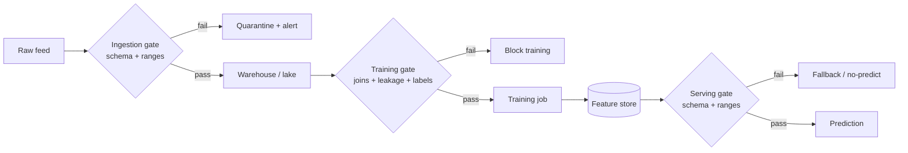

# M5 · Data Engineering II — Quality & Validation

> **Core question:** How do we catch bad data before it poisons a model?

---

## The transaction feed that changed silently

You're on the fraud team at a fintech. Your model has been stable for months. 
- Then, over a few weeks, precision quietly decays — the same slide you now recognize from M2's silent degradation. 
- You start digging and find the culprit buried in the ingestion layer: the upstream card network changed its transaction feed. 
- The `merchant_category` field, which used to be a four-digit code, now sometimes arrives as a *string description* ("RESTAURANT" instead of "5812"). 
- The `amount` field occasionally comes through as `null` for declined transactions. 
- Nobody was told, nothing crashed — the pipeline just absorbed the changes and kept feeding the model garbage.

The model didn't fail. The model was **poisoned by its data**, and the data layer had no gate that could have caught it. 
- M4 taught you where data comes from and how to keep it temporally honest. 
- This module is about the next line of defense: **validation** — making the data's *contract* explicit, and enforcing it automatically, before a single bad row reaches a model.

## Data has a contract, whether you write it down or not

Every dataset has an implicit contract — assumptions about its shape and meaning that the model silently relies on. 
- `amount` is a non-negative float. 
- `merchant_category` is a four-digit code. 
- `transaction_id` is unique. 
- `event_ts` is monotonic. 
- The model doesn't *know* these assumptions; it just behaves correctly only while they hold.

The moment those assumptions break, the model is wrong — but it's wrong *quietly*, because nothing checks. **Validation is the act of writing the contract down and enforcing it mechanically.** It turns "the data probably looks like this" into "the data is *verified* to look like this, or the pipeline stops."

> **⚠️ Failure mode** — *The silent schema change.* This is M2's **cascading failure** in its purest form: an upstream system changes (a feed, a schema, a nulling behavior) and the change flows downstream *unannounced*, because no seam declared a contract. M3's answer was "seams with contracts." Validation is what makes that seam *executable* — a gate that detects the break instead of absorbing it. If your pipeline can't tell you, on the day a column changes type, that it changed type, you don't have a pipeline; you have a hope.

## Schema validation: the contract, made executable

The first and cheapest defense is a **schema contract**: a machine-readable declaration of the expected shape of the data, checked on every batch, every stream window, every write.

```python
import pandera as pa
from pandera.typing import Series

class Transaction(pa.DataFrameModel):
    transaction_id: Series[str] = pa.Field(unique=True)
    amount: Series[float] = pa.Field(ge=0)              # non-negative
    merchant_category: Series[str] = pa.Field(str_matches=r"^\d{4}$")  # four digits
    event_ts: Series["datetime64[ns]"] = pa.Field(nullable=False)

    class Config:
        strict = True        # reject columns we didn't declare
        coerce = False       # never silently cast — fail loudly instead
```

Three things about that snippet carry the whole discipline:

1. **It fails loudly.** `strict=True` rejects unknown columns; `coerce=False` refuses to silently cast `"RESTAURANT"` into something numeric. A validation failure *raises*, it doesn't warn. That's the point: silent is how poison spreads.
2. **It's a contract, not a test suite.** The schema lives *with* the pipeline as a named, versioned artifact — the M3 "data seam" made concrete. Upstream teams can see it, and changes to it are changes to the contract.
3. **It runs everywhere.** The same schema checks training data and serving data. Validation at the door (M5) and continuous monitoring (M15's pillar 2) are the same contract, enforced at two different times.

**Note:** Read more about this [`pa.Field`](https://pandera.readthedocs.io/en/stable/reference/generated/pandera.api.dataframe.model_components.Field.html#pandera.api.dataframe.model_components.Field) here in order to know all possible checking criteria.

> **🐍 Reference stack at a glance** — **Pandera** (dataframe-native, decorators/`DataFrameModel` as above) and **Great Expectations** (expectation suites + data-docs reporting) are the two workhorses. Pandera integrates cleanly with pandas/polars and runs in-process; Great Expectations is heavier but produces human-readable data-quality reports and profiling. Pick one and enforce it everywhere; the *discipline* of a shared schema contract matters more than the library.

## Quality gates: validation in the pipeline

A schema check is one gate. A real pipeline needs several, at different points, because different failures appear at different depths:

1. **At the door (ingestion gate).** Validate raw data as it lands — schema, ranges, nullability. This is the earliest and cheapest place to catch the *silent schema change*. A row that fails here is rejected *before* it can contaminate anything.
2. **Before training (training gate).** Validate the *assembled training set* — joins are correct, no leakage (M4's point-in-time discipline), the label column isn't null, the class balance hasn't vanished. A model trained on a broken training set is a model you'll have to retrain.
3. **Before serving (serving gate).** Validate the features *at inference time* — same schema, same ranges as training. This is where training–serving skew (M6) gets caught at the last possible moment.



Notice the two different *responses* to failure: at ingestion you **quarantine and alert** (the data can be fixed and replayed); at serving you **fall back** (you can't fix the world in 200 ms — you degrade gracefully). Validation isn't just "reject bad data"; it's *deciding what the system does when data is bad*, at each gate.

## Drift at ingestion & anomaly detection

A schema gate catches *hard* breaks — wrong type, missing column, out-of-range value. It does **not** catch *soft* breaks: the data is still the right shape, but its *distribution has moved*. The `amount` field is still a non-negative float — it's just that the average transaction has quietly doubled because a new high-value product launched. No schema violation; a very real change.

That's **drift at ingestion** — the M16 subject (data drift) appearing here, at the door, in its earliest detectable form. The cheap early-warning tool is **distributional monitoring on raw inputs**:

- **Volume and arrival rate** — a sudden drop in event volume usually means an upstream break (a cascading failure); a spike means a retry storm or a bot.
- **Per-column statistics** — mean, quantiles, cardinality, missingness rate, computed on a rolling window and compared to a baseline. `merchant_category` cardinality jumping from 400 to 4,000 is a signal *before* any model metric moves.
- **Rare-value and new-value detection** — values the pipeline has never seen, or hasn't seen in a year. A new `merchant_category` code appearing en masse is either a legit market expansion or a misparse.

The principle from M15 applies here verbatim: these are **tripwires, not verdicts**. They tell you to *look*, not to act. The action — retrain, fix the feed, re-pin a feature — comes only after diagnosis.

## Data documentation & lineage

Validation tells you the data is *shaped right now*. **Documentation** tells you what the data *means* — and that's a different, harder problem. A column named `amount` could be dollars, cents, or a normalized score. A column named `status` could have a hundred meanings depending on the source.

The minimum viable data documentation:

- **A data dictionary** — for every column: its name, type, allowed values, units, and *who produces it*. This is the schema contract's prose twin.
- **Lineage** — where did this dataset come from, what transformations produced it, which upstream systems feed it. M9 and M17 do lineage for *models*; here it's lineage for *data*, and it's the same idea one layer down: when something breaks, you can walk *backward* from the broken value to its source.

> **⚖️ Tradeoff** — *Documentation vs. velocity.* Data docs are the first thing dropped under schedule pressure, and the first thing you regret dropping when a field's meaning is lost to a former employee. The ledger entry: *chose a minimal data dictionary (name, type, units, owner) enforced at schema-change time, gave up exhaustive documentation, bought a contract that survives the person who wrote it.* The schema you can enforce beats the wiki page nobody updates.

## Monitoring data quality as a first-class concern

The closing move: data quality is not a one-time gate — it's a **continuous obligation**, the same way model quality is. M15 will make this explicit as its "Pillar 2 · Data quality," but the decision belongs here: *data quality gets its own dashboards, its own alerts, its own SLOs* — not a subsection of the model dashboard.

A data-quality SLO looks like: "99.9% of transactions pass the ingestion gate; no critical feature exceeds 1% missingness over any 24-hour window; PSI on `amount` stays below 0.25 against its training reference." That's a *standing commitment*, and it's what turns the silent schema change from a three-week mystery into a same-hour alert.

> **💻 CODED DEMO (Pass 2)** — A runnable validation walkthrough: a transaction stream with a planted schema change (a `merchant_category` that flips from numeric to string), flowing through a Pandera gate. The demo shows the gate *rejecting* the bad rows, quarantining them, and firing the alert — then replays the fixed data. The "aha" is watching the same silent-change scenario from this module's opening get *caught at the door* instead of poisoning the model.

## Design exercise

You own the **fintech transaction pipeline** that feeds a fraud model. The raw feed has been stable for a year; now you're hardening it before a planned expansion to a new market (which means new payment methods, new currencies, new merchant categories).

**Part A — The schema contract.** Write the concrete schema for the transaction feed. For each of these fields — `transaction_id`, `amount`, `currency`, `merchant_category`, `device_fingerprint`, `event_ts` — state the **type**, the **constraints** (range, format, nullability, uniqueness), and *why* that constraint matters to the fraud model downstream. Then state what `strict` and `coerce` should be, and justify each.

**Part B — The three gates.** Place the three gates (ingestion, training, serving) against your pipeline. For each, state *exactly what it checks* and *what happens on failure* (quarantine? block? fallback?). Pick the one field whose violation should *halt training entirely* versus the one whose violation should merely *degrade to fallback at serving* — and defend the asymmetry.

**Part C — Adversarial review.** Now attack your own contract. List at least **four** ways bad data could still slip through your schema gate (remember: a schema catches *hard* breaks, not *soft* ones). For each, name whether it's a schema gap or a drift gap, and specify the *monitoring* signal (volume, cardinality, mean, missingness, PSI) that would catch it.

**Part D — The ADR.** Write the ADR for your validation strategy (M3 template): *"we enforce a strict Pandera schema at ingestion, training, and serving, and reject rather than coerce."* The Consequences section must name what this buys you (no silent poison) and what it costs (rejected data to replay, upstream coordination when schemas legitimately change).

The goal: leave this module able to say, for any bad row that *could* reach your model, *"which gate catches it, and what the system does when it does."*

---

*Next: M6 · Feature Pipelines & the Feature Store — the data is now clean and temporally honest; now compute features the same way in training and serving, so the model sees one consistent world.*
