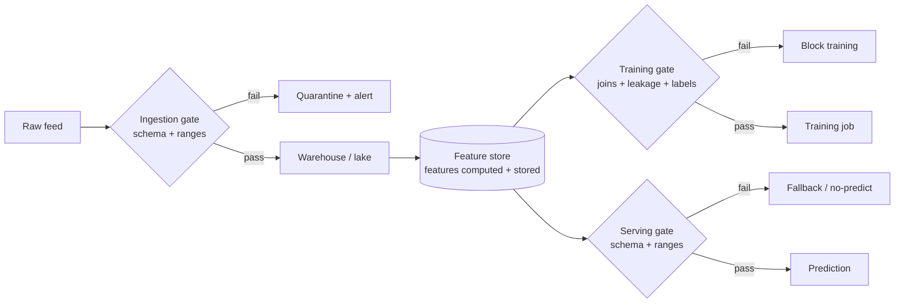
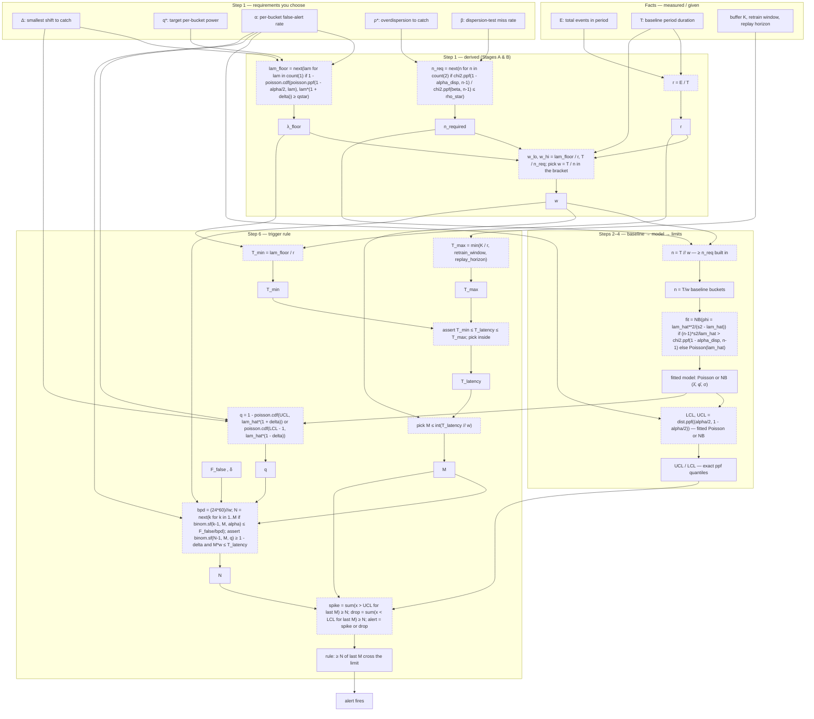

# M5 · Data Engineering II — Quality & Validation

> **Core question:** How do we catch bad data before it poisons a model?

---

## The transaction feed that changed silently

You're on the fraud team at a fintech. Your model has been stable for months. 
- Then, over a few weeks, precision quietly decays — the same slide you now recognize from M2's silent degradation. 
- You start digging and find the culprit buried in the ingestion layer: the upstream card network changed its transaction feed. 
- The `merchant_category` field, which used to be a four-digit code, now sometimes arrives as a *string description* ("RESTAURANT" instead of "5812"). 
- The `amount` field occasionally comes through as `null` for declined transactions. 
- Nobody was told, nothing crashed — the pipeline just absorbed the changes and kept feeding the model garbage.

The model didn't fail. The model was **poisoned by its data**, and the data layer had no gate that could have caught it. 
- M4 taught you where data comes from and how to keep it temporally honest. 
- This module is about the next line of defense: **validation** — making the data's *contract* explicit, and enforcing it automatically, before a single bad row reaches a model.

## Data has a contract, whether you write it down or not

Every dataset has an implicit contract — assumptions about its shape and meaning that the model silently relies on. 
- `amount` is a non-negative float. 
- `merchant_category` is a four-digit code. 
- `transaction_id` is unique. 
- `event_ts` is monotonic. 
- The model doesn't *know* these assumptions; it just behaves correctly only while they hold.

The moment those assumptions break, the model is wrong — but it's wrong *quietly*, because nothing checks. **Validation is the act of writing the contract down and enforcing it mechanically.** It turns "the data probably looks like this" into "the data is *verified* to look like this, or the pipeline stops."

> **⚠️ Failure mode** — *The silent schema change.* This is M2's **cascading failure** in its purest form: an upstream system changes (a feed, a schema, a nulling behavior) and the change flows downstream *unannounced*, because no seam declared a contract. M3's answer was "seams with contracts." Validation is what makes that seam *executable* — a gate that detects the break instead of absorbing it. If your pipeline can't tell you, on the day a column changes type, that it changed type, you don't have a pipeline; you have a hope.

## Schema validation: the contract, made executable

The first and cheapest defense is a **schema contract**: a machine-readable declaration of the expected shape of the data, checked on every batch, every stream window, every write.

```python
import pandera as pa
from pandera.typing import Series

class Transaction(pa.DataFrameModel):
    transaction_id: Series[str] = pa.Field(unique=True)
    amount: Series[float] = pa.Field(ge=0)              # non-negative
    merchant_category: Series[str] = pa.Field(str_matches=r"^\d{4}$")  # four digits
    event_ts: Series["datetime64[ns]"] = pa.Field(nullable=False)

    class Config:
        strict = True        # reject columns we didn't declare
        coerce = False       # never silently cast — fail loudly instead
```

Three things about that snippet carry the whole discipline:

1. **It fails loudly.** `strict=True` rejects unknown columns; `coerce=False` refuses to silently cast `"RESTAURANT"` into something numeric. A validation failure *raises*, it doesn't warn. That's the point: silent is how poison spreads.
2. **It's a contract, not a test suite.** The schema lives *with* the pipeline as a named, versioned artifact — the M3 "data seam" made concrete. Upstream teams can see it, and changes to it are changes to the contract.
3. **It runs everywhere.** The same schema checks training data and serving data. Validation at the door (M5) and continuous monitoring (M15's pillar 2) are the same contract, enforced at two different times.

**Note:** Read more about this [`pa.Field`](https://pandera.readthedocs.io/en/stable/reference/generated/pandera.api.dataframe.model_components.Field.html#pandera.api.dataframe.model_components.Field) here in order to know all possible checking criteria.

> **🐍 Reference stack at a glance** — **Pandera** (dataframe-native, decorators/`DataFrameModel` as above) and **Great Expectations** (expectation suites + data-docs reporting) are the two workhorses. Pandera integrates cleanly with pandas/polars and runs in-process; Great Expectations is heavier but produces human-readable data-quality reports and profiling. Pick one and enforce it everywhere; the *discipline* of a shared schema contract matters more than the library.

<details>
<summary><strong>Great Expectations in production — Data Docs & Checkpoints (alerts)</strong></summary>

GX's two production differentiators are **Data Docs** (auto-generated HTML reports) and **Checkpoints** (runnable validation with alert actions).

**How Data Docs is used in production.** Every validation run appends results — per expectation, per batch, over time — into a browsable HTML site. It's the *evidence/audit layer*, not a daily dashboard:
- **SecurityScorecard** — added GX quality checks to its scoring pipeline; the report is the mechanism that made the pipeline trustworthy ([Building Trust In Data](https://securityscorecard.com/blog/building-trust-in-data-how-we-added-data-quality-checks-to-our-scoring-data-pipeline/)).
- **Avanade** — detects **data drift from upstream model changes** ([case study](https://gxcloud.com/case-studies/how-avanade-uses-gx-to-detect-data-drift-from-upstream-model-changes-in/)).
- **Komodo Health** — quality checks + **UAT verification**; Data Docs is the persistent sign-off artifact ([case study](https://greatexpectations.io/case-studies/how-komodo-health-uses-gx-to-safeguard-their-data-pipelines-with-quality/)).
- **Catalog integration** — Data Docs feeds data catalogs (Alation/Collibra), so "is this table healthy?" is answerable where analysts browse ([blog](https://greatexpectations.io/blog/data-catalogs-and-data-quality-using-great-expectations-with-data-catalog/)).

**How Checkpoints + alerts are used.** A Checkpoint binds a suite + a batch + an action list; on run it validates, updates Data Docs, and fires alert actions on failure. First-class alert actions: **Slack**, **Email**, **Microsoft Teams**, **PagerDuty**, **Opsgenie** ([Checkpoints and Actions reference](https://legacy.017.docs.greatexpectations.io/docs/0.14.13/reference/checkpoints_and_actions/)). The `notify_on` knob (`all`/`success`/`failure`) is what makes it an *alert* (page on failure) rather than a firehose.

The practical pattern: the checkpoint runs on a schedule (Airflow/Dagster/cron) or after each batch; on failure it posts to **Slack** via webhook ([Slack action](https://legacy.017.docs.greatexpectations.io/docs/guides/validation/validation_actions/how_to_trigger_slack_notifications_as_a_validation_action/)) and/or escalates to **PagerDuty/Opsgenie** as an incident ([Email action](https://legacy.017.docs.greatexpectations.io/docs/guides/validation/validation_actions/how_to_trigger_email_as_a_validation_action/)). Slack is the default because it's low-latency and zero-setup; PagerDuty/Opsgenie are the escalation path when a failure must page an on-call rotation.

> ⚠️ **Version caveat:** most alert *how-to* docs are written against legacy 0.x (`action_list` + `class_name`); the current **GX Core 1.x** restructured checkpoints. Cross-check the [Create a Checkpoint with Actions](https://docs.greatexpectations.io/docs/core/trigger_actions_based_on_results/create_a_checkpoint_with_actions/) page for current syntax.

</details>

> **📌 TODO** — revisit this when trying to get a deeper understanding of GX's usage.

## Quality gates: validation in the pipeline

A schema check is one gate. A real pipeline needs several, at different points, because different failures appear at different depths:

1. **At the door (ingestion gate).** Validate raw data as it lands — schema, ranges, nullability. This is the earliest and cheapest place to catch the *silent schema change*. A row that fails here is rejected *before* it can contaminate anything.
2. **Before training (training gate).** Validate the *assembled training set* — joins are correct, no leakage (M4's point-in-time discipline), the label column isn't null, the class balance hasn't vanished. A model trained on a broken training set is a model you'll have to retrain.
3. **Before serving (serving gate).** Validate the features *at inference time* — same schema, same ranges as training. This is where training–serving skew (M6) gets caught at the last possible moment.



Notice the two different *responses* to failure: at ingestion you **quarantine and alert** (the data can be fixed and replayed); at serving you **fall back** (you can't fix the world in 200 ms — you degrade gracefully). Validation isn't just "reject bad data"; it's *deciding what the system does when data is bad*, at each gate.

<a id="intake-buffer"></a>

**🏗️ The intake buffer (architecture).** Producers don't push events straight to the warehouse — a **holding queue** sits between them: an **intake buffer** (a Kafka topic, a broker/spool buffer, an in-memory queue) where events wait until consumers drain them.

Why the buffer is architecturally required, not optional plumbing:
- **Decoupling:** producers and consumers don't block each other.
- **Burst absorption:** a spike fills the buffer instead of overwhelming the consumer.
- **Backpressure room:** a stalled consumer grows the buffer instead of crashing the producer.
- **Replay window:** events linger long enough to be reprocessed after a failure.

The one number that matters here: the buffer's **capacity K** (in events). 
- If consumers stall while producers keep producing at rate r, the buffer fills in ≈ **K/r** — and after that it **overflows: events are permanently dropped**. 
- So K/r is the *time until data loss*: a hard architectural ceiling on how late detection may be (used by step 6's T_max).

## Drift at ingestion & anomaly detection

A schema gate catches *hard* breaks — wrong type, missing column, out-of-range value. 
- It does **not** catch *soft* breaks: the data is still the right shape, but its *distribution has moved*. 
- The `amount` field is still a non-negative float — it's just that the average transaction has quietly doubled because a new high-value product launched. 
- No schema violation; a very real change.

That's **drift at ingestion** — the M16 subject (data drift) appearing here, at the door, in its earliest detectable form. 
The cheap early-warning tool is **distributional monitoring on raw inputs**, in three checks. Each follows the same five-step discipline: (1) pick a metric and window, (2) collect a *known-good* baseline period, (3) describe the baseline's distribution, (4) set thresholds from that distribution (or from an explicit false-alert budget), (5) pre-commit the alert rule so nothing is left to runtime judgment.

### Volume and arrival rate

**What it detects.** The number of events (rows) arriving per fixed time window. A drop usually means an upstream break (a cascading failure); a spike means a retry storm or a bot.

#### Deriving the baseline and thresholds.

<details>
<summary>1. <strong>Fix the window</strong> — bucket width w = F(Δ, q*, α, β, ρ*, E, T); the metric is <em>count per bucket</em> (e.g., 1-minute or 1-hour buckets).</summary>

   - **What an "event" is:** one event = one row = one atomic record that just landed at ingestion (one transaction, one log line, one click). At ingestion the train/serve split doesn't exist yet — the volume metric counts *all* incoming rows, regardless of whether they later become training or inference samples.
   - **Streaming vs. batch:** this is *not* streaming-only. Streaming gives fine-grained "events per minute"; batch gives "rows per run." "This daily batch has 40k rows, it normally has 2M" is the same anomaly at one sample per run — same machinery, fewer and bigger observations (so a longer baseline is needed).

   -  **Choosing the bucket width**
      -  <details>
         <summary>Stage A — decide Δ, q*, α (N and T are given facts); ρ* and β belong to Stage B's n_required determination — before you have any buckets</summary>

            - **Why a separate decision:** the bucket's *contents* (λ̂, s², the observed bucket count n) cannot choose the width — they don't exist until you bucket. Only facts you already have plus requirements you choose can fix w.
            - **Facts you already have (no bucketing needed):**
               - **T** = the baseline period's duration (e.g., 28 days = 40,320 min).
               - **E** = total events over T, counted from arrivals/logs → **r = E/T** (mean rate, events per unit time).
            - **Requirements you choose:**
               - **λ_floor** = events per bucket needed to catch your smallest meaningful shift Δ (derived below).
               - **n_required** = buckets the period must yield to reliably detect overdispersion ρ ≥ ρ\* (χ² power analysis: ≈100 to catch ρ ≥ 1.5; ≈300 for ρ ≥ 1.3).
            - **The bracket** (both ends knowable before any bucket exists):
               - **w ≥ λ_floor / r** — long enough that each bucket clears λ_floor (sensitivity).
               - **w ≤ T / n_required** — short enough that the fixed period T yields ≥ n_required buckets (stability).
            - **Empty bracket = infeasible requirements**, not a bad width choice: relax Δ (accept bigger shifts), extend T (more history), or accept fewer buckets.
            - **Busy feed:** r = 100 ev/min, T = 28 days = 40,320 min, λ_floor = 300, n_required = 300 → w ∈ [3, 134] min; pick w = 5 min → n = 8,064 buckets, λ = 500/bucket.
            - **Quiet feed (infeasible):** r = 1 ev/min, T = 7 days = 10,080 min, λ_floor = 100, n_required = 200 → w ∈ [100, 50.4] → empty. Fix: extend T to 28 days (w ≤ 201 min) or relax λ_floor to 50.

         </details>
      -  <details>
         <summary>Where λ_floor comes from — exact per-bucket detection power (no normal approximation)</summary>

            - **The question:** at λ events/bucket, is a rate shift of fraction Δ detectable? It's a two-distribution separation question, answered with the exact ppf/CDF — the same machinery the limits use.
            - **Healthy bucket:** X ~ Poisson(λ).
            - **UCL** = the exact (1 − α/2)-quantile of the healthy distribution → `poisson.ppf(1 - alpha/2, λ)` (the very ppf used to draw the limits).
            - **Shifted bucket:** X′ ~ Poisson(λ(1 + Δ)) — the rate moved by Δ.
            - **Per-bucket detection power:** q(Δ; λ) = P(X′ > UCL) = 1 − F_{λ(1+Δ)}(UCL) — the shifted distribution's CDF evaluated at the healthy threshold.
            - **The requirement:** choose a target per-bucket power **q\*** (0.5 = the "detectable" floor; 0.9 = strong). **λ_floor = the smallest λ with q(Δ; λ) ≥ q\***, read off the exact CDF. No normal anywhere.
            - **Exact values (α = 0.001 per bucket, two-sided):**

               | Δ | λ for q ≥ 0.5 | λ for q ≥ 0.9 |
               |---|---|---|
               | 10% | ≈1,130 | ≈2,180 |
               | 20% | ≈295 | ≈570 |
               | 30% | ≈135 | ≈265 |
               | 50% | ≈52 | ≈105 |

            - **Reading the table:** at λ ≈ 300 you catch a 20% shift in about half of buckets; at λ ≈ 570, in about 90% of them.
            - **NB case:** same recipe with `nbinom.ppf` / `nbinom.cdf`, shifted mean λ(1 + Δ), same dispersion φ — heavier dispersion (smaller φ) needs more λ for the same q.
            - **N-of-M note:** q is *per-bucket* power. A sustained shift across M buckets fires the run rule at far lower per-bucket q, so these λ_floor values are the honest single-bucket floor, and the run rule rides on top.

         </details>

      -  <details>
         <summary>Stage B — the overdispersion check and where n_required comes from (χ² analysis)</summary>

            - **What this check decides:** Poisson (ρ = 1) or NB (ρ > 1) — the choice that fixes σ, hence UCL/LCL. It is made from the noisy ratio s²/λ̂ (relative error ≈ √(2/n)), so the decision needs formalizing.
            - **ρ (rho) — the true variance-to-mean ratio:**
               - ρ = σ²/λ.
               - ρ = 1 ⟺ Poisson (variance = mean).
               - ρ = 1 + λ/φ > 1 ⟺ NB (overdispersed).
               - The baseline s²/λ̂ is the *sample estimate* of ρ.
            - **ρ\* — the smallest overdispersion worth catching:**
               - The threshold where NB's wider σ starts mattering for the limits (σ_NB = √(ρλ) vs σ_Poisson = √λ).
               - ρ\* ≈ 1.5 → σ ~22% wider than Poisson — worth catching.
               - Milder ρ (1.2–1.3) → σ only ~10–14% wider, and catching them costs far more buckets (n ≈ 300–500+) — usually not worth it.
            - **1 − β — the power requirement:**
               - The probability of NOT missing overdispersion ≥ ρ\*.
               - E.g., 1 − β = 0.9 → accept a 10% miss rate.
            - **α_disp — the false-alert tolerance:**
               - The tolerated probability of declaring NB on a genuinely Poisson feed.
               - E.g., α_disp = 0.05.
            - **The index-of-dispersion statistic:**
               - D = (n−1) · s²/λ̂, built from the n buckets.
               - The test is one-sided: the variance can only be too big.
            - **Its Poisson-ness (why χ² with n−1 degrees of freedom):**
               - Under H₀ (Poisson): D ~ χ²_{n−1}.
               - Reject Poisson when D > χ²_{n−1}(1−α_disp) — the rejection boundary:
                  - **χ²_{n−1}(1−α_disp) is the (1−α_disp)-quantile of the χ²_{n−1} distribution** — function notation, not (1−α_disp) multiplied by χ². The parenthetical is a probability (the argument); the output is a point on the x-axis.
                  - **It is the inverse CDF (a.k.a. quantile / percent-point function):** feed it a probability (1−α_disp), and it returns the x-axis value where the CDF reaches that probability — the value such that P(χ²_{n−1} ≤ value) = 1−α_disp, i.e., only α_disp of the mass lies above it (the same idea as `norm.ppf(1−α_disp)` for the normal).
                  - **In code:** `from scipy.stats import chi2` → `critical = chi2.ppf(1 - alpha, n - 1)` (in R: `qchisq(1 - alpha, n - 1)`).
                  - Reading the rule: reject Poisson if the measured D exceeds the value that a truly Poisson feed's D would exceed only α_disp of the time by pure chance.
               - df = n−1, not n: λ̂ is estimated from the same data, costing one degree of freedom.
            - **When ρ is detectable:**
               - Under a true variance ratio ρ, the statistic scales: D ~ ρ · χ²_{n−1}.
               - Power = P(χ²_{n−1} > c/ρ), with c = χ²_{n−1}(1−α_disp).
               - Demanding power ≥ 1−β gives the detectability condition:
                  - **ρ detectable ⟺ ρ ≥ χ²_{n−1}(1−α_disp) / χ²_{n−1}(β).**
               - The ratio shrinks toward 1 as n grows — more buckets detect smaller ρ.
            - **"Find the smallest n" → n_required:**
               - For your chosen ρ\*: n_required = the smallest n with χ²_{n−1}(1−α_disp) / χ²_{n−1}(β) ≤ ρ\*.
               - Exact values (α_disp = 0.05, power = 0.9):

                  | n | smallest ρ you reliably catch |
                  |---|---|
                  | 30 | ≈ 2.15 |
                  | 50 | ≈ 1.80 |
                  | 100 | ≈ 1.51 |
                  | 200 | ≈ 1.34 |
                  | 300 | ≈ 1.27 |

               - Reading: to catch ρ\* = 1.5, need n ≈ 100; ρ\* = 2, n ≈ 30–50; ρ\* = 1.3, n ≈ 300.
               - This n_required then feeds the width bracket: **w ≤ T / n_required**.

         </details>

</details>

<details>
<summary>2. <strong>Collect the baseline:</strong> per-bucket counts from a period you <em>know</em> was healthy (no incidents, holidays, or deployments).</summary>

   - **How many buckets the baseline holds:** **n = T/w** — you collect every bucket the fixed period T contains at the width w you chose in step 1. **n_required** (Stage B's χ² analysis) is the *minimum*: picking w inside step 1's bracket guarantees n ≥ n_required, and usually you get more.
   - **Sequential, not cherry-picked:** the baseline must be one *contiguous* known-good period, not scattered buckets picked because they "look right" — that selection bias contaminates the baseline.
   - **"Healthiness" is external, not statistical:** you cannot detect "is this bucket healthy?" statistically before you have a baseline, because the baseline *defines* healthy. Healthiness comes from domain knowledge ("this was a good week"), a deployment timestamp, or "the first N buckets after a known-stable release" — not from the data itself.
   - **Interleaved health (b1,b2 good → b3–b6 bad → b7 good → b8–b9 bad → b10 good):** a single good bucket inside a bad run is noise, not recovery. Health is judged on a *run* (sustained deviation), not per-bucket — which is why step 6 uses "N of the last M," never a single blip.
   - **If you can't find healthy buckets (cold start):** when you *can* find some clean data, avoid cold start via robust statistics (median + MAD instead of mean + σ, which tolerate a minority of bad buckets) or the historical baseline from before the bad period. When there is *zero* clean history, cold start is unavoidable — the baseline can only be learned from the feed itself — and the moves are:
       - **Seed from domain knowledge.** If someone can say "we expect roughly 500–2,000 events/min," use that as the *initial* prior and let the data refine it.
       - **Bootstrap from the first N days.** Take the first 2–4 weeks as the baseline and *accept the risk* that those weeks may contain an anomaly (a bug, a bot, a launch spike) — you may bake a dirty period into "normal."
       - **Accept blindness to the first anomaly.** With zero clean history, "drift" is mathematically undefined: you cannot tell "this is the new normal" from "this is a problem," because both look like a change from nothing. The first anomaly is undetectable; you can only detect *changes after* you've established a baseline.

</details>

<details>
<summary>3. <strong>Model the bucket count as a Gamma–Poisson mixture — the overdispersion check decides Poisson vs NB:</strong> </summary>

   - the rate **λ (lambda)** = the average count per bucket = (total events) ÷ (number of buckets); 
   - its spread is **σ = √λ** — the *model's* theoretical standard deviation (a population quantity of the fitted distribution), *not* a spread measured from the observed buckets (that measured spread, the sample variance is used only for the overdispersion check below).
   - **Mean example:** buckets `[10, 12, 9, 11, 13]` → λ = 55 / 5 = 11 events/min, σ = √11 ≈ 3.32.
   - **Overdispersion:** 
      - Poisson assumes *variance ≈ λ* — where "variance" means the **sample variance s²** of the *baseline* window's bucket counts (the same healthy stretch used for λ, **never the detection window**, which may contain the very anomaly you're hunting). 
      - **Compute the sample variance s² and λ, then compare them**: 
         - Check it: `[0, 0, 50, 0, 0]` has λ = 10 but s² = 400 (≫ λ): *one huge burst, mostly idle.* 
         - When **s² / λ is clearly > 1** (say > 1.5–2), the process is burstier than Poisson allows; use the **negative binomial**, which adds a dispersion parameter `φ` and has variance (sample variance) = λ + λ²/φ > λ, so bursts are expected rather than anomalous. thus `φ` can be found out.
         - **Formulas** — Poisson: $P(X=k) = \frac{\lambda^k e^{-\lambda}}{k!}$; negative binomial: $P(X=k) = \binom{k+φ-1}{k}\left(\frac{φ}{φ+\lambda}\right)^{φ}\left(\frac{\lambda}{φ+\lambda}\right)^{k}$. [See why this is doesn't look like the normal binomial PMF](#why-nb-looks-like-this)
         - **Poisson = binomial limit (why $E[X] = np = \lambda$):** 
            - $X\sim\mathrm{Binomial}(n,p)$ with $p=\lambda/n$, $n\to\infty$. 
            - $E[X]=np=\lambda$ by linearity of expectation. The PMF converges: $\binom{n}{k}\sim n^k/k!$, $p^k=\lambda^k/n^k$, and $(1-\lambda/n)^{n-k}\to e^{-\lambda}$ (a $1^\infty$ form → take $\ln$ → $0/0$ → L'Hôpital), giving $P(X=k)=\lambda^k e^{-\lambda}/k!$. 
            - Holding $\lambda=np$ fixed keeps the expected count constant while trials $\to\infty$ and per-trial probability $\to 0$; $np\to 0$ → no events, $np\to\infty$ → Normal, only $np\to\lambda$ → Poisson.
         - **Why the NB mean is $\lambda$ (not $np$):** the NB is a Gamma–Poisson mixture — $X\mid\Lambda\sim\mathrm{Poisson}(\Lambda)$ with $\Lambda\sim\mathrm{Gamma}(φ,\ \text{mean }\lambda)$. Law of total expectation: $E[X]=E[\,E[X\mid\Lambda]\,]=E[\Lambda]=\lambda$. There's no $n\cdot p$ here — that identity belongs to the Binomial/Poisson; the NB's mean is just the average of the random rate.
         - **Why the NB variance is $\lambda + \lambda^2/φ$:** by the law of total variance, $\mathrm{Var}(X) = E[\mathrm{Var}(X\mid\Lambda)] + \mathrm{Var}(E[X\mid\Lambda])$. Since $\mathrm{Var}(X\mid\Lambda) = \Lambda$ (a Poisson's variance equals its mean) and $E[X\mid\Lambda] = \Lambda$, this gives $\mathrm{Var}(X) = E[\Lambda] + \mathrm{Var}(\Lambda) = \lambda + \lambda^2/φ$. The $\lambda$ term is the Poisson noise; the $\lambda^2/φ$ term is the spread of the fluctuating rate, which vanishes as $φ\to\infty$ (Poisson).
         - **Direct PMF derivation (the definition $E[X]=\sum_k k\,p(k)$ applied):**
            - **Binomial mean $=np$:** $E[X]=\sum_{k=0}^{n} k\binom{n}{k}p^k(1-p)^{n-k}$. Absorb the $k$ via $k\binom{n}{k}=n\binom{n-1}{k-1}$, factor out $np$, and the leftover sum is the binomial expansion $(p+(1-p))^{n-1}=1$, so $E[X]=np$.
            - **Poisson mean $=\lambda$:** $E[X]=e^{-\lambda}\sum_{k=1}^{\infty}\frac{k\,\lambda^k}{k!}=e^{-\lambda}\sum_{k=1}^{\infty}\frac{\lambda^k}{(k-1)!}$ (using $\frac{k}{k!}=\frac{1}{(k-1)!}$). Let $m=k-1$: $=e^{-\lambda}\,\lambda\sum_{m=0}^{\infty}\frac{\lambda^m}{m!}=e^{-\lambda}\,\lambda\,e^{\lambda}=\lambda$, where the sum is the Maclaurin series of $e^{\lambda}$.
            - **Poisson variance $=\lambda$:** compute $E[X(X-1)]$ instead of $E[X^2]$ because $\frac{k(k-1)}{k!}=\frac{1}{(k-2)!}$ cancels cleanly: $E[X(X-1)]=e^{-\lambda}\sum_{k=2}^{\infty}\frac{\lambda^k}{(k-2)!}=\lambda^2$. Then $E[X^2]=E[X(X-1)]+E[X]=\lambda^2+\lambda$, so $\mathrm{Var}(X)=(\lambda^2+\lambda)-\lambda^2=\lambda$.
      - **How φ is chosen:**
         - *Method of moments* — equate the model variance to the observed sample variance, then solve for φ: **φ = λ² / (s² − λ)**.
         - Valid only when **s² > λ** (φ positive); s² ≈ λ → φ → ∞ (Poisson); s² < λ → NB invalid.
         - φ is **fixed per baseline** (per time-slice with seasonality), like λ — not re-estimated per bucket.
      - **📌 TODO (drifting mean):** overdispersion has a second cause we're yet to discuss — a *drifting mean* inside the baseline window (slow growth or decline, not burstiness). That's a non-stationarity problem, not a dispersion problem: the fix is to shorten or detrend the baseline and re-estimate λ, not to switch distributions.

</details>

<details>
<summary>4. <strong>Set the alert limits</strong> from the fitted model — fix the tolerated false-alert rate α first; the limits then follow from it:</summary>

   - **Tail probability (α):** alert when the observed count is so extreme that it would occur with probability below **α/2** in the healthy baseline.
      - **$H_0$ (null hypothesis):** the bucket's count is a normal draw from the healthy distribution fitted on the baseline (Poisson/NB) — the process is unchanged.
      - **$H_1$ (alternative hypothesis):** the count is not from that distribution — the rate has moved (spike or drop), so the bucket is anomalous.
      - **UCL/LCL are the rejection region:** a count inside [LCL, UCL] *fails to reject* $H_0$ (treated as healthy — normal variation); a count crossing either limit *rejects* $H_0$ (flagged as a probable anomaly).
      - **What α is:** the tolerated false-alert rate — **α is the probability that a perfectly healthy bucket still lands beyond UCL/LCL purely by chance (hence the name *false-alarm alert*), because the healthy distribution itself has real tails.** α = 0.001 means "1 in 1,000 healthy buckets may false-alarm by pure chance."
   - **Set the limits from the fitted distribution's quantiles (ppf — no normal approximation):**
      - **UCL** = the smallest integer $c$ such that $P(X \le c) = \sum_{k=0}^{c} \frac{\lambda^k e^{-\lambda}}{k!} \ge 1 - \frac{\alpha}{2}$ → in code: `poisson.ppf(1 - alpha/2, lam)` (Poisson) or `nbinom.ppf(1 - alpha/2, φ, φ/(φ+lam))` (NB).
      - **LCL** = the largest integer $c$ such that $P(X \le c-1) = \sum_{k=0}^{c-1} \frac{\lambda^k e^{-\lambda}}{k!} \le \frac{\alpha}{2}$ → in code: `poisson.ppf(alpha/2, lam)` (Poisson) or `nbinom.ppf(alpha/2, φ, φ/(φ+lam))` (NB).
      - These are the $\alpha/2$ and $1-\alpha/2$ **quantiles** of the fitted distribution — exact at every λ and φ. (The $\lambda \pm k\sigma$ "3σ" form is only the pre-computer normal *approximation* to these quantiles at large λ, and is **not used** for the limits.)
      - **The fitted distribution's spread (for reference):** σ = √λ for the Poisson; σ = √(λ + λ²/φ) for the negative binomial.
         - yes, sigma is quite literally the sample standard deviation for NB case.
      - UCL/LCL are the two boundaries of "normal variation": below LCL = abnormally few (drop / upstream break); above UCL = abnormally many (spike / retry storm).

</details>

<details>
<summary>5. <strong>Remove seasonality:</strong> arrival rate has time-of-day / day-of-week patterns, so fit a <em>separate λ per time-slice</em> — compare "this Monday-2pm bucket" to all Monday-2pm buckets in the baseline, never to "all buckets."</summary>

   - **How to use it:** define slices as (day-of-week × hour); for "Monday 2pm," collect all Monday-2pm buckets from the baseline and set λ_Monday2pm = their mean; separately λ_Saturday9am from all Saturday-9am buckets. A new Monday-2pm bucket is compared to λ_Monday2pm (and its limits), a Saturday-9am bucket to λ_Saturday9am. The predictable pattern is absorbed into the expected value, so the alarm fires only on the *surprise*.
   - **Sparse slices:** if a slice has too few baseline samples, coarsen it (merge into "9am, all days" or "weekday vs weekend"), or fit a simple forecast (expected = f(day-of-week, hour)) and alert on observed-minus-forecast.

</details>

<details>
<summary>6. <strong>Pre-commit the trigger rule</strong> — the rule (N, M) = G(α, Δ, w, λ, T_latency, F_false, δ); alert only if <em>at least N of the most recent M buckets</em> cross the limit in the same direction. A single crossing can occur by chance (that's what α quantifies); a <em>run</em> of crossings is not.</summary>

   - **New params this stage introduces:** 
      - **M** (look-back window), **N** (trigger count — the deliverable), 
      - **T_latency** (picked inside [T_min, T_max]), 
      - **F_false** (tolerated false alerts per day), 
      - **δ** (tolerated run-rule miss rate).
   - **Borrowed from steps 1–5 (the rest of G):** α (false-alert rate, step 1/4), Δ and w (step 1), λ and q (steps 2–3 — q = per-bucket power at Δ), r (feed rate).
   - **Two directions, two counters:** "crossing the limit" is *directional* — a bucket above UCL is a **spike**, a bucket below LCL is a **drop**, and they are different anomalies.  \
   Keep **two separate run counters** (one for `x > UCL`, one for `x < LCL`), each with its own N-of-M rule; never merge a spike and a drop into one "bad" flag, or a spike followed by a drop can masquerade as a run of a single anomaly.
   - **Formally:** let $b_j \in \{0,1\}$ mark whether bucket $j$ crossed the limit in that direction. Alert when
     $$\sum_{j=i-M+1}^{i} b_j \;\geq\; N .$$
   - **Why it kills false alarms:** if each bucket independently false-alarms with probability $\alpha$, the chance that $N$ or more of $M$ buckets fire *by chance* is the binomial tail
     $$P(\text{false alert}) = \sum_{k=N}^{M} \binom{M}{k}\,\alpha^{k}\,(1-\alpha)^{M-k},$$
     which collapses as $N$ grows. At $\alpha = 0.001$, "5 of 7" false-alarms with probability $\approx 2.1 \times 10^{-14}$ — essentially never.
   - **T_latency — a corridor, not a guess:**
      - **T_min (physical resolution floor, no N needed):** a bucket must hold ≥ λ_floor events to even *see* a Δ shift → **T_min = w_min = λ_floor/r** (one minimal bucket — alerts are evaluated once per bucket, so you can't react faster than that). The run rule's own slowness (needs ~N buckets to fire) is *not* part of T_min — side 2's **M·w ≤ T_latency** enforces it after (N, M) are solved.
      - **T_max (system ceilings, measurable):** min of [the intake buffer's](#intake-buffer) overflow time (K events ÷ r, the production rate), the retrain/feature-freshness window, and the replay/retention horizon.
         - **K = the intake buffer's capacity** — the holding queue between producers and consumers ([what it is and why it's architecturally required](#intake-buffer)).
         - Overflow scenario: consumers stall while producers keep producing at rate r → buffer fills in ≈ K/r → then events are dropped permanently.
         - So K/r = *time until data loss* — detection must land before it. It's a hard ceiling because the buffer is architecture you don't control from the alerting code.
      - **Workflow:** pick T_latency → check T_min ≤ T_latency ≤ T_max → set M ≤ T_latency/w → solve (N, M) from Sides 1 and 2 → side 2's M·w ≤ T_latency doubles as the "does the rule fire in time?" check; if no (N, M) satisfies both sides at your T_latency, raise T_latency and retry.
   - **How (N, M) are actually fixed — two sides, both exact:**
      - **Side 1 — false alarms must stay within budget (healthy feed):**
         - Per-window chance that "N of M" fires *by chance* = binomial tail at α:
     $$B_{\text{false}}(N, M, \alpha) = \sum_{k=N}^{M}\binom{M}{k}\alpha^{k}(1-\alpha)^{M-k}$$
         - Requirement: B_false ≤ (false alarms tolerated per day) ÷ (buckets per day).
         - Bigger N (or N close to M) → rarer false alarms.
      - **Side 2 — a real sustained shift must be caught:**
         - Once a shift has been present for ≥ M buckets, every bucket crosses with probability q.
         - Chance the run rule fires = binomial tail at q:
     $$B_{\text{true}}(N, M, q) = \sum_{k=N}^{M}\binom{M}{k}q^{k}(1-q)^{M-k}$$
         - Requirement: B_true ≥ 1 − δ (e.g., ≥ 0.95).
         - Latency cap: the run rule needs M buckets → **M·w ≤ T_latency**.
   - **Worked example — real numbers to a range:**
      - Feed rate **r = 1,000 ev/min** (per-bucket mean λ = r·w, i.e., 1,000 ev/bucket at w = 1 min); must catch Δ = 30% drop at q* = 0.5.
      - Operational budgets: **F_false = 1 false alarm/day**; **δ = 0.05** → Side 2 must clear **B_true ≥ 1 − δ = 0.95**.
      - Step 1's exact table: Δ = 30%, q ≥ 0.5 → λ_floor ≈ 135 ev/bucket (same unit as λ) → w_min = λ_floor/r ≈ 135/1000 ≈ 0.14 min ≈ 8 s.
      - T_min = w_min ≈ 8 s (one minimal bucket — no N assumed).
      - T_max = min(buffer overflow 45 min, retrain window 60 min) = 45 min.
      - **T_latency ∈ [≈ 8 s, 45 min]** → pick 10 min.
      - M ≤ T_latency/w = 10/1 → M ≤ 10 (with w = 1 min). Take M = 7.
      - Side 1 (F_false = 1/day): α = 0.001 at 1,440 buckets/day → need B_false ≤ 1/1440 ≈ 7×10⁻⁴; "5 of 7" gives ≈ 2×10⁻¹⁴ ✓.
      - Side 2 (δ = 0.05): at w = 1 min, λ per bucket = 1,000 → q(30%) ≈ 1 → B_true(5,7) ≈ 1 ≥ 0.95 ✓.
      - Verdict: **w = 1 min, T_latency = 10 min, (N, M) = (5, 7)** — derived, not guessed.
   - **Walkthrough** ("5 of the last 7"; bad buckets are b3, b4, b5, b6, b8, b9):
     | At bucket | last 7 | bad count | alert? |
     |---|---|---|---|
     | b7 | b1–b7 | 4 | no (4 < 5) |
     | b8 | b2–b8 | 5 | yes (5 ≥ 5) |
     | b9 | b3–b9 | 6 | yes |
     | b10 | b4–b10 | 5 | yes |
     A single healthy b7 (and b10) inside the run does **not** cancel the alert — the window is majority-bad, so the episode is one continuous event, judged on the run, not the bucket.
   - **Costs:** (1) *lag* — you need M buckets before you can evaluate, and the alert fires a couple buckets after onset; (2) *a tuning choice* — larger N (relative to M) is slower but more false-positive-resistant. N and M are pre-committed once.

</details>

---

<details>
<summary><strong>Worked example — the full chain: steps 1–6 to "when does the alert fire?"</strong></summary>


- **Step 1 — Fix the window** (Stage A: λ_floor + bracket; Stage B: n_required).
   - **Hyperparameters assumed:** **Δ = 30%** (smallest drop we must catch), **q\* = 0.5** (target per-bucket power), **α = 0.001** (per-bucket false-alert rate, two-sided), **ρ\* = 1.5** (smallest overdispersion worth catching).
   - **Facts:** baseline period **T = 28 days = 40,320 min**; measured rate **r = 1,000 events/min** (E ≈ 40.3M events over T).
   - λ_floor 
      - from the exact power condition: the smallest λ s.t. per-bucket power q(Δ; λ) ≥ q*, where q(Δ; λ) = 1 − F_{λ(1+Δ)}(UCL)
      - UCL = `poisson.ppf(1 − α/2, λ)`. 
      - With Δ = 0.30, q* = 0.5, α = 0.001: **λ_floor ≈ 135 events/bucket**.
   - `n_required` — from the Stage B power condition: the smallest n with χ²_{n−1}(1−α_disp)/χ²_{n−1}(β) ≤ ρ\* (α_disp = 0.05, β = 0.10 → 90% power). With ρ\* = 1.5: **n_required ≈ 100 buckets**.
   - Bracket: `w ∈ [λ_floor/r, T/n_required]` = `[135/1000, 40320/100]` ≈ **`[0.14 min, 403 min]`**.
   - **Choose w = 1 min** → per-bucket mean λ = r·w = 1,000 events/bucket.
- **Step 2 — Collect the baseline.**
   - No new hyperparameters — uses step 1's w and the facts.
   - Buckets in the period: n = T/w = 40,320 ≥ n_required (100) ✓.
   - One contiguous, known-healthy stretch (no incidents, holidays, or deployments).
- **Step 3 — Model the bucket count** (Gamma–Poisson; the overdispersion check decides).
   - From the baseline: **λ̂ ≈ 1,000 events/bucket** (sample mean); measure the sample variance s².
   - Overdispersion check: assume s²/λ̂ ≈ 1.05 ≈ 1 → **stay Poisson** (had s²/λ̂ been > ~1.5, fit NB with φ = λ²/(s²−λ)).
   - Fitted model: **Poisson(λ̂ = 1,000)** → σ = √λ̂ ≈ 31.6.
- **Step 4 — Set the alert limits** (exact ppf — no normal approximation).
   - **Hyperparameters assumed:** **α = 0.001** (carried from step 1).
   - **UCL = poisson.ppf(1 − 0.001/2, 1,000) ≈ 1,104**; **LCL = poisson.ppf(0.001/2, 1,000) ≈ 896**.
   - Meaning: a healthy bucket falls below LCL or above UCL with probability α/2 per side.
- **Step 5 — Remove seasonality.**
   - **Assumption: this feed has no time-of-day / day-of-week pattern** → one λ and one set of limits serve every bucket (step 5 is vacuous here).
- **Step 6 — Pre-commit the trigger rule** ((N, M) = G(α, Δ, w, λ, T_latency, F_false, δ)).
   - **Hyperparameters assumed:** **F_false = 1 false alarm/day**, **δ = 0.05** (catch a sustained shift with ≥ 95%).
   - Corridor: **T_min = w_min = λ_floor/r ≈ 8 s**; **T_max = 45 min** (intake-buffer overflow, the binding ceiling) → **choose T_latency = 10 min**.
   - **M ≤ T_latency/w = 10** → pick **M = 7**.
   - Side 1 (false alarms): B_false(N, 7, 0.001) ≤ 1/1440 ≈ 7×10⁻⁴ → holds for N ≥ 2; pick **N = 5** for margin (B_false(5,7) ≈ 2×10⁻¹⁴).
   - Side 2 (detection): at λ = 1,000/bucket a 30% drop trips almost every bucket (q ≈ 1) → B_true(5,7) ≈ 1 ≥ 0.95 ✓; and M·w = 7 min ≤ T_latency = 10 min ✓.
   - **Committed rule: fire the alert when ≥ 5 of the last 7 buckets cross below LCL ≈ 896 (drop) or above UCL ≈ 1,104 (spike).**
- **When the alert fires.**
   - Live drop day: buckets land at ~150 events/min (≈ an 85% drop).
   - Each is far below LCL (150 ≪ 896) → counts as a crossing.
   - The fifth crossing makes it "5 of the last 7" → **the alert fires**.
   - (What you do next — find the cause — is the judgment runbook below.)

</details>

<details>
<summary><strong>Worked example — the overdispersed feed (NB forced)</strong></summary>


- **Step 1 — Fix the window** (same requirement set as Example A).
   - **Hyperparameters assumed:** **Δ = 30%**, **q\* = 0.5**, **α = 0.001**, **ρ\* = 1.5**; **facts:** **T = 28 days = 40,320 min**, **r = 1,000 events/min**.
   - λ_floor ≈ 135 events/bucket; n_required ≈ 100; bracket ≈ [0.14 min, 403 min] → **choose w = 1 min** (λ = 1,000 events/bucket).
- **Step 2 — Collect the baseline.**
   - n = T/w = 40,320 buckets ≥ n_required (100) ✓; one contiguous, known-healthy stretch.
- **Step 3 — Model the bucket count** (this is where Example B diverges).
   - Observed from the baseline: **λ̂ ≈ 1,000 events/bucket**, but **s² ≈ 3,000** → s²/λ̂ = 3 ≫ 1.
   - Index-of-dispersion: D = (n−1)·s²/λ̂ ≈ 40,319 × 3 ≈ 1.2×10⁵ ≫ χ²_{n−1}(0.95) → **reject Poisson**.
   - **NB forced:** **φ̂ = λ̂²/(s² − λ̂) = 10⁶/2,000 = 500**; **σ = √(λ̂ + λ̂²/φ̂) = √3,000 ≈ 54.8** (Poisson's 31.6 would understate the spread).
- **Step 4 — Set the alert limits** (quantiles of the NB, not the Poisson).
   - **Hyperparameters assumed:** **α = 0.001** (carried from step 1).
   - **UCL = nbinom.ppf(1 − α/2, φ̂, φ̂/(φ̂+λ̂)) ≈ 1,180**; **LCL ≈ 820** — versus Poisson's ≈ 1,104 / 896.
   - Meaning: under NB, healthy bursts legitimately reach ≈ 1,180; the wider band is correct, not lax.
- **Step 5 — Remove seasonality.**
   - **Assumption: no day-of-week / hour pattern** → one model and one set of limits (vacuous here, as in Example A).
- **Step 6 — Pre-commit the trigger rule** (same budgets, same solve as Example A).
   - **Hyperparameters assumed:** **F_false = 1 false alarm/day**, **δ = 0.05**.
   - Corridor: T_min ≈ 8 s; T_max = 45 min → **T_latency = 10 min** → **M ≤ 10 → M = 7**; Side 1 → **N = 5** ✓.
   - Side 2: at a 30% drop under NB (shifted mean 700, σ ≈ 41) per-bucket q ≈ 0.998 → B_true(5,7) ≈ 1 ✓; M·w = 7 min ≤ 10 min ✓.
   - **Committed rule: alert when ≥ 5 of the last 7 buckets cross below LCL ≈ 820 or above UCL ≈ 1,180.**
- **Why the NB choice matters (live scenarios).**
   - Normal burst bucket at 1,150: inside the NB band (1,150 < 1,180) → **silent** — the same bucket under Poisson's limits (UCL 1,104) would **false-alarm**.
   - True drop to ~150: far below LCL (820) → "5 of the last 7" → **alert fires** (upstream break — the runbook's job).


</details>

#### Hyperparameter dependency graph

<details>
<summary><strong>Dependency graph with the code</strong> — every edge's weight: the shortest Python that computes each sink from its sources; the code segment (dotted border) sits between the sources and the sink</summary>


</details>

---

#### The judgment runbook.
1. Note direction (drop/spike), the window, and how many buckets tripped.
2. Check for a known cause first (deployment, maintenance, marketing, holiday).
3. Drop → look upstream (producer lag, queue depth, feed errors); spike → look for duplicates (repeated row IDs, one source IP/user-agent).
4. Confirm on raw counts, record the cause, and re-baseline if the shift is a *permanent* level change.

---

#### Re-baselining after a permanent level shift.** 
- The core principle: **never re-baseline on volume alone** — a genuine level shift and a disguised raid (bot raid causing higher-than-usual event-volume) look identical on the volume meter (both are "sustained high"). 
- The discriminator is a *second signal*: genuine growth preserves *composition*; a raid distorts it.

<details>
<summary><strong>User identity-blind upstream (a proprietary feed we are a customer of): structural confirmation</strong></summary>

   - When the events carry no identity we can see: not privy to the sign-ups or the user activity on the vendor's side that raised the stream's frequency — all we observe is that the frequency increased.
   - **Why permanence is only *confirmed*, never detected at onset.** The algorithm never decides permanent baseline shift at onset; it waits a pre-committed **confirmation horizon H** and then tests whether the new level *holds* and *looks like the same process*. 
      - Re-baselining early is the only expensive mistake (it bakes the anomaly into "normal" and silences future alarms for the same cause); re-baselining late only costs repeated alerts. \
      **Default posture: when in doubt, wait.**
   - **Step 1 — the alarm fires; start the clock; touch nothing.** The alert rule (N-of-M, or CUSUM in the enact block above) trips at the first crossing, time **$t_0$**. Every bucket continues to be judged against the **old** baseline — no parameter changes yet.
   - **Step 2 — keep the alarm live through the confirmation horizon $H$.** **H = the longest transient ever observed on this feed** (a pre-committed constant, chosen like $T_{\text{latency}}$: fixed once from history, never guessed or adjusted while an event is live). In bucket units the candidate window holds $H_b = H/w$ buckets.
   - **Step 3 — at $t_0 + H$, run the battery on the candidate window $[t_0,\, t_0+H)$** (transition buckets excluded). All four checks must pass:
      - <details>
          <summary><strong>(a) Slice uniformity — pass/fail = U(α_slice, S, φ̂)</strong></summary>

          The rise must be spread across the (day-of-week × hour) slices in proportion — every slice grows by roughly the same factor (uniform scaling = the slice mix is preserved), not concentrated in a few slices. Of the three arguments, only one is set at this check; the other two are inherited from earlier steps:

          - **α_slice — this test's own false-alert budget (the only new hyperparameter; set here).**  
             - The tolerated chance of declaring "the mix changed" when the mix is unchanged. 
             - default **α_slice = 0.05**.
          - **S — the number of slices (inherited, not set here).** 
             - Fixed by step 5's (day-of-week × hour) granularity: coarser slices → a weaker test; finer slices → sparse cells (merge sparse slices, per step 5).
          - **φ̂ — the old baseline's NB dispersion (inherited, not set here).** 
             - Fixed by the baseline fit via method of moments, $\hat\varphi = \hat\lambda^2/(s^2-\hat\lambda)$; never re-estimated on the candidate window, never set by hand. 
             - **NB only** — this check does not branch to Poisson: the feed is overdispersed, and Poisson is simply the φ̂ → ∞ limit that the NB machinery already contains.
          - **The NB equations, per cell (s, P) of the slice × period table:**
             - Per-slice variance-to-mean ratio: $\rho_s = 1 + \lambda_s/\hat\varphi$, where λ_s = slice s's per-bucket mean on the **old baseline**.
             - Cell variance: $\mathrm{Var}(O_{s,P}) = \rho_s \cdot E_{s,P}$ — variance is ρ × the expected count; ρ's derivation is step 3's chain (σ² = λ + λ²/φ, divide by λ).
             - $O_{s,P}$ = the measured cell count; $E_{s,P} = R_s C_P / G$ — the full calculations of both are in the sub-bullets below.
             - The statistic: $\chi^2_u = \sum_s \sum_P \dfrac{(O_{s,P} - E_{s,P})^2}{\rho_s \cdot E_{s,P}}$ — each term is a variance-1 residual, ((O−E)/√Var)², so the sum needs no further scaling.
               - notice that this term is the sum of square of some random variable, and observe that the scaling made is the mean centering scaling w.r.t. a normal distribution
               - hence, its the sum of squares of i.i.d. standard normal RVs, hence the $\chi^2$ is used as this is the literal definition.
             - Degrees of freedom: $\mathrm{df} = S - 1$ (two periods: (S−1)(2−1) — the row totals, the column totals and the grand total are fixed by the data, leaving S−1 free cells). As with every χ² test, the distributional claim is asymptotic.
             - **The table — the object O and E live in.** Columns = **periods P**: **old** (the baseline period λ_old was measured on) and **new** (the sustained post-shift window, transition excluded). Rows = **time slices s**: the same (day-of-week × hour) slices step 5 uses. Every event lands in exactly one cell (s, P) — its slice comes from its timestamp's day-of-week × hour, its period from which window contains that timestamp. The example below uses three coarse slices (night / day / evening) so the arithmetic stays readable; the full (day × hour) version has 168 rows and identical arithmetic. Counts below are in thousands of events.

               | slice s | old | new | row total $R_s$ |
               |---|---|---|---|
               | night (00–08) | 1,000 | 1,050 | 2,050 |
               | day (08–16) | 2,000 | 3,000 | 5,000 |
               | evening (16–24) | 1,500 | 1,800 | 3,300 |
               | column total $C_P$ | 4,500 | 5,850 | $G$ = 10,350 |

             - **O — observed (measured, never derived).** $O_{s,P}$ = the events actually counted in cell (s, P). To compute it: (1) pick one cell (one slice s, one period P); (2) take every bucket whose timestamp lies in period P and keep those whose timestamp also lies in slice s; (3) sum the kept buckets' counts — $O_{s,P} = \sum_{j \in (s,P)} x_j$. Nothing else is involved: O is read off the data, never computed from other cells.
                - **Worked — (s = night, P = old):** the old period's night buckets sum to **O = 1,000** (e.g., three buckets 320 + 340 + 340).
                - **Worked — (s = day, P = new):** the new period's day buckets sum to **O = 3,000**.
             - **E — expected (derived, never measured).** $E_{s,P}$ = the count slice s *would* contribute to period P **if the slice mix were identical in both periods** — the periods would then differ only in total size (new = old scaled uniformly). E is not data; it is computed from the table's own totals, in four steps:
                - **Step 1 — row total $R_s = O_{s,\text{old}} + O_{s,\text{new}}$** — the slice's pooled evidence: under "same mix" the two periods are one population, so both testify about s's share. $R_{\text{night}} = 1{,}000 + 1{,}050 = 2{,}050$; $R_{\text{day}} = 2{,}000 + 3{,}000 = 5{,}000$; $R_{\text{evening}} = 1{,}500 + 1{,}800 = 3{,}300$.
                - **Step 2 — column total $C_P = \sum_s O_{s,P}$** — each period's total size. $C_{\text{old}} = 1{,}000 + 2{,}000 + 1{,}500 = 4{,}500$; $C_{\text{new}} = 1{,}050 + 3{,}000 + 1{,}800 = 5{,}850$.
                - **Step 3 — grand total $G$.** $G = C_{\text{old}} + C_{\text{new}} = 4{,}500 + 5{,}850 = 10{,}350$, which must equal $\sum_s R_s = 2{,}050 + 5{,}000 + 3{,}300 = 10{,}350$ — the same number by two routes, a built-in check.
                - **Step 4 — the expected cell:** $E_{s,P} = \frac{R_s \cdot C_P}{G}$ — the slice's pooled share ($R_s / G$) of the period's size ($C_P$).
             - **E — worked examples (the same four steps, applied to specific cells):**
                - **Example A — (s = night, P = old):** $E_{\text{night,old}} = \frac{R_{\text{night}} \cdot C_{\text{old}}}{G} = \frac{2{,}050 \times 4{,}500}{10{,}350} = \frac{9{,}225{,}000}{10{,}350} \approx 891.3$. Night "should" contribute ≈ 891 (thousand events) to old; it actually contributes **O = 1,000**.
                - **Example B — (s = day, P = new):** $E_{\text{day,new}} = \frac{R_{\text{day}} \cdot C_{\text{new}}}{G} = \frac{5{,}000 \times 5{,}850}{10{,}350} = \frac{29{,}250{,}000}{10{,}350} \approx 2{,}826.1$. Day "should" contribute ≈ 2,826 to new; it actually contributes **O = 3,000**.
                - **Arithmetic self-check:** within each column the E's sum back to that column's total: $E_{\text{night,old}} + E_{\text{day,old}} + E_{\text{evening,old}} = 891.3 + 2{,}173.9 + 1{,}434.8 = 4{,}500 = C_{\text{old}}$ (rounding aside). E never creates or destroys events — it only redistributes each column total according to the pooled shares.
          - **The pass/fail comparison:**
             - Critical value: $\chi^2_{S-1}(1-\alpha_{\text{slice}})$ — the (1−α_slice)-**quantile** of the χ² distribution with S−1 degrees of freedom: inverse CDF / ppf, function notation not multiplication (the Stage B note; in code `chi2.ppf(1 - alpha_slice, S - 1)`).
             - **Passes** (uniform scaling is consistent — contributes to re-baseline): $\chi^2_u \le \chi^2_{S-1}(1-\alpha_{\text{slice}})$ — the observed scatter is within what sampling noise alone produces.
             - **Fails** (mix changed / growth concentrated — blocks re-baseline, investigate): $\chi^2_u > \chi^2_{S-1}(1-\alpha_{\text{slice}})$ — the scatter is larger than chance alone would produce.
          </details>
      - <details>
          <summary><strong>(b) Noise invariance</strong></summary>

          The level moved, but the arrival *process* must not have changed shape:

          - *Poisson feed:* the candidate window must still pass the index-of-dispersion test. Every quantity below is computed on the **candidate window** — the sustained post-shift stretch $[t_0,\, t_0+H)$, transition excluded — never on the old baseline:
             - **Window size:** $n_{\text{cand}} = H/w$ buckets (no seasonality: all $n_{\text{cand}}$ buckets form one sample at one level), with counts $x_1, \ldots, x_{n_{\text{cand}}}$.
             - **Sample mean (the candidate level):** $\hat\lambda_{\text{cand}} = \dfrac{1}{n_{\text{cand}}} \sum_{j=1}^{n_{\text{cand}}} x_j$.
             - **Sample variance (scatter around it):** $s^2_{\text{cand}} = \dfrac{1}{n_{\text{cand}}-1} \sum_{j=1}^{n_{\text{cand}}} \bigl(x_j - \hat\lambda_{\text{cand}}\bigr)^2$.
             - **Index-of-dispersion statistic** — Stage B's $D$, re-run on the candidate buckets: $D_{\text{cand}} = \dfrac{(n_{\text{cand}}-1)\, s^2_{\text{cand}}}{\hat\lambda_{\text{cand}}}$.
             - **Null distribution:** under Poisson $D_{\text{cand}} \sim \chi^2_{n_{\text{cand}}-1}$ — one degree of freedom is lost because $\hat\lambda_{\text{cand}}$ is estimated from the same buckets (the Stage B rule).
             - **Pass** (Poisson scatter at the new level — only the level moved): $D_{\text{cand}} \le \chi^2_{n_{\text{cand}}-1}(1-\alpha_{\text{disp}})$, where the right side is the quantile `chi2.ppf(1 - alpha_disp, n_cand - 1)`.
             - **Fail** (burstier than Poisson — e.g., a replay's alternating 0 / flood buckets): $D_{\text{cand}} > \chi^2_{n_{\text{cand}}-1}(1-\alpha_{\text{disp}})$ — the arrival *process* changed, not just its level → blocks re-baseline.
          - *NB feed:* compare **dispersions, not ratios** — the NB noise law is set by $\varphi$ (the burstiness of the rate process), not by $\rho$; so the check estimates $\varphi$ on each window with the method-of-moments formula and compares the estimates:
             - **Candidate-window dispersion** (using the candidate moments from the Poisson branch above: $\hat\lambda_{\text{cand}}$, $s^2_{\text{cand}}$): $\hat\varphi_{\text{cand}} = \dfrac{\hat\lambda_{\text{cand}}^2}{s^2_{\text{cand}} - \hat\lambda_{\text{cand}}}$ — valid when $s^2_{\text{cand}} > \hat\lambda_{\text{cand}}$.
             - **Old-baseline dispersion** (already estimated by the baseline fit): $\hat\varphi_{\text{old}} = \dfrac{\hat\lambda_{\text{old}}^2}{s^2_{\text{old}} - \hat\lambda_{\text{old}}}$.
             - **Pass:** $\hat\varphi_{\text{cand}} \approx \hat\varphi_{\text{old}}$ (same burstiness at the new level, up to sampling error) → only the level moved → contributes to re-baseline.
             - **Fail:** $\hat\varphi_{\text{cand}} \ll \hat\varphi_{\text{old}}$ (the candidate is much burstier than the old feed) → the arrival *process* changed, not just its level → blocks re-baseline.
             - **Why $\rho$ is the wrong invariant:** the variance-to-mean ratio $\rho = 1 + \lambda/\varphi$ depends on the level — at a fixed $\varphi$, $\rho_{\text{cand}} = 1 + \hat\lambda_{\text{cand}}/\hat\varphi$ sits above $\rho_{\text{old}} = 1 + \hat\lambda_{\text{old}}/\hat\varphi$ purely because $\hat\lambda$ rose, so comparing $\rho_{\text{cand}}$ with $\rho_{\text{old}}$ would flag a genuine level shift as a process change; $\hat\varphi$ is the level-invariant comparison.
          - **Verdict — the alert fired, but there is no call for re-baselining.** 
             - The alert is the trigger, not the verdict: it tripped at $t_0$ (any sustained deviation trips it) and stays live against the old baseline through $H$ (step 2). 
             - A failed check above — $D_{\text{cand}}$ outside the $\chi^2$ band, or $\hat\varphi_{\text{cand}} \ll \hat\varphi_{\text{old}}$ — means the arrival *process* changed: an anomaly signature (replay, backlog drain, retry storm), not a new level
             - thus, **no re-baseline**: investigate (vendor status, our-side changes) and keep the old baseline live so the alert stays honest; when the transient ends, the rate reverts and the alerts stop — nothing is baked in. 
             - Re-baselining is only ever the battery's confirmation-gated conclusion, never the response to an alert alone.
          - *Serial independence:* the lag-1 autocorrelation $\hat r_1$ of the candidate window's bucket counts must stay inside the band $|\hat r_1| \le 2/\sqrt{n}$ (≈ the 95% band under independence). A replay or backlog drain violates it: buckets alternate near 0 and far above $\hat\lambda$, giving $\hat r_1 \gg 2/\sqrt{n}$.
          </details>
      - <details>
          <summary><strong>(c) Early-vs-late stationarity</strong></summary>

          split $[t_0,\, t_0+H)$ into thirds.

          | observed shape | early vs late thirds | reading | verdict |
          |---|---|---|---|
          | flat at a new level | ≈ (and both ≠ λ_old) | a *step* — settled plateau | (c) passes → with (a),(b),(d): re-baseline |
          | rising then reverting | ≠, late drifting back toward λ_old | a *pulse* — transient that's ending | wait, do not re-baseline |
          | keeps drifting | ≠, no reversion (ramp up or down) | *not settled* — still moving | not a level → defer, don't re-baseline |
          </details>
      - <details>
          <summary><strong>(d) Level significance vs. $\lambda_{\text{old}}$</strong></summary>

          a formality, not a new test. The alarm staying live through $H$ (step 2) already certifies the level difference at the alert machinery's pre-committed budgets: an unchanged baseline sustains an N-of-M alarm at most $F_{\text{false}}$/day (side 1), so a live alarm at $t_0 + H$ means $\hat\lambda_{\text{cand}}$ differs from $\lambda_{\text{old}}$ beyond what $\alpha$, $F_{\text{false}}$ and $\delta$ permit by chance. No new threshold is set here; (a)–(c) are the real discriminators.

          - **What "stays live through H" means in real time.** The N-of-M rule is evaluated on a sliding window: at every new bucket the window shifts by one and the rule re-checks "did ≥ N of the last M buckets cross?" — so the alarm is not one evaluation but a *state* that must hold across the whole horizon.
          - **Evaluations, not episodes.** With M = 10, w = 1 min, H = 1 day the rule runs once per minute, giving $H/w - M + 1 = 1{,}440 - 10 + 1 = 1{,}431$ full-window checks over the horizon. A genuine sustained shift makes the rule evaluate TRUE at (essentially) every one of them — yet it is **one alert episode, not 1,431 alerts**: the notification fires once at the first trip and stays live until the condition clears (re-notifying per evaluation would be spam).
          - **Isolated false evaluations do not reset the episode.** One healthy bucket inside a bad run makes that single window evaluate false (the walkthrough's b7: 4 of the last 7 < 5) — but the episode stays live; it clears only on a *sustained* stretch of non-tripping windows.
          - **So "alarm live through H" = the condition never clears for a sustained stretch across the ~$H/w$ evaluations**, and that continuous survival at the committed budgets (α, F_false, δ) is the significance evidence.
          </details>
   - **Step 4 — all pass → re-baseline.** Estimate $\hat\lambda_{\text{new}}$ = the mean of the stable confirmation window, **excluding the transition buckets**. Then re-run the module's baseline discipline on the new level, exactly as for the original: same window discipline (enough buckets — ≥ n_required), refit the model (the overdispersion check decides Poisson vs NB), recompute the limits at the same α with **exact ppf** (no normal approximation), and re-commit the (N, M) rule from the same budgets (F_false, δ, T_latency) — nothing left to runtime judgment. **Archive the old baseline**, and log the re-baseline event — old λ̂, new λ̂, timestamp $t_0 + H$, which tests passed — so the decision is reversible and auditable.
   - **Step 5 — any fail → do not re-baseline.** Treat it as an incident: investigate (vendor status page; our-side changes: contract tier, purchased SKUs/endpoints, consumer-side changes), keep the old baseline live so the alarm keeps firing. When the rate reverts, the alarm stops — and nothing was baked into "normal".
   - **Direction asymmetry — drops.** A drop is more often a transient upstream incident (outage, stall, feed break) than a structural change, so the not-to-re-baseline bias is *stronger* for drops: re-baseline a drop only if it survives H *and* has a known structural cause (e.g., a vendor notice — a discontinued product line, a lost licence, a removed endpoint).
</details>

- **Different Examples to demonstrate**

   - <details>
     <summary><strong>Rejected at (a) slice uniformity — growth concentrated in the day slice (mix changed)</strong></summary>

       - **Assumed values** (counts in thousands of events): baseline (old) column $C_{\text{old}} = 1000 + 2000 + 1500 = 4500$; candidate (new) column $C_{\text{new}} = 1050 + 3000 + 1800 = 5850$; grand total $G = 4500 + 5850 = 10{,}350$. Feed is Poisson ⇒ $\rho_s = 1$, so each cell's denominator is $\rho_s E = E$. $\alpha_{\text{slice}} = 0.05$; $S = 3$ slices ⇒ $\mathrm{df} = S - 1 = 2$; threshold $\chi^2_2(0.95) = 5.99$ (given).
       - **Pooled row totals** $R_s = O_{s,\text{old}} + O_{s,\text{new}}$: night $2050$, day $5000$, evening $3300$ (check $\sum_s R_s = 10{,}350 = G$). Column totals $C_{\text{old}} = 4500$, $C_{\text{new}} = 5850$.
       - **Expected cells, old** $E_{s,\text{old}} = R_s \times C_{\text{old}} / G$: night $\frac{2050 \times 4500}{10{,}350} \approx 891.3$; day $\frac{5000 \times 4500}{10{,}350} \approx 2173.9$; evening $\frac{3300 \times 4500}{10{,}350} \approx 1434.8$.
       - **Expected cells, new** $E_{s,\text{new}} = R_s \times C_{\text{new}} / G$: night $\frac{2050 \times 5850}{10{,}350} \approx 1158.7$; day $\frac{5000 \times 5850}{10{,}350} \approx 2826.1$; evening $\frac{3300 \times 5850}{10{,}350} \approx 1865.2$.
       - **χ²_u terms, old:** $\frac{(1000-891.3)^2}{891.3} = \frac{108.7^2}{891.3} \approx 13.26$; $\frac{(2000-2173.9)^2}{2173.9} \approx 13.91$; $\frac{(1500-1434.8)^2}{1434.8} \approx 2.96$; sum $30.13$.
       - **χ²_u terms, new:** $\frac{(1050-1158.7)^2}{1158.7} \approx 10.20$; $\frac{(3000-2826.1)^2}{2826.1} \approx 10.70$; $\frac{(1800-1865.2)^2}{1865.2} \approx 2.28$; sum $23.18$.
       - **Total & comparison:** $\chi^2_u \approx 30.13 + 23.18 \approx 53.3 > 5.99 = \chi^2_2(0.95)$ ⇒ **REJECT** at $\alpha_{\text{slice}} = 0.05$ (the day slice alone contributes $\approx 13.91 + 10.70 \approx 24.6$).
       - **Verdict:** the rise is concentrated in the day slice, not uniform — the slice mix changed — so the window **fails check (a) and no re-baseline is allowed**; investigate (e.g., a business-hours-only source) before treating the +30% as structural.
    </details>

   - <details>
     <summary><strong>Rejected at (b) noise invariance — a replay burst (burstier + autocorrelated)</strong></summary>

      - **Assumed values:** no seasonality; Poisson feed with $\lambda_{\text{old}} = 1{,}000$ events/min; bucket width $w = 1$ min; horizon $H = 1$ day $= 1{,}440$ min ⇒ $n_{\text{cand}} = 1{,}440$; candidate-window estimates from the replay $\hat\lambda_{\text{cand}} = 1{,}300$, $s^2_{\text{cand}} = 1{,}690{,}000$, $\hat r_1 = 0.5$; $\alpha_{\text{disp}} = 0.05$, with the given quantile $\chi^2_{n_{\text{cand}}-1}(0.95) = \chi^2_{1439}(0.95) \approx 1{,}528$; band $2/\sqrt{n_{\text{cand}}} = 2/\sqrt{1{,}440} \approx 0.0527$.
      - **Dispersion statistic (Poisson branch):** $D_{\text{cand}} = \frac{(n_{\text{cand}}-1)\, s^2_{\text{cand}}}{\hat\lambda_{\text{cand}}} = \frac{(1{,}440-1)\times 1{,}690{,}000}{1{,}300} = \frac{1{,}439 \times 1{,}690{,}000}{1{,}300} = \frac{2{,}431{,}910{,}000}{1{,}300} = 1{,}870{,}700$.
      - **Dispersion verdict:** need $D_{\text{cand}} \le \chi^2_{1439}(0.95) \approx 1{,}528$; $1{,}870{,}700 > 1{,}528$ ⇒ **fail** — a Poisson feed sits near $D \approx n-1 = 1{,}439$, so the variance-to-mean ratio $s^2_{\text{cand}}/\hat\lambda_{\text{cand}} = 1{,}690{,}000/1{,}300 = 1{,}300$ is ~1,300× the Poisson value 1.
      - **Serial-independence verdict:** need $|\hat r_1| \le 2/\sqrt{n_{\text{cand}}} \approx 0.0527$; $|0.5| = 0.5 > 0.0527$ ⇒ **fail** — strong positive lag-1 autocorrelation.
      - **Conclusion:** the arrival process changed shape — burstier **and** autocorrelated — not merely its level ⇒ **no re-baseline**; the alert stays live on the old baseline and reverts once the vendor-side replay/backlog drain ends; investigate the vendor replay before any retest.
     </details>

   - <details>
     <summary><strong>Rejected at (c) stationarity — a pulse drifting back to λ_old</strong></summary>

      - **Assumed base:** no seasonality; Poisson feed; $\lambda_{\text{old}} = 1{,}000$ events/min; bucket width $w = 1$ min; horizon $H = 1$ day $= 1{,}440$ min ⇒ $n_{\text{cand}} = 1{,}440$ buckets = three thirds of $480$ each.
      - **Observed candidate-window third means (given):** early $1{,}290$, middle $1{,}180$, late $1{,}010$ events/min.
      - **Comparison:** stationarity requires early ≈ late (a flat plateau); early ($1{,}290$) ≠ late ($1{,}010$) ⇒ fail; the sequence $1{,}290 \to 1{,}180 \to 1{,}010$ drifts back toward $\lambda_{\text{old}} = 1{,}000$ — the late third is already near the old level.
      - **Reading:** a **pulse** — a transient that is ending — not a settled plateau ⇒ **no re-baseline**; wait, and once the rate fully reverts the alert stops by itself.
      - **The other (c) failure is a ramp:** e.g. $1{,}100 \to 1{,}300 \to 1{,}500$ — still moving through all thirds, never settling ⇒ also no re-baseline.
     </details>

   - <details>
     <summary><strong>Rejected at (d) level significance — the alarm never stayed live through H (a short spike)</strong></summary>

      - **Assumptions:** Poisson, no seasonality; $\lambda_{\text{old}} = 1{,}000$ events/min; limits $\mathrm{LCL} = 898$, $\mathrm{UCL} = 1{,}106$ (exact ppf at two-sided α = 0.001, given); run rule $(N,M) = (5,7)$; $w = 1$ min; $H = 1$ day $= 1{,}440$ min.
      - **The transient:** a bad deploy pushes 6 consecutive buckets to ≈ 5,000 (all ≫ UCL ⇒ 6 crossings), then the feed returns to ≈ 1,000 (in-control, 0 crossings). The burst spans 6 min.
      - **The rule fires at $t_0$:** any trailing 7-window overlapping the burst holds 5–6 crossings, so once the 5th burst bucket enters the window the rule trips (≈ the 5th burst minute).
      - **The rule clears within minutes:** after the burst every bucket is ≈ 1,000 ∈ [898, 1,106] (0 crossings); ~7 buckets (~7 min) push all six burst buckets out of the trailing window ⇒ the rule CLEARS at ≈ $t_0 + 7$ min and never re-fires. The live episode spans ≈ 13 min ≈ 0.9% of H.
      - **Gate (d) fails ⇒ no re-baseline:** the battery runs only if the alarm stayed live through the entire $H = 1{,}440$ min; it cleared at ≈ $t_0 + 7 \ll H$ ⇒ (d)'s level-difference certificate is absent ⇒ **no re-baseline**; keep $\lambda_{\text{old}} = 1{,}000$; log as an incident (deployment artifact), route to on-call.
     </details>

   - <details>
     <summary><strong>Eligible — passes all four checks: genuine +30% growth → re-baseline to λ_new = 1,300</strong></summary>

      - **Assumed values.** No seasonality; Poisson feed; $\lambda_{\text{old}} = 1{,}000$ events/min; old limits $\mathrm{LCL} = 898$ / $\mathrm{UCL} = 1{,}106$ (exact ppf at α = 0.001, given). Run rule $(N, M) = (5, 7)$; $F_{\text{false}} = 1$/day; δ = 0.05; $w = 1$ min; $H = 1$ day $= 1{,}440$ min ⇒ $n_{\text{cand}} = 1{,}440$; three slices, each old share 1/3. Candidate observations (given): $\hat\lambda_{\text{cand}} = 1{,}300$; $s^2_{\text{cand}} = 1{,}300$; $\hat r_1 = 0.02$; thirds $1{,}295/1{,}301/1{,}303$; every slice ×1.30 ⇒ $\hat\lambda_{\text{cand}}/\lambda_{\text{old}} = 1{,}300/1{,}000 = 1.30$ (+30%, uniform).
      - **(a) Slice uniformity:** each slice grows ×1.30 ⇒ every share stays 1/3 ⇒ $O = E$ in every cell ⇒ $\chi^2_u = 0 < 5.99$ ⇒ pass.
      - **(b) Noise invariance:** $D_{\text{cand}} = (1{,}440-1) \times 1{,}300 / 1{,}300 = 1{,}439 < 1{,}528$ ⇒ pass; $|0.02| < 0.0527$ ⇒ pass.
      - **(c) Stationarity:** early $1{,}295 \approx$ late $1{,}303$ (≈ 0.6% apart, middle $1{,}301$) — flat plateau ⇒ pass.
      - **(d) Level significance:** the shift is genuine and persistent — the alarm stayed live through H (the (5,7) rule kept firing at 1,300, above old UCL 1,106) ⇒ pass. All four pass ⇒ eligible to re-baseline.
      - **Re-baseline calculation:** $\hat\lambda_{\text{new}} = 1{,}300$. Dispersion check $s^2/\hat\lambda = 1{,}300/1{,}300 = 1$ ⇒ stay Poisson. New limits (given): $\mathrm{LCL}_{\text{new}} = poisson.ppf(0.0005,\, 1{,}300) = 1{,}183$; $\mathrm{UCL}_{\text{new}} = poisson.ppf(0.9995,\, 1{,}300) = 1{,}420$. Re-commit $(N, M) = (5, 7)$ with the same budgets $F_{\text{false}} = 1$/day, δ = 0.05; archive the old baseline ($\lambda_{\text{old}} = 1{,}000$; limits 898/1,106) and log the event.
      - **Result:** live baseline now $\lambda_{\text{new}} = 1{,}300$ with limits $[1{,}183,\, 1{,}420]$ — +30% above the archived one, correctly centered on the true rate.
     </details>

***

### Per-column statistics

**What it detects.** A single column's *distribution* has moved — its average/median/percentiles, its number of distinct values (cardinality), or its missingness — while the schema still "looks right."

#### Deriving the baseline and thresholds.
1. Choose the statistic per column, by type. Document this once.
   - numeric → mean, median, standard deviation, p5/p50/p95, missingness rate
   - categorical → cardinality, top-k frequencies, missingness rate (no. of missing rows for this column to total no. of rows in this window)
2. Collect the baseline: compute the statistic per window over the known-good period — you get a *distribution of the statistic* (e.g., 60 daily means of `amount`).
   - **The common algorithm behind every per-window statistic — four steps (the chain of thought; per-stat answers follow below).** Every statistic's window-size logic ($K$) is the same four-step sequence:
      - **Step 1 — choose the empirical estimator.** Pick the window statistic: the empirical quantity computed from the window's $K$ rows that estimates the statistic's own *population-level value*.
      - **Step 2 — derive its sampling noise.** Compute the standard error (SE) of that estimator as a function of $K$. The estimator is an average-like empirical functional of the $K$ rows, so its noise always decays like $1/\sqrt{K}$ — it takes the shape "a population-level noise parameter divided by $\sqrt{K}$".
      - **Step 3 — divide the sampling noise of the estimator by the population-level value of the same statistic.** This division removes the units and turns the error into a dimensionless, relative measure: it answers "the window estimate is off by what fraction of the very thing it is estimating?"
      - **Step 4 — set the relative error to a pre-committed tolerance $\delta$ and find $K$'s valid value or range.** Impose relative noise $\le \delta$ and invert the $K$-dependence from Step 2 - each statistic then yields its own explicit formula for $K$ (a dimensionless shape coefficient over $\delta$, squared), which is what the per-statistic bullets below derive.
   - **mean statistic for Numeric column**
     <details>
     <summary><strong>The full derivation, folded — why the window mean's SE = σ/√K and K_needed = (CV/δ_w)², step by step</strong></summary>

     <details>
     <summary><strong>Step 1 — what a window mean is</strong></summary>

        - Window $j$ holds $K$ rows: $X_1, \ldots, X_K$, i.i.d. draws from the column's value distribution, with population mean $\mu$ (the level being estimated) and population sd $\sigma_{\text{col}}$ — the spread of a *single* value around $\mu$.
        - The statistic: $\bar X = \frac{1}{K}\sum_{i=1}^{K} X_i$ — one estimate of $\mu$ per window.
     </details>

     <details>
     <summary><strong>Step 2 — why Var(X̄) = σ²/K, hence SE = σ/√K</strong></summary>

        - **Unbiasedness (linearity only — independence not needed):** $E[\bar X] = \frac{1}{K}\sum_i E[X_i] = \frac{1}{K}(K\mu) = \mu$.
        - **Variance (independence enters here):** two identities — $\mathrm{Var}(cY) = c^2\,\mathrm{Var}(Y)$, and independent terms give $\mathrm{Var}(\sum_i Y_i) = \sum_i \mathrm{Var}(Y_i)$. With $c = 1/K$: $\mathrm{Var}(\bar X) = \frac{1}{K^2}\cdot K\sigma^2 = \frac{\sigma^2}{K}$.
        - **Standard error = the sd of the estimator:** $\mathrm{SE}(\bar X) = \sqrt{\sigma^2/K} = \sigma/\sqrt K$.
        - **Why the shape matters:** error shrinks like $1/\sqrt K$ — halving the noise needs 4× the rows, and this $\sqrt K$ is why every window-sizing formula below is quadratic in $K$.
     </details>

     <details>
     <summary><strong>Step 3 — why go to relative error</strong></summary>

        - $\mathrm{SE} = \sigma/\sqrt K$ is in the column's raw units (dollars, milliseconds). "±0.45" is meaningless without the scale: it is 1% of $\mu = 45.2$ but 0.001% of $\mu = 45{,}200$.
        - The monitor's question is fractional ("is today's window within ~1% of the baseline level?"), so express the budget as a fraction of $\mu$: $\delta_{\text{rel}} = \mathrm{SE}/\mu$.
        - If $\mu \approx 0$ or the column has no natural zero, the fraction is meaningless → use the absolute form $K = (\sigma/\delta_{\text{abs}})^2$ instead.
     </details>

     <details>
     <summary><strong>Step 4 — why CV is forced to appear</strong></summary>

        - Divide the SE by $\mu$ and watch: $\delta_{\text{rel}} = \frac{\mathrm{SE}}{\mu} = \frac{\sigma/\sqrt K}{\mu} = \frac{\sigma}{\mu}\cdot\frac{1}{\sqrt K} = \frac{\mathrm{CV}}{\sqrt K}$.
        - CV is not something we chose to bring in — dividing the noise $\sigma$ by the level $\mu$ *is* the definition of the coefficient of variation, and the algebra has nowhere else to put it.
        - The payoff: the relative accuracy of a window mean depends on the parent distribution through exactly one number, CV. Values tight around $\mu$ (small CV) → few rows; spread comparable to the level (large CV) → many rows.
     </details>

     <details>
     <summary><strong>Step 5 — why K_needed = (CV/δ_w)²</strong></summary>

        - Budget: the window mean's standard error must be at most $\delta_w$ of the level ($\delta_w = 0.01$ for 1%): $\frac{\mathrm{CV}}{\sqrt K} \le \delta_w \Rightarrow K \ge \left(\frac{\mathrm{CV}}{\delta_w}\right)^2 \Rightarrow K_{\text{needed}} = \lceil(\mathrm{CV}/\delta_w)^2\rceil$.
        - Worked: `amount` $\mu = 45.2$, $\sigma = 2.1$ ⇒ $\mathrm{CV} \approx 0.0465$; $\delta_w = 1\%$ ⇒ $K = (4.65)^2 \approx 22$ rows per window. High-CV column ($\mathrm{CV} = 3$) at $\delta_w = 5\%$ ⇒ $K = 3{,}600$ — the moment to ask whether the *mean* is even the right statistic.
        - In practice plug in $\widehat{\mathrm{CV}} = s_{\text{col}}/\bar x_{\text{col}}$ from the baseline; $\delta_w$ as written is a 1-SE budget (≈68% of healthy windows land inside) — for 95% probability multiply by $z^2 \approx 3.84$.
     </details>

     <details>
     <summary><strong>Step 6 — when this chain breaks</strong></summary>

        - $\mu \approx 0$ → CV explodes to nonsense → use the absolute form $K = (\sigma/\delta_{\text{abs}})^2$.
        - Heavy tails (infinite variance, e.g. α ≤ 2 Pareto) → no σ exists, no CLT → drop the mean for the median.
        - Autocorrelated rows → the $K$ "independent" terms are really $K/\tau$ → size off the effective sample $n_{\text{eff}} = K/\tau$, inflating $K$ by $\tau$.
     </details>

     </details>
   - **Median statistic — K_median = M(p, δ_abs, g)**, where **p** = the quantile level (0.5 for the median; set by choosing the statistic), **δ_abs** = the within-window noise tolerance in scale units, SE(m̂) ≤ δ_abs·σ (pre-committed, derived from alarm sensitivity — never picked arbitrarily), and **g** = f(m)·σ, the normalized density at the quantile (inherited from the baseline: estimated via f̂(m)·σ̂ or a robust scale; g = 0.3989 under the normal reference):
     <details>
     <summary><strong>The full derivation, folded — why the window median's SE = 1.253σ/√K and K_needed = (c_0.5/δ_abs)², step by step</strong></summary>

     <details>
     <summary><strong>Step 1 — what a window median is</strong></summary>

        - Window $j$ holds $K$ i.i.d. values $X_1,\ldots,X_K$ from the column's law, with population median $m$ (the point where $F(m) = 0.5$, F: CDF) and density $f$, requiring $f(m) > 0$.
        - The statistic: the sample median — the middle order statistic $X_{((K+1)/2)}$ (average of the two middle values for even $K$) — one estimate of $m$ per window.
     </details>

     <details>
     <summary><strong>Step 2 — why its SE is NOT σ/√K (order statistic, not an average)</strong></summary>

        - The mean averages *values*; the median is a *rank* — it only counts which side of $m$ each value falls on.
        - The number of values $\le x$ in a window is $N(x) \sim \mathrm{Binomial}(K, F(x))$ — a count.
          - the random variable $\mathcal{N}(x)$ is: out of `K` numbers (`K` independent trials), how many are less than or equal to x. \
         Hence, this RV will naturally be binomially distributed.
          - now, the individual success probability event - what is the probability of a drawn number being $\le x$.
          - hence, this is a CDF probability term, i.e. $F(x)$
        - Event identity: the sample median $\le x \iff N(x) \ge K/2$.
        - At $x = m$ (m: population median): $N(m) \sim \mathrm{Binomial}(K, 0.5)$ → count noise $= \sqrt{K\cdot 0.5\cdot 0.5} = \sqrt K / 2$.
          - $F(m) = 0.5$ because for any prob distro., half of its values will be less than median, hence `CDF` at this point will be `0.5`.
          - **Where Var(N(x)) comes from — decompose into K indicators:** $N(x) = \sum_{i=1}^{K} Z_i$ with $Z_i = \mathbf 1\{\text{value } i \le x\}$ — each $Z_i$ is a Bernoulli with success probability $p = F(x)$.
          - **Bernoulli variance from first principles:** $Z_i \in \{0,1\} \Rightarrow Z_i^2 = Z_i$, so $E[Z_i] = p$ and $E[Z_i^2] = p$, giving $\mathrm{Var}(Z_i) = E[Z_i^2] - E[Z_i]^2 = p - p^2 = p(1-p)$.
          - **Summing over the window (independence):** covariances vanish and variances add: $\mathrm{Var}(N(x)) = \sum_i \mathrm{Var}(Z_i) = K\,p(1-p) = K\,F(x)(1-F(x))$ — the textbook binomial variance $Kp(1-p)$, recovered from first principles.
          - **Plugging $x = m$:** the median is *defined* by $F(m) = 0.5$, so $\mathrm{Var}(N(m)) = K\cdot 0.5\cdot(1-0.5) = K\cdot 0.5\cdot 0.5 = K/4$, hence count noise $= \sqrt{K/4} = \sqrt K/2$; the mean is $E[N(m)] = K\cdot 0.5 = K/2$ — on average half the window's values lie at or below $m$.
          - **Structural remark:** $p(1-p)$ peaks at $p = 0.5$ with value $1/4$ — the median is where count noise is largest in absolute terms — and the $\sqrt K/2$ is precisely the count noise that the next bullet divides by $f(m)$ to get the median's value-scale SE.
        - **Convert count noise into value noise — the full chain, in chronological order.** The count noise lives in *count* units, so it cannot be multiplied by $1/f(m)$ directly. The proper route: derive the count noise → recognize the empirical CDF as the object it feeds → normalize by $K$ to get probability-scale noise → convert probability noise to value noise through the inverse-CDF slope $1/f(m)$ → assemble:
          - **Deriving Var(N(x)) from the Bernoulli sum — the count noise.** $N(x) = \sum_{i=1}^{K} Z_i$ with $Z_i = \mathbf 1\{\text{value } i \le x\}$ Bernoulli with success probability $p = F(x)$; $\mathrm{Var}(Z_i) = p(1-p)$, and independence makes variances add: $\mathrm{Var}(N(x)) = K\,p(1-p)$. At $x = m$ ($F(m) = 0.5$): $\mathrm{Var}(N(m)) = K\cdot 0.5\cdot 0.5 = K/4$ ⇒ count noise $= \sqrt{K/4} = \sqrt K/2$.
          - **The empirical CDF — the sample estimate $\widehat F(x) = N(x)/K$.** $\widehat F$ is the window's own estimate of the true CDF $F$: the *observed* fraction of the $K$ sampled values $\le x$. Each value is $\le x$ with true probability $F(x)$, so $\widehat F(x)$ is a binomial proportion with mean $F(x)$ and $\mathrm{SE} = \sqrt{F(x)(1-F(x))/K}$; at $x = m$ it hovers around $0.5$ and converges to $F$ as $K$ grows.
          - **Layer 1 — noise in probability units (divide the count noise by K).** The empirical-CDF error at $m$ is the count noise normalized by $K$: $\mathrm{SE}\big(\widehat F(m)\big) = \frac{\sqrt K/2}{K} = \sqrt{\frac{p(1-p)}{K}}\Big|_{p=0.5} = \frac{1}{2\sqrt K}$ — a dimensionless, probability-scale noise. (This is the step the naive "count noise $\times 1/f(m)$" phrasing skipped.)
          - **The quantile function and the inverse-function theorem — where $1/f(m)$ comes from.** $Q(u) = F^{-1}(u)$ maps probability $u$ to the value where the CDF reaches $u$ ($Q(0.5) = m$). Differentiate the identity $F(Q(u)) = u$ by the chain rule: $F'\big(Q(u)\big)\cdot Q'(u) = 1$ ⇒ $Q'(u) = 1/f\big(Q(u)\big)$; at $u = 0.5$: $Q'(0.5) = 1/f(m)$. The density's reciprocal is the exchange rate between probability units and value units.
          - **Probability wobble → value wobble (vertical offset ÷ slope).** $\hat m$ is where $\widehat F$ crosses $1/2$, so a probability-scale error $\delta u$ at $m$ shifts the crossing horizontally by $\delta u \div f(m)$ — the slope of $F$ at $m$ is $f(m)$, hence value noise $\approx \delta u / f(m)$. This is the delta method applied to the inverse map: $\mathrm{SE}\big(g(\hat\theta)\big) \approx |g'|\cdot\mathrm{SE}(\hat\theta)$ with $g = Q$.
          - **Layer 3 — assemble.** $\mathrm{SE}(\hat m) \approx \mathrm{SE}\big(\widehat F(m)\big) \times \frac{1}{f(m)} = \frac{\sqrt K/2}{K\,f(m)} = \frac{\sqrt{p(1-p)}}{f(m)\sqrt K} = \frac{1}{2\,f(m)\sqrt K}$ — which the Normal-parent bullet below evaluates for a Gaussian parent.
        - Normal parent: $f(m) = \frac{1}{\sigma\sqrt{2\pi}} = \frac{0.3989}{\sigma}$ ⇒ $\mathrm{SE}(\hat m) \approx \frac{\sigma\cdot 1.2533}{\sqrt K}$ with $1.2533 = \frac{0.5}{0.3989} = \sqrt{\pi/2}$.
        - The intuition: each value contributes only a bit (which side of the median), not its whole magnitude — robust to outliers, but information-poorer per row.
     </details>

     <details>
     <summary><strong>Step 3 — tolerance framing for the median</strong></summary>

        - SE is in value units; the clean dimensionless framing for quantiles is σ-units (or a robust scale — IQR/1.349, MAD — when tails are heavy): $\mathrm{SE}(\hat m) \le \delta_{\mathrm{abs}}\cdot\sigma$.
        - A relative-to-$m$ framing exists for ratio-scale data but is less natural — the median is chosen precisely when the scale is unstable, so σ-units with a robust scale is the honest default.
     </details>

     <details>
     <summary><strong>Step 4 — why a constant factor c_p appears (contrast with the mean)</strong></summary>

        - Mean: $\mathrm{SE} = \sigma/\sqrt K$ → factor $c = 1$; it uses full magnitudes, and only CV enters.
        - Median: $\mathrm{SE} = \sigma\, c_{0.5}/\sqrt K$ with $c_{0.5} = \frac{\sqrt{p(1-p)}}{\varphi(z_p)} = \frac{0.5}{\varphi(0)} = \frac{0.5}{0.3989} = 1.2533$ — count noise $0.5$ times the inverse density $\sqrt{2\pi} \approx 2.507$.
        - Consequence: at equal σ-relative precision the median needs $(1.2533)^2 \approx 1.57\times$ the mean's rows — the price of robustness (magnitudes discarded).
     </details>

     <details>
     <summary><strong>Step 5 — why K_needed = (c/δ_abs)²</strong></summary>

        - Budget: $\mathrm{SE}(\hat m) \le \delta_{\mathrm{abs}}\,\sigma$ ⇒ $\frac{\sigma\,c_{0.5}}{\sqrt K} \le \delta_{\mathrm{abs}}\sigma$ ⇒ $K_{\mathrm{needed}} = \Big\lceil\Big(\frac{c_{0.5}}{\delta_{\mathrm{abs}}}\Big)^2\Big\rceil$.
        - Worked ($\delta_{\mathrm{abs}} = 0.25\sigma$): median $K = (1.2533/0.25)^2 = (5.01)^2 \approx 26$ rows; the mean at the same budget needs $K = (1/0.25)^2 = 16$.
        - General quantile form: $c_p = \sqrt{p(1-p)}/\varphi(z_p)$; p95 has $c = 2.113$ ⇒ $K = 72$ at $\delta = 0.25\sigma$ — extreme quantiles cost ~2.84× the median's rows because the tail density $\varphi(1.645) \approx 0.103$ is ~4× thinner.
        - Floor: the target rank must be interior and $K\cdot\min(p,1-p)$ not tiny.
     </details>

     <details>
     <summary><strong>Step 6 — when the chain breaks (and where the median wins)</strong></summary>

        - **Where the median wins:** its SE needs only local regularity ($f(m) > 0$) — never finite variance — so infinite-variance/heavy-tailed columns (α ≤ 2 Pareto), where the mean has no CLT at all, are exactly where the median is the right statistic.
        - **Where it breaks:** ties/discreteness — if values quantize so a point mass sits at $m$, $f(m)$ is ill-defined and the estimator snaps between tied values (use the exact binomial instead); a flat middle makes $f(m)$ tiny → SE explodes; autocorrelated rows shrink $n_{\mathrm{eff}}$ exactly as for the mean (inflate $K$ by $\tau$).
     </details>

     </details>
   - **pX percentile statistics (p5, p25, p50, p75, p90, p95) — the same derivation as the median; only the value of p changes.** Every step of the median fold above applies unchanged to any quantile: the count $N(x) \sim \mathrm{Binomial}(K,\, p)$ at the crossing, the empirical-CDF layer, the inverse-CDF slope $1/f(q_p)$, the delta-method assembly — the median is simply the $p = 0.5$ case. With $p$ come two dial changes: the count-noise factor $\sqrt{p(1-p)}$ in the numerator and the density at the quantile $f(q_p)$ in the denominator — the latter dominating, since extreme quantiles sit in sparse-density regions. The general window size is $K_p = (c_p/\delta_{\mathrm{abs}})^2$ in σ-units (normal reference, $c_p = \sqrt{p(1-p)}/\varphi(z_p)$), and $p$ also sets the interiority floors ($p$ near 0 or 1 needs $K\cdot\min(p, 1-p) \gtrsim 5$).
      - **p5: c_p ≈ 2.113 ⇒ K_needed = (2.113/δ_abs)²** — ≈ 72 rows at δ_abs = 0.25σ
      - **p25: c_p ≈ 1.363 ⇒ K_needed = (1.363/δ_abs)²** — ≈ 30 rows at δ_abs = 0.25σ
      - **p50 (median): c_p ≈ 1.253 ⇒ K_needed = (1.253/δ_abs)²** — ≈ 26 rows at δ_abs = 0.25σ
      - **p75: c_p ≈ 1.363 ⇒ K_needed = (1.363/δ_abs)²** — ≈ 30 rows at δ_abs = 0.25σ
      - **p90: c_p ≈ 1.710 ⇒ K_needed = (1.710/δ_abs)²** — ≈ 47 rows at δ_abs = 0.25σ
      - **p95: c_p ≈ 2.113 ⇒ K_needed = (2.113/δ_abs)²** — ≈ 72 rows at δ_abs = 0.25σ

   - **missingness rate**
     <details>
     <summary><strong>missingness rate — how this statistic is chosen w.r.t. its baseline, step by step</strong></summary>

        - **Step 1 — the per-window statistic.** Each window over the known-good period has $K$ rows (the volume count of that window), of which $X$ are missing:
           - $\hat p = X/K$, with $X \sim \mathrm{Binomial}(K,\, p)$ and $p$ = the column's true missing probability.
           - Result: the baseline array $\{\hat p_1, \ldots, \hat p_{n_{\mathrm{win}}}\}$ — the same "distribution of the statistic" template as the mean.
        - **Step 2 — choose the window width against the baseline rate (the sizing story).**
           - Count noise is $\sqrt{\text{count}}$, so the relative noise of $\hat p$ is $\approx 1/\sqrt{Kp}$.
              - **Setup (all assumptions stated, nothing hidden):** $X$ = number of missing rows = $\sum_{i=1}^{K} Z_i$, where $Z_i = \mathbf 1\{\text{row } i \text{ is missing}\}$. \
              Assumptions: 
                1. each row is missing independently of the others, with the *same* probability $p$ (i.i.d. Bernoulli rows); 
                2. $K$ is fixed (the window's row count); 
                3. $p \in (0,1]$ (positive, so the division by $p$ in Step D is legitimate) and is constant within the window.
              - **Step A — variance of one Bernoulli (no independence needed here):** $Z_i \in \{0,1\} \Rightarrow Z_i^2 = Z_i$, so $E[Z_i] = p$ and $E[Z_i^2] = p$; hence $\mathrm{Var}(Z_i) = E[Z_i^2] - E[Z_i]^2 = p - p^2 = p(1-p)$.
              - **Step B — variance of the count (independence enters here):** expand the variance of the sum, $\mathrm{Var}(X) = \sum_i \mathrm{Var}(Z_i) + 2\sum_{i<j}\mathrm{Cov}(Z_i, Z_j)$; independence (assumption i) zeroes every covariance, so $\mathrm{Var}(X) = K\,p(1-p)$, and the count noise is $\mathrm{SD}(X) = \sqrt{K\,p(1-p)}$ — "noise $\approx \sqrt{\text{expected count}}$" once $p$ is small (Step E).
              - **Step C — noise of the rate $\hat p$:** $\hat p = X/K$ with $K$ fixed (assumption ii), and scaling by a constant divides the sd by that constant: $\mathrm{SE}(\hat p) = \mathrm{SD}(X)/K = \sqrt{K p(1-p)}/K = \sqrt{\frac{p(1-p)}{K}}$.
              - **Step D — relative noise of the rate:** divide the SE by the rate itself: $\frac{\mathrm{SE}(\hat p)}{p} = \frac{\sqrt{p(1-p)/K}}{p} = \sqrt{\frac{p(1-p)}{K p^2}} = \sqrt{\frac{1-p}{Kp}}$.
              - **Step E — the small-p simplification (the only approximation, stated explicitly):** missingness is a rare event, so $p \ll 1$ and $(1-p) \approx 1$; this gives $\frac{\mathrm{SE}(\hat p)}{p} \approx \frac{1}{\sqrt{Kp}} = \frac{1}{\sqrt{E[X]}}$, where $E[X] = \sum_i E[Z_i] = Kp$ by linearity of expectation (Setup + Step A; no independence needed) — identical to the relative noise of the count itself, $\frac{\mathrm{SD}(X)}{E[X]} = \frac{\sqrt{Kp(1-p)}}{Kp} \approx \frac{1}{\sqrt{Kp}}$, because $K$ is fixed.
           - For the 10× rule to fire reliably and the baseline not to be garbage: $Kp \approx 10\text{–}25$ (baseline good to ~20–30% relative):
             $K \approx \frac{1}{p\,\delta_{\mathrm{rel}}^2}$ ⇒ $K \approx 2{,}475$ at $p = 1\%$, $\approx 25{,}000$ at $p = 0.1\%$.
           - Consequence: rare missingness forces large windows (hours–days) or aggregated windows.
           - $K$ is the volume count and varies per window → compare only same-slice/similar-$K$ windows; empty windows ($K=0$) give no $\hat p$; tiny-$K$ windows give lattice garbage ($K = 50$, $p = 1\%$: ~60% of windows report 0).
        - **Step 3 — estimate the baseline rate $\hat p_0$ from the array.** Pooled rate (total missing ÷ total rows) or mean of the per-window $\hat p$'s, with sanity checks:
           - No drift in the array, no volume dips contaminating windows.
           - Keep $\hat p_0$ away from 0: if the baseline is zero-missing, $10\times 0 = 0$ makes the *first* missing row alarm forever — the empty-window probability is $e^{-Kp}$, so $Kp \gtrsim 10$ keeps the baseline non-degenerate (or floor the rule: alert on $\max(10\,\hat p_0,\ \text{absolute floor})$).
        - **Step 4 — pre-commit the alarm rule.** Alert when the current window's rate exceeds the pre-committed factor, for ≥ 3 consecutive windows (the module's run discipline):
           - $\text{alert if } \hat p_{\text{current}} > 10\times \hat p_0 \ \ (\ge 3 \text{ consecutive windows})$.
           - Direction semantics: rate rising ≫10× = upstream stopped populating the field (fix upstream); rate collapsing toward ~0 = a previously-optional field is now always filled (behavior change — verify it is benign).
        - **Step 5 — seasonality.** Same per-slice fix: baseline and current rates are compared within the same (day × hour) slice, so daily missingness rhythms (e.g., an overnight batch omitting a field) don't masquerade as drift.
     </details>
3. Describe it: its mean μ and standard deviation σ (or empirical percentiles).
4. Set thresholds:
   - **mean statistic**
     <details>
     <summary><strong>mean statistic — the thresholds for the current window, and why</strong></summary>

        - **UCL and LCL — the thresholds.** 
          - The reference is a band, not a single number: $\mathrm{UCL} = \mu_{\mathrm{stat}} + k\,\sigma_{\mathrm{stat}}$ and $\mathrm{LCL} = \mu_{\mathrm{stat}} - k\,\sigma_{\mathrm{stat}}$ (k pre-committed; module default k = 3). 
          - A current window mean outside the band is a candidate anomaly.
        - **μ_stat — the center (the "mean of means").** 
          - From the baseline array of window means $\{\bar x_1, \ldots, \bar x_{n_{\mathrm{win}}}\}$: $\mu_{\mathrm{stat}}$ = the mean of that array. 
          - The center alone cannot define "too far" — half of healthy windows sit above it by noise.
        - **σ_stat — the between-window spread (what the k·σ term needs).** 
          - $\sigma_{\mathrm{stat}}$ = the standard deviation *across* the baseline window-mean array: how much the window mean legitimately wanders window-to-window in the known-good period. 
          - It mixes genuine day-to-day drift with the within-window sampling noise $\sigma_{\mathrm{col}}/\sqrt K$ — which is exactly why layer-1 K sizing matters: window noise inflates $\sigma_{\mathrm{stat}}$ and widens the band.
          - Naming trap: $\sigma_{\mathrm{stat}}$ (spread of *window means*) ≠ $\sigma_{\mathrm{col}}$ (spread of *row values*, used in CV).
        - **Why k = 3, and what σ_stat buys.** 
          - Window means are approximately normal across windows, so ±3σ_stat contains ≈ 99.7% of healthy windows → a single out-of-band crossing is ≈ 0.3% per side *by construction*. 
          - σ_stat is what separates "off-center" from "off-center beyond what healthy windows do" — without it, "above the baseline mean" would fire on ~half of all healthy windows. 
          - Distribution-free floor: Chebyshev gives ≥ 1 − 1/k² = 88.9% for any distribution; the empirical-percentile band is the assumption-free alternative.
        - **The correctly stated rule.**
          1. Baseline: compute μ_stat and σ_stat from the n_win window means.
          2. Pre-commit k = 3 and the run rule.
          3. Observation period: compare each current window mean to the band — a rise sits above UCL, a drop below LCL — and fire the alert when ≥ 3 consecutive windows are on the same side of the band.
        - **Math justification — Ingredient 1 of the rule (CLT over the rows).** 
          - Each window mean $\bar x_i$ is the mean of K i.i.d. rows; by the Lindeberg–Lévy CLT (finite variance, large K): $\bar x_i \approx N\big(\mu_{\mathrm{col}},\, \sigma_{\mathrm{col}}^2/K\big)$ — the source of the 1/√K noise law that sized K (layer 1) and of the ≈normal shape of each window estimate. 
          - The other two ingredients: the ±k·σ band itself is a *normal model* of between-window drift, not a theorem; 
          - the ≥ 3-consecutive run rule rests on independence/combinatorics, like the volume N-of-M rule.
     </details>
   - **median / percentile (pX) statistic**
     <details>
     <summary><strong>median / percentile (pX) — the thresholds for the current window, and why</strong></summary>

        - **UCL / LCL — the thresholds.**
           - The reference is a band, not a single number: $\mathrm{UCL} = \mu_{\mathrm{stat}} + k\,\sigma_{\mathrm{stat}}$, $\mathrm{LCL} = \mu_{\mathrm{stat}} - k\,\sigma_{\mathrm{stat}}$.
           - k is pre-committed; module default k = 3.
           - A current window's quantile outside the band is a candidate anomaly.
        - **μ_stat — the center.**
           - Build the baseline array $\{\hat m_1, \ldots, \hat m_{n_{\mathrm{win}}}\}$ — one window quantile per window (p50 → medians; p95 → p95s).
           - μ_stat = the mean (or median) of that array — the reference level for the current window.
        - **σ_stat — the between-window spread.**
           - σ_stat = the spread *across* that array: how much the window quantile legitimately wanders window-to-window in the known-good period.
           - It mixes genuine day-to-day drift with the within-window quantile noise $\sqrt{p(1-p)}/\big(f(q_p)\sqrt K\big)$ — the layer-1 link: window noise inflates σ_stat and widens the band.
           - Naming trap: σ_stat (spread of *window quantiles*) ≠ σ_col (spread of *row values*).
        - **Why k = 3, and what σ_stat buys — with the pX caveat.**
           - k = 3 and the ≥ 3-consecutive run rule carry over unchanged from the mean.
           - σ_stat separates "off-center" from "beyond healthy fluctuation."
           - The pX caveat: the across-window distribution of quantile estimates is even less guaranteed to be normal than the mean's — quantiles exist precisely for skewed/heavy-tailed columns.
           - Therefore prefer empirical percentile bands of the array (e.g., the 0.135th–99.865th points) over μ ± 3σ as the default.
           - If μ ± kσ is used anyway, measure σ with a robust spread (MAD or IQR/1.349 of the array), not the raw sd.
        - **The correctly stated rule.**
           - Baseline: build the window-quantile array; get center + spread (or an empirical percentile band).
           - Pre-commit k = 3 and the run rule.
           - Observation: compare each current window quantile to the band.
           - p95 rising above UCL → tail growth / outlier injection; p5 dropping below LCL → lower-tail event; p50 → band on both sides.
           - Fire when ≥ 3 consecutive windows sit on the same side of the band.
        - **Math justification — Ingredient 1 (the order-statistic CLT).**
           - The mean's row-CLT does not apply here; normality of each window quantile comes from the binomial CLT at the crossing.
           - The count $N(x) \sim \mathrm{Binomial}(K, p)$ at the quantile is normal for large $K\cdot\min(p, 1-p)$.
           - The inverse-CDF slope $1/f(q_p)$ converts that probability-scale noise into value-scale noise.
           - Result: $\hat q_p \approx N\big(q_p,\ \mathrm{SE}^2\big)$ with $\mathrm{SE} = \sqrt{p(1-p)}/\big(f(q_p)\sqrt K\big)$ (Bahadur / delta-method form).
           - This is the source of the $c_p/\sqrt K$ law that sized K and of the ≈normal shape of each window estimate.
           - Conditions: continuous data with $f(q_p) > 0$ — ties/discreteness break it (the median fold's Step-6 caveats).
           - The other two ingredients are unchanged: the band-spread is a normal *model* of drift, and the run rule is independence/combinatorics.
     </details>
   - **missingness rate**
     <details>
     <summary><strong>missingness rate — the thresholds for the current window, and why</strong></summary>

        - **The reference object — the baseline rate $\hat p_0$.**
           - $\hat p_0$ is estimated from the baseline: pooled (total missing ÷ total rows) or the mean of the per-window array — the Collect-baseline fold.
           - It is the anchor every current window is compared against.
        - **The threshold — multiplicative, not a μ ± k·σ band.**
           - Rule: alert when $\hat p_{\mathrm{current}} > 10\times \hat p_0$ (module default factor 10).
           - Why not μ ± k·σ: missingness is a rare proportion, so absolute errors are meaningless and scale-dependent.
           - $\hat p$ is lattice-valued ($0, 1/K, 2/K, \ldots$), so a symmetric band around $\hat p_0$ misbehaves when $\hat p_0$ is small.
           - The 10× ratio is scale-free: it means the same thing whether $\hat p_0 = 0.01\%$ or $5\%$.
        - **The per-window noise / K-comparability.**
           - Each current window's $\hat p$ carries sampling noise $\sqrt{\hat p_0(1-\hat p_0)/K_{\mathrm{current}}}$, and K varies with volume.
           - Compare current and baseline windows only at similar K (same-slice / similar-volume), else the noise layers differ.
           - Empty windows ($K = 0$) give no $\hat p$ at all.
        - **Detection resolution — what the 10× rule can and cannot catch.**
           - A genuine jump to *exactly* 10× lands on the threshold → only ≈ 50% detection per window.
           - Reliable detection needs overshoot or a larger Kp: at $Kp \approx 10$, ≈ 12× is caught with ≈ 73% and ≈ 15× with ≈ 93% per window.
           - This is exactly why the Collect fold sized windows to $Kp \approx 10\text{–}25$.
        - **The run rule.**
           - Fire only when ≥ 3 *consecutive* windows exceed $10 \times \hat p_0$ — the same same-side run discipline as the mean and median folds.
        - **Direction semantics + floor.**
           - Rate rising ≫10× = upstream stopped populating the field → fix upstream.
           - Rate collapsing toward ~0 = the field is now always filled → verify it is benign.
           - Guard $\hat p_0 = 0$: floor the rule at $\max(10\,\hat p_0,\ \text{absolute floor})$ — otherwise the first missing row alarms forever.
        - **False-alarm multiplicity.**
           - Many columns × many windows per day compound the per-comparison false-alarm rate — budget it (e.g., tighten the run rule or require a stricter per-comparison rate) when alerting on many columns.
        - **Math justification — the comparison's noise layer.**
           - The comparison is valid only where the binomial CLT holds for each $\hat p$: $Kp$ and $K(1-p)$ ≳ 5–10.
           - The ratio's resolvability is set by the relative noise $\approx 1/\sqrt{Kp}$ derived in the Collect fold — the threshold layer inherits its resolution from the K-sizing layer.
     </details>
   - *Point statistic:* alert if the current value is outside **μ ± k·σ** (k = 3) for ≥ 3 consecutive windows.
   - *Distribution (rigorous):* **PSI** (population stability index) compares the current window's distribution to the baseline, binned: `PSI = Σ (aᵢ − eᵢ)·ln(aᵢ/eᵢ)` over bins. **< 0.1 fine; 0.1–0.25 investigate; > 0.25 drift.**
   - *Cardinality:* alert if (current distinct count ÷ baseline distinct count) > 2 (vocabulary grew) or → 1 (column went constant = feed broke).
   - *Missingness:* alert if the missing rate exceeds 10× the baseline rate.
5. Apply the same seasonality fix (per time-slice baseline).

   - **Sizing the statistic window — rows per window (K) each statistic needs** for a chosen tolerance (δ = the tolerance, σ = value-level sd, p = share/rate; σ and μ are population parameters, replaced by their baseline estimates in practice):

     | statistic (col type) | SE of window stat | K_needed | what drives it |
     |---|---|---|---|
     | mean (num) | σ/√K | (CV/δ_rel)² | CV = σ/μ |
     | median / p95 (num) | σ·c_p/√K (1.25 / 2.11) | (c_p/δ_abs)² | density at quantile |
     | std dev (num) | σ/√(2K) | 1/(2δ²) [×(β₂−1)/2] | kurtosis, not μ |
     | missing rate (num+cat) | √(p(1−p)/K) | ≈1/(p·δ_rel²) | expected missing count Kp |
     | top-k share (cat) | √(P(1−P)/K) | P(1−P)/δ_abs² | dominance of top mass |
     | cardinality (cat) | — (rarefaction) | K ≥ ln(1/α)/p | rare-value visibility |

**The judgment runbook.**
1. Which column, which statistic, which direction.
2. Bulk vs. tail: a mean shift = the whole distribution moved (new product, units change); a p95 shift with a flat mean = outliers/injection.
3. Look at raw example rows — plausible (real new product) or corrupt (misparse, wrong units)?
4. Correlate with the volume check (shift + volume drop = the feed changed; shift with normal volume = the world changed).
5. Re-baseline (legit change) or fix the feed (corrupt).

**Worked example.** `amount` mean = 45.2 ± 2.1 for 8 weeks; one week it's 89.3 (≈ 21×σ), PSI = 0.41. Raw rows show every amount doubled → the upstream switched from local currency to cents (a *units* change, invisible to a type check). Fix upstream, don't retrain.

---

### Rare-value and new-value detection

**What it detects.** A categorical column's *vocabulary* changed — a value that never appeared (new) or reappeared after a long absence (rare). Invisible to mean/PSI when values are strings.

**Deriving the baseline and thresholds.**
1. Build a **vocabulary register** per categorical column over the baseline: each distinct value with its first-seen / last-seen timestamps and frequency.
2. Define *new* = frequency 0 in the baseline; *rare* = seen before but < 0.01% of rows, or not seen in the last N days (N = 30 is a sane default).
3. Set thresholds: alert if a *new* value exceeds **1% of a window** (a wave, not a one-off), or if a rare value unseen for N days reappears at > 1%, or if **cardinality grows > 50%** with new values dominating.
4. Pre-commit: "alert if any new value > 1% of a window, or cardinality grows > 50%."

**The judgment runbook.**
1. Which column, which value(s), at what frequency.
2. Plausible vs. corrupt: a real merchant code / ISO country code vs. garbage, a hash, or a placeholder ("9999", "N/A").
3. Plausible → vocabulary expansion: update the register; the model has never seen this value → it's extrapolating (M16 handoff).
4. Corrupt → misparse (M5's opening "RESTAURANT" vs "5812") → fix upstream.
5. Key insight: **a new value is not an error — it's evidence the model's vocabulary is stale.**

**Worked example.** `merchant_category` has 400 codes; one day "9999" (never seen) hits 3% of rows. Human: 9999 isn't a valid merchant code — it's the upstream's "unknown" placeholder → misparse → fix upstream. Contrast: a real new code "7801" appears → legit new segment → update the register; the model will be cold on it.

The principle from M15 applies here verbatim: these are **tripwires, not verdicts**. They tell you to *look*, not to act. The action — retrain, fix the feed, re-pin a feature — comes only after diagnosis.

---

### Bonferroni correction (many simultaneous tests)

If you monitor N buckets/metrics at once, each with its own α, false alarms add up — 1,440 minute-buckets at α = 0.001 is ≈ 1.4 false alarms/day on a healthy day. To hold the *overall* rate at α, divide per test: **α_per_test = α / N**. (Named after the statistician Carlo Emilio Bonferroni.)

**What "N at once" means.** N simultaneous hypothesis tests every minute — a volume check on *each* feed (e.g., 50 feeds, each with its own λ and UCL/LCL), plus per-column checks (50 feeds × ~30 columns × ~3 stats ≈ 4,500 checks/minute):

| Feed | λ (events/min) |
|---|---|
| card transactions | 1,000 |
| logins | 50 |
| clickstream | 40,000 |
| ACH payments | 200 |
| device fingerprints | 300 |
| … 45 more | … |

("is feed #1's count beyond its limits? feed #2? … feed #50?" — 50 hypothesis tests going off together, every single bucket.)

**The time axis multiplies it.** Each check re-fires next bucket. At 1-minute resolution: 1,440 buckets/day → 72,000 volume tests/day (50 feeds), or ~6.5 million tests/day across all checks.

**Why it matters.** Every test is an independent chance to false-alarm. On a perfectly healthy day, 72,000 × 0.001 = ~72 false alerts/day from volume checks alone — thousands across all checks — paged to on-call by pure chance.

## Data documentation & lineage

Validation tells you the data is *shaped right now*. **Documentation** tells you what the data *means* — and that's a different, harder problem. A column named `amount` could be dollars, cents, or a normalized score. A column named `status` could have a hundred meanings depending on the source.

The minimum viable data documentation:

- **A data dictionary** — for every column: its name, type, allowed values, units, and *who produces it*. This is the schema contract's prose twin.
- **Lineage** — where did this dataset come from, what transformations produced it, which upstream systems feed it. M9 and M17 do lineage for *models*; here it's lineage for *data*, and it's the same idea one layer down: when something breaks, you can walk *backward* from the broken value to its source.

> **⚖️ Tradeoff** — *Documentation vs. velocity.* Data docs are the first thing dropped under schedule pressure, and the first thing you regret dropping when a field's meaning is lost to a former employee. The ledger entry: *chose a minimal data dictionary (name, type, units, owner) enforced at schema-change time, gave up exhaustive documentation, bought a contract that survives the person who wrote it.* The schema you can enforce beats the wiki page nobody updates.

## Monitoring data quality as a first-class concern

The closing move: data quality is not a one-time gate — it's a **continuous obligation**, the same way model quality is. M15 will make this explicit as its "Pillar 2 · Data quality," but the decision belongs here: *data quality gets its own dashboards, its own alerts, its own SLOs* — not a subsection of the model dashboard.

A data-quality SLO looks like: "99.9% of transactions pass the ingestion gate; no critical feature exceeds 1% missingness over any 24-hour window; PSI on `amount` stays below 0.25 against its training reference." That's a *standing commitment*, and it's what turns the silent schema change from a three-week mystery into a same-hour alert.

> **💻 CODED DEMO (Pass 2)** — A runnable validation walkthrough: a transaction stream with a planted schema change (a `merchant_category` that flips from numeric to string), flowing through a Pandera gate. The demo shows the gate *rejecting* the bad rows, quarantining them, and firing the alert — then replays the fixed data. The "aha" is watching the same silent-change scenario from this module's opening get *caught at the door* instead of poisoning the model.

## Design exercise

You own the **fintech transaction pipeline** that feeds a fraud model. The raw feed has been stable for a year; now you're hardening it before a planned expansion to a new market (which means new payment methods, new currencies, new merchant categories).

**Part A — The schema contract.** Write the concrete schema for the transaction feed. For each of these fields — `transaction_id`, `amount`, `currency`, `merchant_category`, `device_fingerprint`, `event_ts` — state the **type**, the **constraints** (range, format, nullability, uniqueness), and *why* that constraint matters to the fraud model downstream. Then state what `strict` and `coerce` should be, and justify each.

**Part B — The three gates.** Place the three gates (ingestion, training, serving) against your pipeline. For each, state *exactly what it checks* and *what happens on failure* (quarantine? block? fallback?). Pick the one field whose violation should *halt training entirely* versus the one whose violation should merely *degrade to fallback at serving* — and defend the asymmetry.

**Part C — Adversarial review.** Now attack your own contract. List at least **four** ways bad data could still slip through your schema gate (remember: a schema catches *hard* breaks, not *soft* ones). For each, name whether it's a schema gap or a drift gap, and specify the *monitoring* signal (volume, cardinality, mean, missingness, PSI) that would catch it.

**Part D — The ADR.** Write the ADR for your validation strategy (M3 template): *"we enforce a strict Pandera schema at ingestion, training, and serving, and reject rather than coerce."* The Consequences section must name what this buys you (no silent poison) and what it costs (rejected data to replay, upstream coordination when schemas legitimately change).

The goal: leave this module able to say, for any bad row that *could* reach your model, *"which gate catches it, and what the system does when it does."*

## Appendix: Why the ingestion stream is a Gamma–Poisson mixture

**The intuition.** 
- The Poisson assumes every bucket draws from *one fixed rate* λ. 
- In reality the rate itself fluctuates bucket to bucket — some minutes are busy, some are quiet. 
- The negative binomial is the model that makes the rate a random variable: each bucket draws its own rate Λ, then counts events at that rate. 
- The overdispersion you observe (variance > mean) is the rate's fluctuation leaking into the count.

**Why Gamma, specifically.** 
- The rate Λ must be
   - **non-negative** — Gamma lives on $(0, \infty)$
   - able to express **how much it fluctuates** — the shape parameter $φ$ does exactly that (large $φ$ → rate tightly pinned → near-Poisson; small $φ$ → rate swings wildly → bursts)
   - the **conjugate prior** for a Poisson rate — begin with a Gamma belief about the rate, observe Poisson data, and the posterior is still Gamma. 
- That conjugacy is the mathematical reason Gamma is the natural choice.

**The derivation — integrate the Poisson over the random rate.** Let $\Lambda \sim \mathrm{Gamma}(\text{shape } φ,\ \text{scale } \theta)$, whose density is

$$f(\lambda') = \frac{\lambda'^{\,φ-1} e^{-\lambda'/\theta}}{\theta^{\,φ}\,\Gamma(φ)}, \qquad \text{mean} = φ\theta.$$

Force the mean to be λ by setting $\theta = \lambda/φ$ (so $\mathrm{Var}(\Lambda) = φ\theta^2 = \lambda^2/φ$). Mix the Poisson PMF over this Gamma:

$$P(X=k) = \int_0^\infty \frac{\lambda'^{\,k} e^{-\lambda'}}{k!} \cdot \frac{\lambda'^{\,φ-1} e^{-\lambda'/\theta}}{\theta^{\,φ}\,\Gamma(φ)}\, d\lambda'.$$

Combine the exponentials and pull the constants out:

$$P(X=k) = \frac{1}{k!\,\theta^{\,φ}\,\Gamma(φ)} \int_0^\infty \lambda'^{\,k+φ-1}\, e^{-\lambda'(1 + 1/\theta)}\, d\lambda'.$$

The integral is a standard Gamma integral, $\int_0^\infty x^{a-1} e^{-bx}\,dx = \Gamma(a)/b^{a}$, with $a = k+φ$ and $b = 1 + 1/\theta$:

$$P(X=k) = \frac{1}{k!\,\theta^{\,φ}\,\Gamma(φ)} \cdot \frac{\Gamma(k+φ)}{(1 + 1/\theta)^{\,k+φ}} = \frac{\Gamma(k+φ)}{\Gamma(φ)\,k!} \left(\frac{1}{1+\theta}\right)^{φ} \left(\frac{\theta}{1+\theta}\right)^{k}.$$

Substitute $\theta = \lambda/φ$, so $\frac{1}{1+\theta} = \frac{φ}{φ+\lambda}$ and $\frac{\theta}{1+\theta} = \frac{\lambda}{φ+\lambda}$:

$$P(X=k) = \frac{\Gamma(k+φ)}{\Gamma(φ)\,k!} \left(\frac{φ}{φ+\lambda}\right)^{φ} \left(\frac{\lambda}{φ+\lambda}\right)^{k},$$

which is the negative-binomial PMF. Its variance $\lambda + \lambda^2/φ$ then follows by the law of total variance (derived in the main text).

**Simplify to the binomial form.** The Γ ratio is just a binomial coefficient — $\frac{\Gamma(k+φ)}{\Gamma(φ)\,k!} = \binom{k+φ-1}{k}$ — so the same PMF is

$$P(X=k) = \binom{k+φ-1}{k} \left(\frac{φ}{φ+\lambda}\right)^{φ} \left(\frac{\lambda}{φ+\lambda}\right)^{k}.$$

Define $p = \frac{φ}{φ+\lambda}$ (so $1-p = \frac{\lambda}{φ+\lambda}$) and this is the familiar binomial shape:

$$P(X=k) = \binom{k+φ-1}{k}\, p^{φ}\,(1-p)^{k}.$$

That's the binomial's mirror image — the same $C \cdot p^{\#} \cdot (1-p)^{\#}$ skeleton with the roles swapped:

- **Binomial** fixes the number of trials $n$ and counts successes: $\binom{n}{k} p^k (1-p)^{n-k}$, range $0 \le k \le n$ (bounded).
- **Negative binomial** fixes the number of successes $φ$ and counts failures: $\binom{k+φ-1}{k} p^φ (1-p)^k$, range $k \ge 0$ (unbounded).

(Note: $\binom{k+φ-1}{k}$ is only a literal combination when $φ$ is a whole number; our estimated $φ$ is usually fractional, in which case the Γ form above is the technically correct one and the binomial-coefficient form is the readable shorthand.)

**Why the formula looks like this (the waiting-time reading).**<a href="why-nb-looks-like-this"></a>
- The binomial-shape form $\binom{k+φ-1}{k}\,p^φ(1-p)^k$ has a concrete combinatorial meaning. 
- Flip a coin with success probability $p$ until $φ$ successes accumulate, and let $X$ be the number of failures before the $φ$-th success. 
- Then $P(X=k)$ decomposes piece by piece:
   - $\binom{k+φ-1}{k}$ — the number of *orderings* of the first $k+φ-1$ trials, which hold $k$ failures and $φ-1$ successes in any order.
   - $p^φ$ — the $φ$ successes (each contributes a factor $p$).
   - $(1-p)^k$ — the $k$ failures (each contributes a factor $1-p$).

**The crucial subtlety — why $k+φ-1$, not $k+φ$.**
- The final trial is *forced* to be a success (it is the $φ$-th success, the one that triggers stopping), so it carries no combinatorial freedom. 
- Only the first $k+φ-1$ trials are free to be arranged, and the last one is pinned — which is exactly why the coefficient is over $k+φ-1$ slots rather than $k+φ$.

**Concrete example.** 
- $φ=2$ successes, $p=\frac{1}{2}$, $P(X=3)$ = "3 failures before the 2nd success." 
- The run must end in a success; the 4 prior trials ($k+φ-1 = 3+2-1 = 4$) hold 3 failures and 1 success, in $\binom{4}{3}=4$ orders: `FFFS`, `FFSF`, `FSFF`, `SFFF`. 
- Each order contributes $(1/2)^3(1/2)^1$ for the first four, times $(1/2)$ for the final success, so
- $$P(X=3) = \binom{4}{3}\cdot\left(\frac{1}{2}\right)^{2}\cdot\left(\frac{1}{2}\right)^{3} = 4\cdot\frac{1}{4}\cdot\frac{1}{8} = \frac{1}{8}.$$

---

*Next: M6 · Feature Pipelines & the Feature Store — the data is now clean and temporally honest; now compute features the same way in training and serving, so the model sees one consistent world.*
