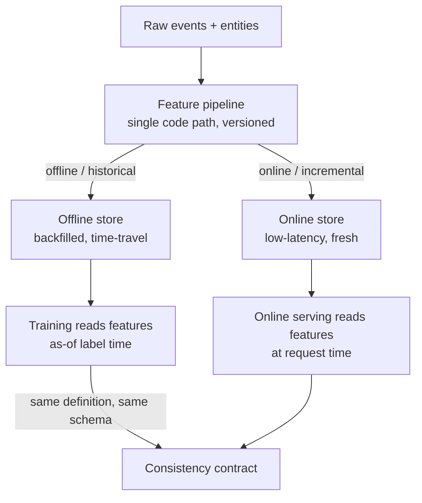

# M6 · Feature Pipelines & the Feature Store

> **Core question:** How do features get computed consistently in training and serving?

---

## The velocity feature that meant two different things

You're on the fraud team. Your best feature is `velocity_1h` — the number of transactions on a given account in the last hour. Fraudsters move fast, so a sudden burst of transactions is a strong signal. It works brilliantly in training: the model leans on it, and fraud detection improves.

In production, it's *quietly wrong*. Here's why: in training, `velocity_1h` was computed over a **30-day** window of history, with the hour-bucket boundary aligned to midnight. In serving, a different team re-implemented it — over a **1-day** window, with the hour boundary aligned to "now." Same feature name, same column in the model's input, *two different meanings*. The model is confidently scoring a feature that never looked like this during training.

This is **training–serving skew** — M2's failure class #2 — and it's the feature layer's signature disease. The model didn't break; its *inputs* silently changed meaning between training and serving, and no seam existed to catch it. This module is about the design that makes this class of bug structurally impossible.

## Features are the unit of reuse — treat them like it

A feature is not a column you compute once in a notebook. It's a **named, versioned computation** with a definition that must mean the *same thing* everywhere it's used — in training, in serving, in backfills, in analytics. Once you see features that way, a few consequences follow:

- **A feature has a definition, not just a value.** `velocity_1h` isn't the number 4. It's "count of transactions on `account_id` in the 60 minutes strictly before the event timestamp, over all channels." The definition is the feature; the value is just its current output.
- **A feature is computed once, consumed everywhere.** If training and serving each re-implement `velocity_1h`, you've created two features that happen to share a name — and they *will* drift apart. The fix is one computation, one code path, one definition.
- **A feature is versioned.** When the definition changes (window 1h → 2h, or a bug fix), that's a *new feature version*, not a silent edit — because a silent edit is exactly how skew starts.

> **⚠️ Failure mode** — *The two implementations.* This is training–serving skew in its most common form: a feature implemented once in the training notebook and again in the serving code, by different people, at different times. They start identical and drift. The failure is invisible because nothing *compares* the two — the model just gets slightly-wrong inputs and produces confidently-wrong outputs. M2's rule applies: the model is the innocent party; the feature seam failed it. The fix is *one code path*, which is precisely what a feature pipeline gives you.

## The feature pipeline: one computation, two destinations

The structural fix for skew is a **feature pipeline** — a single, versioned computation that writes features to a store, from which *both* training and serving read:



Two things make this work:

1. **One code path.** The same transformation code (the feature definition) computes features for both the offline store (bulk, historical) and the online store (incremental, fresh). There is no "training version" and "serving version" of `velocity_1h` — there's one definition, executed two ways. If the definition changes, both paths change together.
2. **A consistency contract.** Training and serving consume features under an explicit contract: *same schema, same value ranges, same semantics*. The contract is checkable (M5's validation, M13's model tests can diff offline-vs-online feature values), so skew becomes a *detected* event, not a silent fact.

## The feature store: what it standardizes, what it leaves to you

A **feature store** is the operational home of that pipeline. It's not magic — it's a disciplined combination of things you could build yourself, standardized so you don't rebuild them per model:

**What a feature store standardizes:**
- **Storage** — an offline store (historical, queryable, time-travel) and an online store (low-latency KV for serving).
- **Feature definitions** — named, versioned features with metadata (owner, window, source).
- **Point-in-time retrieval** — the as-of join from M4, made a first-class query: "give me the features for these entities *as of* these timestamps."
- **Consistency** — the same feature definition serving both paths, so training and serving read the same thing.

**What it leaves to you:**
- **Which features to build.** The store doesn't know `velocity_1h` is fraud-relevant; you do.
- **Freshness requirements.** How fresh each feature must be (seconds? hours?) is a design decision the store can't make for you.
- **Backfill and repair policy.** When a feature's definition changes, you must decide how to *backfill* history — recompute everything, or version-stamp the change and accept a discontinuity.
- **Governance.** Who can add features, who owns them, when they're deprecated (M17).

> **🐍 Reference stack at a glance** — The feature-store ecosystem is less standardized than tracking or serving, so the pragmatic stack is often *composed*: a **warehouse/lake** as the offline store (time-travel via SQL as-of joins), **Redis** (or DynamoDB) as the online store, and a thin feature-definition layer (Feast is the open-source option; commercial stores are more turnkey). The *principle* — one definition, two stores, time-travel retrieval — matters more than the vendor, and it's what this module teaches.

## Freshness, backfills, and time-travel

Three operational concepts make the feature store real, and each is a decision:

**Freshness** — how recent must a feature be when it's served? A `velocity_1h` feature needs to be *seconds* fresh (a fraudster's burst is happening now); a `days_since_last_purchase` feature can be *hours* fresh. Freshness determines whether the feature's online path is streaming (continuous updates) or batch (periodic refresh) — and it's a cost dial, exactly as in M4.

**Backfills** — computing a feature's values *historically*, so you can train on the past. When you define `velocity_1h`, you must also compute it for the last two years of history, as-of each past timestamp, or you can't build a training set. Backfill is where time-travel retrieval earns its keep: you re-compute the feature *as it would have been* at each historical moment.

**Time-travel** — the ability to query "the value of this feature set, for these entities, as of time T." It's M4's point-in-time correctness, raised to a feature-store API. Without it, every training set leaks the future; with it, the training set is a faithful reconstruction of the past.

> **⚖️ Tradeoff** — *Freshness vs. cost vs. consistency.* You want every feature live and fresh and cheap and identical across paths — and you can't have all four. Streaming features are fresh but expensive to run and easy to get subtly wrong (late events, reordering, exactly-once). Batch features are cheap and correct but stale. The ledger entry: *chose streaming only for the handful of features whose freshness actually changes a decision (velocity_1h), batch for the rest, gave up uniform real-time, bought a store that's cheap to run and easy to keep consistent.* Most fraud models need three fresh features, not thirty.

## The consistency guarantee, made testable

The module's thesis, stated as a property you can *enforce*:

> **The feature values a model sees in training and in serving are produced by the same definition, on the same schema, within a bounded staleness.**

You can test this. When a model is promoted (M13), a **skew test** diffs the offline feature values against the online feature values for the same entity+timestamp and fails the promotion if they diverge beyond tolerance. That single test converts the module's opening horror story — two `velocity_1h` implementations drifting apart — into a *caught* event. Skew stops being a silent fact and becomes a failing test.

```python
# A skew smoke test, in spirit: for a sample of (entity, timestamp) pairs,
# the offline and online feature values must agree within tolerance.
def assert_no_skew(offline_values, online_values, tolerance=1e-6):
    diffs = abs(offline_values - online_values)
    assert diffs.max() < tolerance, f"skew detected: max diff {diffs.max():.6f}"
    # In practice this runs against a real store sample, per feature, per model
    # promotion (M13), not as a hand-rolled check.
```

> **💻 CODED DEMO (Pass 2)** — A runnable two-path feature pipeline: define `velocity_1h` once, compute it offline (backfilled, time-travel) and online (incremental) from the same code, then show the skew test *passing* — and then introduce the "two implementations" bug and watch it *fail*. The demo exists to make the module's central claim — one code path prevents skew — visible rather than asserted.

## The training gate

> **📍 Gate to develop here — the *training gate*.** M6 has just materialized the training set (backfill + time-travel, above). Before it goes to the trainer (M7), that training set must be *validated*: joins point-in-time correct, label column present, class balance intact, no future leakage (M5's three-gate taxonomy, gate #2). The full theory and the code for this gate belong in this section.
>
> **📌 TODO (coding):** implement a `TrainingSet` Pandera schema + a `validate_training_set()` gate in `modules/06-feature-pipelines/code/` — ~90% reuse of the M5 `gates/` pattern (`DataFrameModel` + a `validate_batch`-style split into `valid` / `invalid` / `failure_cases`).

## Design exercise

You're designing the feature layer for a **fraud-detection** model. Your features are windowed aggregates over transaction history: `velocity_1h` (tx count last hour), `amount_sum_24h`, `distinct_merchants_7d`, and `avg_amount_30d`.

**Part A — Feature definitions.** Write the precise definition of `velocity_1h` — the entity it keys on, the time window, the boundary alignment, the aggregation, and the units. Then state what *would* break if two teams implemented it slightly differently (one using a 1-day window, one aligning the hour to midnight). Be concrete: what does the model "see" in each case, and why does that silently change its behavior?

**Part B — The pipeline.** Design the feature pipeline: one code path, two destinations (offline and online store). For each of the four features, decide its **freshness requirement** (seconds / minutes / hours) and whether its online path is **streaming or batch** — and write the ledger entry for the one feature you'd love to make streaming but decide to batch.

**Part C — Time-travel training.** Specify how you'd build the training set: for a label "account 42 committed fraud at time T," which features do you fetch, and *as of what timestamp*? State the point-in-time rule that keeps the training set from leaking the future, and name one feature whose time-travel value differs meaningfully from its *current* value.

**Part D — The consistency guarantee + ADR.** Write the consistency contract between training and serving in one sentence, then write the ADR (M3 template) for your decision to use a **feature store with one code path** rather than ad-hoc per-team feature computation. The Consequences section must name what you gave up (setup cost, a new operational dependency) and what you bought (skew made structurally impossible).

The goal: leave this module able to state, for every feature your model uses, *"here is its one definition, here is where it's computed, and here is the test that proves training and serving agree."*

---

*Next: Part 2 — the Modeling Layer. M7 · Experimentation & Reproducibility — the data and features are clean and consistent; now make model development an engineering discipline, where every experiment is a recorded, reproducible fact.*
