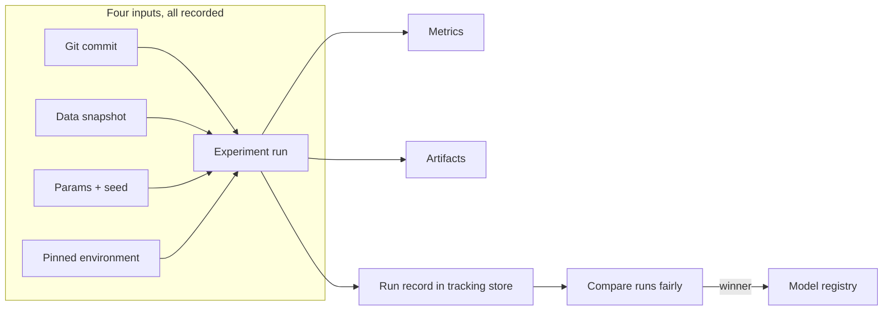

# M7 · Experimentation & Reproducibility

> **Core question:** How do we make model development an engineering discipline, not alchemy?

---

## The winning run that vanished

You're on the retention team at a subscription company. Churn is up, leadership wants a model that flags at-risk accounts, and you've spent three weeks in a notebook trying feature sets and classifiers: logistic regression, a gradient-boosted tree, some hand-built "days since last login" features. On a Tuesday afternoon, one run hits **AUC 0.87** — a real jump over the 0.81 everything else has been hovering around. You screenshot it, drop it in Slack, and move on to the next thing.

Three weeks later, the quarterly retrain comes due. A teammate has to rebuild your "winning" model. They open the notebook. It's been edited since Tuesday. They ask which CSV you used — it's been overwritten by the nightly export. Which hyperparameters? The cell that set them now says something different. Which seed? You never set one. They rerun "the same thing" and get **0.81**.

Now nobody believes the 0.87. Was it real? A lucky split? A leaky feature that got fixed? The honest answer is: *you don't know*, and you never will. The result existed once, on one machine, in one notebook, at one moment — and that's all it ever was.

That is alchemy: model development that produces *outcomes* but not *knowledge*. It feels productive — there are numbers, there are screenshots — but it builds nothing you can stand on. This module is about turning that alchemy into an engineering discipline, where every experiment is a *recorded, comparable, reproducible fact* rather than a rumor about a notebook.

## The experiment as the unit of progress

The first discipline is deciding what "one experiment" even is. It is **not** "one run of a script." It's a *single, deliberate change with a hypothesis attached*:

- **One change.** You vary exactly one thing — a feature set, a hyperparameter, a model class, a training window — so that the result can be attributed to *that* change.
- **One question.** "Does adding the 'days since last login' feature improve holdout AUC without leaking?" Not "let me try a bunch of stuff and see what's good."
- **One record.** Params, metrics, artifacts, data, code — captured together, so the result can be reconstructed.

The moment you start changing three things at once and comparing runs from different weeks against each other, you are no longer doing experiments — you're doing a lottery. The unit of progress in modeling is the *experiment*, and an experiment you can't reconstruct isn't progress; it's noise.

> **⚠️ Failure mode** — *"It worked on my machine."* This is the modeling layer's signature failure, and it maps to M7 in the failure-class → layer table from M2. The root cause is almost never malice or even carelessness — it's that nothing in the environment *forces* the four inputs (code, data, environment, seed) to be recorded. A result that depends on unrecorded context is not a result; it's an anecdote. Treat it accordingly.

## Reproducibility = code + data + environment + seed

"Reproducible" is often treated as a binary — it either reproduces or it doesn't. More usefully, it's a *conjunction* of four things, and any one that's missing silently voids the whole result:

1. **Code** — the exact version of the training logic. This is a git commit, not "whatever was in the notebook." If you can't point at a commit hash, you can't reproduce.
2. **Data** — the exact training set. Datasets are mutable; "the CSV" is a moving target. You need a versioned, immutable snapshot (a timestamped file, a table version, a data-version id) — the same point-in-time discipline M4 builds.
3. **Environment** — the library versions and hardware behavior the code ran under. `numpy` 1.x and 2.x, different CUDA builds, a newer scikit-learn — all can change results in ways that look like "the model got worse" but are really "the environment changed."
4. **Seed** — every source of randomness pinned: the data split, model init, any stochastic training. Unpinned seeds are the classic reason a "great" result never reappears.

Notice that **the model weights are not on this list**. A model is *output*; you reproduce the process that made it, and the weights are a consequence. Teams that only save the `.pkl` file have saved the least informative part of the experiment.

## Data is the hardest pillar to pin

Of the four pillars, **data** is the one that breaks reproducibility most often — because code and environment are *yours* (you commit them), but data is *shared and mutable*. The CSV gets overwritten by the nightly export, the label table gets backfilled, the "last three months" window rolls forward a day at a time. Re-run "the same" experiment a month later and you pull a *different* dataset and get a different number — even with identical code, environment, and seed.

The fix is the point-in-time discipline from M4 and the validation discipline from M5: treat the training set as a **versioned, immutable snapshot with an id** — a timestamped table version, a data-version tag, an explicit window `(start, end)`. Log that id on the run. Then "the same data" means "the same id," not "the same table name."

Labels deserve the same treatment. If the churn label ("did they cancel within 30 days?") is recomputed differently each week — a different grace period, a different definition of "cancel" — then two runs on "the same data version" can still differ. The label *definition* is part of the data version, not a detail you remember.

## What you must track

Concretely, an experiment record binds these together. Here is the minimum schema — the columns of your experiment ledger:

| Category | Fields | Why it matters |
|---|---|---|
| **Parameters** | hyperparams, seed, feature-set id, train/val window | "what changed" — the inputs to the run |
| **Metrics** | loss, AUC, precision/recall, per-slice metrics | "what happened" — the outputs, in numbers |
| **Artifacts** | trained model, feature-definition file, plots, config | "what it produced" — the durable objects |
| **Code version** | git commit + dirty-tree flag | "which logic" — the exact training code |
| **Data version** | dataset snapshot id + label source | "which data" — the exact training set |
| **Environment** | pinned library versions, runtime | "which world" — the exact dependencies |

The point of the schema isn't bookkeeping — it's *attribution*. When a run wins, you should be able to answer, mechanically, **"why did this run beat the last one?"** If the answer requires memory, the schema failed.

> **⚖️ Tradeoff** — *Track everything vs. track the minimum.* A tracking system that demands ten minutes of ceremony per run will be abandoned by the third day. The ledger entry: *chose to log the six categories above automatically (or near-automatically) so logging is zero-effort, gave up exhaustive coverage, bought a log that actually gets filled in.* The schema that survives is the one that happens by default, not by willpower.

## The inline code that makes it real

MLflow is the de-facto standard for this — cloud-agnostic, and it collapses the schema above into a few calls. The idea in miniature:

```python
import mlflow

mlflow.set_experiment("churn-prediction")

with mlflow.start_run(run_name="gbm-baseline-v2"):
    mlflow.log_params({"max_depth": 4, "n_estimators": 200})
    mlflow.set_tag("git_commit", "9f3c1a2")            # code version
    mlflow.set_tag("data_version", "churn_2024-03")     # data version
    mlflow.log_metric("val_auc", 0.87)
    mlflow.sklearn.log_model(model, "model")            # the artifact
    mlflow.log_artifact("features/feature_defs.yaml")   # feature contract
```

Two things to notice. First, every category from the table is here — params, a metric, the model artifact, code, data. Second, this is the *minimum*, not the whole job: `mlflow.autolog()` will sweep up many params and metrics for you, but it cannot know your **git commit** or your **data version**, so those two — the ones alchemy always loses — are the ones you log by hand. Pinned as `mlflow~=2.10`; the calls above are stable across 2.x.

## Comparing experiments fairly

Once runs are recorded, the trap shifts from "I can't reproduce it" to "I'm comparing incomparable things." Fair comparison has rules:

- **Same data, same split.** Comparing AUC from a run on *this week's* data against one on *last month's* data tells you about the data, not the model. A change in metric could be a real improvement or a dataset that got easier.
- **Same seed.** Two runs that differ only by seed can differ by several points of AUC on small data. If you're tuning a hyperparameter, hold the seed fixed; otherwise you're tuning noise.
- **One variable at a time.** This is the experiment-as-unit-of-progress rule again. Change two things, and a good result can't be attributed.
- **Look at variance, not just the best run.** The difference between 0.87 and 0.84 might be within run-to-run noise. Report a spread across seeds, not a single lucky number.
- **Record *what you compared against*.** A run is only meaningful relative to a baseline. "AUC 0.87" with no baseline is a slogan, not a result. (M8 makes baselines a hard requirement.)

> **⚖️ Tradeoff** — *More runs vs. cleaner runs.* You can brute-force your way to a high metric by running hundreds of variants and keeping the best — but each unrecorded or incomparable run is wasted compute, and the "best" of a big pile is just the luckiest, not the truest. The ledger entry: *chose fewer, deliberate, comparable experiments, gave up the illusion of exhaustive search, bought results you can trust and build on.*

## The tracking loop, in one picture



The registry on the right is where this module hands off to M9 — an experiment's *winner* becomes a *versioned, governable artifact*. Until then, it's just a row in a table. That's the seam: tracking produces candidates; the registry produces deployed models.

> **🐍 Reference stack at a glance** — **MLflow Tracking** is the only tool this module strictly needs: it records params, metrics, artifacts, and (via tags you set yourself) code and data versions, and it's cloud-agnostic — the tracking store can live in a local directory, a Postgres DB, or S3, and the concepts transfer. Git handles code versioning; the data snapshot discipline comes from M4/M5; the seed discipline is just a config value you stop treating as optional.

## Why the ADR discipline applies here

M3 gave you the ADR as the formal tradeoff ledger. Experimentation has its own ADR-shaped decisions, and they're worth writing down the same way: *which tracking store*, *what counts as "the same data"*, *which metric is the north star*, *what's the minimum logging schema*. These aren't one-off choices — they're the *contracts* of your modeling effort, and they'll be revisited every quarter. An ADR like "we log git commit + data version as required tags, and any run missing them is invalid" is a small document that prevents an entire class of alchemy. Write it once, enforce it mechanically.

> **⚠️ Failure mode** — *The silent retcon.* The nastiest version of unreproducibility isn't "I lost it" — it's "I quietly changed it." A notebook edited after the fact, a metric re-logged with the corrected number, a seed added retroactively. The engineering fix is immutability: an experiment record, once written, is *not edited* — you run a new experiment and record a new row. If you find yourself editing history, you've found the alchemy.

## Beyond the minimum: what a maturing team adds

The six-category schema is the floor. A team that lives with it for a while starts adding the things that make experimentation a *system* rather than a habit:

- **Config as code.** Hyperparameters, feature lists, and the data window live in a versioned config file that's an artifact of the run — so "what changed between v12 and v13" is a diff, not a memory.
- **Deterministic pipelines.** The training step is a script (or DAG) that takes `(code commit, data version, config) → (model, metrics)` and nothing else. No notebook edits between data and model.
- **Registered experiments as CI.** The tracking store becomes the input to the registry (M9) and the promotion gate (M13) — a run that didn't log its lineage simply can't be promoted, so the schema enforces itself.
- **Naming you can search.** `run_name="gbm-baseline-v2"` is fine; `run_name="try-this-2-FINAL"` is not. Name experiments by *what changed*, not by mood, or the comparison table becomes unreadable in a week.

None of this is required on day one. What's required on day one is the schema and the four pillars. Everything else is the difference between a team that *records* experiments and a team whose experiments *compound*.

## Where the full demo goes

> **💻 CODED DEMO (Pass 2)** — A ~60-line walkthrough: run the *same* churn experiment twice with different seeds and different data snapshots, watch MLflow record four runs, then show the comparison table that exposes the "0.87 was luck" vs. "0.87 was real" distinction — the concrete payoff of tracking, seen end to end. One extra beat: toggle the seed, re-run, and show how the unrecorded-run case silently diverges.

## Design exercise

Your modeling team (say, six people iterating on churn prediction) is about to start a new quarter. Design the discipline before they write a line of model code.

**Part A — The tracking schema.** Write the exact schema for one experiment record: every field, its type, who or what populates it, and whether it's required or optional. Include at minimum: parameters, metrics, artifacts, code version, data version, environment. For each field, state *how you'd detect that it's missing or wrong* — a schema is only as good as its enforcement.

**Part B — The reproducibility checklist.** Write the checklist a teammate follows to *rebuild any run from the quarter from scratch* on a fresh machine. Be specific: what do they check out (code), what do they fetch (data snapshot), what do they install (pinned environment), what do they set (seed), and what do they compare at the end to confirm they got "the same" result? Mark the steps that can be automated vs. the ones that require discipline.

**Part C — The ADR.** Write one ADR (M3 template) for the single most important reproducibility decision on this team — e.g., "we use MLflow with git-commit and data-version tags, and reject any run missing them," or "the north-star metric is holdout AUC on a time-based split, never a random split." State the tradeoff honestly in Consequences.

The goal: leave this module able to answer, for any experiment your team runs, *"what changed, what happened, and can I get the exact same answer again?"* — without consulting anyone's memory.

---

*Next: M8 · Training Infrastructure & Model Selection — what we actually need to train, and how to pick a model without defaulting to the biggest one.*
