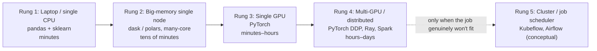
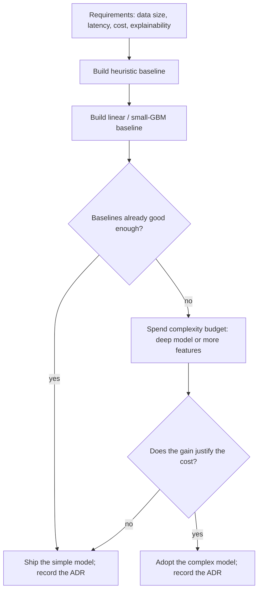

# M8 · Training Infrastructure & Model Selection

> **Core question:** What do we actually need to train, and how do we pick a model?

---

## The transformer that lost to last week's average

You're at a retail chain, tasked with forecasting demand per store per SKU so the replenishment system orders the right amount. The moment the words "forecasting" and "sequence data" appear in the same sentence, someone on the team starts sketching a transformer with attention over two years of sales history. It feels right. It's what the papers do.

You spend two weeks building data loaders and tuning a deep sequence model. Meanwhile, a senior engineer who was asked to "just get something working" writes a twelve-line baseline: **next week's demand ≈ last week's demand, adjusted for the same-week-last-year.** It's embarrassingly simple. It also beats the transformer on holdout MAPE — and it runs in milliseconds on a laptop, with no GPU, and every number it produces is explainable in one sentence.

The lesson isn't "transformers are bad." It's that you reached for capacity before establishing what the problem actually needs. The forecasting model that wins is rarely the most expressive one — it's the one whose complexity is *justified* by the data, the latency budget, and the cost you're willing to pay. This module is about making that justification explicit instead of defaulting to "the most powerful thing."

## Baselines first: complexity is a budget, not a default

The single most important discipline in model selection is **baselines first**. Before you train anything sophisticated, you establish the floor with the cheapest model that could possibly work:

- **The heuristic baseline.** A rule, a moving average, a "predict last week," a "predict the mode." No learning at all. If your fancy model can't beat this, it's not doing anything.
- **The linear baseline.** A logistic or linear regression (or a small GBM) on a handful of clean features. This is the *real* bar — the point where "learning" starts to earn its keep.
- **The prior model.** The thing currently in production, if one exists. The new model has to beat *it*, not just beat zero.

Think of **complexity as a budget you spend**, not a default you inherit. A deep model buys you capacity to fit complex patterns — and charges you for it in data, compute, latency, and explainability. You spend that budget only when the baselines show there's a pattern worth paying for. If the linear model captures 95% of the available lift, the transformer's extra 2% has to be weighed against everything it costs — and often it loses.

> **⚠️ Failure mode** — *Skipping the baseline.* The model-selection analog of M2's "diagnose before you retrain": when you jump straight to the most complex model, you have no way to know whether its success is real signal or just a lot of machinery. You also can't detect when the machinery is *worse*. A deep model with no baseline is a bet with no odds. The baseline is the control group of modeling.

## The training infrastructure ladder

"Training infrastructure" sounds like a big-company problem, but it's really a *ladder* you climb one rung at a time, and each rung is a cost-vs-time decision:

The rule of thumb that prevents most infra over-engineering: **stay on the lowest rung that finishes the job in a tolerable time.** A gradient-boosted tree on 2M rows trains on a laptop in minutes — buying it a GPU cluster is not "scaling up," it's setting money on fire. Distributed training exists for one reason: *the job doesn't fit* — the data is too large, the model too big, or the wall-clock too tight. If none of those is true, you're paying complexity cost for nothing.

The cost-vs-time frame, made explicit:

| Question | If yes, stay put | If no, climb |
|---|---|---|
| Does it fit in memory on one machine? | One node is enough | Consider distributed data loading |
| Does it finish within your retrain window? | Nothing to buy | Faster hardware or parallel jobs |
| Is the model genuinely large (deep, many params)? | CPU is fine | GPU |
| Are you doing this hundreds of times? | A laptop is fine | Scheduled, managed infra |

> **⚖️ Tradeoff** — *Time vs. cost vs. operational complexity.* Every rung up buys you wall-clock time and charges you two currencies: money *and* the operational burden of running distributed systems (which fail more, in more ways, and need someone on call). The ledger entry: *chose the lowest rung that meets the retrain deadline, gave up faster iteration, bought a training path a single engineer can own.* Most teams' real constraint is engineer time, not GPU hours.

## How to pick a model: the four lenses

Model selection isn't a benchmark leaderboard — it's four requirements held up against candidate model classes:

- **Capacity** — can it represent the pattern? A linear model can't learn a highly non-linear interaction no matter how much data you give it; a deep net can fit almost anything, given enough data. The question is what the *data* supports, not what the model *could* do.
- **Data size** — how much do you have? Simple, high-bias models win on small data (they don't overfit); expressive models need volume to justify their variance. Roughly: little data favors linear/trees with heavy regularization; lots of data opens the door to deeper models.
- **Latency** — how fast must a prediction come out? A 50M-parameter model at 200 ms inference budget may be a non-starter regardless of accuracy (M12 takes this to the serving layer).
- **Explainability** — must you explain a prediction to a human, a regulator, or an auditor? A linear coefficient or a shallow tree explains itself; a deep net needs a separate explanation apparatus (SHAP, etc.) that is itself approximate.

When does simple win? The honest answer is *most of the time*, for a concrete reason: **the gap between a well-tuned simple model and a deep model is usually small, while the gap in cost, latency, and explainability is large.** The deep model has to clear a much higher bar to justify itself.

> **🐍 Reference stack at a glance** — **scikit-learn** for the baseline-to-tree spectrum (logistic regression, gradient boosting, pipelines); **PyTorch** for when capacity genuinely demands a neural net; **dask/polars** to push a single node further before you go distributed; **Ray** for distributed training when you finally must. Choosing between sklearn and PyTorch is itself a design decision — the answer is "PyTorch *only* when sklearn can't represent or scale to the pattern."

## The selection matrix

Here is the model-selection decision compressed into one table. Read a *row* against your requirements, not a leaderboard:

| Model class | Capacity | Data it needs | Latency at inference | Explainability | Typical cost |
|---|---|---|---|---|---|
| Heuristic / rule | None (no learning) | None | Microseconds | Total — it's a sentence | ~zero |
| Linear / logistic | Low (linear) | Small–medium | Microseconds | High — one coefficient per feature | ~zero |
| Tree ensemble (GBM, RF) | Medium–high | Medium–large | Low | Medium (SHAP-feasible) | Low–medium |
| Deep network | High | Large–huge | Medium–high | Low (needs a separate explainer) | Medium–high |

The pattern to internalize: **each step down the table buys capacity and charges data, latency, explainability, and cost.** You stop at the first row that clears your requirement on all four lenses. For the demand-forecasting case — 500K rows/week, batch latency, tight cost, high explainability — that's almost always the linear or tree-ensemble row, *not* the deep one.

## When deep learning is genuinely the right call

Deep learning is not a mistake — it's a *specialized instrument* you reach for in specific, honest cases:

- **Unstructured inputs.** Images, audio, raw text. No hand-crafted feature set competes with a learned representation, so the capacity is *earned*, not speculative.
- **Very large, high-signal data.** When you have enough rows that a deeper model's variance is amortized and it *measurably* beats the tree baseline — not "should beat," but *does* beat, on your holdout.
- **Sequence / structure the problem actually has.** Real temporal or spatial structure that a tabular model would have to be hand-engineered to see.

Notice what's *not* on the list: "it's a popular technique," "the stakeholder expects it," "the data has a time column." Those are the alchemy reasons, and they're how the transformer lost to last week's average.

## Hyperparameter tuning & AutoML: when they help, when they're waste

Tuning is where effort goes to die if you're not careful. The honest economics:

- **Tuning a model whose architecture is wrong is waste.** No amount of `n_estimators` search fixes "this should be a time-series model, not a random split." Tuning assumes the *shape* of the solution is right and you're refining it.
- **Tuning before you have a stable evaluation is waste.** If your metric swings several points across seeds (M7), the tuner is optimizing noise, and it will "find" a great config that's just a lucky seed.
- **Tuning matters at the margin, after the design is right.** A modest grid or a few rounds of random search will usually capture most of the available lift; the last fraction from an exhaustive search or AutoML rarely pays for itself in production impact.
- **AutoML is a *baseline generator*, not a strategy.** AutoML tools (auto-sklearn, Optuna, cloud AutoML) are genuinely useful for *quickly producing a strong baseline you must then beat deliberately* — not for replacing model selection judgment.

> **⚖️ Tradeoff** — *Tuning budget vs. feature budget.* An hour spent tuning hyperparameters usually returns less than an hour spent finding a better feature, yet teams default to tuning because it's mechanical and feels productive. The ledger entry: *chose to cap tuning effort (a fixed small grid) and redirect the freed time to features and baselines, gave up the last point of hyperparameter-optimality, bought larger, more durable gains.* (This is Google's Rules of ML #19 in one sentence: most of the gains are in the features and the data.)

## Putting it together: the model-selection loop

The loop forces the two questions alchemy never asks: *"is the simple thing already good enough?"* and *"does the extra complexity actually pay for itself?"* Whatever you choose, it goes in the ADR — because "why this model and not a bigger one" is exactly the kind of decision the next engineer will need to see to avoid re-litigating.

> **⚠️ Failure mode** — *Defaulting to the largest model.* The demand-forecasting team that starts with the transformer has inverted the process: they're spending the complexity budget *first* and looking for justification *after*. The symptom is a system that's expensive, slow, and hard to explain — with no evidence it beats a moving average. The fix is the same reflex as M7's fair comparison: **measure before you scale.**

## Where the full demo goes

> **💻 CODED DEMO (Pass 2)** — A ~50-line worked example on a demand-forecasting dataset: a naive moving-average baseline, a linear model, and a small gradient-boosted model, side by side, with the MAPE of each and the *training time* of each in the same table — so the "simple model wins on the cost-accuracy frontier" point is felt, not asserted. A second beat swaps in a toy neural net to show it *underperforming* on small data — overfitting made visible.

## Design exercise

You're designing for a demand-forecasting problem. Here are the requirements:

| Requirement | Value |
|---|---|
| **Data size** | 500K rows/week; 3 years of history; ~2,000 SKUs |
| **Latency** | Batch only — predictions needed nightly, not online |
| **Cost** | Tight; no dedicated GPU budget yet |
| **Explainability** | High — planners must be able to explain order quantities to buyers |
| **Retrain window** | Must retrain in under 2 hours, weekly |

**Part A — Model class.** Justify a model class (heuristic → linear → tree → deep) for these requirements, using all four lenses (capacity, data size, latency, explainability). Be specific about *which* lens is decisive and why. Write it as if defending the choice to a stakeholder who assumed you'd use a neural network.

**Part B — Training infrastructure.** Given your model class and the 2-hour retrain window, pick the rung on the infrastructure ladder and justify it against cost. State explicitly what you are *not* buying and why.

**Part C — The ADR.** Write the ADR for your model-selection decision (M3 template). It must include: the baseline you compared against (and its score), the chosen model (and its score), the *gap* between them, and an honest Consequences section naming what the added complexity — or the refusal to add it — costs you.

The goal: leave this module able to answer *"why this model, on this hardware, at this cost"* with numbers, not vibes.

---

*Next: M9 · The Model Registry & Lifecycle — how a trained model becomes a versioned, governable artifact, and how "what's deployed" gets a single answer.*
