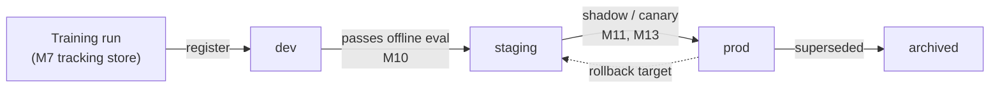
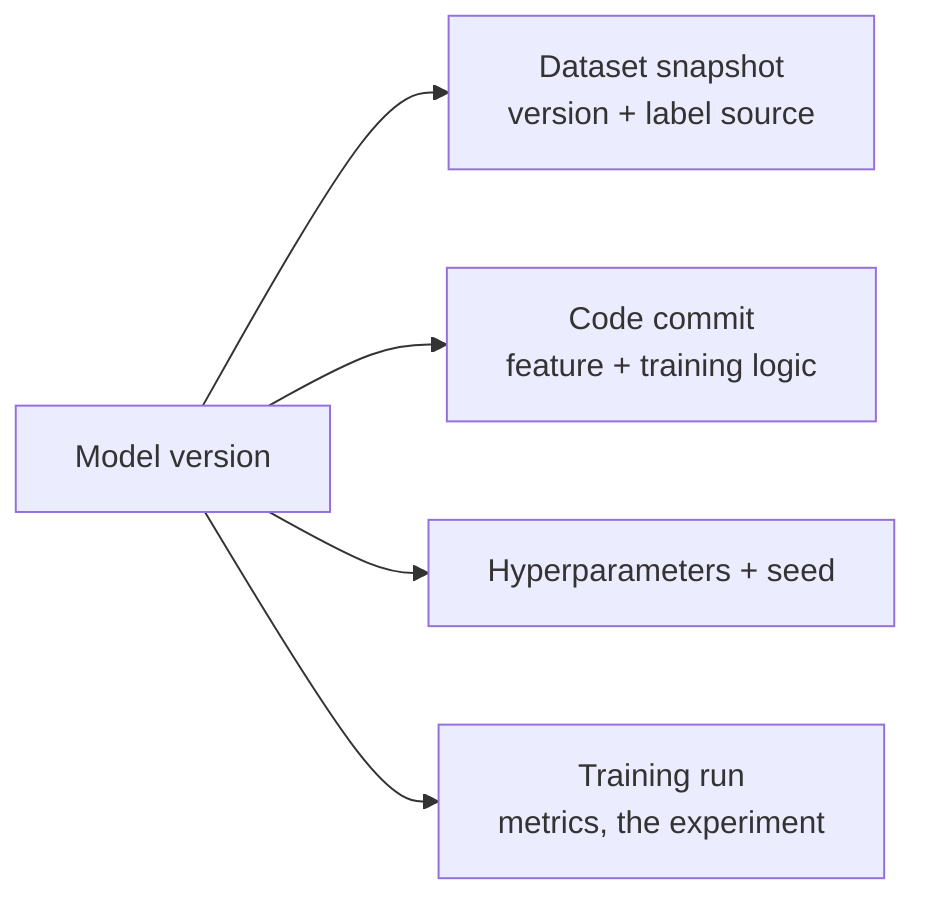

# M9 · The Model Registry & Lifecycle

> **Core question:** How does a model become a versioned, governable artifact?

---

## Twenty models, one unanswerable question

You're on the fraud team at a payments company. Fraud detection isn't one model — it's a *fleet*: a model per region, a model per channel (card-not-present, P2P, ACH), plus challengers running in shadow, plus a few deprecated ones nobody got around to deleting. The team's internal docs list **20+ "live" model versions**, but the docs are six months stale.

Then fraud spikes on card-not-present transactions. The on-call engineer needs to know one thing: **which model is serving those predictions right now, and what was there before the spike?** The answer is scattered across a S3 bucket of `.pkl` files with names like `fraud_v7_final_FINAL.pkl`, a deploy script that hardcodes a path, and a Slack thread from March. Rolling back means guessing which of the twenty is "the previous one." Nobody knows whether the "v7" someone promoted last Tuesday ever passed evaluation, because the evaluation results lived in a notebook on a laptop that's since been reimaged.

The model was never the problem. The problem is that the models were never *artifacts* — versioned, tagged, staged, traceable things with a documented lineage. They were just files. This module is about the registry: the layer that turns a trained model into a governed object whose *history, status, and provenance* are as real as its weights.

## The model as a versioned artifact

A trained model in a registry is not "a file with a good name." It's an **artifact with metadata that answers four questions**:

- **Which version is this?** An immutable, monotonically increasing version (e.g., `churn-model: v12`). A version, once registered, is *never mutated* — a new model is a new version, not an edit to an old one.
- **What state is it in?** A **stage** — `dev`, `staging`, `prod`, `archived` — that says where it is in its lifecycle. The stage is a *property you change*, not a filename.
- **What is it tagged with?** Human-meaningful labels — `champion`, `challenger`, `region-us`, `gbm-baseline` — so you can ask "which model is the champion for the US region?" and get one answer.
- **Where did it come from?** Its **lineage** — the run (from M7's tracking store), the code commit, the dataset version, the hyperparameters — so the artifact points back at exactly how it was made.

> **⚠️ Failure mode** — *The floating `.pkl`.* A model file with no registry is a rumor: it exists, but nobody knows what it *is*, whether it passed evaluation, or who promoted it. In M2's terms this is a **governance gap** — the failure isn't a bad model, it's that the system can't answer "what's deployed." The registry is the seam that turns that unanswerable question into a one-line lookup.

## Version, tag, and stage: three axes, don't conflate them

A registry artifact carries three *different* kinds of metadata, and confusing them is a classic source of mess:

- **Version** — *which artifact is this?* Monotonic, immutable, never reused. `v12` always means the same bytes; a new model is `v13`, never `v12` edited in place.
- **Tag** — *what is this artifact, semantically?* Human labels like `champion`, `challenger`, `region-us`, `gbm-baseline`. A tag can move: when `v13` beats `v12`, the `champion` tag moves from one version to the other.
- **Stage** — *where is this artifact in its lifecycle?* `dev`, `staging`, `prod`, `archived`. Like a tag, it changes over the model's life; unlike a tag, it's a *governed* transition with a gate attached.

The conflation to avoid: treating the *version string* as the *status* ("`fraud_v7_final_FINAL` is obviously the good one") or treating the *tag* as the *identity*. The version is the permanent name; the tag and stage are mutable state layered on top. When someone asks "what's deployed?", they mean the *stage* `prod` — and the answer is "the version that currently holds the `prod` stage," not "the one with the most confident filename."

## The registry as the source of truth for "what's deployed"

The registry's real job is not storage — it's to be the **single source of truth** for the deployed state. One rule gives it that power:

> **The serving system may only load a model from the registry, by version. Nothing else is considered deployed.**

This sounds bureaucratic, but it's what converts the registry from "a nice catalog" into "the answer to on-call's question." If serving can also load a file someone dropped in S3, then the registry is a suggestion, and the fraud spike scenario returns the moment someone shortcuts it. The registry becomes authoritative only when it is *the* path — enforced by the deploy pipeline (M13), not by convention.

Staging makes this legible. A model moves through named stages, and each stage means something operational:

- **`dev`** — experimental, registered so it has an identity, but not evaluated for release.
- **`staging`** — candidate for production: has passed offline evaluation, is being validated (shadow traffic, canary).
- **`prod`** — serving live traffic; at most a small number of versions hold this stage at once (often exactly one champion).
- **`archived`** — retired; kept for lineage and audit, never served again.

## Model lineage: model → data → code → params

A deployed model isn't just weights — it's the *end of a chain of provenance*. The registry records that chain so you can answer "how was this made?" *without* archaeology:

Lineage matters for three reasons, all of them about *trust and safety*:

1. **Audit.** In a regulated domain, "which data trained the model that denied this transaction?" must be answerable — possibly years later (M17).
2. **Root cause.** When a prod model degrades, lineage lets you jump straight to what changed (a bad data snapshot, a feature-code change) instead of guessing — the M2 "diagnose before retrain" reflex, now with a map.
3. **Rollback.** Rolling back isn't just "load older weights" — it's "restore the *whole prior state*," and lineage says what that state was.

> **⚖️ Tradeoff** — *Full lineage vs. registry friction.* Recording lineage requires the training pipeline to *pass* its provenance to the registry — which means the registry and the tracking store must talk, and the pipeline can't be a loose script. The ledger entry: *chose to make lineage a first-class field on every registered model, gave up the freedom to register a model from a bare `.pkl` with no history, bought auditability and instant root-cause.* In regulated work this is not optional; in a startup it's a deliberate, defensible investment.

## Promotion and deprecation

A model's *lifecycle* is governed by two operations, and they should be as disciplined as a code change:

**Promotion** is moving a model up a stage, and it must be *gated*, not automatic. The gate is a checklist: did it pass offline evaluation (M10)? Did it survive shadow/canary without guardrail breaches (M11, M13)? Is its lineage complete? A promotion that skips the gate is how "v7 that never passed eval" ends up serving fraud traffic. The promotion event is itself a *recorded, attributable act* — who promoted it, when, against which evidence — not a silent flip of a flag.

The gate, made concrete — a promotion from `staging` to `prod` is *not permitted* unless every box is checked and recorded:

| Check | Evidence |
|---|---|
| Offline evaluation passed | The M10 metric suite, on a leakage-free split, beats the current champion |
| Shadow / canary clean | No guardrail breach over the validation window (M11, M13) |
| Lineage complete | Data version, code commit, params, and seed all present in the registry |
| Owner named | A human is accountable for this model's behavior and retirement |
| Rollback path tested | The prior `prod` version is confirmed retrievable and loadable |

**Deprecation** is moving a model out of `prod` — and it's the half teams forget. Two sub-rules:

- **The new model inherits the old model's traffic *gradually***, via canary or ramp-up, so deprecation is a controlled transfer of responsibility, not a cliff (M13).
- **The old model stays retrievable.** "Deprecated" means "no longer serving," *not* "deleted." You keep it archived for rollback and audit, and you retire it *fully* only after you're certain nothing needs its lineage.

> **⚠️ Failure mode** — *The model that can't be retired.* In the fleet scenario, deprecated models linger because no one knows if anything still depends on them — so they're left "just in case," and the fleet grows until "which model is live" is unanswerable again. The cure is the same discipline as code: a model has an owner, an end-of-life decision, and an *explicit* retirement that records the last day it served. If you can't name a model's owner, you've found the gap.

## Retiring models safely

Retirement is a *designed* operation, not a cleanup chore. The safe sequence:

1. **Stop new traffic** — the model is no longer the target of promotion, and any router stops sending it predictions.
2. **Drain** — existing in-flight or batch consumers finish or are migrated to the successor.
3. **Archive** — the model moves to `archived`, lineage intact, retrievable for rollback and audit.
4. **Observe** — a quiet period confirms no downstream system still calls it and no metric regresses (this is M15's job).
5. **Purge** (only if policy requires) — the weights are deleted *last*, and only after retention rules are satisfied. The *record* of the model usually outlives the weights.

The failure mode to avoid at every step is **the silent dependency**: some consumer — a reporting job, an experiment, a shadow comparison — still points at the old model. Retirement must be observable enough that a dangling reference *surfaces as an error*, not as a quietly wrong prediction.

> **🐍 Reference stack at a glance** — **MLflow Model Registry** is the concrete surface: `mlflow.register_model(...)` promotes a run's artifact into a versioned model, and `mlflow.models.Model` stages (`Staging`, `Production`, `Archived`) + tags are how the state machine above is expressed. The *authoritative-source-of-truth* rule is enforced by your deploy pipeline (M13), not by MLflow itself — MLflow gives you the record; you give it the teeth.

## The registry is a seam, not a silo

One last architectural point, echoing M3: the registry only matters because it sits at a **seam** between the modeling layer and the serving layer, with a contract. The contract is: *the serving system loads models by registry version, and every promotion/deprecation is a recorded event on that version.* The deploy pipeline (M13) is what *enforces* the contract — it's the thing that refuses to ship a `.pkl` that bypassed the registry.

If the registry were just a catalog that some humans consult sometimes, it would be M1's "vocabulary trap" — a document nobody obeys. What makes it real is the enforcement: **no registry entry, no deployment.** That single rule is worth more than any feature of the registry tool itself.

## Where the full demo goes

> **💻 CODED DEMO (Pass 2)** — A ~70-line walkthrough of the fraud fleet: register three model versions, tag one `champion` and one `challenger`, promote the challenger through `Staging` → `Production`, deprecate the old champion to `Archived`, and finally show the single registry query that answers "which model is live in prod right now, and what was there before?" — the exact question the on-call engineer couldn't answer.

## Design exercise

Your fraud team runs **20+ model versions** across regions and channels, and the current state is the scattered-`.pkl` mess from the opening. Design the registry and its governance before you migrate anything.

**Part A — The registry schema.** Define the naming and tagging convention for model versions: what the version string means, which *tags* are mandatory (`champion`/`challenger`, region, channel, owner), and which *stages* exist. State the invariant that must hold at all times — e.g., "exactly one `champion` per region+channel in `prod`."

**Part B — The promotion policy.** Write the gate a model must pass to move from `dev` → `staging` → `prod`, and the *evidence* each gate requires (which evaluation, which canary result, whose sign-off). Then write the deprecation rule: when does a model get demoted, who decides, and how is the decision recorded?

**Part C — The ADR + the hard question.** Write the ADR for the single most important registry decision — the "registry is the *only* path to serving" rule, or the promotion gate. Then answer the question that makes or breaks the design: *who is responsible for each of the 20 models, and what happens to the models nobody claims?*

The goal: leave this module with a registry design where "what's deployed?" and "how do I roll it back?" are *queries*, not investigations.

---

*Next: Part 3 — the Verification Layer. M10 · Offline Evaluation — how to measure a model honestly before it ships, so the promotion gate in your registry has something real to check.*
