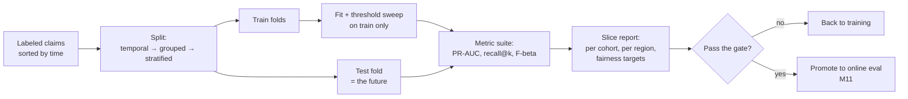

# M10 · Offline Evaluation

> **Core question:** How do we measure a model honestly before it ships?

---

## The 99.2% model that catches nothing

You run the claims operation for an insurance company. Volume is climbing, adjusters are drowning, and the CFO wants "automation." You build a triage model: it scores every incoming claim for risk and routes the high-risk ones to a human reviewer while the rest auto-approve. Weeks of feature work later you have a gradient-boosted classifier, and the evaluation says **99.2% accuracy**.

Leadership is thrilled. You are less sure, and here's why: about 99% of claims are legitimate and get paid out. A model that predicts "approve" for *every single claim* — a model with no intelligence at all — scores 99% accuracy. Your 99.2% model is barely better than a rock, and it may be *worse* than the rock in the only place that matters: finding the fraud buried in the 1%.

Accuracy is the wrong ruler. The triage model's entire value lives in the 1% — the rare, expensive, adversarial claims. Measure the average and the model looks done. Measure the tail and the model is a rounding error above doing nothing.

This module is about the measurement layer that sits between "the model is trained" and "the model is deployed." Offline evaluation is where you learn whether a model is worth shipping — *honestly*, before it can do damage. Get it wrong and you ship a model whose numbers are a mirage. Get it right and the numbers mean something you can defend.

## Why accuracy lies to you

Accuracy is the fraction of predictions that are correct. On balanced problems it's a fine summary. On imbalanced problems — fraud, claims triage, churn, rare-disease screening, defect detection — it is actively misleading, because it is dominated by the majority class.

The failure isn't subtle. When 99% of examples are negative, the baseline you must beat is 99%, not 50%. Every metric has a **trivial baseline** — the score a "do nothing" model achieves — and your job is to measure *lift over that baseline*, not lift over zero.

More than that, accuracy is **threshold-free**. A classifier doesn't produce labels; it produces scores. Accuracy requires you to pick a threshold (usually 0.5), and it hides everything the model does at every *other* threshold. Two models with identical accuracy can behave completely differently at the operating point you actually care about.

> **⚠️ Failure mode** — *The majority-class mirage.* An imbalanced-problem model that reports great accuracy is almost always a model that learned "predict the common thing" and is coasting. This is the offline cousin of M2's "leakage mirage": the number is technically correct and practically useless. Whenever you see accuracy reported on an imbalanced problem without the class ratio stated next to it, treat the number as unverified.

## The metric suite for an imbalanced triage model

So what do you measure instead? Think about what the triage model actually *does*: it produces a risk score per claim, you sort claims by that score, and you route the top of the list to human review. You have a fixed review budget — say, enough adjusters to manually look at 5% of claims. That reframes the problem: **triage is a ranking problem with a threshold, not a classification problem with a default cutoff.**

Three families of metrics matter.

**Precision and recall — and the trade between them.** Recall is "of the fraudulent claims, how many did we catch?" Precision is "of the claims we flagged, how many were actually fraud?" You cannot maximize both. In triage the cost structure is asymmetric: a missed fraud (false negative) is a paid-out fraudulent claim — dollars lost forever; a false positive is a legitimate claimant whose payment is delayed while a human reviews it — a real cost in time and goodwill, but recoverable.

> **⚖️ Tradeoff** — *Recall vs. precision = fraud dollars vs. review cost.* Push the threshold down and you catch more fraud (recall up) but flood your adjusters with clean claims (precision down). The threshold is not a hyperparameter; it's a *business decision* about how much manual review you can afford against how much fraud you're willing to absorb. Your metric suite should report the **precision–recall curve** and let the business pick the operating point — not default to 0.5.

**PR-AUC over ROC-AUC, on imbalanced data.** The ROC curve plots true-positive rate against false-positive rate; because false positives are rare, the curve stays flattering even when the model is mediocre. The precision–recall curve is harsher on imbalanced data: it asks "when you *do* flag something, how often are you right?" and collapses as soon as you dilute the flag set with clean claims. **PR-AUC is the honest headline metric for triage.** (ROC remains useful when the class ratio is stable and you're comparing models on the same data.)

**Ranking metrics, because you're routing a fixed budget.** If you can only review 5% of claims, what matters is how much fraud sits inside the top 5% of your score ranking — not the score of a random claim. `recall@k` (fraction of all fraud found in the top-k), **precision@k**, and — if you have graded outcomes (clear fraud, suspicious, clean) — **nDCG** or **average precision** all capture "the model surfaces the risky claims first." Triage success is really "fraud at the top of the list," so rank-order metrics are closer to the truth than any single-number accuracy.

**F-beta to encode the cost ratio.** F1 weights precision and recall equally; F-beta lets you say "recall is β times more important than precision." If missing fraud costs 5× more than a wasted review, report F2. It's a blunt instrument compared to the full PR curve, but a good single-number summary once you've agreed on the ratio.

> **🐍 Reference stack at a glance** — scikit-learn has all of this in one place: `sklearn.metrics` gives you `precision_recall_curve`, `average_precision_score`, `roc_auc_score`, `fbeta_score`, `classification_report`, and `confusion_matrix`; `sklearn.model_selection` gives you the splits we cover next (`train_test_split`, `TimeSeriesSplit`, `GroupKFold`, `StratifiedKFold`). Threshold sweeping is `precision_recall_curve` followed by `np.argmax` over your objective. No new tool to learn — the discipline is in *choosing* the right functions.

## Splits done right

A metric is only as honest as the split it's computed on. The split is where leakage lives or dies, and leakage is the single most common reason a "great" offline model fails in production (M2's class #1). One rule covers every case:

> **A test row must contain only information that would have been available at prediction time.**

Apply that sentence mechanically and three split designs fall out.

**Temporal split — when time is in the data.** Fraud patterns shift; claims filed in June look different from claims filed in January. If you randomly shuffle claims across time, your model trains on the future and you measure a fantasy. The temporal split trains on the *past* and tests on the *future*: sort by filing timestamp, cut once, never let a later row train an earlier one. This is non-negotiable for anything with a time axis — and fraud, claims, pricing, and demand all have one.

**Grouped split — when rows share an identity.** A policyholder files multiple claims. If some of her claims land in training and others in the test set, the model can memorize *her* (her address, her claim style) rather than learn the fraud signal — and look great on test while failing on any customer it has never seen. A grouped split keeps all rows of a group (a policyholder, an account, a session) on one side of the cut. scikit-learn's `GroupKFold` exists precisely for this.

**Stratified split — when the classes are rare.** Random splitting can, by chance, drop most of your 1% fraud class out of the test set, leaving you to measure the model on a test set with three fraud examples and zero statistical meaning. Stratification preserves the class ratio in every fold. But note the trap: **stratify within time**. Stratifying *across* a temporal split re-imports the future into the past; stratify within each temporal fold instead.

The three compose. A correct claims-triage split is *temporal first, then grouped within time, then stratified within group*.

Here is the leakage bug in the smallest possible code — the difference between "random" and "temporal":

```python
import numpy as np
from sklearn.model_selection import train_test_split

# Claims are sorted by filing date; the fraud signal drifts over time.
X = np.random.rand(10_000, 20)           # features (illustrative)
y = np.random.binomial(1, 0.01, 10_000)  # labels: ~1% fraud

# LEAKY — random split lets future claims train the model that scores past ones:
X_tr, X_te, y_tr, y_te = train_test_split(X, y, test_size=0.2, random_state=42)

# CLEAN — temporal split: train on the past, score the future.
cut = int(0.8 * len(X))
X_tr, X_te = X[:cut], X[cut:]
y_tr, y_te = y[:cut], y[cut:]
```

The random split reports a flattering number and collapses in production, because the fraud signal is *easier* in the future (more fraud, more examples) and the model peeked at it. The temporal split reports the number you'll actually get on day one.

## The leakage traps, enumerated

Temporal, grouped, and stratified splits catch most leakage — but not all. Here is the audit list you run over a triage evaluation before believing any number:

1. **Temporal leakage** — any feature computed from data that post-dates the prediction point (e.g., "total claims in the policyholder's lifetime" computed *including* the claim you're scoring). M4's point-in-time correctness is the same disease one layer earlier.
2. **Group leakage** — near-duplicate rows or repeated identities straddling train and test. The grouped split fixes the *split*; you still have to make sure your *features* don't encode group identity (a hashed policyholder ID is a memorization cheat).
3. **Target leakage** — a feature that *is* or *encodes* the label. The classic triage tell: "was this claim eventually referred to the fraud unit?" — known only *after* the claim resolved, and functionally the label itself.
4. **Preprocessing leakage** — fitting the scaler, imputer, or feature selector on the *full* dataset (train + test together) rather than on the training folds only. scikit-learn's `Pipeline` inside `cross_val_score` exists to stop this; fitting on everything quietly inflates scores.
5. **Label-timing leakage** — training on labels that hadn't *arrived* yet at the moment you'd have made the prediction. A claim filed today might be confirmed fraud 60 days later; a model evaluated on claims from *last month* is fine, but one evaluated on claims from *yesterday* is training on labels that don't exist yet in production.

> **⚠️ Failure mode** — *The leaky evaluation.* Leakage in evaluation is worse than leakage in training, because you're not just wrong — you're *confidently* wrong about how wrong you are. The number looks great, so you ship, and only production reveals the truth. Every trap above is invisible unless you audit features against the timeline and the identity graph. (This is M2's leakage class landing on the M10 layer — the layer that should have caught it.)

## Offline metrics are proxies

Even a leak-free metric is still a *proxy*. PR-AUC on a frozen test set is not "dollars of fraud prevented." It's a stand-in for it, and every stand-in drifts from the truth in predictable ways:

- **The metric ignores the action.** Triage isn't a prediction; it's a *routing decision*. Your PR-AUC says nothing about whether routing a flagged claim to a human actually *recovers* money, or how long it takes. A model that catches fraud on paper but produces un-actionable flags is a paper tiger.
- **The metric ignores the world's response.** Offline evaluation is static; production has feedback loops (M2's class #4). Fraudsters adapt to whatever you flag, and the model's own flags change which claims look risky. No offline number predicts this.
- **The metric ignores drift.** Your test set is a snapshot. The day you ship, the claim distribution has already moved. Offline metrics measure the *past*; production is the *future*.
- **The metric ignores cost asymmetries.** PR-AUC weights all errors equally; your business doesn't. The metric can't see that a false negative on a $50k claim is a thousand times worse than one on a $50 claim.

This is why offline evaluation is necessary and insufficient. It's a **filter**, not a verdict: it tells you "this model is not embarrassingly bad," and it lets you compare candidates cheaply. It does *not* tell you "this model wins in production." That's M11's job — and the entire reason the offline–online gap exists as a named failure class.

> **💻 CODED DEMO (Pass 2)** — *The proxy in action:* one triage model evaluated three ways — accuracy, PR-AUC, and a dollar-cost simulation that applies the actual review budget and fraud amounts. Learners watch the three numbers disagree and learn which one predicts production. This is the module's "aha," so it gets a full demo rather than an inline snippet.

## Slicing and fairness-aware evaluation

A single headline metric hides as much as accuracy does, just one level up. A model can be PR-AUC 0.91 overall and *0.55 on new policyholders*, because it leans on claim history that first-time customers don't have. You won't see that in the aggregate.

**Evaluate on slices.** Choose slices that matter to the business or the product: by claim type (auto vs. property), by region, by claim-amount band, by customer tenure (new vs. established), by the *channel* the claim arrived through. The discipline is the same as before: each slice is its own imbalanced sub-problem, so report PR-AUC (and the slice's baseline) per slice, not accuracy.

The reflex: **when the aggregate looks good, go hunting for the slice where it isn't.** The slice that fails is usually where the model does real-world harm, or where the next incident starts.

**Fairness-aware evaluation.** Some slices are protected classes — and evaluating them isn't a compliance afterthought; it's the same slicing discipline applied to a category you're legally and ethically bound to watch. Two measurements to know:

- **Demographic parity** — the flag rate is similar across groups. Weak, and often the *wrong* target, because it ignores whether the base rate actually differs.
- **Equalized odds** — the error rates (false-positive and false-negative) are similar across groups. This is the fairness target that matters for triage: you want a legitimate claimant in group A and group B to have the *same chance* of being wrongly flagged.

> **⚖️ Tradeoff** — *Aggregate quality vs. slice equity.* A model optimized on the aggregate metric will quietly sacrifice the slices with the fewest examples, because that's what minimizes average loss. Fixing slice gaps often costs a little headline performance. The ledger entry: *chose to hold slice-level floors (minimum PR-AUC per cohort), gave up some aggregate lift, bought a model whose behavior you can defend group by group.* You can't have both, and pretending you can is how fairness failures ship.

Fairness-aware libraries (Aequitas, Fairlearn, and the fairness metrics in scikit-learn-adjacent tooling) will compute these per slice; the design work — *which* slices, *which* fairness target, *what floor* — is yours and can't be delegated to a library.

## The evaluation pipeline, in one picture



Notice what's *not* in the diagram: no accuracy headline, no preprocessing that touches the test fold, no threshold chosen on the test set (you choose it on training/validation; the test set is scored *once*, last). The test set is a **spend-once** resource. Every time you peek, you leak your own judgment into it.

## Design exercise

You're the ML lead on the claims-triage team. Design the evaluation plan that determines whether the model ships.

**Part A — The metric suite.** The business facts: ~1% of claims are fraudulent; each missed fraud costs on average $4,000 in unrecovered payouts; each false positive costs ~$40 in adjuster time and a delayed payment; the team can manually review at most 5% of claims. Write the metric suite — the headline metric, the supporting metrics, the ranking metric, and the threshold-choosing objective. Justify each against the cost structure.

**Part B — The split strategy.** Claims have a filing timestamp, a policyholder ID (one policyholder can file many claims), and a rare fraud class that drifts over time. Specify the split design (temporal / grouped / stratified and their order), and write the one-line rule that governs every cut.

**Part C — The leakage traps.** List the five leakage traps from this module, and for each, write one concrete sentence describing how it would manifest *in your claims data specifically* (name a real feature or a real timing event).

**Part D — The ledger + ADR.** Write an ADR (M3's template) recording your choice of PR-AUC-over-ROC and temporal-first splits, with honest Consequences. Then add one slice-level floor you'll enforce, and name the tradeoff it costs you.

The goal: leave this module able to look at *any* evaluation someone hands you and ask the three questions that expose the truth — *what's the baseline, what leaked, and which slice is hiding the failure?*

---

*Next: M11 · Online Evaluation, A/B Testing & Approval Gates — how we find out whether the model actually wins in production, and what has to be true before we let it in.*
