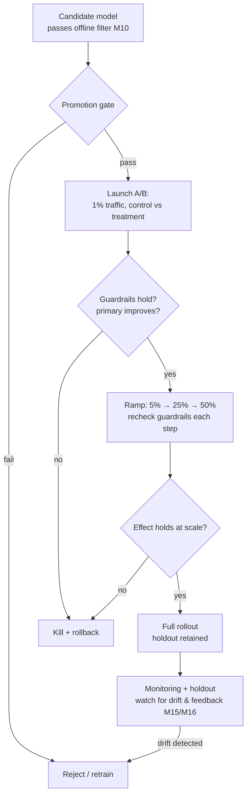

# M11 · Online Evaluation, A/B Testing & Approval Gates

> **Core question:** How do we know the model wins in production, and when do we let it in?

---

## The ranking model that was better on paper

Your search team has spent six weeks on a new ranking model, and the offline evaluation is beautiful: **+3.2% nDCG**, **+4.1% recall@10** against the harness. Leadership is sold. You ship it to 100% of traffic on a Tuesday.

Two weeks later the real numbers are in: click-through is *down* 1.8%, time-to-first-click is up, session abandonment is up, and revenue is down. The offline metrics said the model was better. It wasn't.

What happened? The offline metric measured relevance in a vacuum. It didn't model position bias — users click the first result partly because it's *first*, not because it's best. It didn't model the feedback loop — users clicked what the old ranker showed, and those clicks *became* the labels the new model was trained on. And it measured against a logged set of queries produced by a different model entirely. The number said "better," but it was answering a question nobody asked.

This module is about the gap between "the model looks good offline" and "the model wins in production" — and the machinery that closes it: online evaluation, A/B testing, and the approval gate that decides whether a model gets in.

## The offline–online gap

Offline metrics are proxies (M10), and the distance between proxy and reality is the **offline–online gap** — the single most common reason an ML deployment disappoints. Four causes, each a named thing from M2:

**1. Feedback loops (M2 #4).** The model changes the data it's evaluated on. A new ranker shows different results; users click on what it shows; those clicks become the labels the *next* evaluation trains on. The model's own output contaminates its own ground truth, so an offline improvement can be self-canceling — or self-reinforcing.

**2. Distribution shift (M2 #3).** The world that generated your eval data is not the world you ship into. Queries shift, users shift, competitors shift. An offline metric measures performance on *yesterday's* distribution, then you apply it to *tomorrow's*.

**3. The counterfactual problem.** Offline evaluation measures a model against logged data that was produced by a *different* model. You can only observe what the old ranker showed, not what users would have done with your new one. The new model's best results never appeared in the logs, so offline metrics systematically *underestimate* a genuinely different ranker — and overestimate one that's just a tweak of the old.

**4. Surrogate mismatch.** nDCG and recall@10 are stand-ins for "users find what they want." They don't measure latency, relevance to intent, or revenue. The surrogate can move up while the real objective moves down.

> **⚠️ Failure mode** — *The offline win that loses online.* This is M2's "bad offline → online transfer" row, and it's this module's central hazard: a team ships on a strong offline number and watches the real metric go the wrong way. The cure is never "get better offline metrics." It's *stop using offline metrics as a shipping decision* — use them as a filter, and let the online experiment make the call.

## A/B testing: the experiment that decides

An A/B test (a controlled online experiment) is the only honest way to answer "does the new model actually win in production?" It splits live traffic: a control group gets the current model, a treatment group gets the candidate, and you compare a **guardrail metric** (the business objective) between them.

The parts that decide whether the test means anything:

**Statistical power — decide before you start.** Power is the probability you detect a real effect if one exists. It depends on three things you *choose*: the **minimum detectable effect** (MDE — how big an improvement is worth shipping), the **sample size** (traffic × time), and the baseline variance of your metric. The classic mistake: running a test with too little traffic, getting a non-significant result, and concluding "no effect" — when you were simply underpowered to see a small effect. Compute the sample size *before* you launch, and never interpret a non-significant result on an underpowered test as a null.

```python
from scipy.stats import norm

def min_samples_per_group(p0, p1, alpha=0.05, power=0.80):
    """Samples per arm for a two-proportion test, baseline p0 → target p1."""
    z_a, z_b = norm.ppf(1 - alpha / 2), norm.ppf(power)
    p = (p0 + p1) / 2
    num = (z_a * (2 * p * (1 - p))**0.5 + z_b * (p0 * (1 - p0) + p1 * (1 - p1))**0.5)**2
    return num / (p1 - p0)**2

# Baseline click-through 10%; ship only if we can detect a 10% relative lift (→ 11%).
print(min_samples_per_group(0.10, 0.11))   # ≈ 14,750 per arm — weeks of traffic at low volume
```

The takeaway isn't the exact number; it's that *detecting a 1% lift needs roughly 100× the traffic of detecting a 10% lift*, and most teams have no idea whether their test can even see the effect they're chasing.

**Guardrails — the metrics that can't regress.** Every A/B test has a **primary metric** (what you hope improves) and **guardrails** (what must not get worse): latency, error rate, revenue-per-session, customer-satisfaction score, and — for ranking specifically — *coverage* (are niche queries still surfacing anything at all?). A test that wins the primary metric but blows a guardrail is a **failed test**, not a win. Guardrails are where you catch the ranker that optimizes click-through by turning every result into a clickbait headline.

**Ramp-up — from 1% to 100%, gradually.** You don't flip the whole site at once. Start at 1% of traffic, watch guardrails, double, watch, repeat. Each ramp step is a checkpoint, not a formality: a failure that's catastrophic at 1% is a small incident; at 100% it's a public outage.

**Holdout groups — the long view.** A/B tests measure *short-term* effects (clicks in the first week). Some effects only appear over months — a ranker that trades novelty for relevance might click great for a week and then drive users away as the feed goes stale. A **holdout** — a small fraction of traffic kept on the old model *permanently* — lets you measure the long-term and cumulative effects that a two-week A/B test cannot see.

> **⚖️ Tradeoff** — *Speed of learning vs. risk of the test.* Bigger treatment groups mean more statistical power, faster. But every user in the treatment group is exposed to an unproven model. Ramp-up and guardrails exist to make this tradeoff *safe*, not to eliminate it: the ledger entry is *chose gradual ramp with guardrail floors, gave up some experiment speed, bought the ability to kill a bad model before it hurts at scale.*

## Reading the result without fooling yourself

An A/B test can be statistically valid and still lie to you. Four ways it happens, and the design that prevents each:

**Peeking.** If you check the dashboard every day and stop the moment p < 0.05, you're running *many* tests, not one — and the false-positive rate inflates accordingly. A 5% threshold peeked at daily becomes far more likely to produce a "significant" result by pure chance. The fix: **pre-register the stopping rule** — duration and decision criteria are fixed *before* launch, and you look once, at the end.

**Novelty effects.** Users respond differently to something *because it's new*, not because it's better — the first week of a new ranking inflates (or deflates) engagement before it settles. The fix: run the test long enough for novelty to decay, or discard an explicit novelty burn-in window.

**The randomization unit.** Randomize by *user* (or session), not by *query* or *request* — otherwise the same user sees both rankers across requests, their behavior contaminates both arms, and your effect estimate is a wash. The unit you randomize on is a design decision with consequences for power and correctness.

**Simpson's paradox.** The aggregate metric can improve while *every subgroup* gets worse — because the treatment shifted the mix of traffic (pulled in more of a low-engaging segment, dragging the average down, or the reverse). The fix: report the primary metric overall *and* on your key segments, and treat an aggregate win that hides subgroup losses as a failed test.

## Interleaving and bandits (brief)

For ranking specifically, classic A/B has a cost: it's slow, and it splits traffic between whole rankers, so you need many users to detect the small differences that matter in ranking. Two alternatives, briefly:

**Interleaving.** Show one user a *single* blended result list that mixes results from both rankers, and measure which ranker's results the user clicked more. Because the comparison happens *within* one user's session (rather than across two groups of users), interleaving detects preference with far less traffic than A/B — often 10–100× more sensitive. Its limit: it answers "which ranker does the user prefer?" not "what's the impact on revenue or retention?" Use interleaving to *screen* candidates cheaply; use A/B to *decide*.

**Bandits.** Instead of a fixed split, allocate traffic *adaptively*: start roughly even, then shift traffic toward whichever arm is performing better, exploring less over time (e.g., Thompson sampling or an ε-greedy bandit). Bandits optimize *during* the experiment rather than waiting for a verdict — useful when you have a stream of candidates and continuous reward. Their cost: more moving parts, harder attribution, and they muddy the clean statistical read you get from a fixed A/B.

The design lesson: **interleaving and bandits are efficiency tools, not replacements for the approval decision.** They help you *find* and *screen* candidates; the promotion gate below still applies before anything ships to everyone.

> **💻 CODED DEMO (Pass 2)** — *Interleaving vs. A/B sensitivity:* a synthetic click simulator comparing how many users an interleaved test needs versus a classic A/B to detect the same ranker preference — the 10–100× efficiency claim made concrete.

> **🐍 Reference stack at a glance** — A/B experimentation doesn't live in scikit-learn; it lives in the experiment platform. In the Python ecosystem the pragmatic surface is: a feature-flag / experiment-assignment layer (house-built or open source) keyed off a user or session ID, stats via `scipy.stats` (proportion tests, `norm` for power), and your *business* metrics logged to the same Prometheus/Grafana stack you'll use for monitoring (M15). The discipline is in the design — power, guardrails, ramp — not in any one library.

## Approval gates: what must be true to promote

The last mile is the **approval gate** — a checklist of conditions that must *all* be true before a model moves from candidate to production. This is the "Approval gate" box in M3's Verification Layer, and it's where evaluation stops being a number and becomes a *decision*.

A promotion gate for a ranking change looks like:

1. **Offline filter passed** — nDCG / recall@k met its floor, slices met their floors, no leakage (M10). Necessary, not sufficient.
2. **The A/B test reached power** — it ran long enough and with enough traffic to detect the MDE you set *before* launch. A significant result on an underpowered test is noise.
3. **Primary metric improved, and it's practically (not just statistically) significant** — a 0.05% lift with p<0.01 is statistically real and business-meaningless. Gate on *effect size*, not just p-value.
4. **No guardrail regressed** — latency, error rate, coverage, revenue-per-session all within their floors. A guardrail violation is a hard stop, regardless of the primary metric.
5. **The effect held across the ramp** — the win at 5% traffic survived at 25% and 50%. Early wins that evaporate at scale are usually a niche-user effect.
6. **The model is registered, versioned, and rollback-able** — it's in MLflow with lineage (M9), the serving path can revert to the previous version in one step (M13), and the exact artifact that ran the test is the exact artifact that ships.
7. **Monitoring is on before it ships** — the guardrails become live alerts (M15), and a holdout is in place to catch long-term decay.

Every condition is a *seam with a contract* (M3): the gate is the boundary between the Verification Layer and the Serving Layer, and "promoted" means "this model passed the contract."

> **⚠️ Failure mode** — *The gate that's a form.* An approval gate only works if a *violation actually blocks the promotion*. When the gate is a checklist people initial without reading — "yes it has a number, yes we looked at it" — it degrades into theater, and the models it lets through are the ones that fail. The gate must be *automatable where possible* (metrics auto-computed, floors auto-checked) and *human-judged only where necessary* (is a 2% revenue dip acceptable for a 10% relevance gain?). A gate that can't say "no" isn't a gate.

## The A/B rollout, in one picture



Two things to notice. First, the gate appears *twice* — once as a checklist before the test, once as a re-check at every ramp step. Second, the diagram does not end at "full rollout." Promotion is not retirement from evaluation; it's the start of *continuous* evaluation (M15, M16), because the feedback loops and drift that the offline metric couldn't see are now live.

## Design exercise

You own ranking for a search product. A new ranking model scores +3.2% nDCG offline. Design the path from that number to a shipped model.

**Part A — The experiment.** Define: the primary metric, at least three guardrails (with explicit floors), the MDE you'd target and why, and a power calculation that tells you the traffic × duration the test needs. State your assumption about baseline metric variance.

**Part B — The rollout.** Write the ramp schedule (percentages and the trigger to advance at each step), and specify what "the effect held" means at each step. Include the holdout: how much traffic, kept for how long, and what it's watching for that the A/B test can't see.

**Part C — The promotion gate.** Write the full gate as a checklist (the seven conditions above, adapted to your product). For each condition, mark it **automated** (a number auto-computed against a floor) or **human-judged** (a tradeoff someone must sign off on).

**Part D — The ADR.** Record, in M3's ADR template, your decision to *require an online A/B test before any ranking model ships* — with the honest Consequences (what it costs you in experiment speed and engineering effort, what it buys you). Then name the one guardrail you'd hold even if leadership is pushing to ship the +3.2% nDCG model tomorrow.

The goal: leave this module with the reflex that an offline metric *entitles* a model to a test, and nothing else. The test — powered, guarded, ramped, gated — is what earns it production.

---

*Next: M12 · Serving Architectures — how a promoted model actually gets delivered to users, at what latency and cost, and how the serving design becomes its own set of tradeoffs.*
