# M12 · Serving Architectures

> **Core question:** How do predictions actually get delivered, and at what cost?

---

## The 200-millisecond checkout

A customer taps **Buy** on a $3,000 purchase, and her card network routes the transaction to you for a fraud decision. You have **200 milliseconds** — from the moment the transaction arrives to the moment your approve/decline lands back — before the payment times out and the whole thing fails over to "approve everything" (or worse, "decline everything").

Inside that window, an entire system has to run: parse the request, look up the account's history, compute the features (velocity, amount vs. profile, device fingerprints), load the model, score it, and return a decision. The model itself might take 8 ms. The *system around it* will happily eat the other 192 ms if you let it.

Here's the thing nobody tells you in the notebook: **the model's inference time is not the latency.** Latency is the *sum of everything on the path* — feature lookup, serialization, queueing, network hops, the runtime's cold start. The model is the one component you measured; the serving architecture is the thing that decides whether your 200 ms budget is a luxury or a straitjacket.

This module is about designing that architecture. The model stops being a function and becomes a *service* with a budget, a serialized form, a runtime, and a cost per call.

## Serving is a design surface, not an afterthought

There's a default posture to unlearn: *train the model, then "deploy" it, then think about serving.* That treats serving as the boring last mile. It's not — it's a design surface with real degrees of freedom, and the choices you make there feed back into the model itself:

- **The serving pattern** determines what "a prediction" even means — one row at a time, a million at once, a continuous stream, or on a device with no network.
- **The latency budget** determines which models are *eligible at all*. A beautiful 40 ms transformer is a non-starter in a 20 ms budget; a 2 ms tree is.
- **The serialization + runtime** determines what you can actually execute, how fast, and where.
- **The cost per prediction** determines whether the whole feature is worth building (M14 goes deep on this).

Serving is where model quality meets reality. A model you can't serve within budget, at an acceptable cost, is a research artifact — regardless of its AUC.

### The four serving patterns

Every serving system is one (or a combination) of four patterns. Pick deliberately, because they have completely different failure modes, cost curves, and latency profiles.

```mermaid
flowchart TB
    subgraph Batch["1 · Batch"]
        B1[Data warehouse / lake] --> B2[Scheduled scoring job]
        B2 --> B3[Write predictions to a table]
        B3 --> B4[Downstream systems read]
    end
    subgraph Online["2 · Online (REST / gRPC)"]
        O1[Client request] --> O2[Feature lookup]
        O2 --> O3[Model server]
        O3 --> O4[Synchronous response]
    end
    subgraph Streaming["3 · Streaming"]
        S1[Event stream] --> S2[Stream processor + model]
        S2 --> S3[Emit predictions / alerts]
    end
    subgraph Edge["4 · Embedded / Edge"]
        E1[Device] --> E2[On-device model]
        E2 --> E3[Prediction, no round-trip]
    end
```



**1. Batch.** You score a large set of records on a schedule — nightly, hourly — and write the predictions somewhere downstream systems read them. Predictions are *precomputed and stale by design*: by the time someone reads a batch prediction, the world has moved on. That's fine when the question is "which of these 10 million accounts should marketing email tomorrow?" and disastrous when the question is "is *this* transaction fraud *right now*?"

**2. Online (REST/gRPC).** A synchronous request/response. The client sends features (or an ID, and the server looks features up), the server scores, and returns a prediction in real time. This is the pattern for any decision that must be made *at the moment of action* — fraud, search ranking, a recommendation on a page load. It has a latency budget (usually 20–200 ms), a throughput requirement (QPS), and a hard availability requirement.

**3. Streaming.** A model consumes a continuous stream of events and produces predictions (or triggered actions) as events arrive — no request needed. Think anomaly detection over a log stream, real-time bid optimization, or a fraud model watching every transaction flow past and *emitting* a score into a stream that downstream consumers read.

**4. Embedded/edge.** The model runs *on the device* — a phone, a camera, a car — with no round-trip to a server. Latency is near-zero and privacy is maximal (data never leaves the device), but you pay in deployment pain: you must ship model artifacts to devices, handle heterogeneous hardware, and give up the easy observability of a server you own.

> **⚠️ Failure mode** — *Pattern mismatch.* The single most common serving failure is using the wrong pattern for the question — typically serving a *batch* answer to an *online* question (a fraud model scored nightly, then read at transaction time as if it were fresh), or force-fitting a heavy online model onto an edge device that can't run it. The M2 failure-class map puts **training–serving skew** on this layer (M6, M12) precisely because serving is where "the same features, the same way" is either honored or silently broken. A stale batch score served as if live is skew of the worst kind: the model never even sees the transaction it's judging.

### Choosing a pattern: a decision table

When in doubt, pick from the *question you're answering*, not the tool you already have:

| Question | Pattern | Typical budget | The thing that kills you |
|---|---|---|---|
| "Score these 10M records for tomorrow" | Batch | hours | Staleness mistaken for freshness |
| "Is *this* action safe right now?" | Online | 20–200 ms | Latency tail, cold start |
| "Watch this stream and act as events arrive" | Streaming | seconds | Backpressure, out-of-order events |
| "Decide on-device, no network" | Edge | ms, local | Deployment pain, lost observability |

Notice what's missing: there's no "best" pattern, only the right one for the question — and most real systems are *hybrids*. A fraud system often runs online scoring for the checkout path *and* a nightly batch that recomputes account-level risk scores the online model reads as features. The design skill is drawing the seams between those patterns so each is used for what it's good at.

### Latency budgets and SLOs

Once you've picked online serving, the budget becomes a first-class spec. A **latency budget** is the total time from "request arrives" to "response leaves," and it decomposes into stages you can measure and own:

| Stage | Typical share | What eats it |
|---|---|---|
| Deserialize / parse request | 1–5 ms | JSON parsing, validation |
| Feature lookup / compute | 10–150 ms | Remote calls to feature store, DBs |
| Model inference | 1–50 ms | Model size, runtime, hardware |
| Serialize response | 1–5 ms | JSON encoding |
| **Total (p99)** | **your budget** | everything above, plus queueing |

The trick is that **the budget is an SLO, not an average.** "200 ms average" is a lie. Your budget must be stated as a percentile — typically **p99 (or p99.9) latency ≤ budget** — because the customer who hits the slow tail doesn't care about your average. A fraud check that is 180 ms at p50 and 900 ms at p99 is *broken*: 1% of your customers are timing out even though the dashboard says "180 ms."

Set SLOs the way M3 taught you to set seams: explicit, measurable, owned. "The fraud endpoint serves p99 < 200 ms, at ≥ 99.9% availability, with < 0.1% timeout rate" is an SLO. "It's fast enough" is not.

> **⚖️ Tradeoff** — *Freshness vs. latency vs. cost.* Every serving design is a three-way tension. You can get *fresher* predictions (online, live features) at the price of latency and infrastructure. You can get *cheaper* predictions (batch, precomputed, cached) at the price of freshness. You can get *faster* predictions (smaller model, fewer features, less preprocessing) usually at the price of quality. No corner of this triangle is free; the design exercise is naming which corner you're trading away *and why*.

### Model serialization & runtimes

Online serving raises a concrete question: **in what form does the model cross from training to serving, and what executes it?** That's serialization (the artifact) and the runtime (the engine). The two are coupled, and getting them wrong is a classic source of skew.

| Serialization | Runtime | Notes |
|---|---|---|
| **ONNX** | ONNX Runtime, TensorRT, many others | Open, cross-framework format; the de-facto interchange standard. Export from sklearn/PyTorch/TensorFlow, run anywhere. |
| **TorchScript** | PyTorch (libtorch) | PyTorch's own "graph mode"; optimizes and serializes PyTorch models for C++ serving. |
| **SavedModel** | TensorFlow Serving | TensorFlow's serialization plus a dedicated serving system (REST/gRPC out of the box). |
| **TensorRT** | NVIDIA GPUs | Not a format but an *optimizer/runtime* that compiles models (often via ONNX) into highly optimized GPU inference. |

The reference-stack principle: **train in the framework you like, serve in the runtime that fits the budget.** Train in PyTorch or sklearn, then **export to ONNX** (or TorchScript), and serve with a lean runtime (ONNX Runtime on CPU, TensorRT on GPU). Why? Because the training framework carries baggage you don't want on the hot path — autograd, eager execution, Python overhead — while a dedicated runtime is optimized for one thing: turning an input tensor into an output tensor as fast as possible. The payoff is typically a 2–10× latency cut and a smaller, portable artifact — but it isn't free:

> **⚖️ Tradeoff** — *Framework-native vs. exported artifact.* Serving directly from your training framework (a PyTorch model inside a FastAPI process) is the fastest to build and easiest to debug — but it drags training baggage into the hot path and can be slow. Exporting to ONNX/TorchScript buys speed and portability but adds a step where *numerical differences can creep in* (different ops, different precision) — a fresh skew risk. The ledger entry: *chose ONNX export for the fraud model, gave up "just call `model.predict()`" simplicity, bought a 5× latency cut and a swappable runtime — but we must diff exported-vs-native outputs in the test suite (M13).*

### The minimal online endpoint

The whole serving architecture reduces to a shockingly small amount of code. Here's a minimal FastAPI prediction endpoint — the "hello world" of online serving — enough to make the concept concrete:

```python
import onnxruntime as ort
from fastapi import FastAPI
from pydantic import BaseModel

class Features(BaseModel):
    amount: float
    account_age_days: int
    velocity_1h: int

session = ort.InferenceSession("fraud_model.onnx")  # loaded once, at startup
app = FastAPI()

@app.post("/predict")
def predict(f: Features):
    x = [[f.amount, f.account_age_days, f.velocity_1h]]
    score = session.run(None, {"input": x})[0][0][0]
    return {"fraud_probability": float(score)}
```

Three lines of that snippet carry the whole lesson in miniature: the session is loaded **once at startup** (not per request — cold start and per-request reload are the two classic latency killers), the input is a **fixed, validated schema** (the feature seam from M3 made executable), and the model is an **ONNX artifact** (portable, framework-free). Everything else in this module is just scaling that snippet and deciding what pattern it lives inside.

> **🐍 Reference stack at a glance** — **FastAPI + Docker** is the serving shell; **ONNX Runtime** (CPU) or **TensorRT** (GPU) is the engine; the model arrives as an **ONNX** artifact exported from PyTorch/sklearn. The one-line principle: *train in the framework you like, serve in the runtime that fits the budget.* Docker turns the whole thing into an immutable, versionable, rollback-able image (M13).

> **💻 CODED DEMO (Pass 2)** — A runnable end-to-end serving demo: train a tiny sklearn fraud model → export to ONNX → serve it with the FastAPI endpoint above → drive it with a load generator → watch p50/p99 latency in Prometheus as QPS climbs. The demo exists to make the latency-budget math *visible*, not just asserted.

## Design exercise

You're the ML engineer on a **real-time credit scoring** system. A card network sends each transaction to you for a fraud decision with a hard **200 ms budget** (p99, end-to-end). Transactions arrive at ~500 QPS at peak, spiking to 2,000 QPS during flash sales. The features (velocity, account history, device fingerprints) live in a feature store that takes 30–60 ms to query. You have a gradient-boosted model, currently an `sklearn` pickle, that scores in ~5 ms on CPU.

**Part A — Choose and justify a pattern.** Pick the serving pattern (or combination), and write a one-paragraph justification that names the tradeoff honestly — what you're gaining and what you're giving up. (Hint: "online" is the obvious answer; the interesting part is *which* online decisions you make around it — sync vs. async, what's cached, what's precomputed.)

**Part B — Draw the data flow.** Using Mermaid, draw the full path from "transaction arrives" to "decision returns," labeling every stage with its **latency cost** and its **failure mode** (what breaks if this stage is slow, down, or wrong). Mark the feature seam explicitly — where does the contract live that guarantees serving features match training features?

**Part C — The budget ledger.** Add up your stage latencies against the 200 ms budget. Where are you over, or uncomfortably close? Propose one concrete change (an ONNX export? a cache? a smaller model? a feature-store optimization?) that buys back margin, and state what it costs.

**Part D — Write ADR-012.** Using the M3 template, record your architecture decision: the pattern, the runtime, and the serialization. The Consequences section must state the tradeoff — *what you chose and what you gave up*.

---

*Next: M13 · Deployment Strategies & CI/CD for ML — you've built the serving architecture; now ship it safely, and roll it back when it breaks.*
