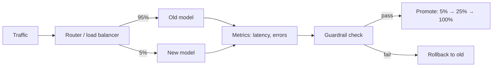
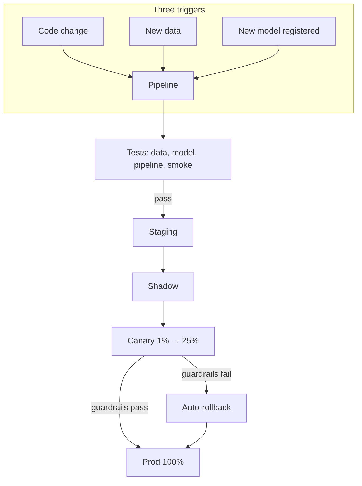

# M13 · Deployment Strategies & CI/CD for ML

> **Core question:** How do we ship a model safely, and roll it back when it breaks?

---

## The recommender that broke Monday morning

You're on the recommendations team. Friday afternoon, a new ranking model shipped. The offline metrics were great — +3% click-through in evaluation, all the tests green. Monday, the numbers come in and they're bad. Engagement is down 11%, revenue is down, and nobody can say exactly when it started, because the model rolled out to *everyone* at once.

Now you're in the worst possible position: a bad model in production, full traffic, and the only "rollback" is *redeploy the old model, hope the old weights are still findable, and hope the pipeline still builds*. It takes three hours, most of it archaeology.

The model wasn't the problem. The **deployment strategy** was. You shipped a model the way you'd ship a button color — all at once, no ramp, no guardrails, no way to compare, no fast path back. This module is about building that path.

## Deployment is a risk surface

A model deploy differs from a normal code deploy in one crucial way: **you often can't tell it's broken from a stack trace.** The new model doesn't crash — it just produces slightly worse predictions, and the damage shows up days later in a metric nobody was watching. So the deployment machinery has to be built around *detecting silent badness and rolling back before it spreads*.

That changes the shape of how you ship. Four strategies, in increasing order of safety (and cost):

### Shadow deployment

The new model runs *alongside* the old one — it sees the same traffic, produces predictions, and **nobody acts on them**. You log its outputs and compare them to production. Zero user risk, because the new model's output goes to a log, not a decision.

Shadow is for *validation*, not *release*. It answers "does the new model behave sanely in production?" — same latency, same output distribution, no crashes, no surprise NaNs — before a single real decision changes. The catch: it doubles compute (two models score every request), and it can't measure *business impact*, because no user ever felt the new model.

### Canary deployment

The new model gets a **small slice of real traffic** — 1%, then 5%, then 25% — while the old model serves the rest. Now users *do* feel the new model, so you can measure real impact — but on a slice small enough that a bad model hurts 1% of users instead of 100%. You watch metrics at each step, and **promote or roll back** based on what you see.

Canary is the workhorse of ML deployment. The slice is the safety dial.

### Blue-green deployment

You run **two complete, identical environments** — "blue" (current) and "green" (new). When green is ready and validated, you flip a router and *all* traffic switches at once. Rollback is a flip back.

Blue-green is fast to roll back but *binary*: there's no gradual ramp, so a bad model hits 100% of users the instant you flip. That makes it better suited to *infrastructure* changes (where you mostly care about "does it boot and serve") than to *model* changes (where badness is probabilistic and emerges slowly).

### A/B testing (as a deployment strategy)

Two or more models serve *different user segments simultaneously* — not as a temporary rollout step, but as a *standing experiment* measuring which one wins. This is M11's online evaluation wearing a serving costume: it answers "is the new model *actually better*?" with statistical rigor, not vibes.

The key distinction: **canary is about safety, A/B is about evidence.** You canary a model you already believe in, to confirm it doesn't break. You A/B a model you're *uncertain* about, to learn which is better. In practice they compose: A/B the new model against the champion, and when it wins, canary-roll it to 100%.

### Rollback: the part people skip

Rollback isn't an afterthought — it's the *reason* the other strategies work. A canary without a fast rollback path is just a slow-motion disaster. Rollback for ML has a subtlety code rollback doesn't: **you must be able to roll back the whole artifact stack** — the model weights, the feature code, the preprocessing, the schema. Rolling back "the model" while leaving the new feature code in place is how you manufacture training–serving skew mid-incident (M2).

The registry (M9) is what makes rollback possible: "what's in prod?" must always have a precise, one-command answer, and "the previous good version" must still exist, frozen, with its exact data and code lineage attached.

> **⚠️ Failure mode** — *Unbounded deployment.* The M2 failure-class → layer map puts **unsafe / unbounded deployment** squarely on this layer (M13). It's the failure where a model ships to 100% of traffic with no ramp, no guardrails, and no rollback — then degrades silently while nobody can reconstruct *which version is even running*. Deployment isn't a button; it's a *gradual, reversible, evidence-gated* process. If you can't answer "what's in prod, and what was there before?" in under a minute, you don't have a deployment strategy — you have a hope.

## CI/CD for ML: three triggers, not one

Classic CI/CD says: *code changes trigger the pipeline.* ML adds two more triggers, because an ML system changes for three different reasons:

1. **Code changes** — a new feature in the serving code, a new training script. Triggers the pipeline, as usual.
2. **Data changes** — new training data arrives. In ML, *the data is part of the program.* New data can silently change what the model learns, so it must trigger the pipeline too.
3. **Model changes** — a new model version is registered (M9). It must flow through the *same* verification and deployment gates as everything else.

This reframes the whole pipeline. **Retraining is not a special event — it's just CI.** The moment new data or new code produces a new model, that model is a *candidate artifact* that must pass the same tests and promotion gates as any code change. A team that "retrains every month, by hand, whenever someone remembers" is running CI/CD with a human as the scheduler.

### Retraining as CI: the continuous-training loop

"Retraining as CI" becomes concrete when you name the *triggers* that kick off a training run, because a pipeline that only runs when a human remembers is a pipeline that decays. Three triggers, in increasing order of ambition:

- **Scheduled** — retrain on a cadence (nightly, weekly). Simple, predictable, always a good baseline. The cost: you retrain even when nothing changed, and you *don't* retrain when something changed mid-cycle.
- **Data-triggered** — retrain when new data arrives (a new batch of labels, a new day of logs). The pipeline is wired to the data feed, so the model tracks the world's pace.
- **Drift-triggered** — retrain when monitoring says the model's inputs or performance have shifted (M16). The most responsive, and the most complex: now the *pipeline itself* is a consumer of observability.

These compose with the three CI/CD triggers above — data and code changes produce candidate models, and *training* is just the step that turns a data or code change into a new candidate. The framing to hold: **a model that isn't being regenerated is a model that's aging, and "we retrain by hand" is a deployment risk, not a workflow detail.**

## Testing in ML: the four layers

"Does the pipeline pass?" isn't one test — it's four families of tests, each guarding a different failure mode:

1. **Data tests** — is the *input* valid? Schemas match, ranges are sane, no silent nulls, no leakage in the split (M5, M10). These catch the leakage/skew failures *before* the model ever trains on them.
2. **Model tests** — is the *artifact* sane? The exported model loads, accepts the right input shape, produces a probability in [0,1], and — critically — its outputs match the training-framework version's outputs within tolerance (the ONNX-export skew check from M12).
3. **Pipeline tests** — does the *whole path* work? Training runs end-to-end, the registry records lineage, and the artifact is reproducible from the recorded data + code + params (M7).
4. **Serving smoke tests** — does the *deployed endpoint* respond? A known input returns a known prediction, latency is within budget, the health check passes. This is the last gate before a model sees real traffic.

> **⚖️ Tradeoff** — *Test depth vs. shipping speed.* Every one of those test families costs time and engineering, and the temptation is to skip the ones that feel redundant — "the data was fine last week." But each family catches a *different* failure class (data tests catch leakage, model tests catch skew, smoke tests catch deployment breakage), so skipping one doesn't speed you up; it reopens one specific hole. The ledger entry: *chose all four test families, gave up some pipeline minutes, bought a deployment path where failures are caught before they're expensive — not discovered after.*

## The promotion pipeline

Put it together and you get the promotion pipeline — the single spine every model must walk, one gate at a time, with evidence at each step:

**staging → shadow → canary → prod**

- **Staging** — the model runs in a production-like environment, against production-like data, with the full test suite. *Does it work at all?*
- **Shadow** — the model runs in production, scoring real traffic, its output discarded. *Does it behave sanely under real load?*
- **Canary** — the model serves a small slice of real users, monitored against guardrails. *Does it win where it matters, without breaking anything?*
- **Prod** — full traffic, with the old version one command away.

Each arrow is an **approval gate** (M11's promotion gate, made mechanical): a set of metrics that must hold — error rate, latency p99, and one *business* metric — before the model advances. Fail a gate, and you don't advance; you roll back or fix.

### What "auto-rollback" actually is

"Auto-rollback" is not magic — it's a *loop*, and you can specify it in four steps:

1. **Watch** — the guardrail metrics are being scraped continuously (Prometheus), not checked by a human at end of day.
2. **Judge** — a rule evaluates them: *"p99 latency > 250 ms, OR error rate > 1%, OR CTR < −2% vs. control, sustained for 5 minutes."*
3. **Act** — on breach, re-point the router back to the previous model version — the registry's one-command rollback, executed by the pipeline, not a person.
4. **Record** — log the incident with the *evidence* that triggered it, so the rollback is explainable rather than a mystery.

The design decisions are all in step 2: *which metrics, what thresholds, how long must they persist before you act, and does a human approve or is it fully automatic?* Fully automatic is faster and safer for *hard* failures (errors, latency); most teams keep a human approval for *quality* regressions, where the metric is noisier and the cost of a wrong rollback is real. That split — machine for safety, human for judgment — is itself an ADR.

> **🐍 Reference stack at a glance** — The CI/CD surface for M13's recommender is: **GitHub Actions / GitLab CI** (orchestrating the pipeline), **Prefect** (the promotion pipeline as a flow — code in Pass 2), **MLflow** (the registry that makes "what's in prod?" answerable and rollback a one-command operation), **Docker** (immutable model+code images that make blue-green and rollback *mechanical* rather than archaeological), and **Prometheus + Grafana** (the guardrail metrics the canary is judged against). The through-line: *the registry says what's deployed, the CI/CD says how it got there, and observability says whether it's allowed to stay.*

> **💻 CODE (Pass 2) · Prefect** — *promotion pipeline (no-infra path).*
> - **Demonstrates:** the promotion gates from "The promotion pipeline" — a flow that stops at a gate when a guardrail breaches, and an auto-rollback that re-points the router.
> - **Where:** `modules/13-deployment-cicd/code/promotion_dag.py`
> - **Requirements:** Prefect 3.x, mlflow, numpy — runs locally.
> - **Reader should see:** canary at 5% → guardrail breach → rollback fires, never full rollout.
> - **Accept:** `flow()` runs end-to-end; a planted guardrail breach rolls back instead of promoting.
> - **Base:** [`tech/prefect.md`](../../tech/prefect.md)

> **💻 CODE (Pass 2) · Airflow** — *promotion pipeline (infra path).*
> - **Demonstrates:** the same promotion pipeline as an Airflow DAG — the batch-scheduling mental model vs. a gated flow, made explicit.
> - **Where:** `modules/13-deployment-cicd/code/promotion_dag_airflow.py`
> - **Requirements:** Airflow 2.10+ + docker-compose (scheduler, webserver, Postgres, LocalExecutor); connections to MLflow/serving. See [`tech/airflow.md`](../../tech/airflow.md).
> - **Reader should see:** a triggered DAG run walking staging → shadow → canary → prod, with a gate task that fails the run on guardrail breach.
> - **Accept:** `airflow dags trigger promotion` produces a run whose task graph shows the gate stopping before prod.
> - **Base:** [`tech/airflow.md`](../../tech/airflow.md)

> **💻 CODE (Pass 2) · Kubeflow Pipelines** — *promotion pipeline (K8s path).*
> - **Demonstrates:** promotion gates as KFP components — each stage an isolated container op.
> - **Where:** `modules/13-deployment-cicd/code/promotion_pipeline_kfp.py`
> - **Requirements:** KFP 2.x on a k3s/minikube cluster (api-server, MinIO+MySQL, Argo); container registry. See [`tech/kubeflow-pipelines.md`](../../tech/kubeflow-pipelines.md).
> - **Reader should see:** the compiled pipeline YAML + a run where the guardrail component fails and the promote component is skipped.
> - **Accept:** `kfp.Client().create_run_from_pipeline_func(...)` runs; failed guardrail skips promotion.
> - **Base:** [`tech/kubeflow-pipelines.md`](../../tech/kubeflow-pipelines.md)

> **💻 CODE (Pass 2) · TFX** — *promotion path as a TFX pipeline.*
> - **Demonstrates:** the release gate expressed as Evaluator → Pusher config in the canonical component graph.
> - **Where:** `modules/13-deployment-cicd/code/promotion_pipeline_tfx.py`
> - **Requirements:** `tfx==1.*`, TF, LocalDagRunner for the demo (Airflow/KFP runners optional); SQLite metadata. See [`tech/tfx.md`](../../tech/tfx.md).
> - **Reader should see:** the component graph where Evaluator thresholds gate whether Pusher writes to prod.
> - **Accept:** `python pipeline.py` runs locally; lowering the Evaluator threshold stops Pusher.
> - **Base:** [`tech/tfx.md`](../../tech/tfx.md)

## Design exercise

You own the **recommender-system rollout** for a streaming service. Your new ranking model beat the champion in offline evaluation (+2.5% click-through) and in a two-week A/B test (+1.8%, statistically significant, no guardrail violations). You're about to promote it to 100% production traffic — a million concurrent users, with revenue riding on it. The current model is in prod, stable, but aging.

**Part A — Draw the promotion pipeline.** Using Mermaid, design the pipeline the new model walks from staging to prod. Label each stage, the traffic percentage, the *evidence collected* at that stage, and the *gate* that must pass to advance.

**Part B — Define the canary + auto-rollback.** Pick a canary ramp (percentages and durations), and specify the **guardrail metrics** that will be watched automatically. Define the **auto-rollback trigger** precisely: *which metric, crossing what threshold, for how long, triggers an automatic rollback — and what exactly rolls back* (model? feature code? both?).

**Part C — The three-trigger audit.** Your pipeline currently triggers only on code changes. Walk through what *breaks* (or silently degrades) when (a) a new batch of training data arrives, and (b) a new model is registered — and specify the pipeline trigger you'd add for each.

**Part D — Write ADR-013.** Record your deployment strategy (shadow → canary → prod, or a variant) and your rollback mechanism in the M3 template. The Consequences section must name what this buys you *and* what it costs (infrastructure, shipping latency, team discipline).

---

*Next: M14 · Scaling, Optimization & Cost — your recommender is safely deployable; now make it serve 100× more predictions, faster and cheaper, without degrading quality.*
