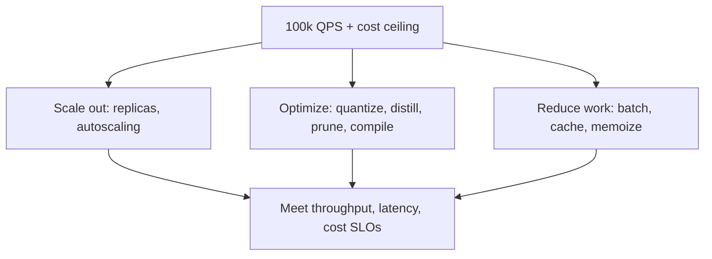

# M14 · Scaling, Optimization & Cost

> **Core question:** How do we serve more predictions, faster, cheaper — without degrading quality?

---

## The moderation queue that melted

Your content-moderation model is a victim of its own success. It was built for **1,000 predictions per second** — flagging abuse on a mid-sized platform. Then the platform went viral. Now it's 100,000 QPS at peak, the queue backs up, p99 latency blows past the SLA, and — the part that actually matters — abusive content is staying up for *minutes* because the model can't keep up. Meanwhile your CFO emails: the serving bill just tripled.

You have three knobs, and they fight each other. **Scale out** (more machines) — fixes throughput but explodes cost. **Optimize the model** (quantize, distill, prune, compile) — fixes cost and latency but risks quality. **Get smarter about the traffic** (batch, cache, memoize) — fixes cost and latency but risks serving stale answers. This module is about turning all three knobs *deliberately* instead of yanking one.

## The three levers, stated once

Every scaling question reduces to three levers, and every real design uses some combination of all three:



**Lever 1 — Reduce the work** (batching, caching, memoization). The cheapest prediction is the one you never compute. If 80% of your moderation traffic is re-checking content you already scored, or scoring near-identical inputs, you can serve most requests from a cache or a shared batch — and cut compute by an order of magnitude before touching a single weight.

**Lever 2 — Optimize the model** (quantization, distillation, pruning, compilation). Make each prediction *cheaper*. A quantized model runs in a fraction of the memory and time; a distilled model is a small student that learned from a big teacher; a compiled model (TensorRT, optimized ONNX Runtime) squeezes the same weights faster. The risk: every one of these can change outputs, so quality must be re-verified — M13's model tests exist exactly for this.

**Lever 3 — Scale out** (replicas, autoscaling). Buy more parallelism. This is the only lever that *guarantees* you can meet any throughput — and the only one that costs money linearly. It's the lever of last resort, not first resort, but also the safety net that catches you while levers 1 and 2 are still being built.

### The order of attack

The levers are not equal in *cost or risk*, and that ordering is the design. The discipline, in order of preference:

1. **Reduce the work first.** Caching and batching are the cheapest wins — no retraining, no new hardware — and their cost (staleness, latency) is usually tolerable in throughput-heavy domains like moderation. A cache hit rate of 80% is an 80% throughput increase *before* you've changed a single weight.
2. **Optimize next.** Quantization and distillation make each remaining prediction cheaper. They cost *engineering time* and carry a *quality risk* that must be re-verified — but they compound with lever 1: a cache that removes 80% of work *and* a model that runs 4× faster is a 20× effective improvement.
3. **Scale out last.** Buy replicas only for the load that survives levers 1 and 2. Autoscaling is the one lever with *linear* cost and *zero* quality risk, which makes it the correct safety net — and the wrong first move.

Most teams get this backwards because scaling out is the *only* lever that doesn't require understanding your traffic or your model, so it's what you reach for under pressure. That's precisely why it's the expensive one.

### Lever 1: batching, caching, memoization

**Batching.** Running a model on one input pays fixed overhead — loading it, launching the runtime, marshalling data. Run 100 inputs at once and you amortize that overhead, often for a 5–50× throughput gain, especially on GPUs, which are *bored* at low batch sizes. The catch: batching trades *latency* for *throughput*. A request sitting in a queue waiting for a batch to fill is getting slower. So batching works best where you can afford a small latency budget — or in *async* paths. A moderation score emitted a second later is fine; a fraud decision emitted a second later is not (M12's budget, reasserted).

**Caching.** If the same input (or the same *feature vector*) was scored recently, return the cached score. Moderation is the ideal case: the same content gets re-checked repeatedly (reposts, re-scans, edits), and a content-hash → score cache turns most of those into memory lookups. The catch: cached scores are *stale by design*. Attach a TTL that matches how fast the world changes — cache a moderation score for a minute, fine; cache a fraud score for a day, and you've built a fraudster's paradise.

**Memoization.** A close cousin: cache *intermediate* results, not just final scores. If 10,000 requests share the same expensive feature computation (an embedding of a popular video, a community-wide risk aggregate), compute it once and reuse it. This is where the feature store (M6) earns its keep — precomputed features *are* memoization, done deliberately.

### Lever 2: model optimization

Four techniques, each a different point on the quality-vs-cost curve:

| Technique | What it does | Cost you pay |
|---|---|---|
| **Quantization** | Store weights/activations in lower precision (FP32 → INT8/FP16) | Tiny accuracy loss, sometimes none; needs calibration data |
| **Distillation** | Train a small "student" model to mimic a big "teacher" | A whole training effort; student can't always reach teacher quality |
| **Pruning** | Remove near-zero weights / connections | Accuracy loss that grows with sparsity; irregular sparsity is hard to exploit on hardware |
| **Compilation** | Fuse ops, optimize the graph (TensorRT, ONNX Runtime, TorchScript) | No accuracy loss ideally; ties you to a runtime/hardware |

The through-line: **every optimization is a new artifact, and every new artifact must be re-validated.** Quantizing a model is not a build flag — it produces a *different model* with *different outputs*, and it goes through the same model tests and canary as any other model change (M13). A common pattern: quantize or distill to hit a latency budget, then measure the quality delta and decide if it's within tolerance.

### The quality budget

Every optimization in lever 2 spends a little accuracy to buy speed or cost. The design question is never "does quantization hurt quality?" (it always changes outputs a little) — it's "*how much* quality are we allowed to spend, and how do we measure that we stayed within budget?"

Treat it like the latency budget from M12: a stated, owned number. "Quality may not degrade more than 1% on the offline evaluation suite" is a budget; "make it faster without ruining it" is a wish. The mechanism is M13's model tests, run *after* every optimization: export the quantized model, run it against the same eval suite as the original, and compare. If the delta is inside budget, ship it; if not, either the optimization is too aggressive or the budget needs revisiting — which is itself an ADR, not a shrug.

Notice the parallel to M2's failure-class map: an optimization that silently drops quality is **silent degradation** with a human cause — you changed the artifact and didn't re-measure. The cure is the same as for any other silent degradation: make the change *measured* and *gated*.

### Lever 3: autoscaling & capacity planning

Scaling out has two modes, and confusing them is expensive:

- **Autoscaling** — respond to *live* load: add replicas when QPS rises, remove them when it falls. Good for spiky, unpredictable traffic; its failure mode is *lag* (scaling up takes seconds-to-minutes, so a sudden viral spike can overwhelm you before the new replicas arrive).
- **Capacity planning** — provision for *known* peaks in advance (the Super Bowl of your traffic). Good for predictable events; its failure mode is *over-provisioning* (you pay for idle capacity year-round to survive one peak).

The design discipline: autoscale for the *shape* of your traffic, capacity-plan for the *peaks* you can predict, and keep headroom for the ones you can't. And watch the metric that actually binds: it's not "how many replicas," it's **p99 latency under load** — autoscaling on CPU is useless if your bottleneck is a shared feature store or a single database connection.

### GPU vs. CPU economics

The GPU question is really a *batch* question. A GPU is a throughput machine: it only pays off when you can feed it large batches continuously.

- **High QPS, large batches, latency-tolerant** (moderation, ranking, embeddings) → GPU wins: more predictions per dollar, *if* you keep it fed.
- **Low QPS, tiny batches, latency-critical** (a 200 ms fraud check on a single row) → CPU almost always wins: the GPU's fixed launch overhead and idle time make it more expensive, not faster, and batching to fill a GPU would blow your latency budget.

> **⚖️ Tradeoff** — *GPU vs. CPU is not "fast vs. slow" — it's "throughput vs. latency."* A GPU can do 100× the throughput of a CPU but often has *higher* per-request latency at batch size 1 (you're paying to ship data to the device and spin it up for one row). The same model can be *cheaper* on GPU at 100k QPS and *cheaper* on CPU at 100 QPS. The ledger entry: *chose CPU + ONNX Runtime for the fraud check (latency-critical, batch=1), and GPU + TensorRT for moderation (throughput-critical, batch=128) — same model family, two different economics.*

## Cost engineering: cost per prediction is the metric

Now the metric that makes all of this concrete: **cost per prediction.** Not "the serving bill" — that's an opaque total. Break it down:

```
cost per prediction = (infra cost per second) ÷ (predictions per second)
```

…and own *both* halves. The numerator is your cloud bill (replicas × instance cost × uptime, plus GPU if any). The denominator is your throughput (QPS × batching efficiency × cache hit rate). Every lever above moves one half: caching and batching raise the denominator; quantization and compilation raise the denominator *per dollar*; autoscaling trims the numerator.

Cost engineering is the discipline of treating that number as a *design metric*, the same way you treat latency. When someone proposes "let's run the big model to squeeze +0.3% accuracy," the answer is a question: *what does that cost per prediction, and is +0.3% worth it?* (M17 goes full governance on this.)

### The worked example: 1k → 100k QPS

Put numbers on it, because the design only becomes real when it's arithmetic. Today: 1,000 QPS on 4 CPU replicas at $0.004/prediction — call it $4/second of compute for 1,000 predictions. Target: 100,000 QPS with the bill capped at 10× ($40/second).

Naive scale-out says: 100× traffic needs ~400 replicas → $400/second. That's 100× cost, ten times over the ceiling. So the levers have to do real work. A plausible allocation:

| Lever | Move | Effect on QPS per dollar |
|---|---|---|
| Cache | 80% of moderation checks are re-checks → serve them from a content-hash cache | ~5× (only 20% of requests reach the model) |
| Quantize | FP32 → INT8, 4× faster, ~0.5% accuracy loss | ~4× on the surviving 20% |
| Batch | Aggregate the async queue into batches of 128 | ~2–3× more per replica |
| Scale out | Buy replicas for what's left | the remainder |

Cache (5×) × quantize (4×) × batch (2.5×) is a 50× effective throughput gain per replica before you add a single machine. Now scale-out only has to cover the remaining 2× — a handful of extra replicas, not 400 — and the bill stays near the ceiling instead of blowing through it. That's the whole module in one table: **reduce the work, then optimize, then scale.**

> **⚠️ Failure mode** — *The silent cost spiral.* Because ML serving cost scales with *traffic*, not with *feature releases*, it creeps up invisibly: usage grows 10×, the bill grows 10×, and nobody notices until it's material — because nothing was watching cost per prediction. This is M2's **silent degradation** with a financial face: an absence of measurement, not an event. If cost per prediction isn't on a dashboard next to latency, you will eventually scale your way into a CFO conversation you don't want.

### When to stop optimizing

A warning that keeps scaling efforts honest: **optimization has diminishing returns, and at some point the next 1% costs more than it earns.** Every lever follows an S-curve — caching tops out at your repeat-traffic rate, quantization bottoms out when you run out of precision to remove, and scale-out never stops being available but never stops costing either.

Treat each optimization as a bet with a measurable payoff, evaluated the same way you evaluate a model change: what does it cost per prediction, what does it save, and is the quality delta inside budget? If an optimization doesn't move the cost-per-prediction number (or moves it less than its own engineering cost), it isn't optimization — it's busywork. The honest endpoint of a scaling effort is not "we squeezed every last millisecond" but "we hit the throughput and cost targets with the least engineering, and documented what we *deliberately didn't* do and why."

> **🐍 Reference stack at a glance** — For M14's moderation system the stack is: **ONNX Runtime / TensorRT** (compilation + quantization to make each prediction cheap), **Redis** (the content-hash → score cache and memoization layer), **Kubernetes HPA** (autoscaling replicas to load), **Docker** (the unit you're scaling), and **Prometheus/Grafana** (the dashboards where QPS, p99, cache hit rate, and *cost per prediction* live side by side). The through-line: *every lever — cache, quantize, scale — is visible as a metric, and cost per prediction is the one that keeps them all honest.*

## Design exercise

Your **content-moderation** system serves **1,000 QPS** today on 4 CPU replicas, p99 latency 95 ms, cost ≈ $0.004 per prediction. Traffic is going to **100,000 QPS** — a 100× jump — and leadership has set a **cost ceiling**: the serving bill may not grow more than 10×. Quality must not degrade more than 1%, as measured by your offline evaluation suite.

**Part A — The lever mix.** You have three levers (reduce work, optimize model, scale out). Roughly allocate your 100× scale across them, and *justify the split*: why not just autoscale 100× (the naive answer), and what role does each lever play?

**Part B — Draw the scaled architecture.** Using Mermaid, draw the new serving path from "content submitted" to "moderation decision," showing where the **cache**, the **batcher**, the **quantized model**, and the **autoscaled replicas** sit — and where each one's *failure mode* lives (stale cache? batching latency? quantization quality loss? autoscaling lag?).

**Part C — The cost ledger.** Compute your target cost per prediction under the 10× ceiling, and identify the single biggest lever to hit it. State what that lever costs you in *quality* or *freshness*, and how you'd verify the cost is acceptable.

**Part D — Write ADR-014.** Record your scaling decision in the M3 template. The Consequences section must name the tradeoff: *what you gained (throughput, cost) and what you gave up (latency, freshness, quality, or operational simplicity).*

---

*Next: M15 · Monitoring & Observability — you've scaled the serving layer to 100k QPS; now the question is whether you can see it degrade the moment it does.*
