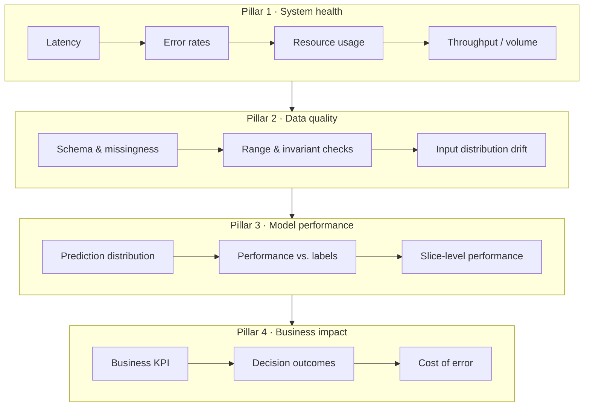
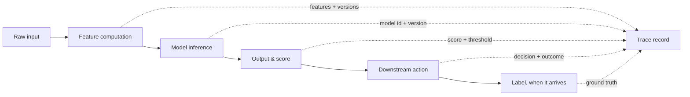

# M15 · Monitoring & Observability

> **Core question:** When a production model degrades, how do we see it — and reconstruct why?

---

## The model is fine. The model is not fine.

You're on the fraud team again — the same payments team from M1, the one whose notebook scored 0.99. The model has been in production for six months. One Tuesday, a support analyst messages you: "Complaints about blocked cards are up 40% this week." You pull up your dashboards.

Everything is green. CPU is at 38%. Memory is flat. Error rate on the serving endpoint is 0.02%. p99 latency is 190 ms, comfortably under your 200 ms budget. The model is *healthy*.

Except it isn't. Three weeks later the quarterly fraud report lands: precision on blocked transactions has slid from 0.94 to 0.71, and the team can't say *when* it started or *why*. Your dashboards were green because they were watching the wrong thing — the machine, not the model. The model had been quietly wrong for weeks, and the only signal it sent was the one you weren't measuring: **the people it was refusing.**

This is silent degradation — the M2 failure mode that is not an event but an *absence* of measurement. M15 is the cure: the deliberate design of systems that can *see* a model go wrong and *reconstruct* why. Everything in this module answers one question: **when your model degrades, how do you notice, and how do you rebuild the story of what happened?**

## Monitoring is not observability

The two words get used interchangeably, and the difference is the whole point of this module.

- **Monitoring** answers questions you *thought to ask in advance*: "is latency below budget?", "is the error rate above threshold?", "did the data pipeline run?" It's a set of known dashboards and known alerts over known signals. It catches the failures you anticipated.
- **Observability** answers questions you *didn't* think to ask: "why did precision drop in March but not February?", "which feature changed first?", "was it this model version or the data?" It's the capacity to ask novel questions of the system *after* something unexpected happens and get answers — usually by instrumenting rich, low-level telemetry you can slice however the question demands.

The fraud example shows the gap. Monitoring would have told you *if you'd set an alert on "false-positive complaint rate."* Observability is what lets you, two weeks later, *reconstruct* that the drop started exactly when a new card-issuer feed came online and its `device_fingerprint` field started arriving empty. Monitoring is the alarm; observability is the investigation that finds the culprit. A system needs both, and they need different design.

> **⚠️ Failure mode** — *The green dashboard.* Teams build monitoring for the infrastructure they already understand (CPU, memory, 5xx errors) and call it done. But ML systems fail in the *model's* behavior, not the server's. A dashboard of system-health metrics that's all green is not evidence the ML system works — it's evidence you're watching the layer where ML failures don't show up.

## The four pillars

Every ML monitoring design should stand on four pillars. Miss one, and there's a class of failure you will not see. From M2, the mapping is explicit: **silent degradation** lives in pillars 3 and 4, **data/concept drift** lives in pillar 2, and **cascading failure** lives in pillar 1.

Read the pillars left to right as *distance from the model's true purpose*. Pillar 1 tells you the server works. Pillar 4 tells you the *business* works. The model can be silently failing in between — the machine healthy, the business bleeding — and only the middle two pillars catch it.

### Pillar 1 — System health

Latency, error rates, throughput, resource consumption. This is the pillar every team already has, and it's necessary but not sufficient. The two ML-specific subtleties:

- **Latency is a distribution, not a number.** Your mean latency can be 60 ms while your p99 is 800 ms and every 100th user times out. Watch percentiles, not averages.
- **Prediction volume is a first-class signal.** A sudden *drop* in prediction volume usually means an upstream caller stopped calling or a feature store started failing over — often the earliest symptom of a cascading failure. A sudden *spike* means a bot or a retry storm. Both matter.

### Pillar 2 — Data quality

From M5, validation gates catch bad data *at the door*; pillar 2 watches it *continuously* after it's inside. The three checks, in order of cheapness:

1. **Schema and missingness** — is the schema what the model expects, and are critical features present? The `device_fingerprint` going empty is a missingness signal.
2. **Range and invariants** — are values in the ranges the model was trained on? A `transaction_amount` of `-1` or a `merchant_category` nobody has seen in a year.
3. **Input distribution drift** — has the *population* of inputs shifted? This is pillar 2's early-warning radar and the direct handoff to M16, which owns drift detection in depth.

> **⚖️ Tradeoff** — *Validate at the door vs. watch continuously.* A validation gate can *reject* a bad row before it poisons a prediction; continuous monitoring can only *alert* after the fact. The ledger entry: *chose to do both — a gate for hard invariants (rejectable errors) and continuous monitoring for soft shifts (distributions that drift gradually) — gave up a little pipeline complexity, bought the ability to catch both the sudden break and the slow slide.*

### Pillar 3 — Model performance

Here's the hard truth of this pillar: **you can't measure a model's accuracy without labels, and labels usually arrive late — or never.** So pillar 3 splits:

- **Prediction distribution** — the label-free proxy. If your fraud model's score distribution suddenly shifts mass toward the high-risk tail, something changed (drift, a broken feature, a new attack pattern). It's not proof the model is wrong, but it's proof the *world the model sees* changed — a cheap, always-available tripwire.
- **Performance vs. labels** — the gold standard, when labels exist. For fraud, a "label" is a confirmed chargeback, arriving days to weeks later. You *join* predictions to eventual labels and compute precision/recall on a rolling window. This is the only signal that directly measures what you care about, and it's always late — which is exactly why M16 spends a module on delayed labels and proxy metrics.

### Pillar 4 — Business impact

The pillar that ties the model to money. For fraud: how much fraud value was blocked, how many legitimate customers were refused, what did false positives cost in support calls and churn? Business impact is the *only* pillar that can tell you whether the model's decisions are still worth making. A model can be statistically fine and commercially pointless — or statistically degraded and commercially fine — and only pillar 4 knows the difference.

> **🐍 Reference stack at a glance** — The ML-agnostic core is **Prometheus + Grafana**: your service emits counters/gauges/histograms (latency percentiles, prediction volume, error rates, score distribution), Grafana renders the four pillars as dashboards, and Prometheus Alertmanager fires on thresholds and burn rates. For the ML-specific pillars, **Evidently AI** computes data-drift and target-drift metrics (PSI, KL) and **MLflow** tells you *which model version* was live when it happened. The design principle from M3: ML monitoring should plug into the *same* observability stack the rest of your org already runs, not a parallel island.

## Tracing a prediction

Monitoring tells you *that* something changed; observability tells you *why*. The engine of "why" is the **prediction trace**: a structured record of everything that happened to one prediction, from raw input to downstream action to eventual label. It's the ML analog of a distributed trace, and it's the single highest-leverage observability investment you can make.

Each link in that chain is a place where the system can silently change — and if you record every link with a shared **trace ID**, you can *reconstruct* a degradation after the fact by joining on it. The four things a trace must capture, as a minimum:

1. **The inputs** — the raw request (or a hash + the raw features, if raw is too large or sensitive).
2. **The features and their versions** — *which* feature values went in, and crucially *which code and data produced them*. From M3, this is the feature seam made observable.
3. **The model** — model ID, version, and the exact artifact from the registry. "Which model was live?" must never be a question.
4. **The output and the action** — the score, the threshold, the decision taken, and the *outcome* that followed (approved / blocked / flagged for review).

The trace is where M3's ADR discipline and M2's "diagnose first, don't retrain" reflex become *operational*. When precision dropped, you didn't guess — you queried traces by `device_fingerprint == null`, found the timestamp where the feature started arriving empty, and traced it to the new issuer feed. The trace turned a week of archaeology into a five-minute join.

> **⚠️ Failure mode** — *The unreconstructable incident.* Without a trace, a degraded model is a murder mystery with no witnesses: you know it got worse, you don't know when, which version, which feature, or which slice. The fix for a past incident is often a retrain; the fix for a *future* one is a trace. Log the trace *before* you need it — retrofitting observability after an incident is the least efficient possible time to do it.

## Metrics that matter

Not everything that can be measured should be. The metrics worth alerting on are the ones that *change before the business outcome changes* — the leading indicators. Here's the short list, with the fraud system in mind:

| Metric | What it is | Why it matters |
|---|---|---|
| **Latency percentiles** (p50/p95/p99) | The *distribution* of prediction time | A p99 spike is a user timeout; a mean hides it |
| **Prediction volume** | Requests per second, per model | Sudden drop = upstream break; spike = bot/retry storm |
| **Error rate** | Failed predictions / total | The seam between serving and everything else |
| **Score distribution** | Histogram of model output | Shifts before labels do; the label-free tripwire |
| **Feature missingness** | % of rows with null critical features | The earliest data-quality signal |
| **Input drift** (PSI/KL per feature) | How far inputs moved from training | The radar for "the world changed" |
| **Performance vs. labels** (rolling precision/recall) | Model accuracy on recent truth | The gold standard, always late |
| **Business KPI** (fraud $ blocked, false-positive complaints, good-customer churn) | Did decisions achieve the goal | The only pillar that justifies the model's existence |

The ordering is the point: the top rows are *fast and cheap* (available in seconds), the bottom rows are *slow and expensive* (available in days, or only as a business report). A healthy monitoring design uses the fast metrics as **tripwires** and the slow metrics as **verdicts**.

## SLOs, alerting, and incident response

Metrics are worthless if nobody is told to look. The discipline that ties them together is the **SLO**: a service-level objective stated as *a threshold over a time window* — e.g., "99% of predictions complete in under 200 ms over any 30-day window." The pieces:

- **SLI** — the *measured* indicator (the actual p99 latency, the actual precision).
- **SLO** — the *target* for the SLI (99% of predictions under 200 ms).
- **Error budget** — the *allowed* failure (1% of predictions may exceed 200 ms). It's the room you're permitted to be imperfect.
- **Burn rate** — how *fast* you're spending the error budget. Alerting on burn rate (e.g., "you burned 5% of the budget in the last hour") is dramatically better than alerting on a bare threshold, because it fires *before* the budget is gone, on the *speed* of degradation, not just its existence.

For an ML system, the SLOs that matter are not only the serving SLOs (latency, availability) but the **model-quality SLOs**: "rolling 14-day precision on blocked transactions stays above 0.85." That's the SLO that would have caught the fraud slide — and it's the one teams most often skip, because labels are late and the measurement is harder. Skipping it is exactly how silent degradation wins.

> **⚖️ Tradeoff** — *Alert early vs. alert usefully.* Every alert has a cost: the on-call page, the interrupted sleep, the fatigue that makes people start ignoring pages. Too few alerts and degradation goes unseen; too many and the team goes numb. The ledger entry: *chose a small number of high-signal alerts (burn-rate based, on leading indicators) over a firehose of threshold alerts, gave up "coverage" of every conceivable signal, bought an on-call rotation that still believes its own pages.*

When an alert *does* fire, incident response for ML differs from a plain outage in one crucial way, straight from M2: **don't retrain first.** The runbook order is:

1. **Triage** — is this a system failure (pillar 1) or a model failure (pillars 2–4)? Check the traces.
2. **Locate** — which seam changed? A feed, a feature, an upstream API, the world itself? The trace answers this.
3. **Contain** — roll back the model, fail over to a fallback heuristic, or pause the risky action (blocking live cards) while you diagnose.
4. **Diagnose, then act** — only after you've found the *cause* do you retrain, re-pin a feature, or fix the feed. Retraining against a shifted world bakes in the shift.

The model is the innocent party, remember. The system failed it — and observability is how you find out which part.

## Design exercise

You're the platform engineer for the production fraud system. Design its observability envelope.

**Part A — The trace schema.** Write the concrete fields of your prediction trace. For a single fraud-scoring call, list every field you'd record at each stage — raw input, computed features (name a few real ones: velocity, amount, device fingerprint), model ID/version, score and threshold, the decision (approve/block/review), and the eventual label (chargeback yes/no, and *when* it arrived). For each field, note: *is it stored raw, hashed, or aggregated?* (Think about PII and retention — this is also a governance question M17 will sharpen.)

**Part B — The five alerts.** Design exactly **five** alerts a platform team should fire on. For each, specify: the **signal** (which metric), the **threshold/burn-rate** (be concrete — a number over a window), and the **first response** (what the on-call does first). One alert *must* be a model-quality SLO, one *must* be a business-impact signal, and at least one must be a *leading* indicator that fires before the business outcome changes. Justify why these five and not six or forty.

**Part C — The ledger.** You have a trace that could store every prediction's full inputs forever, and you have PII/retention pressure to store almost nothing. Write the one-line ADR for *what you store and what you give up* — the tradeoff between reconstructability and compliance.

The goal is to leave with a design where "the model got worse" is *visible within minutes* and *reconstructable within minutes* — not discovered by a support analyst weeks later.

---

*Next: M16 · Drift, Retraining & Feedback Loops — the module that owns what happens after monitoring spots the shift: detecting drift, deciding when to retrain, and taming the feedback loops that make models change their own world.*
