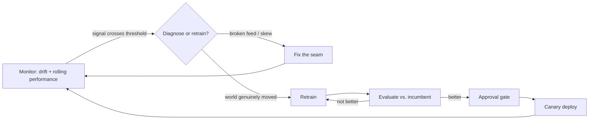

# M16 · Drift, Retraining & Feedback Loops

> **Core question:** How does a model stay correct as the world changes?

---

## The pricing model that kept winning (and losing)

You work on a dynamic-pricing model. It sets the price for a consumer product in real time: demand, competitor prices, inventory, and time-of-day go in; a price comes out. The model was trained on two years of sales history and its offline error was small. For the first quarter it *kills* — revenue per transaction climbs 6%.

Then it gets weird. The model keeps recommending lower and lower prices, chasing volume. Revenue per transaction flattens, then falls. The model is "confident" the whole time — its predictions are internally consistent, the offline metrics still look fine, and it's serving happily. What it can't see is that it's now largely pricing against a world it *created*: it pushed prices down, competitors matched, and the very data it's trained on next is the echo of its own past decisions.

This is the M2 failure mode that most cleanly separates ML systems from ordinary software: **the feedback loop** — predictions changing the data they predict on. And it arrives wrapped in **drift** — the world changing underneath a frozen model. M16 is about the two together, because in practice you can't manage one without the other. The core question, restated: **a model is a snapshot of the world at training time; how do you know when the world has moved on, and what do you do about it?**

## Data drift vs. concept drift

M2 named both; here is the operational version, because the *response* to each is different.

- **Data drift (covariate shift)** — the *input* distribution moves. Your pricing model sees a new demographic, a new competitor, a new channel with different price sensitivity. The relationship "input → price" may still hold; the model is just being asked to work in a region it never trained on.
- **Concept drift** — the *relationship* between input and label changes. The same demand signal that once justified a $50 price now justifies $45, because customers grew more price-sensitive (or a competitor changed their algorithm). Same inputs, different correct answer.

The distinction matters because **retraining fixes concept drift, but data drift may just need more data — and neither is fixed by retraining if the real problem is a broken upstream feed** (that's a cascading failure, M2 again, and retraining on it bakes in garbage).

> **⚠️ Failure mode** — *The unfalsifiable model.* A model that's never checked against fresh labels *looks* fine forever, because its own confidence never wavers. In the pricing case, the model's predictions were internally consistent precisely *because* it had closed itself off from the truth — a self-reinforcing loop is, by construction, stable. "The model is stable" is not evidence it's correct; it may be stable because it's wrong in a self-consistent way.

## Detecting drift: PSI, KL, and statistical tests

Drift detection is pillar 2 of M15 made rigorous. The workhorse metrics:

- **PSI — Population Stability Index** — measures how far a *feature's* distribution has moved from a reference (its training distribution). Cheap, interpretable, per-feature, and the industry default for data drift.
- **KL divergence** — the information-theoretic distance between two distributions. More general than PSI but harder to hand thresholds to a business partner.
- **Statistical tests** — Kolmogorov–Smirnov (continuous features, "is this sample from the same distribution?"), chi-squared (categorical features). They give you a *p-value* rather than a score, which reads well in a review but tempts you to over-interpret small effects on big data.

Here is PSI, because it's the one you'll actually run, and it's only believable once you've seen the computation:

```python
import numpy as np

def psi(expected, actual, bins=10):
    """Population Stability Index: how far `actual` moved from `expected`."""
    edges = np.quantile(expected, np.linspace(0, 1, bins + 1))
    edges = np.unique(edges)  # drop duplicate quantile edges
    e = np.histogram(expected, bins=edges)[0] / len(expected)
    a = np.histogram(actual, bins=edges)[0] / len(actual)
    e, a = np.clip(e, 1e-6, None), np.clip(a, 1e-6, None)  # avoid log(0)
    return float(np.sum((a - e) * np.log(a / e)))
```

The rule of thumb you'll see everywhere: **PSI < 0.1** = no meaningful shift; **0.1–0.25** = moderate shift, investigate; **> 0.25** = significant shift, act. Treat these as *conversation starters*, not laws — a tiny PSI on a critical feature can matter more than a huge PSI on a cosmetic one. The real rule is from M15: drift is a *tripwire*, and a tripwire's job is to make you *look*.

For **concept drift**, the measurement is fundamentally harder, because it needs labels. You detect it the same way pillar 3 of M15 does: rolling performance against *fresh* labels. When precision/error on recent truth diverges from the training-time estimate, the concept has moved. There is no label-free shortcut — which is exactly why the next two sections exist.

The tools, side by side, so you reach for the right one:

| Method | Detects | Needs labels? | Threshold you'll actually use |
|---|---|---|---|
| **PSI** | Data drift (per feature) | No | < 0.1 fine, > 0.25 act |
| **KL divergence** | Data drift (per feature) | No | No universal cutoff; relative |
| **KS test** | Data drift (continuous) | No | p < 0.05, but mind big-data sensitivity |
| **Chi-squared** | Data drift (categorical) | No | p < 0.05 |
| **Rolling performance** | Concept drift | **Yes** | Error/recall vs. training-time estimate |

The pattern to internalize: the label-free methods are *fast tripwires*; the label-dependent method is the *verdict*. A PSI spike tells you *look here*; a rolling-precision drop tells you *the model is actually wrong now*. Only the second one justifies a retrain.

> **🐍 Reference stack at a glance** — **Evidently AI** computes PSI, KL, and categorical drift out of the box over your reference vs. current data and renders a per-feature drift report; it's the M3 "drift detection" row made concrete. Wire the resulting scores into **Prometheus** as gauges (one per critical feature), alert in **Grafana** on the 0.25 PSI threshold, and let **MLflow** tell you *which model version* was live when drift started so the retrain has a target. Airflow (conceptual) is what schedules the drift jobs and the retrain.

## Feedback loops: when predictions change the data

This is the failure mode with the most personality, so read it slowly. A feedback loop happens when **the model's output becomes part of the input it's trained on**. Two directions, both dangerous:

- **Self-reinforcing (runaway).** The pricing model lowers prices → competitors match → the next training batch is full of *its own* low prices → the model "learns" that low prices are the market → it lowers them more. Zillow Offers (M2) was this exact loop in housing: its own aggressive bids became the "market data" justifying more aggressive bids.
- **Self-defeating (the model eats its own signal).** A fraud model blocks card-not-present transactions on a channel → fraud *on that channel* drops → the model sees less fraud there → concludes the channel is safe → relaxes → fraud returns. The model's success destroys the evidence of its own success.

The loop is hard to see because *nothing looks wrong inside the system*. Metrics are stable, the model is confident, the pipeline runs. The giveaway is only visible from the *outside*: the **world the model is trained on has become partly synthetic** — a shadow of the model's own past decisions.

The defenses, in increasing order of commitment:

1. **Log what you intervened on.** Record every action the model took (prices it set, transactions it blocked) and its downstream effect. You can't detect a loop you don't log — this is the M15 trace doing double duty.
2. **Hold out an untouched population.** Keep a fraction of decisions made by a *stale* model or a *randomized* policy, purely so you have data the model *didn't* influence. This is the single most effective loop-breaker, and it costs revenue — which is the ledger entry.
3. **Randomize deliberately.** In ranking and pricing, inject a small amount of exploration (ε-greedy bandits, from M11) so the system keeps *seeing* parts of the world its current policy would never visit.

> **⚖️ Tradeoff** — *Exploit vs. explore.* The holdout/randomization that breaks a feedback loop is, by definition, money left on the table *today* — you're showing some users a suboptimal price or letting some fraud through, on purpose. The ledger entry: *chose to burn a small fraction of near-term revenue on exploration and holdouts, gave up short-run optimality, bought a training signal that isn't an echo of our own decisions — and an insurance policy against the runaway loop that would cost far more.*

## Delayed labels & proxy metrics

Here is the cruelest operational fact in ML: **the thing you most want to measure — whether a prediction was right — usually arrives late, or never.** In pricing, the "label" is the realized outcome (did the customer buy? did revenue hold?), which arrives after the sale — minutes for a conversion, but a *profitability* label can take weeks to settle (returns, refunds, customer lifetime value). In fraud it's the chargeback, days to weeks later. In lending (M17) it's default, months to years later.

Delayed labels create a gap: your rolling "current performance" is always measuring *last month's* world. Two tools close the gap:

- **Proxy metrics** — measurable-now signals that correlate with the eventual label. For pricing, a click or add-to-cart is a proxy for purchase; for fraud, a "flag for manual review" is a proxy for a chargeback. Proxies are *fast but biased* — they correlate with, but are not, the truth. Use them as tripwires (M15), never as verdicts.
- **Backfill and rejoin** — when labels finally land, join them back to the predictions that caused them (via the trace ID) and *retroactively* compute true performance. The system's honest scorecard is always written in the past tense.

The discipline: **label the proxy as a proxy.** A dashboard that shows "precision" computed on clicks when the real label is profitability is quietly lying to you. Mark it, name the lag, and keep the honest metric visible even though it's late.

Make the lag concrete for the pricing model. Today (day 0) the model sets a price. The *click* arrives in minutes. The *purchase* arrives in hours. The *refund/return* signal arrives in days. The *profitability* label — revenue minus the cost of the return plus the customer's estimated lifetime value — doesn't settle for 30 days. So on day 0 you have a proxy (click), on day 1 you have a better proxy (purchase), and only on day 30 do you know whether the price was actually *good*. That 30-day gap is where the whole design lives: you operate on proxies for a month, and every "current" accuracy number is, by definition, last month's verdict.

## Retraining triggers & continuous training

So you've detected drift, or your delayed labels finally say "worse." Now the decision: **when do we retrain?** A retraining policy is a small state machine, not a vibe. The four trigger types:

- **Scheduled** — retrain on a calendar (nightly, weekly). Simple, predictable, and *blind* to whether anything actually changed. Good as a floor, wasteful as a policy.
- **Performance-triggered** — retrain when rolling performance on fresh labels drops below a threshold. The most *correct* trigger, but gated on labels that lag.
- **Drift-triggered** — retrain when PSI/KL on critical features crosses a threshold. Fast and label-free, but drift ≠ "the model is wrong" — a feature can shift and the model still be fine.
- **Data-triggered** — retrain when you've accumulated *enough new data* (volume-based) or when a known event happened (a new competitor, a schema change upstream).

The whole policy as one loop — this is the shape you're designing, whether you automate it or keep a human at the "decide" node:



The single most important box is `D` — the *diagnose-or-retrain* decision — because it's where M2's diagnosis-first rule lives. Automate the loop *around* it and you have continuous training; automate *through* it and you have a machine that retrains on broken feeds.

**Continuous training** — the fully automated loop where drift/performance signals trigger retraining *and* redeployment without a human in the loop — is the fashionable answer and usually the wrong one. It's right only when the world changes faster than humans can review *and* you have fast, trustworthy labels *and* you've built the automated evaluation gates from M11 to catch a bad model before it ships. Without those gates, continuous training is just *continuous redeployment of unverified models* — an automated feedback loop of its own making.

> **⚠️ Failure mode** — *The retrain reflex.* M2's diagnosis-first rule holds here in full force. A drift alert is not a retrain command; it's an *investigation* command. If the "drift" is actually a broken upstream feed (a cascading failure), retraining on it doesn't fix anything — it trains a model on garbage and *looks* like action. Retraining is the fix for a world that moved, not for a system that broke. Diagnose, then retrain.

## The cost of too-frequent retraining

Retraining is not free, and the cost is easy to underestimate because it's mostly *invisible*:

- **Compute and storage** — each retrain is a training job, a validation suite, and a new artifact in the registry. Cheap per run, expensive at "every drift blip."
- **Operational churn** — every retrained model has to be *evaluated* (does it beat the incumbent on fresh labels?), *approved* (M11's gate), and *deployed safely* (M13's canary). Retraining every day means doing this dance every day.
- **The stability cost** — a model that retrains on every small shift never settles; it chases noise. A *stable* model has value in itself: it produces a consistent policy you can reason about, audit, and explain (M17 will make this concrete for lending).
- **The feedback-loop acceleration** — retraining faster *on your own predictions* can tighten the very loop you're trying to break. The pricing model that retrains daily on its own low prices just digs the hole faster.

The ledger writes itself: **retraining cadence is a dial, not a switch.** Too slow and the model goes stale (drift wins); too fast and you buy churn, instability, and a hotter feedback loop. The sweet spot is a *policy with a floor and a trigger*: retrain at least every N days (so you never go fully stale), and *sooner* when a real signal (fresh-label degradation, a material PSI jump on a critical feature) crosses a threshold you decided on *before* the incident, not during it.

> **💻 CODED DEMO (Pass 2)** — A ~80-line runnable demo: a synthetic pricing stream with a planted feedback loop, showing (1) the PSI function above flagging the input drift, (2) rolling performance against delayed labels diverging, and (3) side-by-side policies — "retrain on every drift blip" vs. "retrain on threshold + floor" — so learners can *see* the churn and the loop accelerate versus being tamed. This is the module's central "aha," so it gets a full demo, not just the inline snippet above.

## Design exercise

You own a dynamic-pricing model with delayed labels: the model sets prices in real time, and the true profitability label for any transaction settles weeks later (returns, refunds, lifetime value).

**Part A — Drift detection.** Specify your drift detection design. Which features do you monitor for *data* drift (name at least five: competitor price, inventory, demand, device, time-of-day), with what metric (PSI/KL/test) and threshold? Separately, how do you detect *concept* drift, given that your labels lag weeks? What proxy metrics (clicks, add-to-cart, conversion) will you use as tripwires, and how will you stop the proxy from masquerading as truth?

**Part B — The feedback loop.** This pricing model has a strong feedback loop: its prices become the market it trains on. Design your loop defense. What do you log? What fraction of traffic do you hold out or randomize, and what does that cost you — write the ledger entry.

**Part C — The retraining policy.** Write the retraining policy as a *decision rule*, not a feeling: a scheduled floor (how often, at minimum), plus the *specific* triggers (which metric, what threshold, over what window) that retrain earlier. Then write the ADR for *why this cadence and not continuous training* — state plainly what you'd need to change (faster labels? automated gates?) before you'd turn the loop fully automatic.

The goal: leave with a policy where the model stays correct *as the world moves*, without ever becoming a runaway echo of its own decisions.

---

*Next: M17 · Governance, Security & Cost — the module that asks who decides what the system may do, and how that's enforced and audited: lineage, fairness, security, compliance, and the money.*
