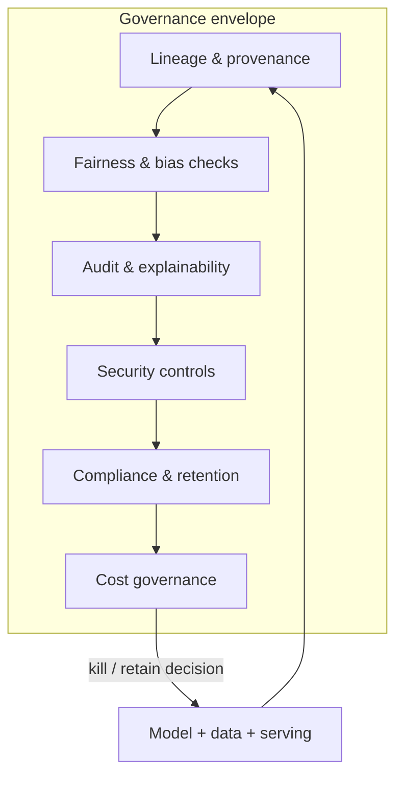
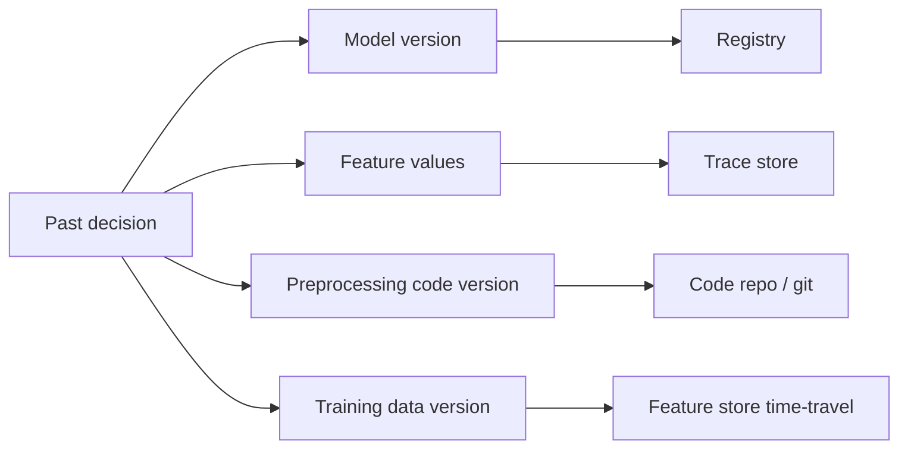

# M17 · Governance, Security & Cost

> **Core question:** Who decides what the system may do, and how is that enforced and audited?

---

## The loan the model couldn't explain

You're on a lending team. The model is a gradient-boosted classifier that scores loan applications: income, credit history, employment, and a few dozen engineered features in; an approval decision out. It's fast, it's accurate, and it's profitable — until the regulator asks a simple question: *"Why did you deny this applicant?"*

You can't answer. Not because you're hiding anything, but because *nobody recorded which model version made the decision, which features it used, or what the inputs even were.* The model was retrained last month and the old artifact is gone; the input rows weren't logged beyond a hash nobody can reverse. And when someone cross-tabs approvals by demographic, they find a disparity nobody intended — a proxy feature quietly standing in for a protected attribute — that you now have to explain to a room full of lawyers with *no lineage and no audit trail*.

The model wasn't broken. It was **ungoverned**: nobody had decided what it was allowed to do, and — more damningly — nobody could prove what it *did*. This is the M2 failure class "unfair / non-compliant outcomes" mapped to its layer, and it's the whole subject of M17. Governance is not paperwork; it's the answer to three questions, and if you can't answer them you don't own the system, the system owns you: **who decides what it may do, how is that enforced, and how is it audited?**

## The governance envelope

Governance is best drawn as an envelope around the model — a set of boundaries the model operates inside, with *measurement* at every boundary and *evidence* kept at every step. Draw it once and every later topic in this module is a region of it:

The envelope is not a stage you pass through once — it's a **standing set of obligations** that the model lives inside for its whole life, and every obligation produces *evidence*. The rest of this module walks the regions.

## Model lineage & auditability

**Lineage** is the record of *where a model came from*: which training data, which code version, which parameters, which features, which evaluation — and, after deployment, *which model made which decision*. It's the M3 ADR discipline and the M9 registry extended from "what's deployed" to "what happened, and can we reproduce it."

The bar governance sets is high, and it's worth stating plainly: **you must be able to reproduce any production prediction.** That means, for an arbitrary past decision, you can recover:

- the exact **model artifact** (version, weights, code) — from the registry;
- the exact **input features** — from the trace (M15), not just a hash you can't reverse;
- the exact **data** the model was trained on — or, where you can't store everything, a *deterministic recipe* (data version + feature-store time-travel query from M6) to rebuild it;
- the exact **preprocessing and feature code** — the feature seam from M3, versioned.

The trace from M15 is doing triple duty here: it's the observability engine, the loop detector, and the *audit trail*. One design, three failures prevented.

The reproduction chain, drawn — every node is a thing you must be able to *recover* for an arbitrary past decision:

If any arrow ends in "we don't have that anymore," the audit trail is broken at that edge — and that edge is your first build priority. For most teams the missing edge is `FT → TR` (features were never retained) or `TD → FS` (training data wasn't versioned in a way that can be rebuilt). Lineage is cheap to design in and brutal to retrofit.

> **⚠️ Failure mode** — *The unreproducible decision.* When a regulator (or a lawsuit) asks "why was this person denied?", a team that can't reproduce the decision has already lost — not because the model was unfair, but because it was *opaque to its own operators*. Lineage is the difference between "we don't know" (a liability) and "here is the model, the inputs, and the data, exactly as it ran" (an answer). Build it *before* the question is asked; retrofitting lineage under regulatory pressure is archaeology with a deadline.

## Fairness & bias: measure, mitigate, and know the limits

Fairness is the region where governance gets hardest, because "fair" is not one property but many *mutually incompatible* ones. The three you'll be asked about:

- **Demographic (group) parity** — approval rates should be equal across groups. But if base rates of default differ, forcing parity can mean approving riskier loans in one group — which is its own unfairness.
- **Equalized odds** — the model should be *equally accurate* across groups (equal false-positive and false-negative rates). This is usually the more defensible target in lending, but it still trades against something.
- **Individual fairness** — similar individuals get similar decisions, regardless of group. Clean in principle, hard to define "similar."

The three, in ledger form, so the tradeoffs are explicit:

| Notion | What it demands | What it gives up |
|---|---|---|
| **Group parity** | Equal approval rates across groups | Risk-adjusted accuracy; may force riskier approvals in some groups |
| **Equalized odds** | Equal false-positive/negative rates across groups | Some overall throughput and profit |
| **Individual fairness** | Similar people → similar decisions | A computable definition of "similar"; simplest to defend rhetorically, hardest to implement |

Here's the hard truth, stated once and loudly: **you cannot satisfy all of these at once.** This is a proven impossibility result (they conflict except in degenerate cases), so "make it fair" is not an engineering task — it's a *decision about which notion of fairness matters*, recorded as an ADR with a tradeoff ledger. The engineering is:

1. **Measure.** Compute the chosen fairness metric on *slices* (from M10's slice-aware evaluation), on fresh production data, continuously — this is pillar 3/4 of M15 with a fairness lens. You cannot fix a bias you don't measure, and most "unexpected" bias is a proxy feature (zip code, device, purchase history) standing in for a protected attribute.
2. **Mitigate.** Three families: **pre-processing** (fix the data — reweighting, resampling), **in-processing** (constrain the training objective), **post-processing** (adjust thresholds per group). None is a free lunch; each trades one fairness metric for another, or for accuracy.
3. **Know the limits.** Mitigation can correct a *measured* disparity; it cannot fix an *unmeasured* one, and it cannot manufacture ground truth that isn't there. A bias that lives in the *label* (historical loans were denied along demographic lines, so "default" is a biased proxy for "would have defaulted") is not fixable by any algorithm — it's a data-governance problem first.

> **⚖️ Tradeoff** — *Fairness vs. accuracy vs. the impossibility theorem.* Every fairness intervention has a price: equalized odds usually costs you some overall accuracy, group parity costs you profit, and individual fairness costs you a computable definition. The ledger entry: *chose equalized odds as the binding constraint for the lending model, gave up some approval throughput and raw profit, bought a defensible, measurable fairness guarantee — and accepted that group parity is deliberately not promised, because promising both is mathematically impossible.*

## Security: the model as an attack surface

ML systems get attacked in ways ordinary services don't, because the *model itself* is a new surface. Three attacks to design against, in the lending domain:

- **Adversarial inputs (evasion)** — a borrower crafts inputs to get a favorable score: trims income just under thresholds, times the application, exploits the fact that the model extrapolates wildly outside its training region. *Defense:* input validation against the training distribution (M5's ranges, M16's PSI at the door), and *not trusting* the model on out-of-distribution inputs.
- **Data poisoning** — an attacker corrupts the *training* data so the model learns a backdoor or a bias. A competitor (or an insider) injects fake "good" loans that teach the model to approve their accomplices. *Defense:* provenance on training data, anomaly detection on label sources, and reproducible pipelines (M7) so you can *detect* a poisoned batch by its provenance.
- **Model extraction** — an attacker with query access reconstructs your model (or its behavior) by sending thousands of applications and watching the scores. *Defense:* rate-limit queries, add noise or return only coarse outputs, and treat the model's *weights* as intellectual property worth protecting — don't ship them somewhere anyone can download.

The through-line: these are not exotic. The same seams and contracts you built in M3 to stop *accidental* change are the first line of defense against *deliberate* change — a versioned, provenance-tracked pipeline is hard to poison silently, and an input validation gate is hard to evade silently.

> **🐍 Reference stack at a glance** — **MLflow** carries lineage (model → data → code → params) and is the "which model decided this?" answer. **Great Expectations / Pandera** are the input-validation gate that doubles as the evasion/poisoning tripwire. **SHAP / LIME** provide the *post-hoc explainability* a lending regulator will demand — feature-attribution explanations of individual decisions, useful precisely *because* the underlying tree/ensemble isn't itself transparent. None of these *is* governance; together they're the evidence governance requires.

## Compliance: regulated domains, retention, explainability, disclosure

When the model touches people's money, health, credit, or employment, the *law* becomes a design constraint as real as latency. Four obligations, in lending:

- **Regulated domains.** Credit decisions in many jurisdictions carry a legal right to explanation (e.g., adverse-action notices under the US Equal Credit Opportunity Act / Fair Credit Reporting Act): if you deny, you must be able to say, in plain language, *why*. That's not a nice-to-have — it's a legal requirement that *picks your model* (an explainable model may be mandatory over a black box) and *picks your telemetry* (you must retain the features).
- **Retention.** How long do you keep inputs, scores, and decisions? Long enough to answer the audit, short enough to honor data-privacy limits. Retention is a *schedule with a rationale*, and it interacts with the M15 trace decision: what you store for observability is also what you'll be asked to produce — or delete — in compliance.
- **Explainability.** Two flavors: **global** (how does the model work overall — feature importances, monotonicity checks) and **local** (why *this* decision — SHAP values for this applicant). A regulator usually wants local; a model-risk team wants global. Plan for both.
- **Disclosure.** Tell people a model made a decision about them, and what data it used. The failure mode here is not technical — it's *institutional*: shipping a model that decides about people without anyone having decided it was allowed to.

The artifact that ties these four together is the **model card** — a one-page document that travels with the model: what it predicts, what data it was trained on, its measured performance *on slices* (including the fairness metrics from above), its known limitations, and the human who owns it. A model card is not a form you fill out at the end; it's the *pre-deployment checklist* that forces the team to state, in writing, what the model may do and what it can't. If you can't fill in the fairness section, the model isn't ready to decide about people. The card is also the first thing a regulator, an auditor, or a future teammate will read — write it for them.

> **⚠️ Failure mode** — *The retroactive compliance scramble.* A model that was "just a prototype" goes live, makes real decisions about real people, and only *then* does someone ask whether it's compliant. By then the lineage is gone, the features weren't retained, and the model is a black box that can't be explained. Compliance is a *pre-deployment gate*, not a post-deployment patch — same lesson as M11's approval gate, applied to law instead of metrics.

## Cost governance: budgets, attribution, and killing models

The last region of the envelope is the one engineers most often skip: **money.** Every model costs something to run — training, serving compute, storage, a data pipeline, a person who babysits it — and governance means *deciding whether it's paying for itself*, then acting on the answer.

- **Budgets** — give every model an explicit cost budget (compute, storage, on-call hours), not an implicit "whatever it uses." Cost must be a *first-class metric*, visible on the same dashboard as accuracy.
- **Attribution** — cost is only meaningful if you can *attribute* it to a model. Tag every job, every inference, every artifact with a model ID (the registry's job) so you can answer "what does this model actually cost per prediction?" — the cost-per-prediction metric from M14, now with a model's name on it.
- **Killing models** — the hardest, most honest act of governance. A model that stops paying (its precision decayed, its use case ended, its value never materialized) should be *retired*, not left running by inertia. M9's deprecation path is the mechanism; governance is the *will*. Every model should have a defined retirement condition *at deployment time* — "we retire this when its business KPI falls below X for Y months" — so killing it is a decision already made, not a fight you have in the heat of a budget review.

> **⚖️ Tradeoff** — *Keep it running vs. kill it.* The marginal cost of leaving a mediocre model deployed is low, and the political cost of killing someone's model is high — so models accumulate like debt. The ledger entry: *chose an explicit kill criterion at deploy time, gave up the comfortable "we'll revisit it later," bought a portfolio that stays honest about what earns its keep — and freed the engineering hours a zombie model silently consumes.*

## Design exercise

You own the governance envelope for the lending model. Design it, concretely.

**Part A — Lineage.** Specify the lineage record. For any single past loan decision, list every artifact you'd need to *reproduce* it — model version, feature values, preprocessing code version, training-data version — and where each lives (registry, feature store, trace store). Then state the *retention* schedule: what you keep, for how long, and what you must be able to *delete* on request. Where do the two pull against each other?

**Part B — Fairness checks.** Pick your fairness definition (state which one, and name the tradeoff you're accepting). Specify the *measurement*: which metric, computed on which slices, on which data (offline eval vs. rolling production), and how often. Then specify the *threshold* at which a disparity triggers action — and what that action is (investigate? mitigate? halt?).

**Part C — The audit.** Write the audit trail for a single denied application. A regulator asks: "why was this applicant denied?" Walk through exactly what you'd produce — the model, the features, the explanation (which method?), and the reasoning in plain language — and note which of the three (lineage, fairness, explainability) is the *weakest link* in your design, and what you'd build first to close it.

**Part D — The ledger.** Write the ADR that captures the *whole* envelope's core tension: a black-box model that's more accurate and more profitable, versus an explainable model that's auditable and compliant. State what you chose and what it costs.

The goal: leave with a system where "why was this person denied?" has a one-query answer, and where the model's right to exist is a decision you *made*, not a fact you *discovered* after it was too late.

---

*Next: M18 · End-to-End Design — the capstone: a complete production fraud-detection system designed layer by layer, from requirements through failure-mode analysis, ADRs, evaluation, serving, and monitoring — the design method this whole course has been building toward, applied once, end to end.*
