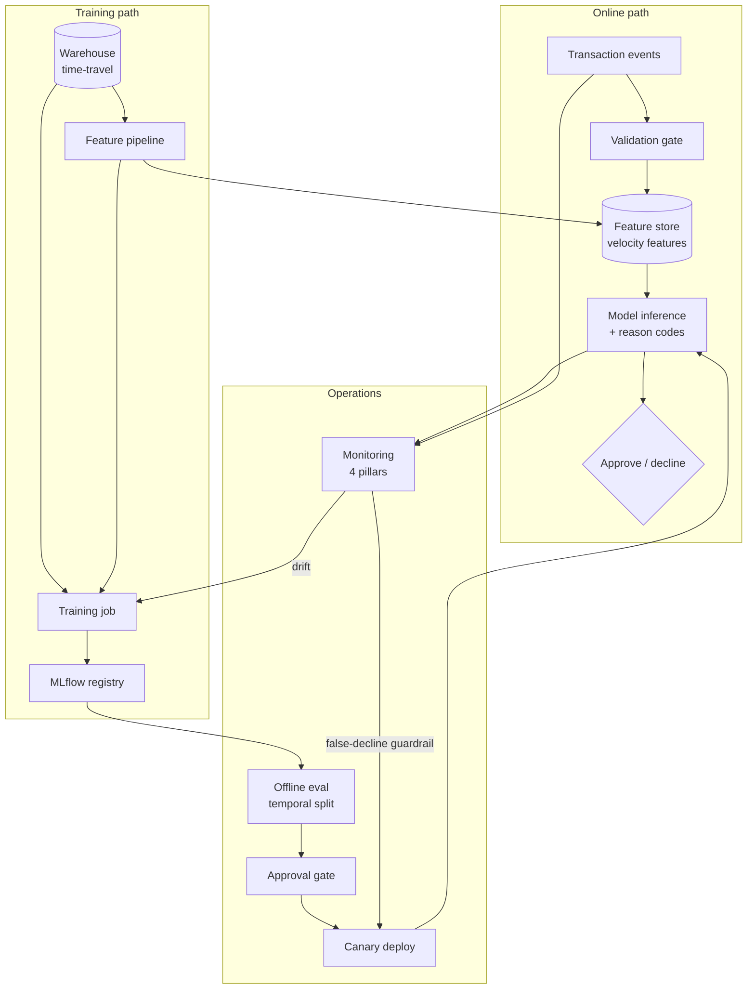

# M18 · End-to-End Design (Worked Example)

> **Core question:** How do all the layers compose into one coherent, defensible design?

---

## The brief

You're a staff ML engineer at a fintech. Fraud losses are climbing, and leadership wants a real-time fraud-detection system. The brief, as briefs always are, is half requirements and half hopes:

- **Decision latency budget:** 200 ms end-to-end, including feature lookup and model inference.
- **Availability:** 99.9%; a missed prediction is a missed transaction.
- **Volume:** ~1,000 predictions/second at peak, doubling every year.
- **Cost:** the system must cost less than the fraud it prevents — by a lot.
- **Constraints:** regulated environment. Every declined transaction must be explainable to a human, and every prediction must be reproducible after the fact.

There's a temptation to start coding. Resist it. This module is the payoff for the previous seventeen: we're going to take this brief and, layer by layer, turn it into a **design document a team could build from** — using exactly the method this course has been teaching.

## The design method

The method is a loop with seven steps, and you've seen every one of them already:

1. **Requirements** — frame the problem and its non-functional constraints (M1).
2. **Failure-mode analysis** — ask "how does this die?" *before* designing (M2).
3. **Layer decisions** — walk the lifecycle and make a decision at each layer (M4–M17).
4. **ADRs** — record each significant decision and its tradeoff (M3).
5. **Eval strategy** — how you'll know it works, offline and online (M10, M11).
6. **Serving & deployment** — how it reaches users safely (M12, M13).
7. **Monitoring & governance** — how it stays correct and accountable (M15–M17).

Order matters. Requirements and failure modes come *first*, because they discipline every decision after. Most bad designs are bad because step 2 was skipped.

## Step 1 — Requirements

The brief is a *hope*. Our first job is to turn it into something measurable, because an unmeasurable requirement is a trap.

| Requirement | Translation | What it implies |
|---|---|---|
| "Real-time" | p99 decision latency ≤ 200 ms | Feature lookups must be cached or in-memory; no synchronous warehouse queries |
| 99.9% availability | ~8.7 hrs downtime/year allowed | Redundancy, fast rollback, graceful degradation |
| 1k QPS, doubling | capacity plan to 10k QPS | Autoscaling, batching economics (M14) |
| "Cost less than fraud" | cost-per-prediction target | CPU-first inference until proven otherwise |
| "Explainable" | per-decision reason codes | Restrict to interpretable models or add an explainer |
| "Reproducible" | any past prediction re-derivable | Model registry + feature store + lineage (M9, M6, M17) |

The single most consequential line here is the last one: **reproducibility is a requirement, not a nice-to-have**, because this is a regulated domain. That one line will shape more of the design than anything else.

## Step 2 — Failure-mode analysis

Before we choose anything, we ask: *how does a real-time fraud system die?* Pulling from M2's taxonomy:

| Failure class | Concrete form here | Layer that catches it |
|---|---|---|
| Target leakage | Using "was this tx refunded" as a feature | Data/feature layer (M4, M6) |
| Temporal leakage | Training on a random split of time-ordered txns | Evaluation (M10) |
| Training–serving skew | Velocity feature computed on 30-day window in training, 1-day in serving | Feature layer (M6) |
| Data drift | New payment method appears; card-not-present share shifts | Monitoring (M15) |
| Concept drift | Fraudsters change tactics; same tx, new label | Monitoring/retraining (M16) |
| Feedback loop | Blocking a channel reduces visible fraud there → model relaxes → fraud returns | Online eval (M11) |
| Silent degradation | Model decays, no one notices | Monitoring (M15) |
| Cascading failure | Upstream device-fingerprint API starts failing | Architecture seams (M3) |
| Unfair outcome | Model declines a protected class at higher rate | Governance (M17) |

This table is the design's *defensive spec*. Every failure row becomes a requirement that some layer must satisfy. A design that can't point to which layer catches each row is not done.

> **⚠️ Failure mode** — *Designing for the happy path.* The most common senior mistake is to design the system that works, then bolt on "monitoring" at the end. The method inverts this: enumerate the failures *first*, then let them dictate the layers. That's the whole difference between a design and a hope.

## Step 3 — Layer decisions

Now we walk the lifecycle and decide. For each layer: the decision, and the ADR that records it.

### Data (M4, M5)

- **Ingestion:** transaction events are **streamed** (Kafka-style) for the online path, and **batch-landed** to a warehouse for training. Two paths, one schema contract.
- **Point-in-time correctness:** training sets are built with **time-travel queries** against the warehouse — features are joined *as they existed at the label timestamp*, never after the fact.
- **Validation:** a schema + invariants gate runs on *both* paths (amount ≥ 0, known currency, non-null device id). Bad data fails loudly, not silently.

### Features (M6)

- **Velocity features** (counts/amounts over windows) are the backbone of fraud detection. They're computed by a **single feature pipeline** and materialized in a **feature store** with a strict training/serving contract: *same code, same window definitions, same schema.*
- **Freshness:** the online path reads windowed aggregates computed continuously; the training path reads them backfilled from history. Time-travel correctness is non-negotiable.

### Model (M7, M8, M9)

- **Baseline first:** a logistic regression on the velocity features ships *before* any gradient-boosted model, so there's always a known-good fallback.
- **Selection:** gradient-boosted trees (LightGBM/XGBoost) — they dominate tabular fraud data, train fast, are interpretable via SHAP, and run on CPU (cost). A neural net buys nothing here.
- **Registry:** every model is registered in MLflow with lineage (data snapshot → code commit → params). "What's in prod?" always has one answer.

### Evaluation (M10, M11)

- **Offline:** metrics are precision@k and recall on the fraud class (not accuracy — fraud is ~0.5% of volume), validated with a **temporal split** and **group-aware** (per-user) folds to prevent leakage. Slices by payment method and geography.
- **Online:** the model ships as an **A/B** against the logistic-regression baseline, with a **holdout** group and a guardrail metric (false-decline rate) that auto-pauses the rollout if it breaches.

### Serving (M12, M13, M14)

- **Pattern:** online REST, CPU inference, batched at the gateway (dynamic batching amortizes latency at 1k QPS).
- **Deployment:** shadow → canary (5%) → full, with **auto-rollback** on the guardrail metric. Rollback is a feature, not a procedure.
- **Scaling:** the 200 ms budget is the constraint everything else bends around; features are precomputed so inference is just a fast model call + reason-code generation.

### Monitoring & governance (M15, M16, M17)

- **Four pillars** all instrumented: system health (latency, error rate), data quality (schema violations, feature drift), model performance (precision/recall vs. delayed fraud labels), business impact (fraud loss, false-decline rate).
- **Drift & retraining:** PSI on key features; retraining triggered on drift *or* scheduled cadence, whichever comes first — but promotion always passes the same gate.
- **Governance:** lineage from prediction back to model/data/features; a fairness audit on decline rates by protected attribute; per-decision reason codes for explainability.

## Step 4 — The design document

Here's the whole thing as one architecture diagram — the deliverable you'd hand a team:

Two things to notice about this diagram, because they're the *point*:

1. **The online and training paths share the feature store** — that single shared contract is what prevents training–serving skew. It's the most important seam in the system.
2. **The operations loop is wired in from the start** — monitoring feeds retraining and rollback. It's not a box someone adds later; it's load-bearing.

> **🐍 Reference stack at a glance** — the whole course, composed into one system: **Pandas + Pandera** (data + validation), a **feature store** (features, one code path), **MLflow** (registry + lineage), **FastAPI + Docker + ONNX** (serving), **Prometheus + Grafana + alibi-detect** (monitoring + drift), **Prefect** (orchestration). M18 introduces no new tools — it's where the stack stops being six modules and becomes *one system*.

## Tradeoff tension points, made explicit

Every design lives on a few sharp tradeoffs. Here are the three this one balances:

- **Freshness vs. cost.** Fresher velocity features catch fraud sooner but cost more to compute continuously. We chose *near-real-time* windows (seconds-to-minutes), not per-event recomputation — good enough for the 200 ms budget, a fraction of the cost.
- **Accuracy vs. latency & explainability.** A deep model might squeeze out another point of AUC, but costs latency and opacity. We chose gradient-boosted trees — they meet the budget, they're explainable, and the marginal accuracy isn't worth the regulatory risk.
- **Precision vs. recall.** Blocking too much loses good customers (false declines); blocking too little loses money. We chose to tune for precision *subject to* a recall floor, and made the false-decline rate the online guardrail — the business's most visible pain.

> **⚖️ Tradeoff** — *The ledger is the design.* A design document without explicit tradeoffs is a wish list. The three bullets above are the real decisions; the diagram is just their consequence. When you write your own design, the test is: *can a reviewer find, in one place, what you chose and what you gave up?*

## What a senior engineer should be able to produce

By the end of this course, you should be able to take a brief like the one at the top and produce, in a day or two of thinking:

1. A **requirements table** (business goal + measurable non-functionals).
2. A **failure-mode table** (how it dies, and which layer catches each).
3. **Layer-by-layer decisions**, each with an **ADR**.
4. An **architecture diagram** (Mermaid or whiteboard) with the seams labeled.
5. An **eval strategy** (offline metrics + splits, online A/B + guardrails).
6. A **monitoring & governance plan** (the four pillars, retraining, lineage).
7. A **tradeoff ledger** (the three or four real tensions, resolved explicitly).

That document is the artifact. The code is downstream of it.

## Design exercise

Take one of your *own* real problems — the thing you've been meaning to "do ML on" — and produce the **first-draft design document** using the seven-step method.

Don't aim for completeness; aim for *the shape*. Specifically:

1. **Requirements** — the business goal and 3–5 measurable non-functionals.
2. **Failure modes** — at least four rows: how it dies, and which layer catches it.
3. **Layer decisions** — one sentence + one ADR per layer (data, features, model, eval, serving, monitoring). If a layer is genuinely "not applicable," say *why* in the ADR.
4. **Diagram** — a Mermaid architecture diagram with the seams labeled.
5. **Tradeoff ledger** — the two or three real tensions, resolved.

This is the same exercise that ends M1, but now you have the whole course behind you. The difference between your M1 answer and this one *is* the course.

---

> **📌 Capstone note — deferred.** Whether this module's final exercise becomes a formal, assessed capstone project (vs. remaining a self-directed design exercise) is intentionally **not decided here**. This section will be revisited once the rest of the course is reviewed. *[Decision pending discussion.]*

---

*That's the last module. The course is a loop: M1 asked you to dissect a product you use; M18 asked you to design one. The distance between the two is what ML engineering design is.*
